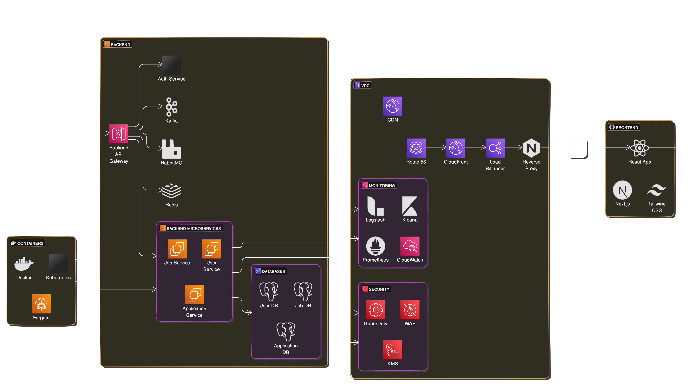

# Diseño del Sistema ATS de LTI

## Descripción del Software LTI

**LTI (Leading Talent Innovator)** es un sistema ATS (Applicant-Tracking System) diseñado para revolucionar la gestión del talento en las empresas. Con un enfoque en la eficiencia, colaboración en tiempo real, y automatización avanzada mediante inteligencia artificial, LTI se posiciona como la herramienta indispensable para los departamentos de recursos humanos modernos. Su diseño intuitivo y sus funcionalidades avanzadas permiten a las empresas atraer, evaluar y seleccionar a los mejores talentos de manera más rápida y efectiva.

### Valor Añadido y Ventajas Competitivas

**Valor Añadido:**

- **Automatización Inteligente:** Reduce significativamente el tiempo y el esfuerzo en tareas administrativas repetitivas.
- **Colaboración en Tiempo Real:** Facilita una comunicación fluida y eficiente entre reclutadores, gerentes de contratación y otros stakeholders.
- **Análisis Predictivo:** Utiliza IA para predecir el éxito de los candidatos, optimizando el proceso de selección.

**Ventajas Competitivas:**

- **Integración Sencilla:** Compatible con una amplia gama de herramientas y plataformas utilizadas por las empresas.
- **Experiencia de Usuario Superior:** Interfaz intuitiva y fácil de usar.
- **Escalabilidad:** Adecuado para empresas de todos los tamaños, con capacidad de adaptarse al crecimiento y cambios en las necesidades de contratación.

### Funciones Principales

1. **Gestión de Candidatos**
2. **Publicación de Ofertas**
3. **Automatización del Flujo de Trabajo**
4. **Evaluaciones y Pruebas**
5. **Análisis y Reportes**
6. **Colaboración en Tiempo Real**
7. **Asistencia de IA**

### Diagrama Lean Canvas formato mermaid

graph TD
    A[Lean Canvas LTI]
    A --> B1[Problema]
    A --> B2[Segmentos de Clientes]
    A --> B3[Propuesta de Valor]
    A --> B4[Solución]
    A --> B5[Canales]
    A --> B6[Estructura de Costos]
    A --> B7[Flujo de Ingresos]
    A --> B8[Métricas Clave]
    A --> B9[Ventaja Competitiva]

    B1 --> C1[Proceso de selección ineficiente y costoso]
    B1 --> C2[Falta de colaboración efectiva entre reclutadores y gerentes]
    B1 --> C3[Necesidad de automatización y reducción de tareas manuales repetitivas]

    B2 --> D1[Departamentos de Recursos Humanos]
    B2 --> D2[Gerentes de Contratación]
    B2 --> D3[Agencias de Reclutamiento]
    B2 --> D4[Empresas de todos los tamaños]

    B3 --> E1[Optimización del proceso de reclutamiento]
    B3 --> E2[Mejora de la colaboración en tiempo real]
    B3 --> E3[Automatización avanzada con IA]

    B4 --> F1[Sistema ATS con funcionalidades avanzadas]
    B4 --> F2[Automatización]
    B4 --> F3[Colaboración]
    B4 --> F4[Análisis predictivo]

    B5 --> G1[Ventas directas]
    B5 --> G2[Marketing digital]
    B5 --> G3[Partnerships con consultoras de recursos humanos]

    B6 --> H1[Desarrollo y mantenimiento del software]
    B6 --> H2[Marketing y ventas]
    B6 --> H3[Soporte y capacitación al cliente]

    B7 --> I1[Suscripción mensual/anual]
    B7 --> I2[Servicios adicionales]

    B8 --> J1[Tasa de adopción del sistema]
    B8 --> J2[Satisfacción del cliente]
    B8 --> J3[Reducción del tiempo de contratación]

    B9 --> K1[Uso de IA para automatización y análisis predictivo]
    B9 --> K2[Interfaz intuitiva y experiencia de usuario superior]
    B9 --> K3[Escalabilidad y flexibilidad del sistema]

**Casos de uso principales:**

### Caso 1: Publicar Oferta de Trabajo formato plantuml
  
    @startuml
    actor Reclutador
    actor Administrador

    usecase "Publicar Oferta de Trabajo" as U1
    usecase "Crear Descripción de Trabajo" as U1a
    usecase "Aprobar Oferta de Trabajo" as U1b
    usecase "Publicar en Portales de Empleo" as U1c
    usecase "Notificar a Candidatos Existentes" as U1d

    Reclutador --> U1
    U1 --> U1a : includes
    U1 --> U1b : includes
    U1 --> U1c : includes
    U1 --> U1d : includes

    Administrador --> U1b
    @enduml

### Caso 2: Gestionar Candidatos

    @startuml
    actor Reclutador
    actor "Gerente de Contratación" as Gerente
    actor Administrador

    usecase "Gestionar Candidatos" as U2
    usecase "Buscar Candidatos" as U2a
    usecase "Filtrar Candidatos" as U2b
    usecase "Actualizar Perfil del Candidato" as U2c
    usecase "Asignar Etapa de Proceso" as U2d

    Reclutador --> U2
    Gerente --> U2

    U2 --> U2a : includes
    U2 --> U2b : includes
    U2 --> U2c : includes
    U2 --> U2d : includes

    Administrador --> U2d
    @enduml

### Caso 3: Evaluar Candidatos

    @startuml
    actor Reclutador
    actor "Gerente de Contratación" as Gerente
    actor Sistema

    usecase "Evaluar Candidatos" as U3
    usecase "Programar Entrevista" as U3a
    usecase "Realizar Entrevista" as U3b
    usecase "Evaluar Pruebas" as U3c
    usecase "Compartir Feedback" as U3d

    Reclutador --> U3
    Gerente --> U3

    U3 --> U3a : includes
    U3 --> U3b : includes
    U3 --> U3c : includes
    U3 --> U3d : includes

    Sistema --> U3a : Automate

    @enduml

**Modelo de datos:**

    classDiagram
        class Candidato {
            ID_Candidato: INT
            Nombre: VARCHAR
            Apellido: VARCHAR
            Correo_Electronico: VARCHAR
            Telefono: VARCHAR
            Fecha_de_Aplicacion: DATE
            CV: BLOB
            Estado_Actual: VARCHAR
        }

        class Oferta_de_Trabajo {
            ID_Oferta: INT
            Titulo_del_Trabajo: VARCHAR
            Descripcion_del_Trabajo: TEXT
            Fecha_de_Publicacion: DATE
            Fecha_de_Cierre: DATE
            Requisitos: TEXT
            Salario_Propuesto: DECIMAL
            Estado_de_la_Oferta: VARCHAR
        }

        class Proceso_de_Seleccion {
            ID_Proceso: INT
            ID_Candidato: INT
            ID_Oferta: INT
            Etapa_Actual: VARCHAR
            Comentarios_del_Evaluador: TEXT
            Puntuacion: DECIMAL
            Fecha_de_Ultima_Actualizacion: DATE
        }

        class Usuario {
            ID_Usuario: INT
            Nombre: VARCHAR
            Apellido: VARCHAR
            Correo_Electronico: VARCHAR
            Rol: VARCHAR
        }

        class Entrevista {
            ID_Entrevista: INT
            ID_Proceso: INT
            ID_Usuario: INT
            Fecha_y_Hora: DATETIME
            Comentarios: TEXT
        }

        class Evaluacion {
            ID_Evaluacion: INT
            ID_Proceso: INT
            ID_Usuario: INT
            Puntuacion: DECIMAL
            Comentarios: TEXT
        }

        class Comentario {
            ID_Comentario: INT
            ID_Proceso: INT
            ID_Usuario: INT
            Texto: TEXT
            Fecha_de_Creacion: DATE
        }

        class Notificacion {
            ID_Notificacion: INT
            ID_Usuario: INT
            Mensaje: TEXT
            Fecha_de_Envio: DATE
            Estado: VARCHAR
        }

        Candidato "1" --> "M" Proceso_de_Seleccion : tiene
        Oferta_de_Trabajo "1" --> "M" Proceso_de_Seleccion : recibe
        Usuario "1" --> "M" Proceso_de_Seleccion : involucra
        Proceso_de_Seleccion "1" --> "M" Entrevista : incluye
        Proceso_de_Seleccion "1" --> "M" Evaluacion : incluye
        Proceso_de_Seleccion "1" --> "M" Comentario : recibe
        Usuario "1" --> "M" Notificacion : recibe

## Arquitectura del Sistema ATS (Applicant-Tracking System)

### Descripción General

El sistema ATS (Applicant-Tracking System) está diseñado para gestionar de manera eficiente el proceso de reclutamiento en las empresas. Utilizando una arquitectura basada en microservicios, el sistema ofrece alta escalabilidad, mantenibilidad y rendimiento.

### Componentes Principales y su Interacción

#### Infraestructura en la Nube

- **AWS**: Utilizamos Amazon Web Services (AWS) como la plataforma de infraestructura en la nube.
- **VPC**: Creamos una VPC usando ECS o AWS Kubernetes con Fargate para gestionar los contenedores.

#### Patrón de Microservicios

- **Microservicios**: Implementamos microservicios independientes, cada uno con su propia base de datos para garantizar el aislamiento y la escalabilidad.
- **Componentes Principales**:
  - **Job Service**: Gestiona la publicación y aprobación de ofertas de trabajo.
  - **Notification Service**: Notifica a los candidatos existentes sobre nuevas ofertas.
  - **Auth Service**: Maneja la autenticación y autorización de usuarios.

#### Mensajería y Escalabilidad

- **Kafka o RabbitMQ**: Utilizamos estas herramientas de mensajería para la comunicación asincrónica entre microservicios.
- **Patrones de Mensajes**: Implementamos circuit breaker, rate limiter y backoff para asegurar la escalabilidad y resiliencia del sistema.

#### Desacoplamiento y Buenas Prácticas de API

- **Desacoplamiento**: Desacoplamos las capas lógicas y físicas del sistema.
- **API Gateway**: Gestiona todas las solicitudes entrantes y asegura que las APIs sigan buenas prácticas.

#### Caching y Proxy

- **Redis**: Implementamos Redis como sistema de cache para mejorar el rendimiento.
- **Reverse Proxy**: Utilizamos un reverse proxy para manejar las solicitudes de manera eficiente.

#### Logs Distribuidos

- **Logs**: Implementamos logs distribuidos para monitorizar y depurar el sistema de manera efectiva.

#### Autoscaling y Load Balancer

- **Autoscaling**: Configuramos autoscaling para ajustar automáticamente la capacidad del sistema según la demanda.
- **Load Balancer**: Utilizamos un load balancer para distribuir el tráfico entre los microservicios.

#### Herramientas de Monitoring

- **Stack de Monitoring**: Usamos Logstash, Kibana, Prometheus y CloudWatch para monitorizar el estado del sistema.

#### CDN y CI/CD

- **CloudFront**: Utilizamos CloudFront como CDN para distribuir contenido estático.
- **Terraform**: Implementamos pipelines de CI/CD con Terraform para automatizar el despliegue y la gestión de la infraestructura.

#### Frontend

- **Tecnologías**: React, JavaScript, Next.js y Tailwind CSS.
- **Comunicación**: La comunicación con el backend se realiza mediante llamadas API autenticadas con tokens JWT.

#### Seguridad y Autenticación

- **OAuth 2.0**: Utilizamos Keycloak para la autenticación y autorización.
- **Seguridad**: Implementamos GuardDuty, WAF, Route 53 y AWS KMS para proteger el sistema.

#### Diagrama de la Arquitectura

## Modelos C4 para caso de uso 'Publicar Oferta de Trabajo'

### System Context Diagram

    @startuml
    !include https://raw.githubusercontent.com/plantuml-stdlib/C4-PlantUML/master/C4_Context.puml

    Person(admin, "Admin", "Un administrador del sistema")
    Person(recruiter, "Reclutador", "Un reclutador que gestiona ofertas de trabajo")
    Person(candidate, "Candidato", "Un candidato que busca trabajo")

    System_Boundary(ATS_System_Boundary, "Sistema ATS") {
        System(ATS, "Applicant Tracking System", "Sistema de seguimiento de candidatos")
    }

    Rel(admin, ATS, "Administra el sistema")
    Rel(recruiter, ATS, "Publica y gestiona ofertas de trabajo")
    Rel(candidate, ATS, "Aplica a ofertas de trabajo")

    @enduml

### Container Diagram

    @startuml
    !include https://raw.githubusercontent.com/plantuml-stdlib/C4-PlantUML/master/C4_Container.puml

    Person(recruiter, "Reclutador", "Un reclutador que gestiona ofertas de trabajo")

    Container_Boundary(ATS_Boundary, "Sistema ATS") {
        Container(WebApp, "Web Application", "React, Next.js", "Interfaz para reclutadores y candidatos")
        Container(API, "API Backend", "Node.js", "Servicios backend para la aplicación ATS")
        ContainerDb(Database, "Base de Datos", "PostgreSQL", "Base de datos de la aplicación")
        
        Container_Ext(ExternalService, "Portales de Empleo", "API", "Plataformas externas donde se publican las ofertas")
    }

    Rel(recruiter, WebApp, "Usa para publicar ofertas")
    Rel(WebApp, API, "Hace llamadas API")
    Rel(API, Database, "Lee y escribe")
    Rel(API, ExternalService, "Publica ofertas")

    @enduml

### Component Diagram

    @startuml
    !include https://raw.githubusercontent.com/plantuml-stdlib/C4-PlantUML/master/C4_Component.puml

    Container(API, "API Backend", "Node.js", "Servicios backend para la aplicación ATS") {
        Component(JobService, "Job Service", "Node.js", "Gestiona la publicación de ofertas de trabajo")
        Component(NotificationService, "Notification Service", "Node.js", "Notifica a los candidatos existentes")
        Component(AuthService, "Auth Service", "Node.js", "Gestiona la autenticación y autorización")
        
        ComponentDb(Database, "Base de Datos", "PostgreSQL", "Base de datos de la aplicación")

        JobService - [API] : Usa
        NotificationService - [API] : Usa
        AuthService - [API] : Usa
        JobService --> Database : Lee y escribe
        NotificationService --> Database : Lee y escribe
    }

    Container(WebApp, "Web Application", "React, Next.js", "Interfaz para reclutadores y candidatos") {
        Component(JobUI, "Job UI", "React", "Interfaz para gestionar ofertas de trabajo")
        Component(NotificationUI, "Notification UI", "React", "Interfaz para notificar a los candidatos")
        
        JobUI - [WebApp] : Usa
        NotificationUI - [WebApp] : Usa
        JobUI --> JobService : Llamadas API
        NotificationUI --> NotificationService : Llamadas API
    }

    @enduml

### Code Diagram

    @startuml

    package "API Backend" {
        class JobService {
            + createJob(jobDetails)
            + approveJob(jobId)
            + publishJob(jobId)
        }

        class NotificationService {
            + notifyCandidates(jobId)
        }

        class AuthService {
            + authenticate(userCredentials)
            + authorize(user, action)
        }
    }

    package "Web Application" {
        class JobUI {
            + createJobForm()
            + submitJob()
        }

        class NotificationUI {
            + createNotification()
            + sendNotification()
        }
    }

    JobUI --> JobService : Llamadas API
    NotificationUI --> NotificationService : Llamadas API

    @enduml
