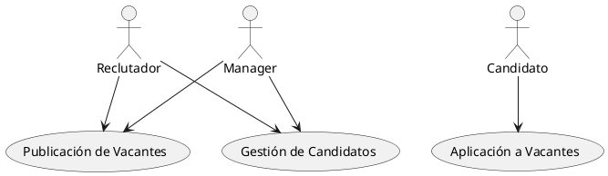

# Sistema de Seguimiento de Candidatos (ATS)

## Descripción de los Casos de Uso Principales

### 1. Publicación de Vacantes
- **Descripción**: El reclutador crea y publica una nueva vacante en el sistema ATS. Esto incluye la definición de la descripción del trabajo, requisitos, beneficios y otros detalles relevantes.
- **Actor Principal**: Reclutador
- **Actor Secundario**: Manager
- **Flujo Básico**:
  1. El reclutador accede al sistema y selecciona la opción para crear una nueva vacante.
  2. Introduce la información relevante sobre la vacante.
  3. Revisa y envía la vacante para su aprobación.
  4. El manager revisa la vacante y la aprueba o rechaza.
  5. Una vez aprobada, la vacante se publica en el portal de empleo.

### 2. Gestión de Candidatos
- **Descripción**: El reclutador gestiona las aplicaciones de los candidatos que han aplicado a las vacantes. Esto incluye la revisión de currículums, programación de entrevistas y actualización del estado del candidato.
- **Actor Principal**: Reclutador
- **Actor Secundario**: Manager
- **Flujo Básico**:
  1. Los candidatos aplican a las vacantes publicadas.
  2. El reclutador revisa las aplicaciones recibidas.
  3. El reclutador selecciona a los candidatos adecuados y programa entrevistas.
  4. El reclutador y el manager realizan entrevistas y actualizan el estado del candidato en el sistema.
  5. El reclutador notifica a los candidatos sobre su estado (rechazado, en proceso, seleccionado).

### 3. Aplicación a Vacantes
- **Descripción**: El candidato busca y aplica a las vacantes disponibles en el sistema ATS. Esto incluye la creación de un perfil, búsqueda de vacantes y envío de su currículum.
- **Actor Principal**: Candidato
- **Flujo Básico**:
  1. El candidato se registra y crea un perfil en el sistema ATS.
  2. El candidato busca vacantes disponibles.
  3. Selecciona una vacante de interés y aplica a ella.
  4. El sistema confirma la aplicación y notifica al candidato.

## Diagrama UML de Casos de Uso

## User Stories para el Sistema ATS

### Casos de Uso Principales para un Sistema ATS

#### 1. Publicación de Vacantes
1. **User Story**: Como Reclutador, quiero crear una nueva vacante para que pueda atraer candidatos calificados.
   - **Prioridad**: Alta
   - **Criterios de Aceptación**:
     - El reclutador puede acceder a un formulario de creación de vacantes.
     - El formulario permite ingresar detalles de la vacante como título, descripción, requisitos, y beneficios.
     - La vacante creada queda guardada en estado "Pendiente de aprobación".

2. **User Story**: Como Manager, quiero revisar y aprobar las vacantes creadas para asegurar que cumplan con los requisitos de la empresa.
   - **Prioridad**: Alta
   - **Criterios de Aceptación**:
     - El manager puede ver una lista de vacantes pendientes de aprobación.
     - El manager puede revisar los detalles de la vacante.
     - El manager puede aprobar o rechazar la vacante.
     - Si se aprueba, la vacante se publica en el portal de empleo. Si se rechaza, el reclutador recibe una notificación con los motivos del rechazo.

#### 2. Gestión de Candidatos
3. **User Story**: Como Reclutador, quiero revisar las aplicaciones de los candidatos para seleccionar a los más adecuados para la vacante.
   - **Prioridad**: Alta
   - **Criterios de Aceptación**:
     - El reclutador puede ver una lista de candidatos que han aplicado a una vacante.
     - El reclutador puede ver los detalles del perfil y currículum de cada candidato.
     - El reclutador puede cambiar el estado del candidato (en revisión, seleccionado para entrevista, rechazado).

4. **User Story**: Como Reclutador, quiero programar entrevistas con los candidatos seleccionados para evaluarlos adecuadamente.
   - **Prioridad**: Media
   - **Criterios de Aceptación**:
     - El reclutador puede seleccionar una fecha y hora para la entrevista.
     - El sistema envía notificaciones a los candidatos con los detalles de la entrevista.
     - El reclutador y el manager pueden ver el calendario de entrevistas.

5. **User Story**: Como Manager, quiero actualizar el estado de los candidatos después de la entrevista para mantener el proceso de selección organizado.
   - **Prioridad**: Media
   - **Criterios de Aceptación**:
     - El manager puede acceder a la lista de candidatos entrevistados.
     - El manager puede actualizar el estado del candidato (aprobado, rechazado, en espera).

#### 3. Aplicación a Vacantes
6. **User Story**: Como Candidato, quiero registrarme y crear un perfil en el sistema ATS para poder aplicar a las vacantes.
   - **Prioridad**: Alta
   - **Criterios de Aceptación**:
     - El candidato puede registrarse con su correo electrónico y contraseña.
     - El candidato puede completar su perfil con información personal, experiencia laboral, y educación.
     - El candidato puede subir su currículum.

7. **User Story**: Como Candidato, quiero buscar vacantes disponibles para encontrar oportunidades que se ajusten a mis habilidades e intereses.
   - **Prioridad**: Alta
   - **Criterios de Aceptación**:
     - El candidato puede buscar vacantes por palabra clave, ubicación, y categoría.
     - El candidato puede ver los detalles de cada vacante.

8. **User Story**: Como Candidato, quiero aplicar a una vacante para poder ser considerado para el puesto.
   - **Prioridad**: Alta
   - **Criterios de Aceptación**:
     - El candidato puede seleccionar una vacante y aplicar a ella.
     - El sistema confirma la aplicación y envía una notificación al candidato.

### Priorización de User Stories

1. Crear una nueva vacante (Reclutador) - **Alta**
2. Revisar y aprobar vacantes (Manager) - **Alta**
3. Revisar aplicaciones de candidatos (Reclutador) - **Alta**
4. Registrarse y crear un perfil (Candidato) - **Alta**
5. Buscar vacantes (Candidato) - **Alta**
6. Aplicar a una vacante (Candidato) - **Alta**
7. Programar entrevistas (Reclutador) - **Media**
8. Actualizar el estado de candidatos después de la entrevista (Manager) - **Media**
