# 🛠️ Diseño de un sistema de gestión de candidatos 👥💼

# **Tabla de Contenido**

- [***1. Fase de investigación y Análisis***](#1-fase-de-investigación-y-análisis)
  - [Prompt 1 - Resultado: Fase de investigación y análisis - Descripción](#prompt-1---resultado-fase-de-investigación-y-análisis---descripción)
  - [Prompt 2 - Resultado: Fase de investigación y análisis - Valor agreagado](#prompt-2---resultado-fase-de-investigación-y-análisis---valor-agreagado)
  - [Prompt 3 - Resultado: Fase de investigación y análisis - Ventajas competitivas](#prompt-3---resultado-fase-de-investigación-y-análisis---ventajas-competitivas)
  - [Prompt 4 - Resultado: Fase de investigación y análisis - Funciones principales](#prompt-4---resultado-fase-de-investigación-y-análisis---funciones-principales)
  - [Prompt 4.1 - Resultado: Fase de investigación y análisis - Funciones principales](#prompt-41---resultado-fase-de-investigación-y-análisis---funciones-principales)
  - [Prompt 5 - Resultado: Fase de investigación y análisis - Lean canvas](#prompt-5---resultado-fase-de-investigación-y-análisis---lean-canvas)
  - [Prompt 5 - Resultado: Fase de investigación y análisis - Lean canvas en Mermaid](#prompt-5---resultado-fase-de-investigación-y-análisis---lean-canvas-en-mermaid)
   - [Prompt 5.1 - Resultado: Fase de investigación y análisis - Lean canvas en Mermaid (ERROR #1)](#prompt-51---resultado-fase-de-investigación-y-análisis---lean-canvas-en-mermaid-error-1)
  - [Prompt 6 - Resultado: Generar Lean Canvas](#prompt-6---resultado-generar-lean-canvas)
- [***2. Fase de Casos de Uso***](#2-fase-de-casos-de-uso)
  - [Prompt 7 - Resultado: Fase de casos de uso - Tres casos de uso principales](#prompt-7---resultado-fase-de-casos-de-uso---tres-casos-de-uso-principales)
  - [Prompt 8 - Resultado: Fase de casos de uso - Diagrama](#prompt-8---resultado-fase-de-casos-de-uso---diagrama)
  - [Prompt 8.1 - Resultado: Fase de casos de uso - Error de sintaxis](#prompt-81---resultado-fase-de-casos-de-uso---error-de-sintaxis)
  - [Prompt 8.2 - Resultado: Fase de casos de uso - Falta el candidato](#prompt-82---resultado-fase-de-casos-de-uso---falta-el-candidato)
  - [Prompt 8.3 - Resultado: Fase de casos de uso - Diagrama de CU ajustado](#prompt-83---resultado-fase-de-casos-de-uso---diagrama-de-cu-ajustado)
- [***3. Fase de Modelado de Datos***](#3-fase-de-modelado-de-datos)
  - [Prompt 9 - Resultado: Modelo de datos](#prompt-9---resultado-modelo-de-datos)
  - [Prompt 9 - Resultado: Modelo de datos ampliado](#prompt-9---resultado-modelo-de-datos-ampliado)
- [***4. Fase de Diseño del Sistema y Modelo C4***](#4-fase-de-diseño-del-sistema-y-modelo-c4)
  - [Prompt 10 - Resultado: Diseño del sistema a alto nivel](#prompt-10---resultado-diseño-del-sistema-a-alto-nivel)
  - [Prompt 11 - Resultado: Explicación del diseño del sistema en alto nivel](#prompt-11---resultado-explicación-del-diseño-del-sistema-en-alto-nivel)
  - [Prompt 12 - Resultado: Diagrama C4 - Modelo de Contexto](#prompt-12---resultado-diagrama-c4---modelo-de-contexto)
  - [Prompt 12 - Resultado: Diagrama C4 - Modelo de Contexto. Error en el código](#prompt-12---resultado-diagrama-c4---modelo-de-contexto-error-en-el-código)
  - [Prompt 13 - Resultado: Diagrama C4 - Modelo de Contenedor](#prompt-13---resultado-diagrama-c4---modelo-de-contenedor)
  - [Prompt 14 - Resultado: Diagrama C4 - Modelo de Componentes _Offer Creation Service_](#prompt-14---resultado-diagrama-c4---modelo-de-componentes-offer-creation-service)
  - [Prompt 15 - Resultado: Diagrama C4 - Modelo de Código](#prompt-15---resultado-diagrama-c4---modelo-de-código)
  - [Prompt 16 - Resultado: Diagrama C4 - Modelo de Despliegue](#prompt-16---resultado-diagrama-c4---modelo-de-despliegue)
  - [Prompt 16 - Resultadoo: Diagrama C4 - Modelo de Despliegue ERROR en el diagrama](#prompt-16---resultadoo-diagrama-c4---modelo-de-despliegue-error-en-el-diagrama)

# ***1. Fase de investigación y Análisis***

## Prompt 1 - Resultado: Fase de investigación y análisis - Descripción
Un Sistema de Gestión de Candidatos (ATS) es una herramienta integral diseñada para optimizar y automatizar el proceso de reclutamiento, desde la creación de ofertas hasta la contratación final. Este sistema ayuda a las empresas a gestionar de manera eficiente y eficaz a los candidatos a lo largo de todo el ciclo de contratación.

1. **Creación de ofertas**: Permite diseñar y configurar descripciones de puestos y requisitos de manera intuitiva, asegurando claridad y precisión.
2. **Publicación de ofertas**: Facilita la distribución de las vacantes en múltiples plataformas como bolsas de trabajo, sitios web corporativos y redes sociales, alcanzando a una amplia audiencia.
3. **Recepción de candidatos**: Centraliza la recolección de aplicaciones, permitiendo una gestión ordenada y accesible de todos los candidatos que aplican.
4. **Revisión de candidatos**: Proporciona herramientas para evaluar y filtrar candidatos según criterios predefinidos, mejorando la calidad de las selecciones.
5. **Realización de pruebas en línea**: Integra evaluaciones y pruebas de habilidades que los candidatos pueden completar en línea, agilizando la preselección.
6. **Programación de entrevistas**: Automatiza la coordinación de entrevistas, permitiendo la asignación de horarios y seguimiento de confirmaciones.
7. **Contratación de candidatos seleccionados**: Facilita la generación de ofertas de trabajo y la gestión del proceso de incorporación, asegurando una transición fluida de los nuevos empleados.

Este ATS es esencial para cualquier organización que busque optimizar su proceso de reclutamiento y mejorar la calidad de sus contrataciones.

## Prompt 2 - Resultado: Fase de investigación y análisis - Valor agreagado
El valor agregado que obtiene el cliente de un sistema de gestión de candidatos (ATS) se manifiesta en varios aspectos clave:

1. **Eficiencia y ahorro de tiempo:** Automatiza tareas repetitivas como la publicación de ofertas, la recolección de aplicaciones y la programación de entrevistas, lo que libera tiempo para que los reclutadores se concentren en actividades estratégicas y de valor agregado.

2. **Mejora de la calidad de contratación:** Facilita la revisión y comparación de candidatos de manera estructurada y basada en criterios específicos, lo que conduce a decisiones más informadas y contrataciones más acertadas.

3. **Mejora de la experiencia del candidato:** Ofrece una experiencia más fluida y profesional desde la aplicación inicial hasta la contratación, lo que refuerza la imagen de la empresa y fortalece la relación con los candidatos, incluso aquellos que no son seleccionados.

4. **Análisis y reportes:** Proporciona datos y métricas sobre el rendimiento del reclutamiento, como el tiempo promedio de contratación o la efectividad de las fuentes de reclutamiento, permitiendo ajustes y mejoras continuas en el proceso.

5. **Cumplimiento y gestión de talento:** Ayuda a cumplir con regulaciones laborales y a gestionar eficazmente la base de datos de talentos, creando una reserva valiosa para futuras contrataciones.

En resumen, un ATS no solo simplifica y optimiza el proceso de reclutamiento, sino que también mejora la calidad de las contrataciones, fortalece la marca empleadora y proporciona herramientas para la gestión estratégica del talento.

## Prompt 3 - Resultado: Fase de investigación y análisis - Ventajas competitivas
Un Sistema de Gestión de Candidatos (ATS) puede proporcionar varias ventajas competitivas significativas para una organización:

### Beneficios Operativos y Eficiencia:

1. **Automatización de Procesos:** Reduce el tiempo dedicado a tareas administrativas como la publicación de ofertas, la recolección y clasificación de currículums, y la programación de entrevistas, permitiendo que los reclutadores se enfoquen en actividades más estratégicas como la evaluación de candidatos.

2. **Centralización y Accesibilidad de Datos:** Facilita el acceso rápido y seguro a la información de los candidatos desde una plataforma centralizada, mejorando la colaboración entre equipos y la toma de decisiones basada en datos.

3. **Mejora de la Experiencia del Candidato:** Proporciona una experiencia de reclutamiento más profesional y eficiente, lo cual puede aumentar la satisfacción de los candidatos, independientemente de si son seleccionados o no, fortaleciendo la marca empleadora de la organización.

### Reducción de Costos:

1. **Reducción de Tiempo de Contratación:** Acelera el proceso de reclutamiento, lo que puede reducir los costos asociados a la vacante de posiciones clave y minimizar la pérdida de productividad.

2. **Optimización de Recursos:** Permite una mejor asignación de recursos humanos y financieros al eliminar redundancias y mejorar la eficiencia operativa del equipo de reclutamiento.

### Aspectos Críticos para el Éxito del ATS:

1. **Integración y Adaptabilidad:** La capacidad del ATS para integrarse con otros sistemas empresariales y adaptarse a las necesidades específicas de la organización es crucial para maximizar su utilidad y eficacia.

2. **Facilidad de Uso y Soporte:** Un diseño intuitivo y un soporte eficaz aseguran una adopción rápida por parte de los usuarios y una menor curva de aprendizaje.

3. **Cumplimiento y Seguridad de Datos:** Garantizar que el ATS cumpla con las normativas de protección de datos y seguridad de la información es fundamental para mitigar riesgos legales y de reputación.

### Medición del Éxito del ATS:

1. **Mejora Operativa:** Se puede medir el éxito del ATS mediante indicadores como el tiempo promedio de contratación, la reducción de costos por contratación y la eficiencia del proceso de reclutamiento.

2. **Reducción de Costos:** Evaluar los ahorros en términos de reducción de costos administrativos y tiempo dedicado a procesos manuales.

3. **Satisfacción del Candidato:** Realizar encuestas de satisfacción para evaluar la percepción de los candidatos sobre la experiencia de reclutamiento.

4. **Satisfacción del Equipo de Reclutamiento:** Obtener retroalimentación de los equipos internos sobre la facilidad de uso y la efectividad del ATS en la mejora de su productividad.

En conclusión, un ATS no solo optimiza las operaciones de reclutamiento, sino que también contribuye directamente a los objetivos estratégicos de una organización al mejorar la eficiencia, reducir costos y fortalecer la experiencia tanto de candidatos como de equipos internos. La selección y la implementación cuidadosa de un ATS que se alinee con los objetivos empresariales específicos será clave para maximizar estos beneficios competitivos.

## Prompt 4 - Resultado: Fase de investigación y análisis - Funciones principales
**ELIMINADO por obtener un resultado ineficiente**

## Prompt 4.1 - Resultado: Fase de investigación y análisis - Funciones principales
Aquí tienes una lista detallada de las funciones principales de cada módulo de un Sistema de Gestión de Candidatos (ATS), basada en los elementos que mencionaste:

1. **Creación de Ofertas:**
   - Creación de descripciones detalladas de puestos vacantes.
   - Especificación de responsabilidades, requisitos y competencias necesarias.
   - Definición de ubicación, tipo de contrato, salario y beneficios asociados.

2. **Publicación de Ofertas:**
   - Distribución automática de las ofertas en múltiples canales como bolsas de trabajo, sitio web corporativo y redes sociales.
   - Programación de publicaciones para optimizar la visibilidad de las vacantes en diferentes horarios y días.

3. **Recepción de Candidatos:**
   - Recepción y registro automatizado de todas las aplicaciones de candidatos.
   - Notificaciones instantáneas de nuevas aplicaciones para una respuesta rápida.

4. **Revisión de Candidatos:**
   - Funcionalidad de screening automático para filtrar candidatos que cumplen con criterios específicos.
   - Herramientas de evaluación y comparación de candidatos basadas en habilidades y competencias.

5. **Realización de Pruebas en Línea:**
   - Integración de plataformas para administrar y evaluar pruebas de habilidades técnicas, cognitivas o de personalidad.
   - Generación automática de resultados y análisis de rendimiento de los candidatos.

6. **Programación de Entrevistas:**
   - Agenda electrónica para la coordinación de entrevistas con candidatos y reclutadores.
   - Envío automatizado de recordatorios y confirmaciones de entrevistas.

7. **Contratación de Candidatos Seleccionados:**
   - Gestión del proceso de ofrecimiento y negociación con los candidatos seleccionados.
   - Generación de cartas de oferta y documentación para la contratación.

Estas funciones están diseñadas para optimizar cada etapa del proceso de reclutamiento y selección, mejorando la eficiencia operativa, reduciendo tiempos de contratación y ofreciendo una experiencia mejorada tanto para los candidatos como para los equipos de reclutamiento.

## Prompt 5 - Resultado: Fase de investigación y análisis - Lean canvas
Aquí tienes los 9 apartados del Lean Canvas aplicados al modelo de negocio de implementar un Sistema de Gestión de Candidatos (ATS):

1. **PROBLEMA**
   - **Problemas principales que resuelve el ATS:**
     1. Ineficiencia en el proceso de reclutamiento debido a la gestión manual de candidatos.
     2. Dificultad para atraer y seleccionar candidatos adecuados de manera rápida y efectiva.
     3. Falta de visibilidad y control sobre el flujo de candidatos en el proceso de contratación.
   - **ALTERNATIVAS EXISTENTES:**
     - Actualmente, las empresas utilizan hojas de cálculo, correos electrónicos y sistemas de seguimiento de candidatos (CRM) genéricos para gestionar el reclutamiento.

2. **SEGMENTOS DE CLIENTES**
   - **Clientes Objetivo:**
     - Empresas de todos los tamaños que necesitan gestionar eficientemente su proceso de reclutamiento.
   - **EARLY ADOPTERS:**
     - Grandes corporaciones con alto volumen de contratación.
     - Startups en crecimiento que buscan optimizar recursos en la contratación.
   - *Características de los Early Adopters:*
     - Innovadores en tecnología.
     - Enfocados en mejorar la eficiencia operativa.
     - Dispuestos a adoptar nuevas soluciones tecnológicas para obtener ventajas competitivas.

3. **PROPUESTA DE VALOR ÚNICA**
   - **Propuesta de Valor Única:**
     - Un ATS intuitivo y personalizable que simplifica y acelera el proceso de contratación desde la publicación de ofertas hasta la incorporación.
   - **CONCEPTO DE ALTO NIVEL:**
     - "RecruitEasy es el sistema todo-en-uno que transforma tu proceso de reclutamiento, optimizando cada etapa desde la atracción inicial de candidatos hasta la contratación final."

4. **SOLUCIÓN**
   - **Soluciones propuestas:**
     - Creación de ofertas de trabajo personalizadas y atractivas.
     - Publicación automática en múltiples plataformas y redes sociales.
     - Gestión centralizada de candidatos con herramientas avanzadas de filtrado y evaluación.
     - Programación automatizada de entrevistas y pruebas en línea.
     - Flujo de trabajo eficiente para la contratación y documentación.

5. **CANALES DE CLIENTES**
   - **Canales de adquisición:**
     - Marketing digital (SEO, SEM).
     - Participación en ferias de reclutamiento y eventos del sector.
     - Alianzas estratégicas con consultoras de recursos humanos y empresas de formación.

6. **FLUJOS DE INGRESOS**
   - **Tipos de ingresos:**
     - Suscripciones mensuales o anuales por el uso del ATS.
     - Modelos de pago por uso (por número de usuarios o número de vacantes publicadas).
     - Servicios adicionales como formación y soporte personalizado.

7. **ESTRUCTURA DE COSTES**
   - **Costes fijos:**
     - Desarrollo y mantenimiento del software.
     - Servidores y almacenamiento de datos.
     - Personal técnico y de soporte.
   - **Costes variables:**
     - Costes de marketing y adquisición de clientes.
     - Costes de servicios adicionales (formación, consultoría).

8. **MÉTRICAS CLAVE**
   - **Métricas clave:**
     - Número de usuarios activos del ATS.
     - Tasa de conversión de candidatos.
     - Tiempo promedio de contratación.
     - Retención de clientes.
     - Customer Lifetime Value (CLV).

9. **VENTAJA INJUSTA**
   - **Ventaja competitiva difícil de replicar:**
     - Integración profunda con plataformas de empleo líderes y redes profesionales.
     - Algoritmos avanzados de matching que mejoran la precisión en la selección de candidatos.
     - Innovaciones continuas y actualizaciones rápidas del producto basadas en retroalimentación del usuario.

Este Lean Canvas proporciona una visión holística del modelo de negocio de un ATS, destacando cómo puede resolver problemas específicos de reclutamiento, identificar y atraer a sus clientes objetivo, y generar ingresos mientras controla los costes y mide el éxito a través de métricas clave.

## Prompt 5 - Resultado: Fase de investigación y análisis - Lean canvas en Mermaid
**ELIMINADO por resultados no legibles**

## Prompt 5.1 - Resultado: Fase de investigación y análisis - Lean canvas en Mermaid (ERROR #1)
**ELIMINADO por resultados no legibles y un error persistente**

## Prompt 6 - Resultado: Generar Lean Canvas
[Resultado generado por Lean Canvas AI](https://leancanvasai.com/l/view_canvas/4b484348-0a2d-4260-bc18-37b538c01628/)

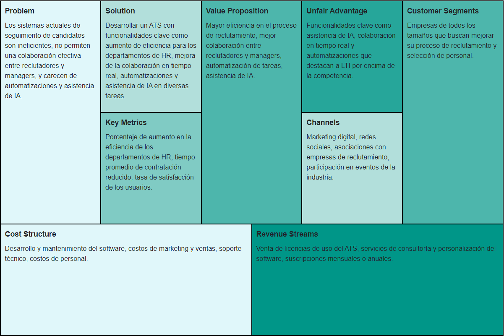

# ***2. Fase de Casos de Uso***

## Prompt 7 - Resultado: Fase de casos de uso - Tres casos de uso principales

Para un Sistema de Gestión de Candidatos (ATS) orientado a un Producto Mínimo Viable (MVP), los casos de uso más importantes podrían incluir:

1. **Publicación de Ofertas de Trabajo:**
   - **Descripción:** Permite a los reclutadores crear y publicar ofertas de trabajo de manera eficiente.
   - **Funcionalidades Clave:**
     - Interfaz para crear nuevas ofertas con campos estructurados (puesto, ubicación, descripción, requisitos, etc.).
     - Opciones para seleccionar plataformas de publicación como bolsas de trabajo, sitio web de la empresa, redes sociales, etc.
     - Capacidades de edición y borrado de ofertas existentes.

2. **Gestión de Candidatos:**
   - **Descripción:** Facilita la recepción, gestión y seguimiento de candidatos que aplican a las ofertas publicadas.
   - **Funcionalidades Clave:**
     - Recepción automatizada de candidaturas y almacenamiento en una base de datos centralizada.
     - Herramientas de filtrado y búsqueda avanzadas para evaluar candidatos según criterios predefinidos (experiencia, habilidades, educación, etc.).
     - Gestión de estados de candidatos (por ejemplo, entrevista programada, en proceso de evaluación, rechazado, contratado).

3. **Programación de Entrevistas:**
   - **Descripción:** Permite a los reclutadores coordinar y programar entrevistas con candidatos de manera eficiente.
   - **Funcionalidades Clave:**
     - Calendario integrado para visualizar disponibilidad de reclutadores y candidatos.
     - Envío automático de invitaciones y recordatorios de entrevistas por correo electrónico.
     - Capacidades de sincronización con calendarios personales (por ejemplo, Google Calendar) para evitar conflictos de horarios.

Estos casos de uso proporcionan una base funcional sólida para un ATS MVP, abarcando desde la creación y publicación de ofertas de trabajo hasta la gestión y programación de entrevistas con candidatos. Implementar estos elementos básicos permitirá a un equipo de reclutamiento mejorar significativamente su eficiencia y efectividad en el proceso de contratación.

## Prompt 8 - Resultado: Fase de casos de uso - Diagrama

Para representar los casos de uso de un Sistema de Gestión de Candidatos (ATS) utilizando PlantUML, vamos a crear un diagrama de casos de uso. Este tipo de diagrama es ideal para visualizar las interacciones entre los actores y el sistema, mostrando los casos de uso principales y sus relaciones. Aquí está el diagrama junto con la descripción de cada caso de uso:

```plantuml
@startuml
left to right direction

actor Reclutador as recruiter

rectangle "Sistema de Gestión de Candidatos" {
    rectangle "Publicación de Ofertas" {
        :Crear Oferta de Trabajo;
        :Publicar Oferta en Plataformas;
        :Editar/Borrar Oferta;
    }
    
    rectangle "Gestión de Candidatos" {
        :Recibir Candidaturas;
        :Filtrar y Buscar Candidatos;
        :Gestionar Estados de Candidatos;
    }
    
    rectangle "Programación de Entrevistas" {
        :Visualizar Calendario;
        :Enviar Invitaciones y Recordatorios;
        :Sincronización con Calendarios Externos;
    }
    
    recruiter --> "Publicación de Ofertas"
    recruiter --> "Gestión de Candidatos"
    recruiter --> "Programación de Entrevistas"
}

@enduml
```

**Descripción de los Casos de Uso:**

1. **Publicación de Ofertas:**
   - **Crear Oferta de Trabajo:** Permite al reclutador ingresar los detalles de una nueva oferta de trabajo.
   - **Publicar Oferta en Plataformas:** Facilita la selección y publicación automática de la oferta en diferentes plataformas como bolsas de trabajo, sitio web de la empresa y redes sociales.
   - **Editar/Borrar Oferta:** Permite al reclutador modificar los detalles de una oferta existente o eliminarla según sea necesario.

2. **Gestión de Candidatos:**
   - **Recibir Candidaturas:** Automatiza la recepción de candidaturas de candidatos interesados en las ofertas publicadas.
   - **Filtrar y Buscar Candidatos:** Proporciona herramientas para filtrar y buscar candidatos en función de criterios específicos como habilidades, experiencia, etc.
   - **Gestionar Estados de Candidatos:** Permite al reclutador mantener y actualizar el estado de cada candidato en el proceso de contratación (por ejemplo, en revisión, programado para entrevista, rechazado, contratado).

3. **Programación de Entrevistas:**
   - **Visualizar Calendario:** Permite al reclutador ver de manera centralizada los horarios disponibles para programar entrevistas.
   - **Enviar Invitaciones y Recordatorios:** Automatiza el envío de invitaciones y recordatorios de entrevistas a candidatos por correo electrónico u otros medios.
   - **Sincronización con Calendarios Externos:** Ofrece la capacidad de sincronizar automáticamente con calendarios externos (como Google Calendar) para evitar conflictos de horarios.

Este diagrama y descripción proporcionan una representación clara y concisa de cómo los reclutadores interactúan con el sistema ATS a través de estos casos de uso esenciales para el proceso de contratación.

## Prompt 8.1 - Resultado: Fase de casos de uso - Error de sintaxis

Para corregir el error en la línea 8 y asegurar que el diagrama se genera correctamente, vamos a ajustar la sintaxis de los casos de uso. En lugar de usar dos puntos para definir los casos de uso, vamos a utilizar la palabra clave `usecase` que es más adecuada para PlantUML en este contexto.

Aquí está el diagrama corregido:

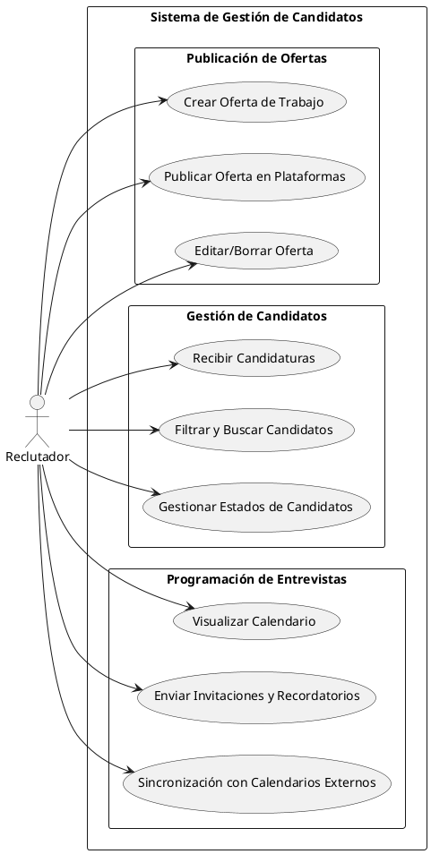
```plantuml
@startuml
left to right direction

actor Reclutador as recruiter

rectangle "Sistema de Gestión de Candidatos" {
    rectangle "Publicación de Ofertas" {
        usecase "Crear Oferta de Trabajo" as U1
        usecase "Publicar Oferta en Plataformas" as U2
        usecase "Editar/Borrar Oferta" as U3
    }
    
    rectangle "Gestión de Candidatos" {
        usecase "Recibir Candidaturas" as U4
        usecase "Filtrar y Buscar Candidatos" as U5
        usecase "Gestionar Estados de Candidatos" as U6
    }
    
    rectangle "Programación de Entrevistas" {
        usecase "Visualizar Calendario" as U7
        usecase "Enviar Invitaciones y Recordatorios" as U8
        usecase "Sincronización con Calendarios Externos" as U9
    }
    
    recruiter --> U1
    recruiter --> U2
    recruiter --> U3
    recruiter --> U4
    recruiter --> U5
    recruiter --> U6
    recruiter --> U7
    recruiter --> U8
    recruiter --> U9
}

@enduml
```

Este diagrama usa `usecase` para definir los casos de uso y se asegura que el formato esté correcto para que PlantUML lo interprete sin errores.

> Resultado del sitio [PlantUML](https://www.plantuml.com/)
> - Diagrama de casos de uso versión 1.0

  

## Prompt 8.2 - Resultado: Fase de casos de uso - Falta el candidato

Claro, vamos a ajustar la definición de los tres casos de uso más importantes para incluir tanto al reclutador como al candidato.

### Casos de Uso Ajustados:

1. **Publicación de Ofertas de Trabajo:**
   - **Descripción:** Permite a los reclutadores crear y publicar ofertas de trabajo de manera eficiente, y facilita a los candidatos la visualización y aplicación a estas ofertas.
   - **Actores:** Reclutador, Candidato
   - **Funcionalidades Clave:**
     - **Reclutador:**
       - Crear nueva oferta de trabajo con campos estructurados (puesto, ubicación, descripción, requisitos, etc.).
       - Seleccionar plataformas de publicación (bolsas de trabajo, sitio web de la empresa, redes sociales, etc.).
       - Editar y borrar ofertas existentes.
     - **Candidato:**
       - Buscar y visualizar ofertas de trabajo publicadas.
       - Aplicar a las ofertas de trabajo de interés.

2. **Gestión de Candidatos:**
   - **Descripción:** Facilita la recepción, gestión y seguimiento de candidatos que aplican a las ofertas publicadas, y permite a los candidatos gestionar sus aplicaciones.
   - **Actores:** Reclutador, Candidato
   - **Funcionalidades Clave:**
     - **Reclutador:**
       - Recepción automatizada de candidaturas y almacenamiento en una base de datos centralizada.
       - Herramientas de filtrado y búsqueda avanzadas para evaluar candidatos según criterios predefinidos (experiencia, habilidades, educación, etc.).
       - Gestión de estados de candidatos (por ejemplo, entrevista programada, en proceso de evaluación, rechazado, contratado).
     - **Candidato:**
       - Enviar su candidatura para las ofertas de trabajo.
       - Ver el estado de sus aplicaciones (en revisión, entrevista programada, rechazado, contratado).

3. **Programación de Entrevistas:**
   - **Descripción:** Permite a los reclutadores coordinar y programar entrevistas con candidatos de manera eficiente, y permite a los candidatos gestionar sus entrevistas.
   - **Actores:** Reclutador, Candidato
   - **Funcionalidades Clave:**
     - **Reclutador:**
       - Visualizar calendario para ver la disponibilidad de reclutadores y candidatos.
       - Enviar invitaciones y recordatorios automáticos de entrevistas por correo electrónico.
       - Sincronización con calendarios personales (por ejemplo, Google Calendar) para evitar conflictos de horarios.
     - **Candidato:**
       - Recibir invitaciones y recordatorios de entrevistas.
       - Confirmar o solicitar cambios en las fechas y horas de las entrevistas.
       - Ver su calendario de entrevistas programadas.

Estos casos de uso ajustados incluyen tanto a los reclutadores como a los candidatos, destacando sus interacciones y responsabilidades en el proceso de gestión de candidatos mediante el ATS.

## Prompt 8.3 - Resultado: Fase de casos de uso - Diagrama de CU ajustado

Claro, aquí tienes cada uno de los tres casos de uso representados por separado en diagramas de casos de uso utilizando el formato PlantUML.

### Diagrama de Caso de Uso 1: Publicación de Ofertas de Trabajo

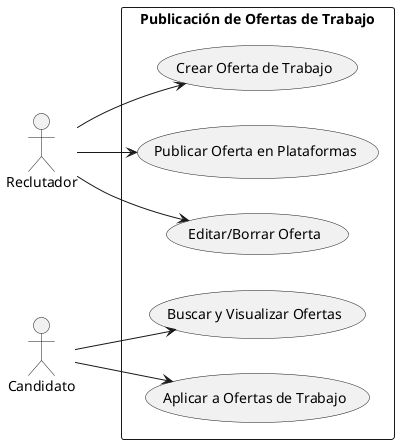
```plantuml
@startuml
left to right direction

actor Reclutador as recruiter
actor Candidato as candidate

rectangle "Publicación de Ofertas de Trabajo" {
    usecase "Crear Oferta de Trabajo" as U1
    usecase "Publicar Oferta en Plataformas" as U2
    usecase "Editar/Borrar Oferta" as U3
    usecase "Buscar y Visualizar Ofertas" as U4
    usecase "Aplicar a Ofertas de Trabajo" as U5
}

recruiter --> U1
recruiter --> U2
recruiter --> U3
candidate --> U4
candidate --> U5

@enduml
```

### Diagrama de Caso de Uso 2: Gestión de Candidatos

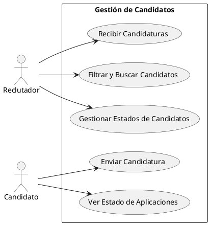
```plantuml
@startuml
left to right direction

actor Reclutador as recruiter
actor Candidato as candidate

rectangle "Gestión de Candidatos" {
    usecase "Recibir Candidaturas" as U1
    usecase "Filtrar y Buscar Candidatos" as U2
    usecase "Gestionar Estados de Candidatos" as U3
    usecase "Enviar Candidatura" as U4
    usecase "Ver Estado de Aplicaciones" as U5
}

recruiter --> U1
recruiter --> U2
recruiter --> U3
candidate --> U4
candidate --> U5

@enduml
```

### Diagrama de Caso de Uso 3: Programación de Entrevistas

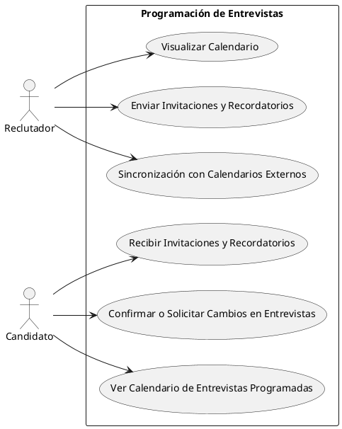
```plantuml
@startuml
left to right direction

actor Reclutador as recruiter
actor Candidato as candidate

rectangle "Programación de Entrevistas" {
    usecase "Visualizar Calendario" as U1
    usecase "Enviar Invitaciones y Recordatorios" as U2
    usecase "Sincronización con Calendarios Externos" as U3
    usecase "Recibir Invitaciones y Recordatorios" as U4
    usecase "Confirmar o Solicitar Cambios en Entrevistas" as U5
    usecase "Ver Calendario de Entrevistas Programadas" as U6
}

recruiter --> U1
recruiter --> U2
recruiter --> U3
candidate --> U4
candidate --> U5
candidate --> U6

@enduml
```

Cada diagrama muestra claramente las interacciones entre los actores (Reclutador y Candidato) y los casos de uso, asegurando que la sintaxis esté correcta y que PlantUML los interprete sin errores.

> Resultados del sitio [PlantUML](https://www.plantuml.com/)
> - CU01-Publicación de Ofertas de Trabajo

  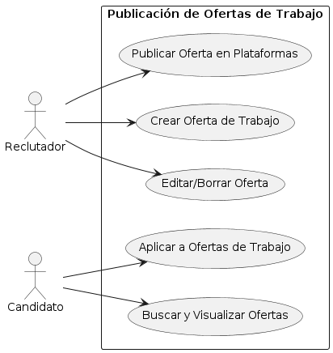

> - CU02-Gestión de Candidatos

  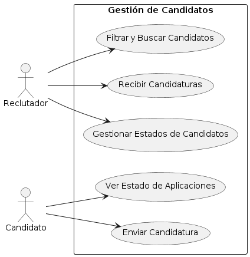

> - CU03-Programación de Entrevistas

  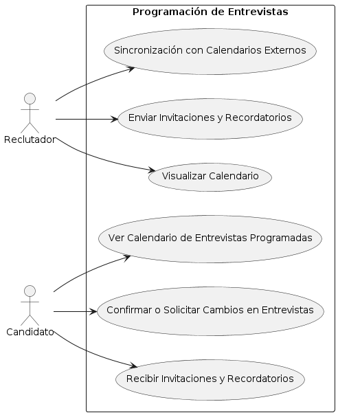

# ***3. Fase de Modelado de Datos***

## Prompt 9 - Resultado: Modelo de datos

Para diseñar el modelo de datos de un Sistema de Gestión de Candidatos (ATS) enfocado en los tres casos de uso más relevantes, vamos a definir las entidades principales y sus campos esenciales. También estableceremos las relaciones entre estas entidades.

### Entidades y Campos Esenciales

1. **Oferta**
   - `id`: Identificador único de la oferta.
   - `titulo`: Título de la oferta de trabajo.
   - `descripcion`: Descripción detallada de la oferta.
   - `requisitos`: Requisitos necesarios para la oferta.
   - `fecha_publicacion`: Fecha de publicación de la oferta.
   - `estado`: Estado de la oferta (publicada, cerrada, etc.).

2. **Candidato**
   - `id`: Identificador único del candidato.
   - `nombre`: Nombre completo del candidato.
   - `email`: Correo electrónico del candidato.
   - `telefono`: Número de teléfono del candidato.
   - `cv`: Enlace al currículum vitae del candidato.
   - `estado`: Estado del candidato (aplicó, en revisión, rechazado, contratado).

3. **Aplicacion**
   - `id`: Identificador único de la aplicación.
   - `id_oferta`: Referencia a la oferta a la que aplica el candidato.
   - `id_candidato`: Referencia al candidato que aplica.
   - `fecha_aplicacion`: Fecha en la que el candidato aplicó.
   - `estado`: Estado de la aplicación (recibida, en revisión, entrevista programada, etc.).

4. **Entrevista**
   - `id`: Identificador único de la entrevista.
   - `id_candidato`: Referencia al candidato entrevistado.
   - `id_oferta`: Referencia a la oferta relacionada con la entrevista.
   - `fecha_entrevista`: Fecha y hora de la entrevista.
   - `resultado`: Resultado de la entrevista (pendiente, aprobado, rechazado).

### Relaciones entre Entidades

- Una **Oferta** puede tener múltiples **Aplicaciones**.
- Un **Candidato** puede aplicar a múltiples **Ofertas** (mediante la entidad **Aplicacion**).
- Una **Aplicacion** puede derivar en múltiples **Entrevistas**.
- Una **Entrevista** está asociada a una única **Aplicacion**.

### Diagrama Mermaid

Aquí está el código para generar el diagrama de entidades y relaciones utilizando Mermaid:

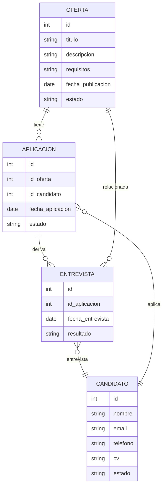
```mermaid
erDiagram
    OFERTA {
        int id
        string titulo
        string descripcion
        string requisitos
        date fecha_publicacion
        string estado
    }

    CANDIDATO {
        int id
        string nombre
        string email
        string telefono
        string cv
        string estado
    }

    APLICACION {
        int id
        int id_oferta
        int id_candidato
        date fecha_aplicacion
        string estado
    }

    ENTREVISTA {
        int id
        int id_aplicacion
        date fecha_entrevista
        string resultado
    }

    OFERTA ||--o{ APLICACION : tiene
    CANDIDATO ||--o{ APLICACION : aplica
    APLICACION ||--o{ ENTREVISTA : deriva
    ENTREVISTA }o--|| CANDIDATO : entrevista
    ENTREVISTA }o--|| OFERTA : relacionada
```

Este diagrama representa las entidades esenciales del ATS, sus campos principales y las relaciones entre ellas, proporcionando una base sólida para el diseño de la base de datos del sistema.

> Resultado en el sitio [Mermaid](https://mermaid.js.org/)

  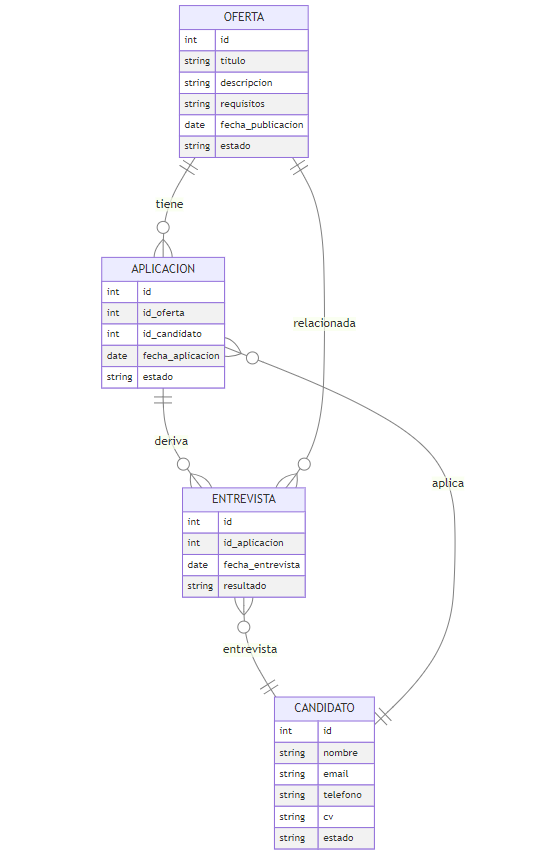

## Prompt 9 - Resultado: Modelo de datos ampliado

Además de las entidades previamente mencionadas, hay otras entidades que son importantes para un Sistema de Gestión de Candidatos (ATS) completo. Aquí se incluyen:

1. **Usuario (Reclutador)**
2. **Prueba**
3. **Calificación de Prueba**
4. **Comentario de Entrevista**
5. **Notificación**
6. **Empresa**

### Entidades y Campos Esenciales

1. **Usuario (Reclutador)**
   - `id`: Identificador único del usuario.
   - `nombre`: Nombre completo del usuario.
   - `email`: Correo electrónico del usuario.
   - `rol`: Rol del usuario (reclutador, administrador, etc.).

2. **Prueba**
   - `id`: Identificador único de la prueba.
   - `nombre`: Nombre de la prueba.
   - `descripcion`: Descripción de la prueba.
   - `duracion`: Duración de la prueba.

3. **Calificación de Prueba**
   - `id`: Identificador único de la calificación.
   - `id_prueba`: Referencia a la prueba.
   - `id_candidato`: Referencia al candidato.
   - `puntuacion`: Puntuación obtenida en la prueba.
   - `fecha_realizacion`: Fecha de realización de la prueba.

4. **Comentario de Entrevista**
   - `id`: Identificador único del comentario.
   - `id_entrevista`: Referencia a la entrevista.
   - `id_usuario`: Referencia al usuario que realizó el comentario.
   - `comentario`: Texto del comentario.
   - `fecha_comentario`: Fecha en que se realizó el comentario.

5. **Notificación**
   - `id`: Identificador único de la notificación.
   - `id_usuario`: Referencia al usuario receptor de la notificación.
   - `mensaje`: Contenido de la notificación.
   - `fecha_envio`: Fecha de envío de la notificación.
   - `leida`: Estado de la notificación (leída o no leída).

6. **Empresa**
   - `id`: Identificador único de la empresa.
   - `nombre`: Nombre de la empresa.
   - `direccion`: Dirección de la empresa.
   - `telefono`: Número de teléfono de la empresa.
   - `email`: Correo electrónico de la empresa.

### Relaciones entre Entidades

- Un **Usuario** puede crear múltiples **Ofertas** y **Entrevistas**.
- Una **Prueba** puede ser tomada por múltiples **Candidatos** (mediante la entidad **Calificación de Prueba**).
- Un **Candidato** puede tener múltiples **Calificaciones de Prueba**.
- Un **Comentario de Entrevista** está asociado a una única **Entrevista** y un único **Usuario**.
- Una **Notificación** está dirigida a un único **Usuario**.
- Una **Empresa** puede tener múltiples **Ofertas**.

### Diagrama Mermaid

Aquí está el código para generar el diagrama de entidades y relaciones utilizando Mermaid:

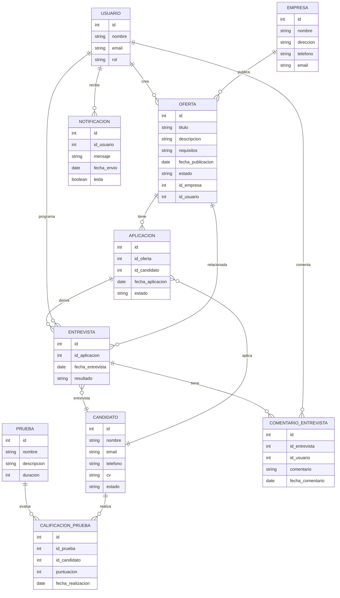
```mermaid
erDiagram
    OFERTA {
        int id
        string titulo
        string descripcion
        string requisitos
        date fecha_publicacion
        string estado
        int id_empresa
        int id_usuario
    }

    CANDIDATO {
        int id
        string nombre
        string email
        string telefono
        string cv
        string estado
    }

    APLICACION {
        int id
        int id_oferta
        int id_candidato
        date fecha_aplicacion
        string estado
    }

    ENTREVISTA {
        int id
        int id_aplicacion
        date fecha_entrevista
        string resultado
    }

    USUARIO {
        int id
        string nombre
        string email
        string rol
    }

    PRUEBA {
        int id
        string nombre
        string descripcion
        int duracion
    }

    CALIFICACION_PRUEBA {
        int id
        int id_prueba
        int id_candidato
        int puntuacion
        date fecha_realizacion
    }

    COMENTARIO_ENTREVISTA {
        int id
        int id_entrevista
        int id_usuario
        string comentario
        date fecha_comentario
    }

    NOTIFICACION {
        int id
        int id_usuario
        string mensaje
        date fecha_envio
        boolean leida
    }

    EMPRESA {
        int id
        string nombre
        string direccion
        string telefono
        string email
    }

    OFERTA ||--o{ APLICACION : tiene
    CANDIDATO ||--o{ APLICACION : aplica
    APLICACION ||--o{ ENTREVISTA : deriva
    ENTREVISTA }o--|| CANDIDATO : entrevista
    ENTREVISTA }o--|| OFERTA : relacionada
    USUARIO ||--o{ OFERTA : crea
    USUARIO ||--o{ ENTREVISTA : programa
    PRUEBA ||--o{ CALIFICACION_PRUEBA : evalua
    CANDIDATO ||--o{ CALIFICACION_PRUEBA : realiza
    ENTREVISTA ||--o{ COMENTARIO_ENTREVISTA : tiene
    USUARIO ||--o{ COMENTARIO_ENTREVISTA : comenta
    USUARIO ||--o{ NOTIFICACION : recibe
    EMPRESA ||--o{ OFERTA : publica
```

Este diagrama detalla las entidades adicionales necesarias para un ATS completo y muestra cómo se relacionan entre sí, proporcionando una estructura robusta para la implementación del sistema.

> Resultado en el sitio [Mermaid](https://mermaid.js.org/)
>> [Ver modelo extendido](https://mermaid.live/view#pako:eNq1VtuO2jAQ_ZXIz4C4F_KWAishLRdx6UMVCZlkAFeJnTo26i7w7-uwhibBAapV80LMzMRnZs4Z-4A85gOyEfA-wVuOQ5e71FLP5GUwWzjW4bJOHkKFRfz0P7HghG4tQYQMmMHgQ-xxEnmEUYOVw29JYiJYnDb6WIC1AW-HV5FcB8TDBeEQC-yzW4ArCCMOMTZYZCwxJ9eYU_JyWfSccX_YdxaTJ5OmLFxzMOEKMQlMVYIANoya6uTtH-aXwepMX4c9pzecjB-B1YmzDXBhqoiHqU9UyVlBC3D0dAcyCAfjxWzwYzh_zCENxLxRCglQwWFP4mwaVyrFMigEs5wvndnwvzWWs8C47XS2HHx3vrprgYaSD_mSZyqW4_Pr8EWzZPUcFN2KiEtYP02WxBZJKuS95nHAAXm_A3YyUoxJmrT6Z-aYiWFWfFpzLFSReWMK861DBvJ4srjW90mkxWDUTjH-BYXU32ej1owFgKkVgGqHWX-j6Www_zr5CAevQP135llGKRlc-lw5HstldkjPMVudIkDhdhqbXD-HhWEaaucUh2wlIE722DCYTqxcPh5TW9nWLZdu_XUKtho6wZnR-G8PLpNG47i6ekoABT4ZrBFnySmMcyNEu5okrTDvcSBxYeHMQVqQhiwvYUZF5rqUS6UoRiupICojpASZR9aQ53G-oPpqkLihEgqBK8b56iJzSMJcJHYQgots9erDBquzwUUuPSlXLAWbv1EP2UKNuRLiTG53yN7gIFYrGSWy03ehi0uE6U_G0ktkH9AfZDca3Uq7863bqrUa6reE3pBdbjY6lW61Xm3XOvVmu1lrnUro_Rxeq9Qb3Wq32qq3u-16p1nrlBD46v7DR5-3sPNl7PQB9fXtxg)

   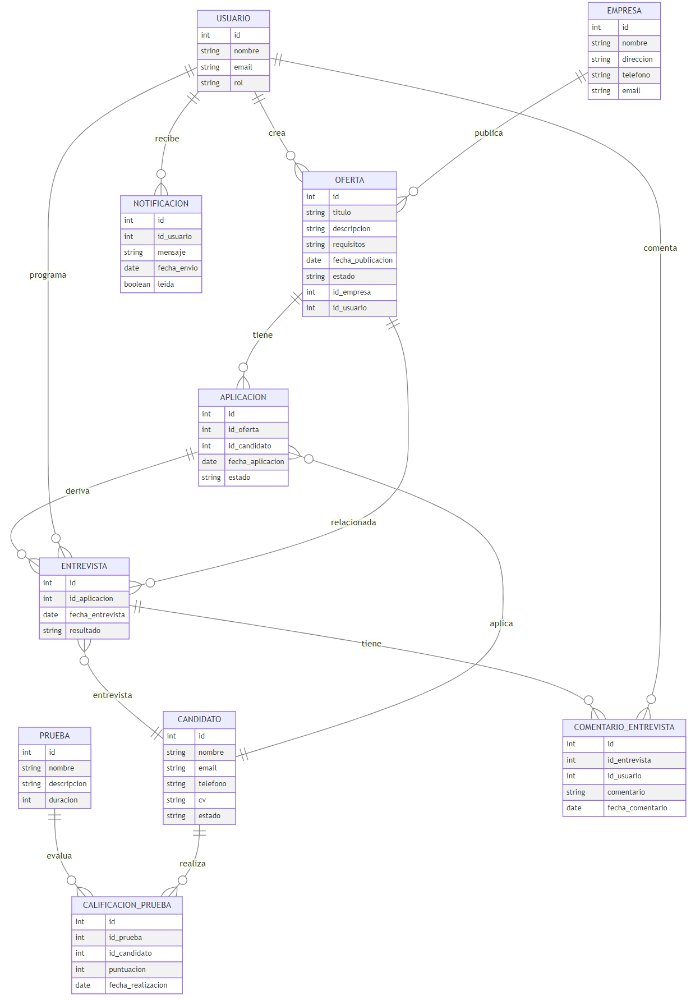

# ***4. Fase de Diseño del Sistema y Modelo C4***

## Prompt 10 - Resultado: Diseño del sistema a alto nivel

> Resultado del sitio [DiagramGPT](https://www.eraser.io/diagramgpt)

## Prompt 11 - Resultado: Explicación del diseño del sistema en alto nivel

Este diseño de sistema ATS (Applicant Tracking System) se basa en una arquitectura de microservicios. A continuación se detalla cada componente y su función en el sistema:

### Componentes Principales

1. **Web App**:
   - La interfaz de usuario con la que interactúan los usuarios (reclutadores y candidatos).

2. **CloudFront**:
   - Un servicio de distribución de contenido que acelera la entrega de la web app mediante caching en ubicaciones globales.

3. **API Gateway**:
   - Puerta de entrada que maneja todas las solicitudes entrantes hacia el sistema, asegurando que sean direccionadas correctamente hacia los microservicios correspondientes.

4. **Load Balancer**:
   - Distribuye el tráfico entrante entre los diferentes microservicios, asegurando que no haya un solo punto de fallo y que las cargas de trabajo se gestionen eficientemente.

### Microservicios y Bases de Datos

1. **Offer Creation Service**:
   - Servicio encargado de la creación de ofertas de trabajo.
   - **Offer Creation DB**: Base de datos que almacena la información de las ofertas de trabajo creadas.

2. **Offer Publishing Service**:
   - Servicio encargado de la publicación de las ofertas en diferentes plataformas (sitios web, redes sociales, etc.).
   - **Offer Publishing DB**: Base de datos que almacena la información relacionada con la publicación de las ofertas.

3. **Candidate Reception Service**:
   - Servicio encargado de la recepción de aplicaciones de candidatos.
   - **Candidate Reception DB**: Base de datos que almacena las aplicaciones recibidas de los candidatos.

4. **Candidate Review Service**:
   - Servicio encargado de la revisión de candidatos.
   - **Candidate Review DB**: Base de datos que almacena la información de los candidatos para su revisión.
   - **Redis Cache**: Caché utilizado para mejorar la velocidad de acceso a la información de los candidatos.

5. **Online Testing Service**:
   - Servicio encargado de la realización de pruebas en línea para los candidatos.
   - **Online Testing DB**: Base de datos que almacena la información y resultados de las pruebas en línea.

6. **Interview Scheduling Service**:
   - Servicio encargado de la programación de entrevistas con los candidatos.
   - **Interview Scheduling DB**: Base de datos que almacena los horarios y detalles de las entrevistas programadas.

7. **Candidate Hiring Service**:
   - Servicio encargado de la contratación de los candidatos seleccionados.
   - **Candidate Hiring DB**: Base de datos que almacena la información de los candidatos contratados.

### Almacenamiento Adicional

- **S3 Bucket**:
  - Almacenamiento de objetos, utilizado para guardar documentos y archivos relacionados con los candidatos (por ejemplo, currículums).

### Flujo de Trabajo

1. **Interacción del Usuario**: Los usuarios (reclutadores y candidatos) interactúan con la Web App.
2. **Distribución de Contenido**: CloudFront acelera la entrega de contenido estático de la Web App.
3. **Gestión de Solicitudes**: El API Gateway maneja las solicitudes entrantes y las dirige al servicio adecuado.
4. **Distribución de Carga**: El Load Balancer distribuye el tráfico entre los microservicios para asegurar la eficiencia y la tolerancia a fallos.
5. **Procesamiento de Servicios**: Cada microservicio realiza sus funciones específicas:
   - Creación y publicación de ofertas.
   - Recepción y revisión de aplicaciones.
   - Realización de pruebas y programación de entrevistas.
   - Contratación de candidatos.
6. **Almacenamiento y Cache**: La información se almacena en las bases de datos correspondientes y se utiliza Redis Cache para mejorar el rendimiento en la revisión de candidatos.
7. **Almacenamiento de Archivos**: S3 Bucket almacena documentos y archivos relacionados con los candidatos.

Este diseño modular y escalable asegura que cada componente puede desarrollarse, desplegarse y escalarse de manera independiente, mejorando la eficiencia y facilitando el mantenimiento del sistema ATS.

## Prompt 12 - Resultado: Diagrama C4 - Modelo de Contexto

El Modelo C4 es una forma de visualizar la arquitectura de un sistema de software en diferentes niveles de detalle. El primer nivel, el modelo de contexto, se centra en el sistema como una "caja negra" y muestra cómo interactúa con actores externos y otros sistemas.

### Explicación del Modelo de Contexto

El modelo de contexto para el Sistema de Gestión de Candidatos (ATS) incluye los siguientes componentes:

1. **Sistema ATS**:
   - El sistema principal que gestiona la creación, publicación y administración de ofertas de trabajo, así como la recepción, revisión y contratación de candidatos.

2. **Usuarios**:
   - **Reclutadores**: Utilizan el ATS para crear y gestionar ofertas de trabajo, revisar aplicaciones de candidatos, realizar pruebas en línea, programar entrevistas y contratar candidatos.
   - **Candidatos**: Utilizan el ATS para buscar ofertas de trabajo, aplicar a ellas, realizar pruebas en línea y programar entrevistas.

3. **Sistemas Externos**:
   - **Sistemas de Publicación de Ofertas**: Plataformas externas donde se publican las ofertas de trabajo creadas en el ATS (por ejemplo, bolsas de trabajo, redes sociales, etc.).
   - **Sistema de Almacenamiento de Documentos**: Servicio externo como S3 Bucket para almacenar documentos y archivos relacionados con los candidatos (por ejemplo, currículums).
   - **Correo Electrónico/Notificaciones**: Servicios externos que envían notificaciones y correos electrónicos a los candidatos y reclutadores.

### Modelo de Contexto en Mermaid

```mermaid
C4Context
title Sistema de Gestión de Candidatos (ATS) - Modelo de Contexto

Person(recruiter, "Reclutador", "Crea y gestiona ofertas de trabajo, revisa aplicaciones, realiza pruebas en línea, programa entrevistas y contrata candidatos")
Person(candidate, "Candidato", "Busca ofertas de trabajo, aplica a ellas, realiza pruebas en línea y programa entrevistas")

System(ats, "Sistema de Gestión de Candidatos (ATS)", "Gestiona ofertas de trabajo y candidatos")

System_Ext(publishing_system, "Sistemas de Publicación de Ofertas", "Plataformas externas para publicar ofertas de trabajo")
System_Ext(storage_system, "Sistema de Almacenamiento de Documentos", "Servicio externo para almacenar documentos y archivos relacionados con los candidatos")
System_Ext(notification_system, "Correo Electrónico/Notificaciones", "Servicios externos para enviar notificaciones y correos electrónicos")

Rel(recruiter, ats, "Utiliza")
Rel(candidate, ats, "Utiliza")
Rel(ats, publishing_system, "Publica ofertas de trabajo en")
Rel(ats, storage_system, "Guarda y recupera documentos y archivos en")
Rel(ats, notification_system, "Envía notificaciones y correos electrónicos a través de")

SHOW_LEGEND
```

### Explicación del Diagrama

- **Reclutadores** y **Candidatos** son los usuarios principales del sistema ATS. Los reclutadores utilizan el sistema para gestionar todo el ciclo de vida de las ofertas de trabajo y la contratación, mientras que los candidatos lo utilizan para buscar y aplicar a las ofertas.
- El **Sistema de Gestión de Candidatos (ATS)** es el sistema principal que conecta y gestiona las interacciones entre los reclutadores, candidatos y los sistemas externos.
- **Sistemas de Publicación de Ofertas** son plataformas externas donde se publican las ofertas de trabajo creadas en el ATS.
- **Sistema de Almacenamiento de Documentos** es un servicio externo (como S3 Bucket) utilizado para almacenar documentos y archivos relacionados con los candidatos.
- **Correo Electrónico/Notificaciones** son servicios externos utilizados para enviar notificaciones y correos electrónicos a los usuarios del sistema.

Este modelo de contexto proporciona una visión general de cómo el ATS interactúa con sus usuarios y otros sistemas externos.

## Prompt 12 - Resultado: Diagrama C4 - Modelo de Contexto. Error en el código

Aquí tienes el código Mermaid corregido para el modelo de contexto del sistema de gestión de candidatos (ATS):

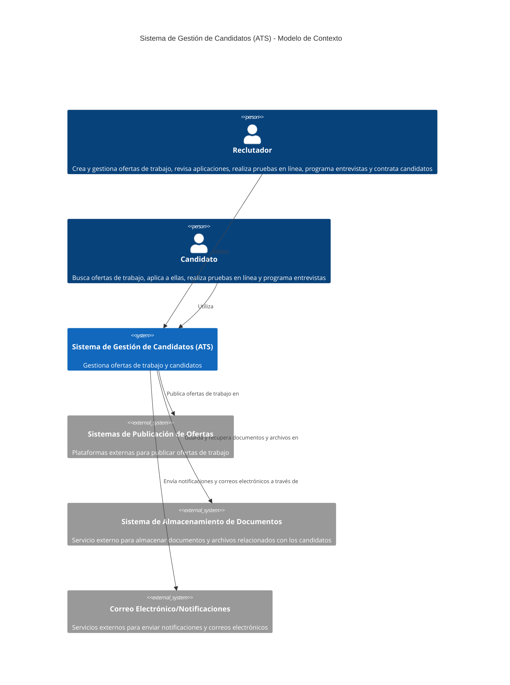
```mermaid
C4Context
title Sistema de Gestión de Candidatos (ATS) - Modelo de Contexto

Person(recruiter, "Reclutador", "Crea y gestiona ofertas de trabajo, revisa aplicaciones, realiza pruebas en línea, programa entrevistas y contrata candidatos")
Person(candidate, "Candidato", "Busca ofertas de trabajo, aplica a ellas, realiza pruebas en línea y programa entrevistas")

System(ats, "Sistema de Gestión de Candidatos (ATS)", "Gestiona ofertas de trabajo y candidatos")

System_Ext(publishing_system, "Sistemas de Publicación de Ofertas", "Plataformas externas para publicar ofertas de trabajo")
System_Ext(storage_system, "Sistema de Almacenamiento de Documentos", "Servicio externo para almacenar documentos y archivos relacionados con los candidatos")
System_Ext(notification_system, "Correo Electrónico/Notificaciones", "Servicios externos para enviar notificaciones y correos electrónicos")

Rel(recruiter, ats, "Utiliza")
Rel(candidate, ats, "Utiliza")
Rel(ats, publishing_system, "Publica ofertas de trabajo en")
Rel(ats, storage_system, "Guarda y recupera documentos y archivos en")
Rel(ats, notification_system, "Envía notificaciones y correos electrónicos a través de")
```
> Resultado en el sitio [Mermaid](https://mermaid.js.org/)
>> [Ver modelo extendido](https://mermaid.live/view#pako:eNqNlM9uGjEQxl_F8olIVL30xC0lKKe2KLS3laLBO4Arr70a26vQKA_UQ059BF6sM94FLQ1UOWF7589vPn_mWZtQo57p-ad58AmfUuWTTQ7VysaEDaga1T3GZA9_vKzn4GtbQwpRTW6_r27UB_WFK7hQPvYlQuUrv0SKwU8IDWWbkKaq0g9oXE5QB6q07OeEoPZqK_WDBxU2SAmilEoEa_gZpoqwsxEUtM4aMByGUQ7B2V-gWsq45gT0yh1ePcKUj8KWgMHRp5IrBffKMBpBAmVOA1T65oR5PMWCdQzpKT_naC6z9VCKezkH_8NigEtchaDyq71IPYEUpd07he_Z7q9LJ0Ofz3rs9Lh4SpM2r52NO-u3j7GcjnqXMksJEMkHgG99h77v0rGWm0ASyzeO5HnRAvHsfRpdICoQI4SYAsEW3_aXnFvXgEEPjWXBirvugsmNbAaGFVJn2REDQOj7w5BHqj7FsxRAZmc7XhK6YiN2YRRXKCe_50KNGH1IdsPziMoj0HkgwqAWDk0iFsia8PHrENqb9JzxqFIYVELfWUb0ZynFplKXo0eFj5f3gG78nAa7_EhWPFdiJGLk5CsR5fji9Q9XfslM6M_z397dfQaqxenMmFvkIS9fwL-Vrii88N3hFd6pED9BBu0Ov4W5lNdT3SDb09b85_ZcecUl0w4b_jrjZY0byC5VuvIvHAo5hdXeGz1L_HSnmkLe7vRsAy7yLrei550FecB9yMtfxVXpxA)

   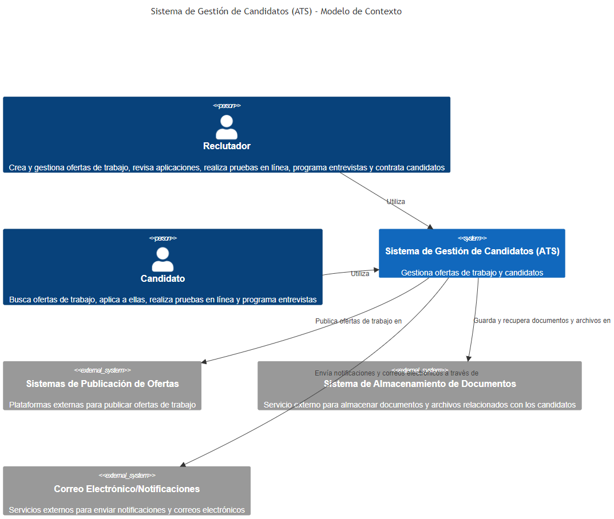

## Prompt 13 - Resultado: Diagrama C4 - Modelo de Contenedor

El modelo de contenedor del sistema de gestión de candidatos (ATS) muestra los diferentes contenedores que componen el sistema, cómo interactúan entre sí y con actores externos. Aquí se detallan los componentes principales y se presenta el diagrama en formato Mermaid.

### Componentes del Modelo de Contenedor

1. **Web Application**:
   - Interfaz de usuario accesible desde navegadores web para reclutadores y candidatos.

2. **API Gateway**:
   - Punto de entrada para todas las solicitudes externas, gestiona el enrutamiento hacia los microservicios apropiados.

3. **Load Balancer**:
   - Distribuye el tráfico entre los diferentes microservicios para asegurar la disponibilidad y balanceo de carga.

4. **Microservicios**:
   - **Offer Creation Service**: Maneja la creación de ofertas de trabajo.
   - **Offer Publishing Service**: Gestiona la publicación de ofertas en plataformas externas.
   - **Candidate Reception Service**: Administra la recepción de aplicaciones de candidatos.
   - **Candidate Review Service**: Gestiona la revisión de candidatos.
   - **Online Testing Service**: Facilita la realización de pruebas en línea.
   - **Interview Scheduling Service**: Maneja la programación de entrevistas.
   - **Candidate Hiring Service**: Administra la contratación de candidatos.

5. **Bases de Datos**:
   - Almacenan la información necesaria para cada microservicio.

6. **Servicios Externos**:
   - **Publishing Systems**: Plataformas donde se publican las ofertas de trabajo.
   - **Document Storage System**: Servicio para almacenar documentos y archivos relacionados con los candidatos.
   - **Email/Notification System**: Servicios para enviar notificaciones y correos electrónicos.

### Diagrama del Modelo de Contenedor en Mermaid

```mermaid
C4Container
title Sistema de Gestión de Candidatos (ATS) - Modelo de Contenedor

Person(recruiter, "Reclutador", "Crea y gestiona ofertas de trabajo, revisa aplicaciones, realiza pruebas en línea, programa entrevistas y contrata candidatos")
Person(candidate, "Candidato", "Busca ofertas de trabajo, aplica a ellas, realiza pruebas en línea y programa entrevistas")

System_Boundary(ats, "Sistema de Gestión de Candidatos (ATS)") {
  Container(web_app, "Web Application", "React/Angular/Vue", "Interfaz de usuario para reclutadores y candidatos")
  Container(api_gateway, "API Gateway", "AWS API Gateway/NGINX", "Punto de entrada para todas las solicitudes externas")
  Container(lb, "Load Balancer", "AWS ELB/NGINX", "Distribuye el tráfico entre los microservicios")

  ContainerDb(offer_creation_db, "Offer Creation DB", "RDS/SQL", "Base de datos para ofertas de trabajo")
  ContainerDb(offer_publishing_db, "Offer Publishing DB", "RDS/SQL", "Base de datos para la publicación de ofertas")
  ContainerDb(candidate_reception_db, "Candidate Reception DB", "RDS/SQL", "Base de datos para la recepción de aplicaciones")
  ContainerDb(candidate_review_db, "Candidate Review DB", "RDS/SQL", "Base de datos para la revisión de candidatos")
  ContainerDb(online_testing_db, "Online Testing DB", "RDS/SQL", "Base de datos para las pruebas en línea")
  ContainerDb(interview_scheduling_db, "Interview Scheduling DB", "RDS/SQL", "Base de datos para la programación de entrevistas")
  ContainerDb(candidate_hiring_db, "Candidate Hiring DB", "RDS/SQL", "Base de datos para la contratación de candidatos")

  Container(offer_creation_service, "Offer Creation Service", "Java/Spring Boot", "Maneja la creación de ofertas de trabajo")
  Container(offer_publishing_service, "Offer Publishing Service", "Java/Spring Boot", "Gestiona la publicación de ofertas")
  Container(candidate_reception_service, "Candidate Reception Service", "Java/Spring Boot", "Administra la recepción de aplicaciones de candidatos")
  Container(candidate_review_service, "Candidate Review Service", "Java/Spring Boot", "Gestiona la revisión de candidatos")
  Container(online_testing_service, "Online Testing Service", "Java/Spring Boot", "Facilita la realización de pruebas en línea")
  Container(interview_scheduling_service, "Interview Scheduling Service", "Java/Spring Boot", "Maneja la programación de entrevistas")
  Container(candidate_hiring_service, "Candidate Hiring Service", "Java/Spring Boot", "Administra la contratación de candidatos")
}

System_Ext(publishing_system, "Publishing Systems", "Plataformas externas para publicar ofertas de trabajo")
System_Ext(storage_system, "Document Storage System", "Servicio para almacenar documentos y archivos relacionados con los candidatos")
System_Ext(notification_system, "Email/Notification System", "Servicios para enviar notificaciones y correos electrónicos")

Rel(recruiter, web_app, "Utiliza")
Rel(candidate, web_app, "Utiliza")

Rel(web_app, api_gateway, "Solicitudes")
Rel(api_gateway, lb, "Distribuye")

Rel(lb, offer_creation_service, "Solicitudes de creación")
Rel(lb, offer_publishing_service, "Solicitudes de publicación")
Rel(lb, candidate_reception_service, "Solicitudes de recepción")
Rel(lb, candidate_review_service, "Solicitudes de revisión")
Rel(lb, online_testing_service, "Solicitudes de pruebas")
Rel(lb, interview_scheduling_service, "Solicitudes de programación")
Rel(lb, candidate_hiring_service, "Solicitudes de contratación")

Rel(offer_creation_service, offer_creation_db, "Lee/Escribe")
Rel(offer_publishing_service, offer_publishing_db, "Lee/Escribe")
Rel(candidate_reception_service, candidate_reception_db, "Lee/Escribe")
Rel(candidate_review_service, candidate_review_db, "Lee/Escribe")
Rel(online_testing_service, online_testing_db, "Lee/Escribe")
Rel(interview_scheduling_service, interview_scheduling_db, "Lee/Escribe")
Rel(candidate_hiring_service, candidate_hiring_db, "Lee/Escribe")

Rel(offer_publishing_service, publishing_system, "Publica en")
Rel(candidate_reception_service, storage_system, "Guarda/Recupera")
Rel(candidate_hiring_service, notification_system, "Envía notificaciones y correos electrónicos a través de")
```

### Explicación del Diagrama

1. **Usuarios (Reclutadores y Candidatos)**:
   - Interactúan con la **Web Application** para realizar diversas tareas relacionadas con la gestión de candidatos.

2. **Web Application**:
   - La interfaz de usuario que envía solicitudes al **API Gateway**.

3. **API Gateway**:
   - Maneja las solicitudes de la **Web Application** y las dirige al **Load Balancer**.

4. **Load Balancer**:
   - Distribuye el tráfico a los diferentes **Microservicios**.

5. **Microservicios**:
   - **Offer Creation Service**: Interactúa con la **Offer Creation DB** para gestionar la creación de ofertas de trabajo.
   - **Offer Publishing Service**: Interactúa con la **Offer Publishing DB** y **Publishing Systems** para gestionar la publicación de ofertas.
   - **Candidate Reception Service**: Interactúa con la **Candidate Reception DB** y **Document Storage System** para la recepción de aplicaciones de candidatos.
   - **Candidate Review Service**: Interactúa con la **Candidate Review DB** para gestionar la revisión de candidatos.
   - **Online Testing Service**: Interactúa con la **Online Testing DB** para facilitar las pruebas en línea.
   - **Interview Scheduling Service**: Interactúa con la **Interview Scheduling DB** para gestionar la programación de entrevistas.
   - **Candidate Hiring Service**: Interactúa con la **Candidate Hiring DB** y **Email/Notification System** para gestionar la contratación de candidatos y enviar notificaciones.

Este modelo de contenedor proporciona una visión detallada de cómo los diferentes componentes del sistema ATS interactúan entre sí y con los usuarios y sistemas externos.

> Resultado en el sitio [Mermaid](https://mermaid.js.org/)
>> [Ver modelo extendido](https://mermaid.live/view#pako:eNqVV8mS2zYQ_RUUT3LVpHTJaW7SaDKZ1HgyGTqxD6pStciWBBcEsEBQY9nlj8kxB5_8CfqxNAAuEBctN6oB9nu9vGbrW5SoFKPb6O7XOyUNcIl6Lg03AlnMc4NbYCmyB8wNP_yU9vkOZMpTMCpno8mH-B37hb0nH0K5Q3KCElNFXubyBXWu5EhjogtuUN-wefSKiSgM2BuR_X2nEdierS2CksDUCrWB3DozGpbwWd0wjTueA4NM8AQSuoa5NYLgX4FlusAlvYCSicMPiXBDJrXWQNRRGveudbhnCZHTYIAldQjz6F1Ns7Kio1Vd8SynRZ70c_OkGGEJAadoEYE-Xo7BXMZ7m-zFVBUyBb0fgckt7oU1ICfs21wyVhdx9IbLBWSZdfIRl2ySOZ42xz6iV4TEjCdyXQjQ438K9OZHqp9ewVeLUuQFaK5YBhoorqpu6HJ5nMIQGTK-WFMa32BvPU5eHtmD_-khJh9jFhjHzw-Pz5_80UshjesjmyBIwUMblVIiKbssVxQEN0VKHPALMZXQxRdL6-pJQcqmIEAmqBvg-6dpCDij_Gq-LPYEKaioh39XPFG-PkxQerc80SpHvSNcVRUrQJstR2pFbbFIqPA2u4vUwf9pjeyuNLLZtMz6LB7Hfz2VTQU52mB9IV2o3Q5rh1cDZsVS8HzD5foI8qU2XwwqKM_2LautssFKHj3gtUoW1BGYBSFXTYnstTq5hoJzVxMItX6GxY7jWw8Fa74OnwRZwQ-3t82_FPS0MFaQTfadkX3wxiuA8-6o6MHkVpcu0jzZYFqIBvmxOmJxfXRV7cupVOe-PZ2GUr_humHRpP53Z76GQTWYk4H0H-u7pTcvTuwRXexPPPIfsINxnDlqU6WMt74HiZ89B3qr3f4nZNgVYYdHoMQLmDxUH8DL1dirxYBGnyAvYDJJt1zauXhGlqd10pXoADPfudcl6EKttpUaluhYrhfg_0ZhC25KfPeRr9NyVsH9-g349Ir4qga-RsZdEfcWp1Ty1T1zTs_fg43n_osZhSpyVr8LNPJxxrzcEQR5Xim9hWYH8JOklI0ekm-AmBulYY0B3EwlxZZSxmJ_VIJ6zLhcADwOCMoySgJKy5eUXYlAJxu-o0eNwkmElqXc5sItEq0UBFykMnxV7mYBofstcDF-Dg57KZWxo9xxIlT5KhVqd16tkS6hwITWm5-S1ptqqL6iCHfzYGP823Db3-6evRWsxgO3_L36sLUDxs3eVvs8uuJ3tmYbC3zao-GRH3h2jVZN8Rqmeb1_VrcchKP3yMeZWdty00zNQSftmdjxUI6440gGB1o7Dj-Rjl4-N4M6LoKBMhBGd3q0CxKOgqCqQxXtXaafEMf3eUKtgTWP4ZoOrMd9Tk4WdXjTPefquLQDu2pvUAPl7d04-xycLvGJJfJ0SO0yD-yAbSfnKjU89xM70S4rU3eUP9Df1hTGtPQUGWq4IJ6hESx3hx9w4VBlYD82u8N_tu8dZnQTbZG-UzyNbiP393wemQ1u6fSWHlNcQSHoA0ofRLoKhVHxXibRrSHt3kRaFetNdLsCkdOvIrPEZxysJEvr9_8B_5pnVA)

   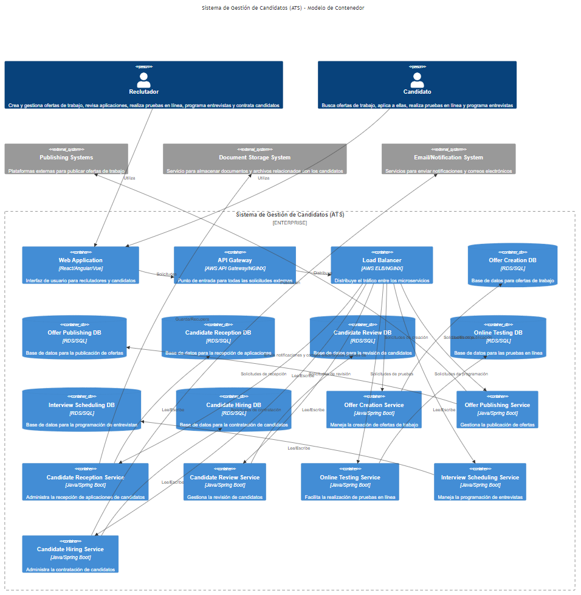

## Prompt 14 - Resultado: Diagrama C4 - Modelo de Componentes _Offer Creation Service_

Aquí tienes el diagrama del modelo de componentes para el "Offer Creation Service" (servicio de creación de oferta) en formato Mermaid:

### Diagrama del Modelo de Componentes en Mermaid

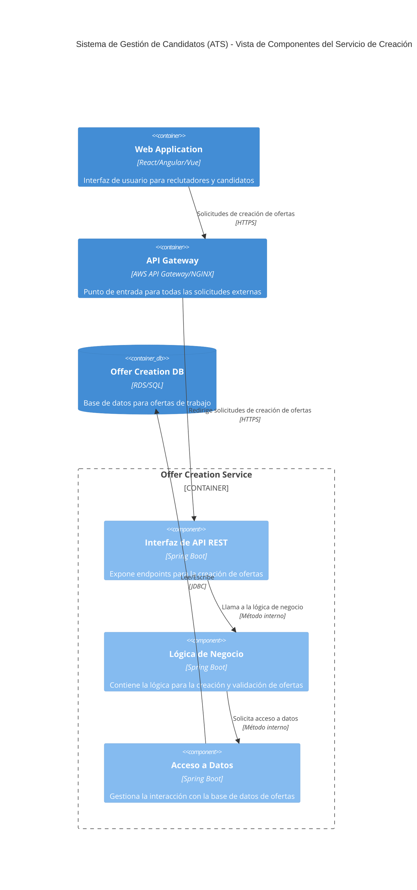
```mermaid
C4Component
title Sistema de Gestión de Candidatos (ATS) - Vista de Componentes del Servicio de Creación de Oferta

Container_Boundary(c1, "Offer Creation Service") {
  Component(interface, "Interfaz de API REST", "Spring Boot", "Expone endpoints para la creación de ofertas")
  Component(logic, "Lógica de Negocio", "Spring Boot", "Contiene la lógica para la creación y validación de ofertas")
  Component(database, "Acceso a Datos", "Spring Boot", "Gestiona la interacción con la base de datos de ofertas")
}

Container(web_app, "Web Application", "React/Angular/Vue", "Interfaz de usuario para reclutadores y candidatos")
Container(api_gateway, "API Gateway", "AWS API Gateway/NGINX", "Punto de entrada para todas las solicitudes externas")
ContainerDb(offer_creation_db, "Offer Creation DB", "RDS/SQL", "Base de datos para ofertas de trabajo")

Rel(web_app, api_gateway, "Solicitudes de creación de ofertas", "HTTPS")
Rel(api_gateway, interface, "Redirige solicitudes de creación de ofertas", "HTTPS")
Rel(interface, logic, "Llama a la lógica de negocio", "Método interno")
Rel(logic, database, "Solicita acceso a datos", "Método interno")
Rel(database, offer_creation_db, "Lee/Escribe", "JDBC")
```

### Explicación del Diagrama

1. **Interfaz de API REST**:
   - **Funcionalidad**: Expone endpoints que permiten a los usuarios (a través de la **Web Application**) crear nuevas ofertas de trabajo.
   - **Tecnología**: Implementado en Spring Boot.

2. **Lógica de Negocio**:
   - **Funcionalidad**: Contiene toda la lógica necesaria para validar, procesar y gestionar la creación de ofertas de trabajo.
   - **Tecnología**: Implementado en Spring Boot.

3. **Acceso a Datos**:
   - **Funcionalidad**: Gestiona la interacción con la base de datos, realizando operaciones de lectura y escritura de datos relacionados con las ofertas de trabajo.
   - **Tecnología**: Implementado en Spring Boot.

4. **Web Application**:
   - **Funcionalidad**: La interfaz de usuario que permite a los reclutadores y candidatos interactuar con el sistema ATS.
   - **Tecnología**: Implementado en frameworks de frontend como React, Angular o Vue.

5. **API Gateway**:
   - **Funcionalidad**: Actúa como el punto de entrada para todas las solicitudes externas, dirigiéndolas al servicio adecuado.
   - **Tecnología**: Implementado usando AWS API Gateway o NGINX.

6. **Offer Creation DB**:
   - **Funcionalidad**: La base de datos que almacena las ofertas de trabajo.
   - **Tecnología**: Utiliza RDS/SQL para el almacenamiento de datos.

### Relaciones

- La **Web Application** envía solicitudes de creación de ofertas al **API Gateway** a través de HTTPS.
- El **API Gateway** redirige estas solicitudes a la **Interfaz de API REST** del **Offer Creation Service**.
- La **Interfaz de API REST** llama a la **Lógica de Negocio** para procesar las solicitudes.
- La **Lógica de Negocio** utiliza el componente de **Acceso a Datos** para interactuar con la **Offer Creation DB**.
- El componente de **Acceso a Datos** lee y escribe en la **Offer Creation DB** utilizando JDBC.

Este diagrama proporciona una visión detallada de los componentes internos del "Offer Creation Service" y cómo interactúan con otros componentes del sistema ATS.

> Resultado en el sitio [Mermaid](https://mermaid.js.org/)
>> [Ver modelo extendido](https://mermaid.live/view#pako:eNqVVNtOGzEQ_RXLT0Giiir1KW-5IKCiQLMR9GGlaNaeLK4ce-ULkCI-qM98Aj_WsXchG5qo6psvM-fMmTn2ExdWIh_x6ZepXTfWoAmlCSpoZIXyAdfAJLJT9EG9vpi0noKRSkKwng3Gi-KIfWI3FJnj3jHQ01azAt29EsrmO4cg3kCuVugClKY0U2sCKINuObHRSHCbgfh8zEp-taKYnBWUNR0UlvyIPZWGbakGiujcCgSmrPN28yuRjK_P2fykWJQ83RSNU6ZmE2tDe3DymAAYGtlYwvCsAQdMAxP9Sm2u1BPvLqu2tRIJ5uL1hVZZ_iXWltQe4EtKFRIjUegu6W_KDbsHTf39ZwE0AqjAZ9VjIdBbBmyW5nKAPw_RmsyXewaiJRHUXjpLYImwne0H5uedWQ0esFpC0yTYW6zYuGk0yUnwLdec5ITh2NRRgxveRGyP-9OJPoIja-QWOBQ6BpDWkXM2TLx7LJNveaFRyxoCPsAm66YJn7bblmB8W7De4fDy9PzyR3t1HU3IRqTmOZBd74OV4Em9Z96SBBWipArwkeo08IF9Vg1sMuVSdKZcymqPU2eTrgezYlh8v2g3k53mZuquvemUCqrgp810pZmj3jb4g-KiVyUl7rdqCjxbLK6LDJjgdlB2HswcpXKqxh39_4HcA9s-CQ30b0Df6ARi-q_j2-tvar1tazH2Ha7D6Ju7k0yAby6XW5cfwtkC7B3ZBeLwxAunqs6ZX2eTaU7mx3yNbg1K0q-Yf5qShztcU9yIlhJXEDW9KHoSFAox2GJjBB8FF_GYOxvrOz5agSZqHhsqA2cKagfrNuT5DwwX6M0)

   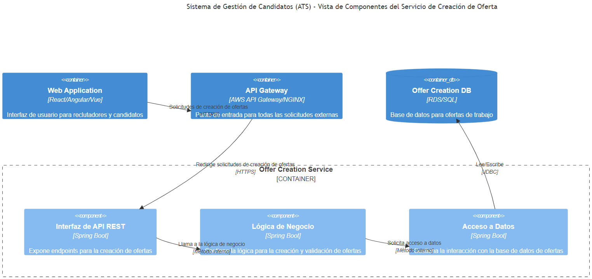

## Prompt 15 - Resultado: Diagrama C4 - Modelo de Código

Para el componente "Lógica de Negocio" del "Offer Creation Service", el diagrama de código se enfocará en las clases principales, sus atributos y métodos. Aquí tienes el diagrama en formato Mermaid:

### Diagrama de Código en Mermaid

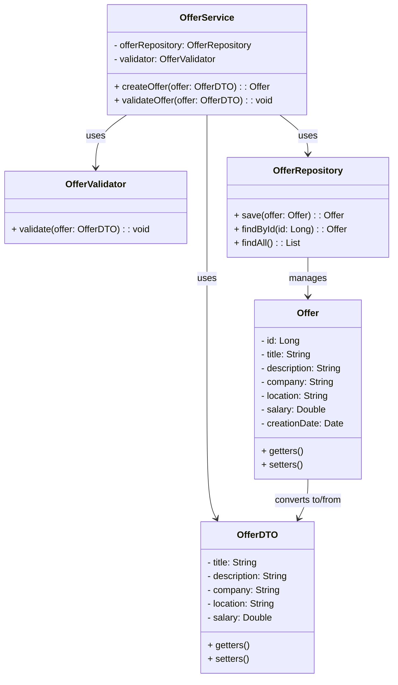
```mermaid
classDiagram
    class OfferService {
        - offerRepository: OfferRepository
        - validator: OfferValidator
        + createOffer(offer: OfferDTO): Offer
        + validateOffer(offer: OfferDTO): void
    }

    class OfferValidator {
        + validate(offer: OfferDTO): void
    }

    class OfferRepository {
        + save(offer: Offer): Offer
        + findById(id: Long): Offer
        + findAll(): List<Offer>
    }

    class Offer {
        - id: Long
        - title: String
        - description: String
        - company: String
        - location: String
        - salary: Double
        - creationDate: Date
        + getters()
        + setters()
    }

    class OfferDTO {
        - title: String
        - description: String
        - company: String
        - location: String
        - salary: Double
        + getters()
        + setters()
    }

    OfferService --> OfferValidator : uses
    OfferService --> OfferRepository : uses
    OfferRepository --> Offer : manages
    OfferService --> OfferDTO : uses
    Offer --> OfferDTO : converts to/from
```

### Explicación del Diagrama

1. **OfferService**:
   - **Atributos**:
     - `offerRepository`: Para interactuar con la base de datos.
     - `validator`: Para validar las ofertas antes de guardarlas.
   - **Métodos**:
     - `createOffer(offer: OfferDTO): Offer`: Crea una nueva oferta.
     - `validateOffer(offer: OfferDTO): void`: Valida la oferta.
   
2. **OfferValidator**:
   - **Métodos**:
     - `validate(offer: OfferDTO): void`: Valida que la oferta cumpla con ciertos criterios antes de ser guardada.

3. **OfferRepository**:
   - **Métodos**:
     - `save(offer: Offer): Offer`: Guarda una oferta en la base de datos.
     - `findById(id: Long): Offer`: Encuentra una oferta por su ID.
     - `findAll(): List<Offer>`: Encuentra todas las ofertas.

4. **Offer**:
   - **Atributos**:
     - `id`: ID único de la oferta.
     - `title`: Título de la oferta.
     - `description`: Descripción de la oferta.
     - `company`: Compañía que ofrece la oferta.
     - `location`: Ubicación de la oferta.
     - `salary`: Salario ofrecido.
     - `creationDate`: Fecha de creación de la oferta.
   - **Métodos**:
     - `getters()`: Métodos para obtener los valores de los atributos.
     - `setters()`: Métodos para establecer los valores de los atributos.

5. **OfferDTO**:
   - **Atributos**:
     - `title`: Título de la oferta.
     - `description`: Descripción de la oferta.
     - `company`: Compañía que ofrece la oferta.
     - `location`: Ubicación de la oferta.
     - `salary`: Salario ofrecido.
   - **Métodos**:
     - `getters()`: Métodos para obtener los valores de los atributos.
     - `setters()`: Métodos para establecer los valores de los atributos.

### Relaciones

- `OfferService` usa `OfferValidator` para validar las ofertas.
- `OfferService` usa `OfferRepository` para guardar y recuperar ofertas.
- `OfferRepository` gestiona las instancias de `Offer`.
- `OfferService` utiliza `OfferDTO` como un objeto de transferencia de datos.
- `Offer` puede convertirse a/desde `OfferDTO`.

Este diagrama proporciona una visión detallada de las clases y sus relaciones dentro del componente "Lógica de Negocio" del servicio de creación de ofertas.

> Resultado en el sitio [Mermaid](https://mermaid.js.org/)
>> [Ver modelo extendido](https://mermaid.live/view#pako:eNrNlEFrwyAUx7-KeEpZy-4yChu5DAqFdeyUy5u-pILRoCYQSr_7TJo2sU0Lvc1DiO__84_vPfVAuRFIGeUKnEslFBbKTJMw-gjZ5jnaHdpGciSHk9KNFTGd8oWVcdIb27ITOgambANKCgjRgfo5z0fohXCL4LHXk958gNPv7WL4neKD590FjZHixB8zfZPSZQfTpEbTp_3GvGNDB01sNpdKLrX4aD9FIgUjG6OLe9C7UknQNtL5tx5Y399R3K2z8zTmpVfIyM5bGQsCHbey8tLoOZmbsgLdzknKcLi3zIGC7pykpv5VGBl2nQ-r0lD5oIfvNPECvUfrkkVU1zg4V4DQtrgG_yTfJzOKbuBqtb4-v4zUDt0jdnI2b-CJduEDVYKG4rFrV94bu2uZG92g9Y5485pbE54WuqQl2hKkCK9O356M-j2WmFEWfgXmUCuf0UwfAwq1N7tWc8q8rXFJramLPWU5KBdmddXd1eHVGqLHP1-gfJE)

   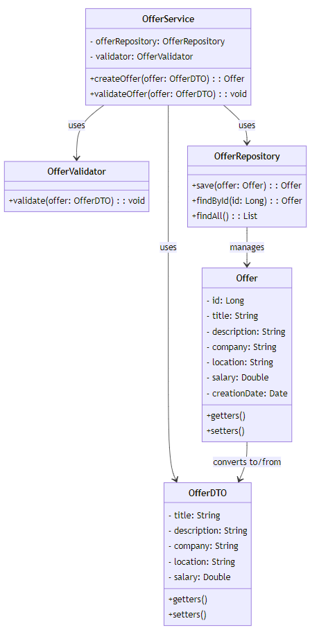

## Prompt 16 - Resultado: Diagrama C4 - Modelo de Despliegue

Aquí tienes el diagrama de despliegue en formato Mermaid usando la sintaxis de C4Deployment:

### Diagrama de Despliegue en Mermaid

```mermaid
C4Deployment
title Despliegue del Sistema de Gestión de Candidatos (ATS)

Environment(dev, "Desarrollo") {
  Deployment_Node(app_server, "Servidor de Aplicaciones", "AWS EC2") {
    Container(web_app, "Aplicación Web", "React/Angular/Vue", "Interfaz de usuario para reclutadores y candidatos")
    Container(mobile_app, "Aplicación Móvil", "React Native/Ionic/Flutter", "Interfaz de usuario para reclutadores y candidatos")
    Container(api_gateway, "API Gateway", "AWS API Gateway/NGINX", "Punto de entrada para todas las solicitudes externas")
    Container_Boundary(services, "Microservicios") {
      Container(offer_creation_service, "Offer Creation Service", "Spring Boot", "Gestión de la creación de ofertas de trabajo")
      Container(candidate_reception_service, "Candidate Reception Service", "Spring Boot", "Gestión de la recepción de candidatos")
      Container(interview_scheduling_service, "Interview Scheduling Service", "Spring Boot", "Programación de entrevistas")
    }
  }

  Deployment_Node(db_server, "Servidor de Base de Datos", "AWS RDS") {
    ContainerDb(offer_creation_db, "Offer Creation DB", "MySQL", "Base de datos para ofertas de trabajo")
    ContainerDb(candidate_reception_db, "Candidate Reception DB", "MySQL", "Base de datos para candidatos")
    ContainerDb(interview_scheduling_db, "Interview Scheduling DB", "MySQL", "Base de datos para programación de entrevistas")
  }
}

Deployment_Node(web_browser, "Navegador Web") {
  Container(web_app, "Aplicación Web", "React/Angular/Vue", "Interfaz de usuario para reclutadores y candidatos")
}

Deployment_Node(mobile_device, "Dispositivo Móvil") {
  Container(mobile_app, "Aplicación Móvil", "React Native/Ionic/Flutter", "Interfaz de usuario para reclutadores y candidatos")
}
```

### Explicación del Diagrama

1. **Entorno de Desarrollo**:
   - **Servidor de Aplicaciones** (AWS EC2):
     - **Aplicación Web**: Implementada con frameworks de frontend como React, Angular o Vue.
     - **Aplicación Móvil**: Implementada con frameworks de desarrollo móvil como React Native, Ionic o Flutter.
     - **API Gateway**: Implementado con AWS API Gateway o NGINX, actúa como el punto de entrada para todas las solicitudes externas.
     - **Microservicios**:
       - **Offer Creation Service**: Implementado en Spring Boot, gestiona la creación de ofertas de trabajo.
       - **Candidate Reception Service**: Implementado en Spring Boot, gestiona la recepción de candidatos.
       - **Interview Scheduling Service**: Implementado en Spring Boot, gestiona la programación de entrevistas.

   - **Servidor de Base de Datos** (AWS RDS):
     - **Offer Creation DB**: Base de datos MySQL para almacenar las ofertas de trabajo.
     - **Candidate Reception DB**: Base de datos MySQL para almacenar la información de los candidatos.
     - **Interview Scheduling DB**: Base de datos MySQL para almacenar la programación de entrevistas.

2. **Navegador Web**:
   - **Aplicación Web**: Implementada con frameworks de frontend como React, Angular o Vue, accesible desde navegadores web modernos.

3. **Dispositivo Móvil**:
   - **Aplicación Móvil**: Implementada con frameworks de desarrollo móvil como React Native, Ionic o Flutter, accesible desde dispositivos móviles.

Este diagrama muestra cómo los diferentes componentes del sistema ATS se despliegan en varios nodos, incluyendo servidores de aplicaciones, servidores de base de datos, navegadores web y dispositivos móviles.

## Prompt 16 - Resultadoo: Diagrama C4 - Modelo de Despliegue ERROR en el diagrama

Aquí tienes el código ajustado para el diagrama de despliegue en formato Mermaid, utilizando la sintaxis correcta:

### Diagrama de Despliegue en Mermaid

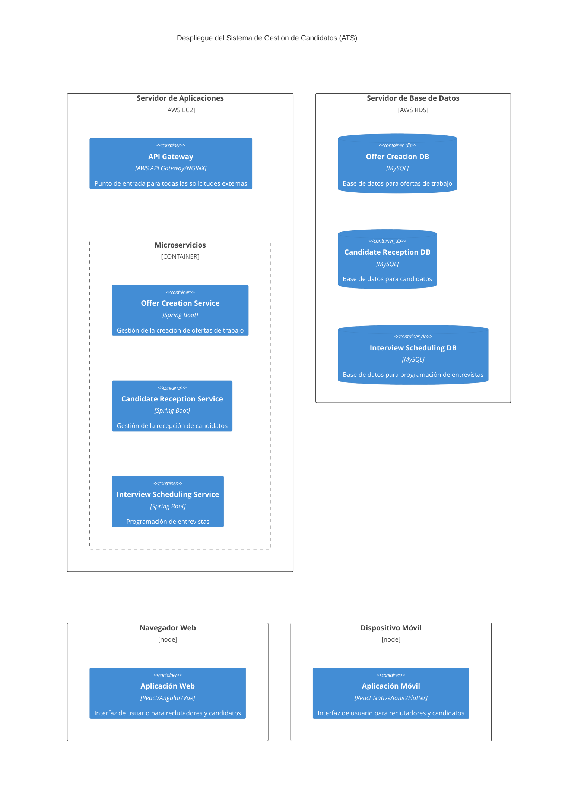
```mermaid
C4Deployment
title Despliegue del Sistema de Gestión de Candidatos (ATS)

Deployment_Node(app_server, "Servidor de Aplicaciones", "AWS EC2") {
  Container(web_app, "Aplicación Web", "React/Angular/Vue", "Interfaz de usuario para reclutadores y candidatos")
  Container(mobile_app, "Aplicación Móvil", "React Native/Ionic/Flutter", "Interfaz de usuario para reclutadores y candidatos")
  Container(api_gateway, "API Gateway", "AWS API Gateway/NGINX", "Punto de entrada para todas las solicitudes externas")
  Container_Boundary(services, "Microservicios") {
    Container(offer_creation_service, "Offer Creation Service", "Spring Boot", "Gestión de la creación de ofertas de trabajo")
    Container(candidate_reception_service, "Candidate Reception Service", "Spring Boot", "Gestión de la recepción de candidatos")
    Container(interview_scheduling_service, "Interview Scheduling Service", "Spring Boot", "Programación de entrevistas")
  }
}

Deployment_Node(db_server, "Servidor de Base de Datos", "AWS RDS") {
  ContainerDb(offer_creation_db, "Offer Creation DB", "MySQL", "Base de datos para ofertas de trabajo")
  ContainerDb(candidate_reception_db, "Candidate Reception DB", "MySQL", "Base de datos para candidatos")
  ContainerDb(interview_scheduling_db, "Interview Scheduling DB", "MySQL", "Base de datos para programación de entrevistas")
}

Deployment_Node(web_browser, "Navegador Web") {
  Container(web_app, "Aplicación Web", "React/Angular/Vue", "Interfaz de usuario para reclutadores y candidatos")
}

Deployment_Node(mobile_device, "Dispositivo Móvil") {
  Container(mobile_app, "Aplicación Móvil", "React Native/Ionic/Flutter", "Interfaz de usuario para reclutadores y candidatos")
}
```

> Resultado en el sitio [Mermaid](https://mermaid.js.org/)
>> [Ver modelo extendido](https://mermaid.live/view#pako:eNrFVc1q20AQfpVFJwcChtKTb7bVGkPjplFpehCI0e5Y2SLtiv2x64Y8VR4hL9ZZr-UosUJSKORgGO3szvfNfDPj24RrgckkmX9Msa31rkHlcuWkq5GlaNtaYuWRCaxZJq3DBshmC7ROPtyrYM9BCSnAactG0-_ZWa5y9RirWFH8EbRtYdFs0JyzPMnIkkKb8HpKCBy41AptngTv9Dpjn-Yf8uSM3eaKsblWDqRCM9piWVCk_aXDs8DhGsv48gqBu_FUVb4GM_7hMR4vlUOzhj8BzlsPRmrWggFmkNfeATFBy3aMHxMh7KfIjS5ljUPgFw_3G1n38NkKnNzgeKmV5OPPBEDo_40ItLKowOEWdnsml0u2iJ-PxesdjleL5epndF165XSAJlUMCIjQTguwrKaf1ZSVdF4QB_xNTBWc4Bcz7ZUAsxsFNSVHGyJfSG50PJB7zlG4Pm-9XtNrbpCKo1VxeB0efw0eNj94WBY9kXLWGqkqNtPaxYN-39XAQjzefWuK4ygPMim_En7pA_s-j660WFDNsX1OputlZFed-98Y7aMeKZ0I2aciQzdsJG4Ly29Q-JoC97ksOz_Ljv5XyFwaXRloHmsSpMYNze1Ryrtc3Q1NqChfGNAZ2DD-LI1pdE12lWanE5qWz4UW5YDG6SzGudhl375Es0OJe2TfmS_q2Ycb0jNiDkn5NuCXx48AB1WLiIOCvQ2yfU24Qc3CPiyN3tqo2go2WIUlEjfiO6_PQcaHPSqwa_JU2lZbSRtTH1fpCfF33b6UR3KeNGgakIL-KPfc8sTdYEMFmpApcA2-phGky3QVvNPZTvFk4ozH88RoX90kkzXUlr58G3oylRD0Ppze_QUF9avH)

   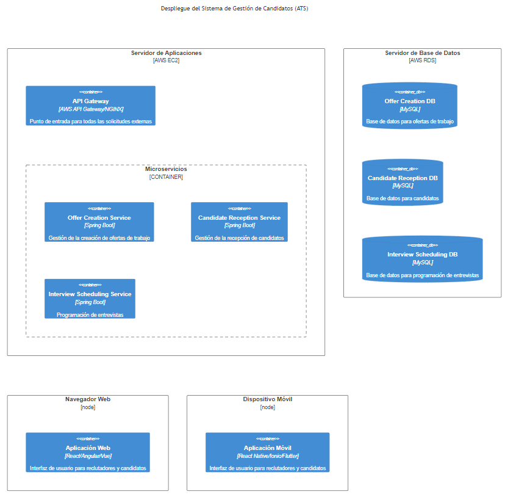

