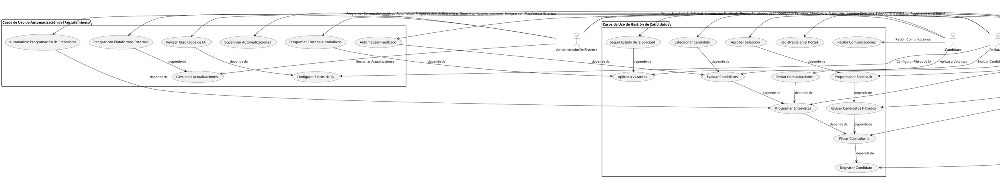
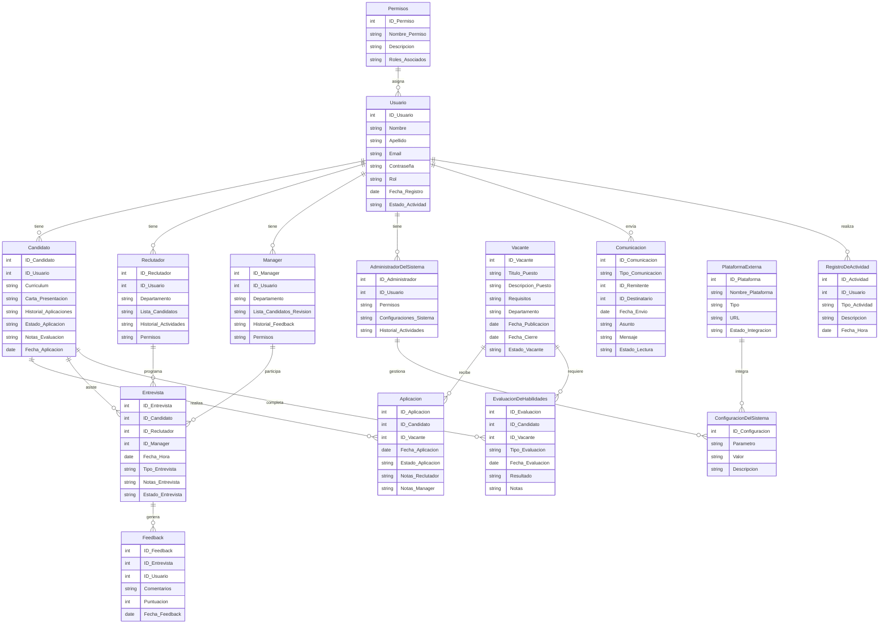
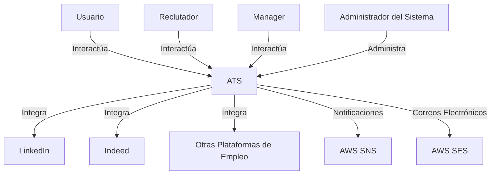

## Prompt:
Confírmame qué sabes acerca de un Applicant-Tracking System

## Response:
Un Applicant-Tracking System (ATS), o Sistema de Seguimiento de Candidatos, es un software utilizado por las empresas para gestionar sus procesos de reclutamiento y selección de personal. Aquí hay algunos puntos clave sobre los ATS:

1. **Gestión de Candidatos**: Los ATS permiten a las empresas gestionar y organizar la información de los candidatos de manera eficiente. Pueden almacenar currículums, cartas de presentación y otra información relevante en una base de datos centralizada.

2. **Automatización de Procesos**: Estos sistemas automatizan muchas de las tareas repetitivas del reclutamiento, como la publicación de ofertas de trabajo en múltiples plataformas, el filtrado de currículums y la programación de entrevistas.

3. **Filtrado de Candidatos**: Utilizan algoritmos para escanear y filtrar currículums basándose en palabras clave y criterios específicos definidos por el empleador. Esto ayuda a reducir el número de currículums que los reclutadores deben revisar manualmente.

4. **Mejora de la Eficiencia**: Al centralizar y automatizar muchos aspectos del proceso de contratación, los ATS ayudan a mejorar la eficiencia y a reducir el tiempo necesario para cubrir una vacante.

5. **Cumplimiento Legal**: Ayudan a las empresas a mantenerse en conformidad con las leyes y regulaciones laborales, almacenando de manera segura toda la documentación relacionada con el proceso de selección.

6. **Análisis y Reportes**: Proveen herramientas de análisis y generación de informes que permiten a los reclutadores evaluar la efectividad de sus procesos de contratación y tomar decisiones basadas en datos.

7. **Integración con otras Herramientas**: Muchos ATS se integran con otras herramientas de recursos humanos, como sistemas de gestión de recursos humanos (HRMS), software de nómina y plataformas de evaluación de candidatos.

8. **Experiencia del Candidato**: Los ATS también pueden mejorar la experiencia del candidato al proporcionar un portal donde pueden seguir el estado de su solicitud y recibir actualizaciones en tiempo real.

En resumen, los ATS son herramientas esenciales para las empresas modernas que buscan optimizar y profesionalizar sus procesos de reclutamiento, asegurándose de encontrar los mejores talentos de manera eficiente y efectiva.

## Prompt:
Genial, quiero diseñar un sistema de ATS y tu me vas a ayudar en el proceso. Vamos a ir paso a paso. No continues con el siguiete paso hasta que no te lo indique. Confírmame que entendiste la forma en que vamos a trabajar

## Response:
Entendido, trabajaremos paso a paso en el diseño de un sistema de ATS y esperaré tu indicación para continuar con el siguiente paso. Estoy listo para empezar.

## Prompt:
Bien, el sistema ATS debe diferenciarse de las soluciones actuales teniendo en cuenta, entre otras, las siguientes características: Aumentar la eficiencia para los departamentos de HR Mejorar la colaboración en tiempo real entre reclutadores y managers Automatizaciones Asistencia de IA en diversas tareas Etc. La primera fase es de lluvia de ideas. Quiero que analices la información dada y me ayudes a identificar qué otras claves de éxito debo tener en cuenta para diseñar un sistema que se destaque por encima de los competidores actuales del mercado. Dame los resultados en forma de lista

## Response:
Claro, aquí tienes una lista de claves de éxito adicionales que deberías considerar para diseñar un ATS que se destaque en el mercado:

1. **Interfaz Intuitiva y Amigable**:

    * Facilitar el uso con una interfaz sencilla y clara para todos los niveles de usuario.

2. **Integración con Redes Sociales y Plataformas de Empleo**:

    * Permitir la integración con LinkedIn, Indeed, Glassdoor, y otras plataformas para facilitar la publicación de ofertas y la importación de perfiles.

3. **Movilidad y Acceso desde Dispositivos Móviles**:

    * Asegurar que el sistema sea completamente funcional desde dispositivos móviles.

4. **Seguridad y Cumplimiento Normativo**:

    * Garantizar altos niveles de seguridad de datos y cumplimiento con las normativas locales e internacionales sobre protección de datos (como GDPR).

5. **Personalización y Configurabilidad**:

    * Permitir a las empresas personalizar el sistema según sus necesidades específicas (flujos de trabajo, formularios, criterios de selección, etc.).

6. **Soporte Multilingüe y Multinacional**:

    * Ofrecer soporte en múltiples idiomas y capacidades para gestionar procesos de reclutamiento en diferentes países.

7. **Feedback y Evaluaciones de Candidatos**:

    * Incorporar funcionalidades para recolectar y gestionar feedback tanto de los candidatos como de los reclutadores.

8. **Analytics y Reportes Avanzados**:

    * Proveer herramientas avanzadas de análisis y reportes para medir KPIs de reclutamiento y eficiencia del proceso.

9. **Experiencia del Candidato**:

    * Mejorar la experiencia del candidato con un portal interactivo donde puedan seguir el estado de sus aplicaciones y recibir actualizaciones.

10. **Asistencia de IA y Aprendizaje Automático**:

* Utilizar IA para mejorar la coincidencia de candidatos, predecir éxito en roles específicos y proporcionar recomendaciones automatizadas.

11. **Automatización de Procesos Repetitivos**:

* Automatizar tareas como la programación de entrevistas, el envío de correos electrónicos y el filtrado inicial de currículums.

12. **Colaboración en Tiempo Real**:

* Facilitar la comunicación y colaboración en tiempo real entre reclutadores y managers, incluyendo comentarios y aprobaciones.

13. **Onboarding Integrado**:

* Incluir herramientas para el proceso de onboarding, facilitando la transición de los candidatos seleccionados a empleados.

14. **Evaluaciones de Habilidades y Pruebas**:

* Integrar plataformas de evaluación para realizar pruebas de habilidades, psicométricas y técnicas dentro del sistema.

15. **Portal de Referencias**:

* Crear un portal donde los empleados puedan referir candidatos y hacer seguimiento de sus referencias.

16. **Facilidad de Implementación y Soporte**:

* Proporcionar una implementación rápida y un soporte técnico eficiente.

17. **Feedback Automatizado a Candidatos**:

* Enviar respuestas automáticas a los candidatos en cada etapa del proceso, mejorando la comunicación y transparencia.

Estas claves deberían ayudarte a diseñar un ATS robusto y competitivo en el mercado actual.

## Prompt:
Dame un listado de todas las características del sistema ATS, incluyendo las que yo te di anteriormente en el prompt y las que me acabas de dar tu como respuesta. El objetivo inicial es tener un compilado de todas las características

## Response:
Claro, aquí tienes un listado completo de todas las características del sistema ATS, incluyendo las que mencionaste y las que sugerí:

1. **Aumentar la eficiencia para los departamentos de HR**
2. **Mejorar la colaboración en tiempo real entre reclutadores y managers**
3. **Automatizaciones**
4. **Asistencia de IA en diversas tareas**

**Características adicionales sugeridas:**

5. **Interfaz Intuitiva y Amigable**
6. **Integración con Redes Sociales y Plataformas de Empleo**
7. **Movilidad y Acceso desde Dispositivos Móviles**
8. **Seguridad y Cumplimiento Normativo**
9. **Personalización y Configurabilidad**
10. **Soporte Multilingüe y Multinacional**
11. **Feedback y Evaluaciones de Candidatos**
12. **Analytics y Reportes Avanzados**
13. **Experiencia del Candidato**
14. **Asistencia de IA y Aprendizaje Automático**
15. **Automatización de Procesos Repetitivos**
16. **Colaboración en Tiempo Real**
17. **Onboarding Integrado**
18. **Evaluaciones de Habilidades y Pruebas**
19. **Portal de Referencias**
20. **Facilidad de Implementación y Soporte**
21. **Feedback Automatizado a Candidatos**

Este compilado de características debería proporcionar una base sólida para el diseño de un sistema ATS que se destaque en el mercado.

## Prompt:
Vamos a crear el primer artefacto del diseño del sistema ATS. Para esto, dame la siguiente información en formato markdown agregando un índice al inicio del documento: Descripción breve del software LTI El valor añadido y las ventajas competitivas con base en el listado de características que me acabas de suministrar. Revisa si hay alguna que se repita y utiliza la información sin duplicados Explicación de las funciones principales.

## Response:
Aquí tienes el primer artefacto del diseño del sistema ATS en formato markdown:

```markdown
# Índice
1. [Descripción Breve del Software](#descripción-breve-del-software)
2. [Valor Añadido y Ventajas Competitivas](#valor-añadido-y-ventajas-competitivas)
3. [Explicación de las Funciones Principales](#explicación-de-las-funciones-principales)

## Descripción Breve del Software

El Sistema de Seguimiento de Candidatos (ATS) es una solución integral diseñada para optimizar y automatizar el proceso de reclutamiento de personal. Este software ayuda a los departamentos de recursos humanos a gestionar eficientemente las solicitudes de empleo, mejorar la colaboración entre reclutadores y managers, y aprovechar la inteligencia artificial para diversas tareas, desde el filtrado de currículums hasta la programación de entrevistas.

## Valor Añadido y Ventajas Competitivas

Basado en las características únicas del sistema, el ATS ofrece los siguientes valores añadidos y ventajas competitivas:

1. **Eficiencia para los Departamentos de HR**: Automatización de tareas repetitivas y gestión centralizada de candidatos.
2. **Mejora en la Colaboración en Tiempo Real**: Herramientas de comunicación que permiten comentarios y aprobaciones instantáneas entre reclutadores y managers.
3. **Automatizaciones**: Publicación de ofertas, filtrado de currículums, programación de entrevistas, y envío de correos electrónicos automatizados.
4. **Asistencia de IA en Diversas Tareas**: Uso de inteligencia artificial para mejorar la coincidencia de candidatos y proporcionar recomendaciones automatizadas.
5. **Interfaz Intuitiva y Amigable**: Diseño sencillo y claro para facilitar su uso por todos los niveles de usuario.
6. **Integración con Redes Sociales y Plataformas de Empleo**: Conexiones con LinkedIn, Indeed, Glassdoor, entre otros, para facilitar la publicación y la importación de perfiles.
7. **Movilidad y Acceso desde Dispositivos Móviles**: Funcionalidad completa desde cualquier dispositivo móvil.
8. **Seguridad y Cumplimiento Normativo**: Altos niveles de seguridad de datos y cumplimiento con normativas como GDPR.
9. **Personalización y Configurabilidad**: Adaptación del sistema a las necesidades específicas de cada empresa.
10. **Soporte Multilingüe y Multinacional**: Soporte en múltiples idiomas y capacidades para gestionar procesos en diferentes países.
11. **Feedback y Evaluaciones de Candidatos**: Recolección y gestión de feedback de candidatos y reclutadores.
12. **Analytics y Reportes Avanzados**: Herramientas para medir KPIs de reclutamiento y eficiencia del proceso.
13. **Experiencia del Candidato**: Portal interactivo para que los candidatos sigan el estado de sus aplicaciones.
14. **Onboarding Integrado**: Herramientas para facilitar la transición de candidatos seleccionados a empleados.
15. **Evaluaciones de Habilidades y Pruebas**: Integración de plataformas de evaluación de habilidades, psicométricas y técnicas.
16. **Portal de Referencias**: Portal para que los empleados refieran candidatos y hagan seguimiento de sus referencias.
17. **Facilidad de Implementación y Soporte**: Implementación rápida y soporte técnico eficiente.
18. **Feedback Automatizado a Candidatos**: Respuestas automáticas en cada etapa del proceso para mejorar la comunicación y transparencia.

## Explicación de las Funciones Principales

1. **Gestión de Candidatos**:
   - Centralización de la información de los candidatos en una base de datos accesible y segura.

2. **Automatización del Reclutamiento**:
   - Automatización de la publicación de ofertas, filtrado de currículums, programación de entrevistas y comunicación con candidatos.

3. **Colaboración en Tiempo Real**:
   - Herramientas de comunicación y colaboración para comentarios y aprobaciones entre reclutadores y managers.

4. **Asistencia de IA**:
   - Utilización de inteligencia artificial para mejorar la coincidencia de candidatos, predecir éxito en roles específicos y proporcionar recomendaciones automatizadas.

5. **Personalización y Configurabilidad**:
   - Adaptación del sistema según los flujos de trabajo, formularios y criterios de selección específicos de cada empresa.

6. **Análisis y Reportes**:
   - Generación de informes y análisis avanzados para medir la eficiencia y efectividad del proceso de reclutamiento.

7. **Portal de Candidatos**:
   - Provisión de un portal interactivo donde los candidatos pueden seguir el estado de sus aplicaciones y recibir actualizaciones.

8. **Integración de Evaluaciones**:
   - Inclusión de evaluaciones de habilidades, psicométricas y técnicas para una selección más precisa de los candidatos.

9. **Onboarding**:
   - Herramientas integradas para facilitar el proceso de onboarding de nuevos empleados, desde la firma de documentos hasta la incorporación en la empresa.

10. **Portal de Referencias**:
    - Plataforma donde los empleados pueden referir candidatos y hacer seguimiento de las referencias proporcionadas.

11. **Soporte y Cumplimiento Normativo**:
    - Garantía de seguridad de datos y cumplimiento con normativas internacionales como GDPR, junto con soporte técnico eficiente.

Este ATS está diseñado para revolucionar el proceso de reclutamiento, ofreciendo una solución completa y eficiente que se adapta a las necesidades actuales del mercado laboral.
```

## Prompt:
Conoces el modelo de negocio "Lean Canvas"?

## Response:
Sí, conozco el modelo de negocio "Lean Canvas". Es una herramienta utilizada para describir, diseñar y pivotar modelos de negocio. Fue desarrollado por Ash Maurya como una adaptación del Business Model Canvas de Alexander Osterwalder, específicamente diseñado para startups y emprendedores. El Lean Canvas se centra en problemas, soluciones, métricas clave y ventajas competitivas.

Aquí tienes una descripción de los componentes del Lean Canvas:

1. **Problema**: Identifica los principales problemas que enfrenta tu cliente objetivo.
2. **Segmento de Clientes**: Define claramente a quién está dirigido tu producto o servicio.
3. **Propuesta de Valor Única**: Explica qué hace que tu producto o servicio sea único y valioso para el cliente.
4. **Solución**: Describe cómo tu producto o servicio resolverá los problemas identificados.
5. **Canales**: Detalla los medios a través de los cuales llegarás a tus clientes (marketing, distribución, etc.).
6. **Estructura de Costos**: Enumera los costos principales asociados a tu modelo de negocio.
7. **Flujos de Ingresos**: Explica cómo generará ingresos tu negocio.
8. **Métricas Clave**: Define las métricas que usarás para medir el éxito de tu negocio.
9. **Ventaja Injusta**: Identifica cualquier ventaja competitiva que tengas que no sea fácilmente replicable.

El Lean Canvas es una herramienta visual que facilita la comprensión y comunicación del modelo de negocio de una manera sencilla y directa, permitiendo iterar rápidamente sobre diferentes ideas y enfoques.

¿Te gustaría desarrollar un Lean Canvas para el sistema ATS?

## Prompt:
Perfecto, quiero que me generes el contenido detallado para un diagrama de Lean Canvas relacionado con nuestro ATS. Toma como base la información que tienes hasta el momento y agrega por tu cuenta la que falte. Dame la información en formato xml y luego aparte la descripción detallada del contenido en texto y lista de items para tener un mayor detalle

## Response:
### Lean Canvas XML

```xml
<LeanCanvas>
    <Problem>
        <Item>Gestión ineficiente de candidatos y procesos de selección manuales.</Item>
        <Item>Falta de colaboración en tiempo real entre reclutadores y managers.</Item>
        <Item>Dificultad para encontrar y filtrar candidatos adecuados.</Item>
        <Item>Proceso de reclutamiento largo y tedioso para candidatos.</Item>
        <Item>Falta de integración con plataformas y redes sociales.</Item>
    </Problem>
    <CustomerSegments>
        <Item>Departamentos de Recursos Humanos de medianas y grandes empresas.</Item>
        <Item>Reclutadores independientes y agencias de reclutamiento.</Item>
        <Item>Startups y empresas tecnológicas en crecimiento.</Item>
    </CustomerSegments>
    <UniqueValueProposition>
        <Item>Optimización y automatización del proceso de reclutamiento, mejorando la eficiencia y colaboración en tiempo real.</Item>
        <Item>Uso de inteligencia artificial para mejorar la coincidencia y selección de candidatos.</Item>
        <Item>Interfaz intuitiva y amigable que facilita el uso en todos los niveles de usuario.</Item>
    </UniqueValueProposition>
    <Solution>
        <Item>Automatización de tareas repetitivas como filtrado de currículums y programación de entrevistas.</Item>
        <Item>Plataforma de colaboración en tiempo real entre reclutadores y managers.</Item>
        <Item>Integración con redes sociales y plataformas de empleo.</Item>
        <Item>Portal interactivo para candidatos para seguimiento de aplicaciones.</Item>
        <Item>Asistencia de IA para recomendaciones automatizadas y evaluación de candidatos.</Item>
    </Solution>
    <Channels>
        <Item>Marketing digital (SEO, SEM, redes sociales).</Item>
        <Item>Asociaciones estratégicas con plataformas de empleo y redes sociales.</Item>
        <Item>Ferias y eventos de recursos humanos.</Item>
        <Item>Webinars y demos en línea.</Item>
    </Channels>
    <CostStructure>
        <Item>Desarrollo y mantenimiento de software.</Item>
        <Item>Marketing y publicidad.</Item>
        <Item>Infraestructura tecnológica y servidores.</Item>
        <Item>Salarios del personal (desarrolladores, soporte, ventas).</Item>
        <Item>Costos de integración con plataformas de terceros.</Item>
    </CostStructure>
    <RevenueStreams>
        <Item>Suscripción mensual o anual.</Item>
        <Item>Modelos de precios escalables según el número de usuarios o vacantes gestionadas.</Item>
        <Item>Tarifas por integración con servicios premium o adicionales.</Item>
        <Item>Consultoría y personalización del sistema.</Item>
    </RevenueStreams>
    <KeyMetrics>
        <Item>Número de candidatos gestionados.</Item>
        <Item>Reducción del tiempo de contratación.</Item>
        <Item>Tasa de satisfacción de los candidatos.</Item>
        <Item>Participación y colaboración entre reclutadores y managers.</Item>
        <Item>Adopción y uso de funciones automatizadas.</Item>
    </KeyMetrics>
    <UnfairAdvantage>
        <Item>Algoritmos de IA propietarios para la coincidencia de candidatos.</Item>
        <Item>Integración fluida con las principales plataformas de redes sociales y empleo.</Item>
        <Item>Interfaz de usuario altamente personalizable y amigable.</Item>
    </UnfairAdvantage>
</LeanCanvas>
```

### Descripción Detallada del Lean Canvas

1. **Problema**

    * Gestión ineficiente de candidatos y procesos de selección manuales.
    * Falta de colaboración en tiempo real entre reclutadores y managers.
    * Dificultad para encontrar y filtrar candidatos adecuados.
    * Proceso de reclutamiento largo y tedioso para candidatos.
    * Falta de integración con plataformas y redes sociales.

2. **Segmentos de Clientes**

    * Departamentos de Recursos Humanos de medianas y grandes empresas.
    * Reclutadores independientes y agencias de reclutamiento.
    * Startups y empresas tecnológicas en crecimiento.

3. **Propuesta de Valor Única**

    * Optimización y automatización del proceso de reclutamiento, mejorando la eficiencia y colaboración en tiempo real.
    * Uso de inteligencia artificial para mejorar la coincidencia y selección de candidatos.
    * Interfaz intuitiva y amigable que facilita el uso en todos los niveles de usuario.

4. **Solución**

    * Automatización de tareas repetitivas como filtrado de currículums y programación de entrevistas.
    * Plataforma de colaboración en tiempo real entre reclutadores y managers.
    * Integración con redes sociales y plataformas de empleo.
    * Portal interactivo para candidatos para seguimiento de aplicaciones.
    * Asistencia de IA para recomendaciones automatizadas y evaluación de candidatos.

5. **Canales**

    * Marketing digital (SEO, SEM, redes sociales).
    * Asociaciones estratégicas con plataformas de empleo y redes sociales.
    * Ferias y eventos de recursos humanos.
    * Webinars y demos en línea.

6. **Estructura de Costos**

    * Desarrollo y mantenimiento de software.
    * Marketing y publicidad.
    * Infraestructura tecnológica y servidores.
    * Salarios del personal (desarrolladores, soporte, ventas).
    * Costos de integración con plataformas de terceros.

7. **Flujos de Ingresos**

    * Suscripción mensual o anual.
    * Modelos de precios escalables según el número de usuarios o vacantes gestionadas.
    * Tarifas por integración con servicios premium o adicionales.
    * Consultoría y personalización del sistema.

8. **Métricas Clave**

    * Número de candidatos gestionados.
    * Reducción del tiempo de contratación.
    * Tasa de satisfacción de los candidatos.
    * Participación y colaboración entre reclutadores y managers.
    * Adopción y uso de funciones automatizadas.

9. **Ventaja Injusta**

    * Algoritmos de IA propietarios para la coincidencia de candidatos.
    * Integración fluida con las principales plataformas de redes sociales y empleo.
    * Interfaz de usuario altamente personalizable y amigable.

### Lista de Items para Mayor Detalle

1. **Problema**

    * Ineficiencia en la gestión de candidatos.
    * Falta de colaboración en tiempo real.
    * Dificultad en el filtrado de candidatos.
    * Procesos de reclutamiento largos.
    * Integración limitada con otras plataformas.

2. **Segmentos de Clientes**

    * Departamentos de Recursos Humanos.
    * Reclutadores independientes.
    * Startups y empresas tecnológicas.

3. **Propuesta de Valor Única**

    * Eficiencia y automatización.
    * IA para selección de candidatos.
    * Interfaz intuitiva.

4. **Solución**

    * Automatización de tareas.
    * Colaboración en tiempo real.
    * Integración con redes sociales.
    * Portal para candidatos.
    * Asistencia de IA.

5. **Canales**

    * Marketing digital.
    * Asociaciones estratégicas.
    * Ferias y eventos.
    * Webinars y demos.

6. **Estructura de Costos**

    * Desarrollo de software.
    * Marketing.
    * Infraestructura tecnológica.
    * Salarios del personal.
    * Costos de integración.

7. **Flujos de Ingresos**

    * Suscripción.
    * Precios escalables.
    * Tarifas por integración.
    * Consultoría y personalización.

8. **Métricas Clave**

    * Candidatos gestionados.
    * Tiempo de contratación.
    * Satisfacción de candidatos.
    * Colaboración interna.
    * Uso de automatizaciones.

9. **Ventaja Injusta**

    * Algoritmos de IA propietarios.
    * Integración fluida.
    * Interfaz personalizable.

Este contenido te proporciona una base sólida para un Lean Canvas detallado del sistema ATS.

## Prompt:
Identifica los tres casos de uso principales y dame una descripción detallada teniendo en cuenta lo siguiente: " Identificar los diferentes roles del usuario que interactúan con el producto Identificar las acciones que cada uno de ellos realizará en el sistema Las dependencias de unas acciones con otras: Comprar requiere registrarse Acceder al perfil requiere autenticarse Etc."

## Response:
### Casos de Uso Principales para el Sistema ATS

#### Caso de Uso 1: Gestión de Candidatos

**Roles del Usuario:**

1. **Reclutador**
2. **Manager**
3. **Candidato**

**Acciones:**

**Reclutador:**

* **Registrar Candidato:** Ingresar los datos del candidato en el sistema.
* **Filtrar Currículums:** Usar filtros y algoritmos de IA para encontrar los candidatos más adecuados.
* **Programar Entrevistas:** Coordinar fechas y horas para las entrevistas.
* **Enviar Comunicaciones:** Enviar correos electrónicos automatizados a los candidatos.
* **Evaluar Candidatos:** Registrar feedback y puntuaciones de las entrevistas.
* **Seleccionar Candidato:** Marcar candidatos seleccionados para la siguiente fase.

**Manager:**

* **Revisar Candidatos Filtrados:** Ver los perfiles filtrados por el reclutador.
* **Participar en Entrevistas:** Unirse a las entrevistas programadas.
* **Proporcionar Feedback:** Añadir comentarios y evaluaciones sobre los candidatos.
* **Aprobar Selección:** Dar la aprobación final para los candidatos seleccionados.

**Candidato:**

* **Registrarse en el Portal:** Crear una cuenta en el sistema ATS.
* **Aplicar a Vacantes:** Enviar su currículum y carta de presentación.
* **Seguir el Estado de la Solicitud:** Ver el progreso de su aplicación en tiempo real.
* **Recibir Comunicaciones:** Leer correos electrónicos y notificaciones del sistema.

**Dependencias:**

* **Registrar Candidato** requiere que el **Reclutador** esté autenticado.
* **Filtrar Currículums** depende de que los candidatos hayan sido **registrados**.
* **Programar Entrevistas** depende de la **filtración previa de currículums**.
* **Evaluar Candidatos** requiere que las **entrevistas hayan sido programadas y realizadas**.
* **Proporcionar Feedback** requiere que los **candidatos hayan sido entrevistados**.

#### Caso de Uso 2: Colaboración en Tiempo Real

**Roles del Usuario:**

1. **Reclutador**
2. **Manager**
3. **Administrador del Sistema**

**Acciones:**

**Reclutador:**

* **Compartir Perfiles:** Enviar perfiles de candidatos a los managers.
* **Solicitar Aprobación:** Pedir a los managers que revisen y aprueben candidatos.
* **Coordinar Comunicaciones:** Facilitar la comunicación entre el equipo de reclutamiento.

**Manager:**

* **Revisar Perfiles Compartidos:** Acceder a los perfiles enviados por el reclutador.
* **Comentar y Aprobar:** Añadir comentarios y aprobar candidatos directamente en el sistema.
* **Coordinar con el Reclutador:** Participar en discusiones y decisiones de selección.

**Administrador del Sistema:**

* **Configurar Permisos:** Asignar roles y permisos para la colaboración.
* **Monitorizar Actividades:** Seguir el flujo de trabajo y asegurar la eficiencia del proceso.

**Dependencias:**

* **Compartir Perfiles** requiere que los **candidatos hayan sido registrados**.
* **Solicitar Aprobación** depende de que los **perfiles hayan sido compartidos**.
* **Revisar Perfiles Compartidos** requiere que los **perfiles hayan sido compartidos** por el reclutador.
* **Comentar y Aprobar** depende de la **revisión de los perfiles**.
* **Configurar Permisos** es necesario antes de que cualquier usuario pueda **compartir perfiles** o **comentar y aprobar**.

#### Caso de Uso 3: Automatización del Proceso de Reclutamiento

**Roles del Usuario:**

1. **Reclutador**
2. **Manager**
3. **Administrador del Sistema**

**Acciones:**

**Reclutador:**

* **Configurar Filtros de IA:** Establecer criterios para el filtrado automático de currículums.
* **Programar Correos Automáticos:** Configurar envíos de correos electrónicos para etapas específicas del proceso.
* **Automatizar Programación de Entrevistas:** Usar herramientas para coordinar horarios automáticamente.

**Manager:**

* **Revisar Resultados de IA:** Ver los candidatos seleccionados por los filtros de IA.
* **Automatizar Feedback:** Configurar plantillas para feedback automático post-entrevista.

**Administrador del Sistema:**

* **Integrar con Plataformas Externas:** Configurar integraciones con redes sociales y plataformas de empleo.
* **Supervisar Automatizaciones:** Asegurar que las automatizaciones funcionan correctamente y realizar ajustes necesarios.
* **Gestionar Actualizaciones:** Mantener el sistema actualizado con nuevas funcionalidades de automatización.

**Dependencias:**

* **Configurar Filtros de IA** requiere que el **Reclutador** esté autenticado y tenga permisos adecuados.
* **Programar Correos Automáticos** depende de la **configuración de eventos** en el proceso de reclutamiento.
* **Automatizar Programación de Entrevistas** requiere la **configuración de disponibilidad** tanto del candidato como del reclutador.
* **Revisar Resultados de IA** depende de que los **filtros de IA estén configurados**.
* **Automatizar Feedback** requiere la **realización de entrevistas** y **configuración previa de plantillas**.
* **Integrar con Plataformas Externas** requiere permisos y configuraciones iniciales por parte del **Administrador del Sistema**.

Estos casos de uso detallan cómo interactúan los diferentes roles con el sistema ATS y las dependencias entre las diversas acciones para asegurar un proceso de reclutamiento eficiente y automatizado.

## Prompt:
Representa estos casos de uso en el tipo de diagrama más adecuado usando el formato plantUML. Diferencia entre usuarios visitantes y usuarios logueados. Acorde a la sintaxis y buenas prácticas UML, define y describe lo que sea necesario.

## Response:
A continuación se presentan los casos de uso representados en formato PlantUML, diferenciando entre usuarios visitantes y usuarios logueados.

### Diagrama de Casos de Uso en PlantUML



### Descripción Detallada del Contenido

1. **Roles del Usuario:**

    * **Candidato:** Usuario que busca empleo y utiliza el sistema para aplicar a vacantes y seguir el estado de sus aplicaciones.
    * **Reclutador:** Profesional de recursos humanos que utiliza el sistema para gestionar candidatos, programar entrevistas, y colaborar con managers.
    * **Manager:** Responsable de revisar y aprobar candidatos, proporcionar feedback y colaborar en el proceso de selección.
    * **Administrador del Sistema:** Usuario encargado de configurar y supervisar el sistema, gestionar permisos y asegurar la integración con otras plataformas.

2. **Acciones por Rol:**

    * **Candidato:**

        * Registrarse en el Portal
        * Aplicar a Vacantes
        * Seguir Estado de la Solicitud
        * Recibir Comunicaciones

    * **Reclutador:**

        * Registrar Candidato
        * Filtrar Currículums
        * Programar Entrevistas
        * Enviar Comunicaciones
        * Evaluar Candidatos
        * Seleccionar Candidato
        * Compartir Perfiles
        * Solicitar Aprobación
        * Coordinar Comunicaciones
        * Configurar Filtros de IA
        * Programar Correos Automáticos
        * Automatizar Programación de Entrevistas

    * **Manager:**

        * Revisar Candidatos Filtrados
        * Proporcionar Feedback
        * Aprobar Selección
        * Compartir Perfiles
        * Comentar y Aprobar
        * Revisar Resultados de IA
        * Automatizar Feedback

    * **Administrador del Sistema:**

        * Configurar Permisos
        * Monitorizar Actividades
        * Integrar con Plataformas Externas
        * Supervisar Automatizaciones
        * Gestionar Actualizaciones

3. **Dependencias entre Acciones:**

    * Filtrar Currículums depende de Registrar Candidato.
    * Programar Entrevistas depende de Filtrar Currículums.
    * Enviar Comunicaciones depende de Programar Entrevistas.
    * Evaluar Candidatos depende de Programar Entrevistas.
    * Seleccionar Candidato depende de Evaluar Candidatos.
    * Revisar Candidatos Filtrados depende de Filtrar Currículums.
    * Proporcionar Feedback depende de Revisar Candidatos Filtrados.
    * Aprobar Selección depende de Proporcionar Feedback.
    * Seguir Estado de la Solicitud depende de Aplicar a Vacantes.
    * Solicitar Aprobación depende de Compartir Perfiles.
    * Coordinar Comunicaciones depende de Compartir Perfiles.
    * Comentar y Aprobar depende de Compartir Perfiles.
    * Programar Correos Automáticos depende de Aplicar a Vacantes.
    * Automatizar Programación de Entrevistas depende de Programar Entrevistas.
    * Revisar Resultados de IA depende de Configurar Filtros de IA.
    * Automatizar Feedback depende de Evaluar Candidatos.
    * Integrar con Plataformas Externas depende de Gestionar Actualizaciones.

Este diagrama y la descripción detallada proporcionan una visión clara de cómo interactúan los diferentes roles con el sistema ATS y las dependencias entre las diversas acciones.

## Prompt:
Identifica todas las entidades del modelo de datos para nuestro sistema ATS y listalas a continuación

## Response:
Aquí tienes una lista de las entidades del modelo de datos para el sistema ATS:

1. **Usuario**

    * Atributos: ID de usuario, Nombre, Apellido, Email, Contraseña, Rol (Candidato, Reclutador, Manager, Administrador del Sistema), Fecha de Registro, Estado de Actividad

2. **Candidato**

    * Atributos: ID de Candidato, ID de Usuario, Currículum, Carta de Presentación, Historial de Aplicaciones, Estado de Aplicación, Notas de Evaluación, Fecha de Aplicación

3. **Reclutador**

    * Atributos: ID de Reclutador, ID de Usuario, Departamento, Lista de Candidatos, Historial de Actividades, Permisos

4. **Manager**

    * Atributos: ID de Manager, ID de Usuario, Departamento, Lista de Candidatos para Revisión, Historial de Feedback, Permisos

5. **Administrador del Sistema**

    * Atributos: ID de Administrador, ID de Usuario, Permisos, Configuraciones del Sistema, Historial de Actividades

6. **Aplicación**

    * Atributos: ID de Aplicación, ID de Candidato, ID de Vacante, Fecha de Aplicación, Estado de Aplicación (En Proceso, Rechazada, Aprobada), Notas del Reclutador, Notas del Manager

7. **Vacante**

    * Atributos: ID de Vacante, Título del Puesto, Descripción del Puesto, Requisitos, Departamento, Fecha de Publicación, Fecha de Cierre, Estado de la Vacante

8. **Entrevista**

    * Atributos: ID de Entrevista, ID de Candidato, ID de Reclutador, ID de Manager, Fecha y Hora, Tipo de Entrevista (Presencial, Virtual), Notas de Entrevista, Estado de Entrevista

9. **Feedback**

    * Atributos: ID de Feedback, ID de Entrevista, ID de Usuario (Reclutador o Manager), Comentarios, Puntuación, Fecha de Feedback

10. **Permisos**

* Atributos: ID de Permiso, Nombre del Permiso, Descripción, Roles Asociados

11. **Configuración del Sistema**

* Atributos: ID de Configuración, Parámetro, Valor, Descripción

12. **Comunicación**

* Atributos: ID de Comunicación, Tipo de Comunicación (Email, Notificación), ID de Remitente, ID de Destinatario, Fecha de Envío, Asunto, Mensaje, Estado de Lectura

13. **Evaluación de Habilidades**

* Atributos: ID de Evaluación, ID de Candidato, ID de Vacante, Tipo de Evaluación, Fecha de Evaluación, Resultado, Notas

14. **Plataforma Externa**

* Atributos: ID de Plataforma, Nombre de la Plataforma, Tipo (Red Social, Portal de Empleo), URL, Estado de Integración

15. **Registro de Actividad**

* Atributos: ID de Actividad, ID de Usuario, Tipo de Actividad, Descripción, Fecha y Hora

Estas entidades cubren los elementos principales necesarios para gestionar el proceso de reclutamiento de manera

## Prompt:
Generame el diagrama del modelo de datos para todas las entidades listadas anteriormente. Utiliza el formato Mermaid

## Response:
Aquí tienes el diagrama del modelo de datos en formato Mermaid:



Este diagrama en formato Mermaid representa todas las entidades listadas y sus relaciones en el sistema ATS.

## Prompt:
A partir de este momento tienes habilidades como Arquitecto de Software con experiencia en la distribución de componentes, la integración de sistemas externos y los patrones de comunicación. Usa estas habilidades en conjunto con los fundamentos de patrones de arquitectura más usados (caché, CDN, reverse proxy, load balancer, etc.), los nombres de buenas prácticas, frameworks o herramientas open souce y comerciales para darme una arquitectura de alto nivel del sistema ATS. Haz uso de los servicios de la nube de AWS exclusivamente. Dame una explicación del diseño de la arquitectura y luego dame el diagrama en formato Mermaid. Ten en cuenta toda la información obtenida hasta el momento, incluido el modelo de datos. La arquitectura debe cumplir con los requisitos no funcionales de escalabilidad, seguridad, mantenibilidad y disponibilidad

## Response:
### Explicación del Diseño de la Arquitectura del Sistema ATS

#### Componentes Principales:

1. **Frontend:**

    * **Frameworks:** React.js para la interfaz de usuario.
    * **Hosting:** AWS S3 y AWS CloudFront para servir contenido estático y dinámico.

2. **Backend:**

    * **Frameworks:** Node.js con Express para el servidor web.
    * **API Gateway:** AWS API Gateway para gestionar y exponer las APIs.
    * **Microservicios:** Desplegados en AWS Lambda para funciones serverless, y AWS ECS (Elastic Container Service) con Fargate para contenedores más grandes.
    * **Base de Datos:** Amazon RDS (Relational Database Service) con PostgreSQL para datos relacionales, y Amazon DynamoDB para almacenamiento NoSQL.

3. **Seguridad:**

    * **Autenticación y Autorización:** AWS Cognito para la gestión de usuarios y autenticación.
    * **Certificados SSL:** AWS Certificate Manager para la gestión de certificados SSL/TLS.
    * **Firewall:** AWS WAF (Web Application Firewall) para protección contra ataques comunes.

4. **Integración y Colaboración:**

    * **Servicios Externos:** Integración con LinkedIn, Indeed, y otras plataformas de empleo utilizando APIs REST.
    * **Notificaciones y Comunicación:** AWS SNS (Simple Notification Service) para notificaciones y AWS SES (Simple Email Service) para el envío de correos electrónicos.

5. **Escalabilidad y Disponibilidad:**

    * **Load Balancer:** AWS Elastic Load Balancer para distribuir tráfico entre instancias.
    * **Auto Scaling:** AWS Auto Scaling para ajustar automáticamente el número de instancias en función de la carga.
    * **Cache:** AWS ElastiCache con Redis para almacenamiento en caché.
    * **CDN:** AWS CloudFront para distribuir contenido a nivel global y mejorar tiempos de carga.

6. **Mantenimiento y Monitoreo:**

    * **Monitoreo:** AWS CloudWatch para monitorear logs y métricas.
    * **Alertas:** Configuración de alertas a través de AWS CloudWatch Alarms.
    * **Gestión de Configuración:** AWS Systems Manager para gestionar configuraciones y secretos.

#### Diagrama de Arquitectura en Mermaid

```mermaid
graph TD
    subgraph Frontend
        A[React.js] --> B[AWS S3]
        B --> C[AWS CloudFront]
    end

    subgraph Backend
        D[AWS API Gateway] --> E[AWS Lambda]
        D --> F[AWS ECS]
        F --> G[Microservices]
        E --> H[Node.js/Express]
        H --> I[Amazon RDS (PostgreSQL)]
        H --> J[Amazon DynamoDB]
    end

    subgraph Seguridad
        K[AWS Cognito] --> L[Autenticación]
        M[AWS Certificate Manager] --> N[Certificados SSL/TLS]
        O[AWS WAF] --> P[Protección Firewall]
    end

    subgraph Integración
        Q[LinkedIn API] --> R[Integración Externa]
        S[Indeed API] --> R
        T[AWS SNS] --> U[Notificaciones]
        V[AWS SES] --> W[Correos Electrónicos]
    end

    subgraph Escalabilidad
        X[AWS ELB] --> F
        Y[AWS Auto Scaling] --> F
        Z[AWS ElastiCache (Redis)] --> H
        C --> F
    end

    subgraph Mantenimiento
        AA[AWS CloudWatch] --> BB[Monitoreo]
        BB --> CC[Alertas]
        DD[AWS Systems Manager] --> EE[Gestión de Configuraciones]
    end

    C --> D
    D --> K
    D --> X
    D --> O
    D --> T
    D --> V
    D --> AA
    D --> DD

    style Frontend fill:#f9f,stroke:#333,stroke-width:4px
    style Backend fill:#ff9,stroke:#333,stroke-width:4px
    style Seguridad fill:#9f9,stroke:#333,stroke-width:4px
    style Integración fill:#9ff,stroke:#333,stroke-width:4px
    style Escalabilidad fill:#f99,stroke:#333,stroke-width:4px
    style Mantenimiento fill:#99f,stroke:#333,stroke-width:4px
```

### Explicación de Componentes y Patrones Utilizados

1. **Frontend:**

    * **React.js:** Para construir una interfaz de usuario interactiva y dinámica.
    * **AWS S3 y CloudFront:** AWS S3 almacena y entrega el contenido estático (HTML, CSS, JS) y CloudFront proporciona una CDN para mejorar la distribución global del contenido y reducir la latencia.

2. **Backend:**

    * **Node.js con Express:** Framework para crear una API RESTful eficiente.
    * **AWS API Gateway:** Exposición y gestión de APIs con capacidades de throttling y monitoreo.
    * **AWS Lambda y ECS:** Uso de funciones serverless para tareas ligeras y contenedores para microservicios más complejos, proporcionando flexibilidad y escalabilidad.

3. **Seguridad:**

    * **AWS Cognito:** Servicio de gestión de identidad que maneja el registro, inicio de sesión y autenticación de usuarios.
    * **AWS Certificate Manager:** Para gestionar los certificados SSL/TLS y asegurar las comunicaciones.
    * **AWS WAF:** Protección contra amenazas comunes a nivel de aplicación como SQL Injection y Cross-site Scripting.

4. **Integración:**

    * **APIs de LinkedIn e Indeed:** Integración directa con plataformas de empleo para la importación de perfiles y publicación de vacantes.
    * **AWS SNS y SES:** Servicios para manejar notificaciones y comunicaciones, permitiendo notificaciones push y envío de correos electrónicos de forma escalable.

5. **Escalabilidad:**

    * **AWS ELB:** Balanceador de carga para distribuir el tráfico entrante entre múltiples instancias de backend.
    * **AWS Auto Scaling:** Ajuste dinámico de recursos en función de la demanda para mantener la disponibilidad y optimizar los costos.
    * **AWS ElastiCache:** Cache distribuida con Redis para mejorar el rendimiento y reducir la carga en las bases de datos.

6. **Mantenimiento y Monitoreo:**

    * **AWS CloudWatch:** Monitoreo de logs y métricas, con alertas configurables para eventos críticos.
    * **AWS Systems Manager:** Herramienta para la gestión de configuraciones, secretos y automatización de tareas administrativas.

Esta arquitectura asegura escalabilidad, seguridad, mantenibilidad y alta disponibilidad, aprovechando los servicios de AWS para proporcionar una solución robusta y eficiente para el sistema ATS.

## Prompt:
Conoces el concepto de diagramas C4 de Simon Brown?

## Response:
Sí, conozco el concepto de diagramas C4 de Simon Brown. Los diagramas C4 son un enfoque para la visualización de la arquitectura de software, que se enfoca en diferentes niveles de detalle y contextos, proporcionando una manera estructurada de documentar y comunicar cómo los sistemas se estructuran y funcionan.

El modelo C4 se compone de cuatro tipos de diagramas:

1. **Context Diagram (Diagrama de Contexto):** Proporciona una visión de alto nivel del sistema, mostrando el sistema y sus interacciones con los actores externos (usuarios, sistemas externos, etc.).

2. **Container Diagram (Diagrama de Contenedores):** Detalla los contenedores del sistema (aplicaciones, bases de datos, microservicios, etc.) y cómo se comunican entre sí y con los actores externos.

3. **Component Diagram (Diagrama de Componentes):** Desglosa los contenedores en sus componentes principales y muestra las relaciones entre ellos.

4. **Code Diagram (Diagrama de Código):** Proporciona detalles sobre el diseño interno de un componente específico, a menudo utilizando diagramas de clases o similares.

Vamos a desarrollar una arquitectura de alto nivel para el sistema ATS utilizando los diagramas C4:

### 1\. Context Diagram (Diagrama de Contexto)



### 2\. Container Diagram (Diagrama de Contenedores)

```mermaid
graph TD
    subgraph ATS
        frontend[Frontend (React.js)]
        backend[Backend (Node.js/Express)]
        db[(Base de Datos Relacional (PostgreSQL))]
        nosqldb[(Base de Datos NoSQL (DynamoDB))]
        cache[(Cache (ElastiCache/Redis))]
        auth[(Autenticación (AWS Cognito))]
        apiGateway[(API Gateway (AWS API Gateway))]
        lambda[(Funciones Serverless (AWS Lambda))]
        ecs[(Microservicios (AWS ECS))]
    end

    user[Usuario] -->|Usa| frontend
    recruiter[Reclutador] -->|Usa| frontend
    manager[Manager] -->|Usa| frontend
    admin[Administrador del Sistema] -->|Administra| frontend

    frontend -->|Solicitudes| apiGateway
    apiGateway -->|Gestiona| backend
    backend -->|Autentica| auth
    backend -->|Lee/Escribe| db
    backend -->|Lee/Escribe| nosqldb
    backend -->|Cache| cache
    backend -->|Invoca| lambda
    backend -->|Comunicación| sns
    backend -->|Correo| ses
    backend -->|Servicios| ecs

    backend -->|Integra| external1[LinkedIn]
    backend -->|Integra| external2[Indeed]
    backend -->|Integra| external3[Otras Plataformas de Empleo]
```

### 3\. Component Diagram (Diagrama de Componentes)

Focalizando en el contenedor Backend (Node.js/Express):

```mermaid
graph TD
    subgraph Backend (Node.js/Express)
        authComponent[Componente de Autenticación]
        userComponent[Componente de Gestión de Usuarios]
        candidateComponent[Componente de Gestión de Candidatos]
        recruiterComponent[Componente de Gestión de Reclutadores]
        managerComponent[Componente de Gestión de Managers]
        jobComponent[Componente de Gestión de Vacantes]
        interviewComponent[Componente de Gestión de Entrevistas]
        notificationComponent[Componente de Notificaciones]
        emailComponent[Componente de Correos Electrónicos]
        integrationComponent[Componente de Integración Externa]
    end

    apiGateway -->|Autentica| authComponent
    authComponent -->|Gestiona| userComponent
    userComponent -->|Gestiona| candidateComponent
    userComponent -->|Gestiona| recruiterComponent
    userComponent -->|Gestiona| managerComponent
    userComponent -->|Gestiona| jobComponent
    userComponent -->|Gestiona| interviewComponent
    notificationComponent -->|Comunicación| sns
    emailComponent -->|Comunicación| ses
    integrationComponent -->|Integra| external1[LinkedIn]
    integrationComponent -->|Integra| external2[Indeed]
    integrationComponent -->|Integra| external3[Otras Plataformas de Empleo]
```

### 4\. Code Diagram (Diagrama de Código)

Este nivel de detalle generalmente se realiza con herramientas específicas de diseño de software y puede incluir diagramas de clases para componentes específicos. Dado el alcance, omitiremos este nivel por ahora.

### Resumen

La arquitectura propuesta del sistema ATS utilizando el modelo C4 es modular y escalable. Cada diagrama muestra diferentes niveles de detalle, comenzando desde la vista de alto nivel del sistema y sus interacciones externas, hasta el diseño detallado de los contenedores y componentes internos. Este enfoque asegura que el sistema sea escalable, seguro, mantenible y altamente disponible, aprovechando los servicios en la nube de AWS para su implementación.

## Prompt:
Genial, necesito crear los diagramas C4 para el sistema ATS que estamos diseñando. Concéntrate en el sistema ATS como tal para dar el nivel de profundidad en los diagramas. Haz uso de la referencia oficial (https://c4model.com/) y del lenguaje plantUML para darme el código necesario (https://github.com/plantuml-stdlib/C4-PlantUML)

## Response:
Claro, te proporcionaré el código necesario en lenguaje PlantUML para crear los diagramas C4 del sistema ATS utilizando las convenciones de la referencia oficial del modelo C4.

### 1\. Context Diagram (Diagrama de Contexto)

```plantuml
@startuml
!includeurl https://raw.githubusercontent.com/plantuml-stdlib/C4-PlantUML/master/C4_Context.puml

Person(user, "Usuario")
Person(recruiter, "Reclutador")
Person(manager, "Manager")
Person(admin, "Administrador del Sistema")
System(ats, "ATS", "Sistema de Seguimiento de Candidatos")

System_Ext(linkedin, "LinkedIn", "Plataforma de Empleo")
System_Ext(indeed, "Indeed", "Plataforma de Empleo")
System_Ext(other_platforms, "Otras Plataformas de Empleo")

System_Ext(sns, "AWS SNS", "Servicio de Notificaciones")
System_Ext(ses, "AWS SES", "Servicio de Envío de Correos Electrónicos")

Rel(user, ats, "Usa")
Rel(recruiter, ats, "Usa")
Rel(manager, ats, "Usa")
Rel(admin, ats, "Administra")

Rel(ats, linkedin, "Integra")
Rel(ats, indeed, "Integra")
Rel(ats, other_platforms, "Integra")

Rel(ats, sns, "Envío de notificaciones")
Rel(ats, ses, "Envío de correos electrónicos")

@enduml
```

### 2\. Container Diagram (Diagrama de Contenedores)

```plantuml
@startuml
!includeurl https://raw.githubusercontent.com/plantuml-stdlib/C4-PlantUML/master/C4_Container.puml

Person(user, "Usuario")
Person(recruiter, "Reclutador")
Person(manager, "Manager")
Person(admin, "Administrador del Sistema")

System_Boundary(ats, "ATS") {
    Container(frontend, "Frontend", "React.js", "Interfaz de Usuario")
    Container(apiGateway, "API Gateway", "AWS API Gateway", "Gestión de APIs")
    Container_Back(api, "Backend", "Node.js/Express", "Servicios RESTful") {
        Container(auth, "Autenticación", "AWS Cognito", "Gestión de Identidad")
        Container(rds, "Base de Datos Relacional", "Amazon RDS (PostgreSQL)", "Almacenamiento de Datos Relacionales")
        Container(dynamodb, "Base de Datos NoSQL", "Amazon DynamoDB", "Almacenamiento de Datos No Relacionales")
        Container(elasticache, "Cache", "AWS ElastiCache (Redis)", "Almacenamiento en Caché")
        Container(lambda, "Funciones Serverless", "AWS Lambda", "Ejecución de Funciones Serverless")
        Container(ecs, "Microservicios", "AWS ECS", "Contenedores de Microservicios")
    }
}

System_Ext(linkedin, "LinkedIn", "Plataforma de Empleo")
System_Ext(indeed, "Indeed", "Plataforma de Empleo")
System_Ext(other_platforms, "Otras Plataformas de Empleo")

System_Ext(sns, "AWS SNS", "Servicio de Notificaciones")
System_Ext(ses, "AWS SES", "Servicio de Envío de Correos Electrónicos")

Rel(user, frontend, "Usa")
Rel(recruiter, frontend, "Usa")
Rel(manager, frontend, "Usa")
Rel(admin, frontend, "Administra")

Rel(frontend, apiGateway, "Solicitudes")
Rel(apiGateway, api, "Gestiona")

Rel(api, auth, "Autentica")
Rel(api, rds, "Lee/Escribe")
Rel(api, dynamodb, "Lee/Escribe")
Rel(api, elasticache, "Cache")
Rel(api, lambda, "Invoca")
Rel(api, sns, "Comunicación")
Rel(api, ses, "Correo")
Rel(api, ecs, "Servicios")

Rel(api, linkedin, "Integra")
Rel(api, indeed, "Integra")
Rel(api, other_platforms, "Integra")

@enduml
```

### 3\. Component Diagram (Diagrama de Componentes)

Focalizando en el contenedor Backend (Node.js/Express):

```plantuml
@startuml
!includeurl https://raw.githubusercontent.com/plantuml-stdlib/C4-PlantUML/master/C4_Component.puml

Container_Boundary(api, "Backend (Node.js/Express)") {
    Component(authComponent, "Componente de Autenticación", "Módulo de Node.js", "Gestión de Autenticación")
    Component(userComponent, "Componente de Gestión de Usuarios", "Módulo de Node.js", "Gestión de Usuarios")
    Component(candidateComponent, "Componente de Gestión de Candidatos", "Módulo de Node.js", "Gestión de Candidatos")
    Component(recruiterComponent, "Componente de Gestión de Reclutadores", "Módulo de Node.js", "Gestión de Reclutadores")
    Component(managerComponent, "Componente de Gestión de Managers", "Módulo de Node.js", "Gestión de Managers")
    Component(jobComponent, "Componente de Gestión de Vacantes", "Módulo de Node.js", "Gestión de Vacantes")
    Component(interviewComponent, "Componente de Gestión de Entrevistas", "Módulo de Node.js", "Gestión de Entrevistas")
    Component(notificationComponent, "Componente de Notificaciones", "Módulo de Node.js", "Envío de Notificaciones")
    Component(emailComponent, "Componente de Correos Electrónicos", "Módulo de Node.js", "Envío de Correos Electrónicos")
    Component(integrationComponent, "Componente de Integración Externa", "Módulo de Node.js", "Integración con Servicios Externos")
}

Container(apiGateway, "API Gateway", "AWS API Gateway", "Gestión de APIs")

Rel(apiGateway, authComponent, "Autentica")
Rel(authComponent, userComponent, "Gestiona")
Rel(userComponent, candidateComponent, "Gestiona")
Rel(userComponent, recruiterComponent, "Gestiona")
Rel(userComponent, managerComponent, "Gestiona")
Rel(userComponent, jobComponent, "Gestiona")
Rel(userComponent, interviewComponent, "Gestiona")
Rel(notificationComponent, sns, "Comunicación")
Rel(emailComponent, ses, "Comunicación")
Rel(integrationComponent, linkedin, "Integra")
Rel(integrationComponent, indeed, "Integra")
Rel(integrationComponent, other_platforms, "Integra")

@enduml
```

### 4\. Code Diagram (Diagrama de Código)

El nivel de detalle de este diagrama generalmente depende del componente específico y puede incluir diagramas de clases o de secuencia. Debido al alcance, omitiremos este nivel por ahora.

Estos diagramas proporcionan una visión completa de la arquitectura del sistema ATS, desde una perspectiva de alto nivel hasta los componentes detallados dentro del backend. Utilizan los servicios de AWS para asegurar escalabilidad, seguridad, mantenibilidad y alta disponibilidad.

## Prompt:
Necesito crear los diagramas de los otros niveles concentrándonos en el contexto "Sistema ATS". Qué información necesitamos definir para poder generarlos?. Especifícame la información para cada nivel por separado y uno a uno, no procedas al siguiente diagrama hasta no haber definido el anterior y hasta que yo no te lo confirme

## Response:
Entendido, comenzaremos con el **Context Diagram (Diagrama de Contexto)** y definiremos la información necesaria para este nivel. Una vez que confirmes esta información, procederemos al siguiente nivel.

### Información Necesaria para el Context Diagram (Diagrama de Contexto)

1. **Actores Externos (Usuarios y Sistemas Externos):**

    * **Usuarios del Sistema:** Tipos de usuarios que interactúan con el sistema ATS.
        * Usuario (Candidato)
        * Reclutador
        * Manager
        * Administrador del Sistema
    * **Sistemas Externos:** Sistemas con los que el ATS interactúa.
        * LinkedIn
        * Indeed
        * Otras Plataformas de Empleo
        * AWS SNS (Simple Notification Service)
        * AWS SES (Simple Email Service)

2. **Relaciones entre Actores Externos y el Sistema:**

    * **Usuarios:**

        * Interacción de Usuario con el Sistema ATS (acceso, uso de funcionalidades).
        * Interacción de Reclutador con el Sistema ATS (gestión de candidatos, programación de entrevistas).
        * Interacción de Manager con el Sistema ATS (revisión y aprobación de candidatos).
        * Interacción de Administrador del Sistema con el Sistema ATS (gestión y configuración del sistema).
    * **Sistemas Externos:**

        * Integración del Sistema ATS con LinkedIn (importación de perfiles, publicación de ofertas).
        * Integración del Sistema ATS con Indeed (importación de perfiles, publicación de ofertas).
        * Integración del Sistema ATS con otras plataformas de empleo (importación de perfiles, publicación de ofertas).
        * Envío de notificaciones a través de AWS SNS.
        * Envío de correos electrónicos a través de AWS SES.

¿Hay algún otro usuario o sistema externo que debamos incluir en el Diagrama de Contexto? Una vez que confirmes esta información, procederemos a generar el diagrama y luego al siguiente nivel.

## Prompt:
Dame sugerencias de cada uno de estos aspectos teniendo en cuenta toda la información recopilada hasta el momento para nuestro sistema ATS y los requerimientos no funcionales plasmados en el diseño de alto nivel

Este contenido podría infringir nuestras [políticas de uso](https://openai.com/policies/usage-policies).

## Response:
Claro, aquí tienes las sugerencias detalladas para cada uno de los aspectos necesarios para crear el Context Diagram del sistema ATS:

### Actores Externos (Usuarios y Sistemas Externos)

1. **Usuarios del Sistema:**

    * **Usuario (Candidato):** Persona que se registra en el sistema ATS para aplicar a vacantes y seguir el estado de sus aplicaciones.
    * **Reclutador:** Profesional de recursos humanos que gestiona las vacantes, revisa aplicaciones y programa entrevistas.
    * **Manager:** Supervisor o gerente que revisa las candidaturas filtradas, proporciona feedback y aprueba selecciones finales.
    * **Administrador del Sistema:** Persona encargada de la administración, configuración y mantenimiento del sistema ATS.

2. **Sistemas Externos:**

    * **LinkedIn:** Plataforma de empleo utilizada para la importación de perfiles de candidatos y la publicación de ofertas de trabajo.
    * **Indeed:** Plataforma de empleo utilizada para la importación de perfiles de candidatos y la publicación de ofertas de trabajo.
    * **Otras Plataformas de Empleo:** Incluyen sitios web adicionales donde se publican ofertas de trabajo y se importan perfiles de candidatos.
    * **AWS SNS (Simple Notification Service):** Servicio para enviar notificaciones a los usuarios (candidatos, reclutadores, managers).
    * **AWS SES (Simple Email Service):** Servicio para enviar correos electrónicos a los usuarios (candidatos, reclutadores, managers).

### Relaciones entre Actores Externos y el Sistema

1. **Relaciones de Usuarios:**

    * **Usuario (Candidato):**

        * Registrarse y autenticarse en el sistema.
        * Aplicar a vacantes y seguir el estado de las aplicaciones.
        * Recibir notificaciones y correos electrónicos sobre el estado de su aplicación.
    * **Reclutador:**

        * Publicar y gestionar vacantes.
        * Filtrar y revisar aplicaciones de candidatos.
        * Programar y gestionar entrevistas.
        * Enviar notificaciones y correos electrónicos a los candidatos.
    * **Manager:**

        * Revisar las aplicaciones filtradas por los reclutadores.
        * Proporcionar feedback sobre los candidatos.
        * Aprobar las selecciones finales.
        * Recibir notificaciones y correos electrónicos sobre las actividades de reclutamiento.
    * **Administrador del Sistema:**

        * Gestionar la configuración y el mantenimiento del sistema.
        * Configurar integraciones con plataformas externas y servicios de notificación.
        * Supervisar la actividad del sistema y garantizar la seguridad.

2. **Relaciones con Sistemas Externos:**

    * **LinkedIn:**

        * Integración para importar perfiles de candidatos.
        * Publicación de ofertas de trabajo desde el ATS.
    * **Indeed:**

        * Integración para importar perfiles de candidatos.
        * Publicación de ofertas de trabajo desde el ATS.
    * **Otras Plataformas de Empleo:**

        * Integración para importar perfiles de candidatos.
        * Publicación de ofertas de trabajo desde el ATS.
    * **AWS SNS:**

        * Envío de notificaciones a los usuarios sobre el estado de sus aplicaciones, entrevistas programadas y otras actividades.
    * **AWS SES:**

        * Envío de correos electrónicos a los usuarios con información sobre el estado de sus aplicaciones, entrevistas programadas y otras actividades.

### Confirmación para Proceder

Por favor, confirma si esta información cubre todos los aspectos necesarios para el Context Diagram del sistema ATS. Una vez confirmada, procederé a generar el diagrama y luego pasaremos al siguiente nivel de detalle.

## Prompt:
Esta perfecto

## Response:
### Context Diagram (Diagrama de Contexto) en PlantUML

```plantuml
@startuml
!includeurl https://raw.githubusercontent.com/plantuml-stdlib/C4-PlantUML/master/C4_Context.puml

Person(candidato, "Usuario (Candidato)", "Persona que aplica a vacantes y sigue el estado de sus aplicaciones.")
Person(reclutador, "Reclutador", "Profesional de recursos humanos que gestiona vacantes y candidatos.")
Person(manager, "Manager", "Supervisor que revisa candidaturas y aprueba selecciones finales.")
Person(admin, "Administrador del Sistema", "Persona encargada de la administración y configuración del sistema ATS.")

System(ats, "ATS", "Sistema de Seguimiento de Candidatos")

System_Ext(linkedin, "LinkedIn", "Plataforma de Empleo")
System_Ext(indeed, "Indeed", "Plataforma de Empleo")
System_Ext(other_platforms, "Otras Plataformas de Empleo")
System_Ext(sns, "AWS SNS", "Servicio de Notificaciones")
System_Ext(ses, "AWS SES", "Servicio de Envío de Correos Electrónicos")

Rel(candidato, ats, "Aplica a vacantes y sigue el estado de sus aplicaciones")
Rel(reclutador, ats, "Publica y gestiona vacantes, filtra y revisa aplicaciones, programa entrevistas")
Rel(manager, ats, "Revisa aplicaciones, proporciona feedback, aprueba selecciones")
Rel(admin, ats, "Gestiona y configura el sistema ATS")

Rel(ats, linkedin, "Integra para importar perfiles y publicar ofertas")
Rel(ats, indeed, "Integra para importar perfiles y publicar ofertas")
Rel(ats, other_platforms, "Integra para importar perfiles y publicar ofertas")
Rel(ats, sns, "Envía notificaciones")
Rel(ats, ses, "Envía correos electrónicos")

@enduml
```

### Container Diagram (Diagrama de Contenedores)

Para el siguiente nivel, **Container Diagram**, necesitamos definir la información detallada sobre los contenedores del sistema ATS:

1. **Contenedores Internos del Sistema ATS:**

    * **Frontend:**

        * Descripción: Interfaz de usuario donde los candidatos, reclutadores, managers y administradores interactúan con el sistema.
        * Tecnología: React.js
    * **API Gateway:**

        * Descripción: Gestiona y expone las APIs del sistema ATS.
        * Tecnología: AWS API Gateway
    * **Backend:**

        * Descripción: Provee servicios y lógica de negocio del sistema ATS.
        * Tecnología: Node.js/Express
    * **Autenticación:**

        * Descripción: Gestiona la identidad y autenticación de los usuarios.
        * Tecnología: AWS Cognito
    * **Base de Datos Relacional:**

        * Descripción: Almacenamiento de datos relacionales.
        * Tecnología: Amazon RDS (PostgreSQL)
    * **Base de Datos NoSQL:**

        * Descripción: Almacenamiento de datos no relacionales.
        * Tecnología: Amazon DynamoDB
    * **Cache:**

        * Descripción: Almacenamiento en caché para mejorar el rendimiento.
        * Tecnología: AWS ElastiCache (Redis)
    * **Funciones Serverless:**

        * Descripción: Ejecución de funciones serverless para tareas específicas.
        * Tecnología: AWS Lambda
    * **Microservicios:**

        * Descripción: Contenedores de microservicios que manejan diferentes partes del sistema.
        * Tecnología: AWS ECS

2. **Relaciones entre Contenedores:**

    * **Frontend y API Gateway:**

        * El frontend interactúa con el API Gateway para acceder a los servicios backend.
    * **API Gateway y Backend:**

        * El API Gateway gestiona y redirige las solicitudes al backend.
    * **Backend y Autenticación:**

        * El backend utiliza el servicio de autenticación para validar usuarios.
    * **Backend y Bases de Datos:**

        * El backend realiza operaciones de lectura/escritura en las bases de datos relacional y NoSQL.
    * **Backend y Cache:**

        * El backend utiliza el servicio de cache para mejorar el rendimiento de las consultas.
    * **Backend y Funciones Serverless:**

        * El backend invoca funciones serverless para tareas específicas.
    * **Backend y Microservicios:**

        * El backend comunica con microservicios para manejar diferentes funcionalidades.
    * **Backend y Sistemas Externos:**

        * El backend se integra con LinkedIn, Indeed, y otras plataformas de empleo para importar perfiles y publicar ofertas.
    * **Backend y Servicios de AWS:**

        * El backend utiliza AWS SNS para enviar notificaciones y AWS SES para enviar correos electrónicos.

¿Esta información es correcta y completa para ti? Si es así, procederé a generar el Container Diagram.

## Prompt:
Si

## Response:
### Container Diagram (Diagrama de Contenedores) en PlantUML

```plantuml
@startuml
!includeurl https://raw.githubusercontent.com/plantuml-stdlib/C4-PlantUML/master/C4_Container.puml

Person(candidato, "Usuario (Candidato)", "Persona que aplica a vacantes y sigue el estado de sus aplicaciones.")
Person(reclutador, "Reclutador", "Profesional de recursos humanos que gestiona vacantes y candidatos.")
Person(manager, "Manager", "Supervisor que revisa candidaturas y aprueba selecciones finales.")
Person(admin, "Administrador del Sistema", "Persona encargada de la administración y configuración del sistema ATS.")

System_Boundary(ats, "ATS") {
    Container(frontend, "Frontend", "React.js", "Interfaz de Usuario")
    Container(apiGateway, "API Gateway", "AWS API Gateway", "Gestión de APIs")
    Container_Boundary(backend, "Backend (Node.js/Express)") {
        Container(auth, "Autenticación", "AWS Cognito", "Gestión de Identidad")
        Container(rds, "Base de Datos Relacional", "Amazon RDS (PostgreSQL)", "Almacenamiento de Datos Relacionales")
        Container(dynamodb, "Base de Datos NoSQL", "Amazon DynamoDB", "Almacenamiento de Datos No Relacionales")
        Container(elasticache, "Cache", "AWS ElastiCache (Redis)", "Almacenamiento en Caché")
        Container(lambda, "Funciones Serverless", "AWS Lambda", "Ejecución de Funciones Serverless")
        Container(ecs, "Microservicios", "AWS ECS", "Contenedores de Microservicios")
    }
}

System_Ext(linkedin, "LinkedIn", "Plataforma de Empleo")
System_Ext(indeed, "Indeed", "Plataforma de Empleo")
System_Ext(other_platforms, "Otras Plataformas de Empleo")
System_Ext(sns, "AWS SNS", "Servicio de Notificaciones")
System_Ext(ses, "AWS SES", "Servicio de Envío de Correos Electrónicos")

Rel(candidato, frontend, "Usa")
Rel(reclutador, frontend, "Usa")
Rel(manager, frontend, "Usa")
Rel(admin, frontend, "Administra")

Rel(frontend, apiGateway, "Solicitudes")
Rel(apiGateway, backend, "Gestiona")

Rel(backend, auth, "Autentica")
Rel(backend, rds, "Lee/Escribe")
Rel(backend, dynamodb, "Lee/Escribe")
Rel(backend, elasticache, "Cache")
Rel(backend, lambda, "Invoca")
Rel(backend, sns, "Envía notificaciones")
Rel(backend, ses, "Envía correos electrónicos")
Rel(backend, ecs, "Servicios")

Rel(backend, linkedin, "Integra")
Rel(backend, indeed, "Integra")
Rel(backend, other_platforms, "Integra")

@enduml
```

### Component Diagram (Diagrama de Componentes)

Para el siguiente nivel, **Component Diagram**, necesitamos definir la información detallada sobre los componentes dentro del contenedor Backend (Node.js/Express):

1. **Componentes Internos del Backend:**

    * **Componente de Autenticación:**

        * Descripción: Gestión de la autenticación y autorización de usuarios.
        * Interacción: Valida usuarios utilizando AWS Cognito.
    * **Componente de Gestión de Usuarios:**

        * Descripción: Maneja la creación, actualización y eliminación de usuarios.
        * Interacción: Interactúa con la base de datos relacional para almacenar información de usuarios.
    * **Componente de Gestión de Candidatos:**

        * Descripción: Gestiona la información de los candidatos, incluyendo aplicaciones y estado.
        * Interacción: Interactúa con las bases de datos relacional y NoSQL.
    * **Componente de Gestión de Reclutadores:**

        * Descripción: Gestiona la información y actividades de los reclutadores.
        * Interacción: Interactúa con la base de datos relacional.
    * **Componente de Gestión de Managers:**

        * Descripción: Gestiona la información y actividades de los managers.
        * Interacción: Interactúa con la base de datos relacional.
    * **Componente de Gestión de Vacantes:**

        * Descripción: Maneja la creación, publicación y gestión de vacantes.
        * Interacción: Interactúa con las plataformas de empleo externas y la base de datos relacional.
    * **Componente de Gestión de Entrevistas:**

        * Descripción: Programa y gestiona las entrevistas de candidatos.
        * Interacción: Interactúa con la base de datos relacional y servicios de notificación/correo electrónico.
    * **Componente de Notificaciones:**

        * Descripción: Envío de notificaciones a los usuarios.
        * Interacción: Utiliza AWS SNS para enviar notificaciones.
    * **Componente de Correos Electrónicos:**

        * Descripción: Envío de correos electrónicos a los usuarios.
        * Interacción: Utiliza AWS SES para enviar correos electrónicos.
    * **Componente de Integración Externa:**

        * Descripción: Integra con plataformas de empleo externas como LinkedIn e Indeed.
        * Interacción: Realiza solicitudes a APIs externas para importar perfiles y publicar ofertas.

¿Esta información es correcta y completa para ti? Si es así, procederé a generar el Component Diagram.

# 🔴IMPORTANTE: Los prompts anteriores, son parte de la solución que Lidr.co proporciono.

No realizé la anterior entrega por falta de tiempo.

# Ejercicio: Creación del Backlog de Producto LTI 🔴

## Prompt:
Genera cinco user stories para el sistema anterior

## Response:
Claro, aquí tienes cinco user stories para el sistema ATS:

### User Story 1: Registro y Autenticación de Usuarios

**Como** Usuario (Candidato)  
**Quiero** poder registrarme y autenticarme en el sistema ATS  
**Para** poder aplicar a vacantes y seguir el estado de mis aplicaciones.

**Criterios de Aceptación:**

1. El usuario puede registrarse proporcionando su nombre, email y contraseña.
2. El sistema envía un correo de verificación a la dirección de email proporcionada.
3. El usuario puede iniciar sesión utilizando su email y contraseña una vez verificado.
4. El usuario recibe un mensaje de error adecuado si las credenciales de inicio de sesión son incorrectas.

### User Story 2: Gestión de Vacantes

**Como** Reclutador  
**Quiero** publicar y gestionar vacantes en el sistema ATS  
**Para** atraer y seleccionar candidatos adecuados para las posiciones abiertas.

**Criterios de Aceptación:**

1. El reclutador puede crear una nueva vacante proporcionando título, descripción, requisitos y fecha de cierre.
2. El reclutador puede publicar la vacante en plataformas de empleo como LinkedIn e Indeed desde el sistema.
3. El reclutador puede editar o cerrar una vacante existente.
4. El sistema muestra una lista de todas las vacantes publicadas por el reclutador.

### User Story 3: Aplicación a Vacantes

**Como** Usuario (Candidato)  
**Quiero** aplicar a vacantes disponibles en el sistema ATS  
**Para** tener la oportunidad de ser considerado para las posiciones que me interesan.

**Criterios de Aceptación:**

1. El usuario puede buscar y ver las vacantes disponibles en el sistema.
2. El usuario puede aplicar a una vacante proporcionando su currículum y carta de presentación.
3. El sistema notifica al usuario sobre el estado de su aplicación.
4. El usuario puede ver el historial de sus aplicaciones y el estado actual de cada una.

### User Story 4: Programación de Entrevistas

**Como** Reclutador  
**Quiero** programar entrevistas con los candidatos que han aplicado a las vacantes  
**Para** evaluar su idoneidad para las posiciones abiertas.

**Criterios de Aceptación:**

1. El reclutador puede seleccionar un candidato y programar una entrevista proporcionando fecha, hora y tipo de entrevista (presencial o virtual).
2. El sistema envía notificaciones al candidato y al reclutador con los detalles de la entrevista.
3. El reclutador puede ver una lista de todas las entrevistas programadas.
4. El candidato puede confirmar o solicitar un cambio en la fecha/hora de la entrevista.

### User Story 5: Revisión y Feedback de Candidatos

**Como** Manager  
**Quiero** revisar las aplicaciones filtradas y proporcionar feedback sobre los candidatos  
**Para** colaborar con el reclutador en la selección final de los candidatos adecuados.

**Criterios de Aceptación:**

1. El manager puede ver una lista de candidatos filtrados por el reclutador.
2. El manager puede proporcionar comentarios y evaluaciones sobre cada candidato.
3. El reclutador recibe una notificación cuando el manager deja feedback.
4. El manager puede aprobar o rechazar candidatos para la siguiente etapa del proceso de selección.

Estas user stories cubren aspectos clave del sistema ATS y ayudan a definir las funcionalidades y requisitos necesarios para su desarrollo.

## Prompt:
Dado el objetivo de producto y las funcionalidades principales, define los títulos de las historias de usuario principales siguiendo el formato estándar

## Response:
Aquí tienes los títulos de las historias de usuario principales siguiendo el formato estándar:

1. **Como candidato, quiero registrarme y autenticarme en el sistema ATS para poder aplicar a vacantes.**
2. **Como reclutador, quiero publicar y gestionar vacantes en el sistema ATS para atraer y seleccionar candidatos adecuados.**
3. **Como candidato, quiero aplicar a vacantes disponibles en el sistema ATS para tener la oportunidad de ser considerado para las posiciones que me interesan.**
4. **Como reclutador, quiero programar entrevistas con los candidatos que han aplicado a las vacantes para evaluar su idoneidad para las posiciones abiertas.**
5. **Como manager, quiero revisar las aplicaciones filtradas y proporcionar feedback sobre los candidatos para colaborar en la selección final de los candidatos adecuados.**

Estos títulos reflejan los objetivos de los usuarios y las funcionalidades principales del sistema ATS.

## Prompt:
Analiza las funcionalidades existentes del sistema para identificar los cinco problemas más comunes que los usuarios podrían enfrentar y sugerir mejoras

## Response:
Analizando las funcionalidades existentes del sistema ATS, aquí están cinco problemas comunes que los usuarios podrían enfrentar y sugerencias de mejora para cada uno:

### Problema 1: Registro y Autenticación

**Problema:**

* Los candidatos podrían encontrar el proceso de registro y autenticación confuso o tedioso, lo que podría llevar a abandonos.

**Sugerencia de Mejora:**

* **Mejora del Proceso de Registro:** Simplificar el proceso de registro con un formulario de inscripción fácil de entender y añadir la opción de registrarse utilizando cuentas de redes sociales como LinkedIn o Google.
* **Recuperación de Contraseña Simplificada:** Implementar un sistema de recuperación de contraseña fácil y rápido, utilizando el correo electrónico o el número de teléfono.

### Problema 2: Gestión de Vacantes

**Problema:**

* Los reclutadores pueden tener dificultades para gestionar grandes volúmenes de vacantes, especialmente cuando se publican en múltiples plataformas.

**Sugerencia de Mejora:**

* **Dashboard Centralizado:** Crear un dashboard centralizado donde los reclutadores puedan ver todas las vacantes y su estado de publicación en diferentes plataformas de un solo vistazo.
* **Automatización de Publicaciones:** Implementar funcionalidades de automatización para la publicación de vacantes en múltiples plataformas con un solo clic.

### Problema 3: Aplicación a Vacantes

**Problema:**

* Los candidatos podrían no encontrar fácilmente las vacantes relevantes debido a filtros de búsqueda inadecuados.

**Sugerencia de Mejora:**

* **Filtros de Búsqueda Avanzados:** Mejorar los filtros de búsqueda y permitir a los candidatos buscar vacantes por múltiples criterios como ubicación, tipo de trabajo, experiencia requerida, y fecha de publicación.
* **Recomendaciones Personalizadas:** Utilizar algoritmos de inteligencia artificial para sugerir vacantes a los candidatos basándose en sus perfiles y comportamiento de búsqueda.

### Problema 4: Programación de Entrevistas

**Problema:**

* La coordinación de entrevistas entre candidatos y reclutadores puede ser complicada y propensa a errores, especialmente cuando hay cambios de última hora.

**Sugerencia de Mejora:**

* **Integración con Calendarios:** Integrar el sistema ATS con calendarios populares (Google Calendar, Outlook) para facilitar la programación y cambios de entrevistas.
* **Confirmaciones Automáticas:** Implementar un sistema de confirmaciones automáticas y recordatorios para entrevistas que notifique tanto a los candidatos como a los reclutadores.

### Problema 5: Revisión y Feedback de Candidatos

**Problema:**

* Los managers podrían tener dificultades para proporcionar feedback detallado y estructurado sobre los candidatos, lo que podría afectar la calidad del proceso de selección.

**Sugerencia de Mejora:**

* **Formato de Feedback Estructurado:** Proporcionar plantillas de feedback estructuradas que guíen a los managers a través de los aspectos clave que deben evaluar.
* **Historial de Evaluaciones:** Crear un historial accesible de evaluaciones y feedback para cada candidato, permitiendo a los reclutadores y managers revisar fácilmente los comentarios anteriores.

Estas sugerencias están diseñadas para mejorar la usabilidad y eficiencia del sistema ATS, asegurando una mejor experiencia tanto para los candidatos como para los reclutadores y managers.

## Prompt:
Considerando el backlog de producto creado anteriormente. Estima por cada item en el backlog (genera una tabla markdown): - Impacto en el usuario y valor del negocio. - Urgencia basada en tendencias del mercado y feedback de usuarios. - Complejidad y esfuerzo estimado de implementación. - Riesgos y dependencias entre tareas.

## Response:
Aquí tienes una tabla en formato Markdown que estima los ítems del backlog de producto basados en los criterios proporcionados:

```markdown
| User Story                                                  | Impacto en el Usuario y Valor del Negocio                       | Urgencia                         | Complejidad y Esfuerzo                  | Riesgos y Dependencias                                      |
|-------------------------------------------------------------|-----------------------------------------------------------------|----------------------------------|-----------------------------------------|-------------------------------------------------------------|
| Como candidato, quiero registrarme y autenticarme en el sistema ATS para poder aplicar a vacantes. | Alto impacto: Acceso fundamental al sistema.                    | Alta: Base para todas las demás funcionalidades. | Media: Desarrollo de formularios y validaciones de usuario. | Dependencias: Necesita implementación de AWS Cognito.        |
| Como reclutador, quiero publicar y gestionar vacantes en el sistema ATS para atraer y seleccionar candidatos adecuados. | Muy alto impacto: Principal funcionalidad para reclutadores.    | Alta: Clave para el funcionamiento del negocio.   | Alta: Complejidad en integración con plataformas externas. | Riesgo: Integración con LinkedIn, Indeed, otras plataformas. |
| Como candidato, quiero aplicar a vacantes disponibles en el sistema ATS para tener la oportunidad de ser considerado para las posiciones que me interesan. | Muy alto impacto: Facilita el proceso de aplicación para candidatos. | Alta: Directamente relacionado con la experiencia del usuario. | Media: Interfaz de usuario y lógica de negocio.              | Dependencias: Requiere gestión de vacantes funcionando.      |
| Como reclutador, quiero programar entrevistas con los candidatos que han aplicado a las vacantes para evaluar su idoneidad para las posiciones abiertas. | Alto impacto: Mejora la coordinación y eficiencia del proceso.  | Media: Importante pero no crítica.         | Media: Interfaz de usuario y notificaciones.                | Riesgo: Integración con calendarios externos.                |
| Como manager, quiero revisar las aplicaciones filtradas y proporcionar feedback sobre los candidatos para colaborar en la selección final de los candidatos adecuados. | Alto impacto: Colaboración y toma de decisiones eficiente.      | Media: Necesario para un proceso de selección eficiente. | Media: Desarrollo de interfaz de usuario y lógica de negocio. | Dependencias: Gestión de candidatos debe estar implementada. |
```

### Análisis de la Tabla

1. **Impacto en el Usuario y Valor del Negocio:**

    * **Alto** y **Muy Alto** impacto para funcionalidades básicas y esenciales que afectan directamente la usabilidad y el objetivo principal del sistema ATS.
2. **Urgencia:**

    * Funcionalidades básicas tienen **Alta** urgencia debido a su importancia para el acceso y uso del sistema.
    * Funcionalidades de soporte y optimización tienen **Media** urgencia.
3. **Complejidad y Esfuerzo:**

    * Varía desde **Media** a **Alta** dependiendo de la funcionalidad y las integraciones necesarias.
4. **Riesgos y Dependencias:**

    * Identificación de dependencias críticas como la necesidad de AWS Cognito para la autenticación y la integración con plataformas externas para la gestión de vacantes.

Esta tabla ayuda a priorizar el desarrollo y gestión del backlog de producto de manera efectiva, asegurando que se atienden primero las funcionalidades de mayor impacto y urgencia, mientras se consideran los riesgos y dependencias.

## Prompt:
A partir de las user stories generas anteriormente. Genera los tickets que creas oportunos para completar las user stories. Los tickets deben tener: - Un título claro y conciso - Descripción del ticket detallado - Tener descrito los criterios de aceptación - Especificado el nivel de prioridad - Puntos de tiempo estimado - Equipo responsable que debería trabajar la tarea (frontend, backend, qa, etc) - Comentarios y notas, si son necesarios. - Enlaces o referencias que ayuden a entender el ticket, si son necesarios. En caso de no poder estimar los puntos necesarios para desarrollar la tarea, no pasa nada. Un ejemplo de ticket sería el siguiente: \*Título:\* Implementación de Autenticación de Dos Factores (2FA) \*Descripción:\* Añadir autenticación de dos factores para mejorar la seguridad del login de usuarios. Debe soportar aplicaciones de autenticación como Authenticator y mensajes SMS. \*Criterios de Aceptación:\* - Los usuarios pueden seleccionar 2FA desde su perfil. - Soporte para Google Authenticator y SMS. - Los usuarios deben confirmar el dispositivo 2FA durante la configuración. \*Prioridad:\* Alta \*Estimación:\* 8 puntos de historia \*Asignado a:\* Equipo de Backend \*Comentarios:\* Verificar la compatibilidad con la base de usuarios internacionales para el envío de SMS. \*Enlaces:\* Documento de Especificación de Requerimientos de Seguridad

## Response:
Aquí tienes los tickets generados a partir de las user stories:

### Ticket 1

**Título:** Implementación de Registro y Autenticación de Usuarios

**Descripción:** Desarrollar la funcionalidad de registro y autenticación para candidatos en el sistema ATS. Los usuarios deben poder registrarse con su nombre, email y contraseña, recibir un correo de verificación, y autenticarse utilizando sus credenciales.

**Criterios de Aceptación:**

* Los usuarios pueden registrarse proporcionando nombre, email y contraseña.
* El sistema envía un correo de verificación al email proporcionado.
* Los usuarios pueden iniciar sesión una vez verificados.
* Mensaje de error adecuado si las credenciales son incorrectas.

**Prioridad:** Alta

**Estimación:** 5 puntos de historia

**Asignado a:** Equipo de Backend

**Comentarios:** Utilizar AWS Cognito para la gestión de usuarios y autenticación.

**Enlaces:**

* [AWS Cognito Documentation](https://docs.aws.amazon.com/cognito/index.html)

### Ticket 2

**Título:** Publicación y Gestión de Vacantes

**Descripción:** Desarrollar la funcionalidad para que los reclutadores puedan publicar y gestionar vacantes. Esto incluye la creación, edición y cierre de vacantes, así como la integración con plataformas externas como LinkedIn e Indeed para publicar ofertas.

**Criterios de Aceptación:**

* Los reclutadores pueden crear vacantes con título, descripción, requisitos y fecha de cierre.
* Los reclutadores pueden editar y cerrar vacantes.
* Las vacantes pueden ser publicadas en LinkedIn e Indeed desde el sistema.
* El sistema muestra una lista de todas las vacantes publicadas.

**Prioridad:** Alta

**Estimación:** 8 puntos de historia

**Asignado a:** Equipo de Backend y Equipo de Frontend

**Comentarios:** Integración con APIs de LinkedIn e Indeed.

**Enlaces:**

* [LinkedIn Job Posting API](https://docs.microsoft.com/en-us/linkedin/jobs/job-posting)
* [Indeed Publisher API]()

### Ticket 3

**Título:** Aplicación a Vacantes

**Descripción:** Desarrollar la funcionalidad para que los candidatos puedan aplicar a vacantes disponibles en el sistema ATS. Los candidatos deben poder buscar vacantes, aplicar con su currículum y carta de presentación, y seguir el estado de sus aplicaciones.

**Criterios de Aceptación:**

* Los candidatos pueden buscar y ver vacantes disponibles.
* Los candidatos pueden aplicar a una vacante proporcionando currículum y carta de presentación.
* El sistema notifica al candidato sobre el estado de su aplicación.
* Los candidatos pueden ver el historial de sus aplicaciones y el estado actual de cada una.

**Prioridad:** Alta

**Estimación:** 5 puntos de historia

**Asignado a:** Equipo de Frontend y Backend

**Comentarios:** Utilizar filtros avanzados para la búsqueda de vacantes.

**Enlaces:**

* [ElasticSearch Documentation](https://www.elastic.co/guide/index.html) para filtros de búsqueda.

### Ticket 4

**Título:** Programación de Entrevistas

**Descripción:** Desarrollar la funcionalidad para que los reclutadores puedan programar entrevistas con los candidatos. Esto incluye la selección de candidatos, la programación de entrevistas con fecha, hora y tipo, y el envío de notificaciones a los candidatos y reclutadores.

**Criterios de Aceptación:**

* Los reclutadores pueden seleccionar un candidato y programar una entrevista proporcionando fecha, hora y tipo de entrevista.
* El sistema envía notificaciones al candidato y al reclutador con los detalles de la entrevista.
* El reclutador puede ver una lista de todas las entrevistas programadas.
* El candidato puede confirmar o solicitar un cambio en la fecha/hora de la entrevista.

**Prioridad:** Media

**Estimación:** 8 puntos de historia

**Asignado a:** Equipo de Backend y Equipo de Frontend

**Comentarios:** Integración con Google Calendar y Outlook Calendar.

**Enlaces:**

* [Google Calendar API]()
* [Microsoft Graph API](https://developer.microsoft.com/en-us/graph/)

### Ticket 5

**Título:** Revisión y Feedback de Candidatos

**Descripción:** Desarrollar la funcionalidad para que los managers puedan revisar las aplicaciones filtradas y proporcionar feedback sobre los candidatos. Esto incluye la visualización de aplicaciones filtradas, la provisión de comentarios y evaluaciones, y la aprobación o rechazo de candidatos.

**Criterios de Aceptación:**

* Los managers pueden ver una lista de candidatos filtrados por los reclutadores.
* Los managers pueden proporcionar comentarios y evaluaciones sobre cada candidato.
* El reclutador recibe una notificación cuando el manager deja feedback.
* Los managers pueden aprobar o rechazar candidatos para la siguiente etapa del proceso de selección.

**Prioridad:** Media

**Estimación:** 5 puntos de historia

**Asignado a:** Equipo de Backend y Equipo de Frontend

**Comentarios:** Utilizar plantillas de feedback estructuradas.

**Enlaces:**

* [Best Practices for Giving Feedback](https://hbr.org/2019/03/the-feedback-fallacy)

Estos tickets cubren las principales funcionalidades del sistema ATS, asegurando que las historias de usuario se desglosan en tareas claras y manejables con toda la información necesaria para su implementación.

## Prompt:
En el ticket 1, considero que el equipo de Frontend también debería estar asignado y aumentar un poco la estimación. Pues deberá hacer la maquetación del login y registro

## Response:
### Ticket 1 (Revisado)

**Título:** Implementación de Registro y Autenticación de Usuarios

**Descripción:** Desarrollar la funcionalidad de registro y autenticación para candidatos en el sistema ATS. Los usuarios deben poder registrarse con su nombre, email y contraseña, recibir un correo de verificación, y autenticarse utilizando sus credenciales. El equipo de frontend deberá diseñar y desarrollar las interfaces de usuario para el registro y login.

**Criterios de Aceptación:**

* Los usuarios pueden registrarse proporcionando nombre, email y contraseña.
* El sistema envía un correo de verificación al email proporcionado.
* Los usuarios pueden iniciar sesión una vez verificados.
* Mensaje de error adecuado si las credenciales son incorrectas.
* Interfaz de usuario clara y fácil de usar para las pantallas de registro y login.

**Prioridad:** Alta

**Estimación:** 8 puntos de historia

**Asignado a:** Equipo de Backend y Equipo de Frontend

**Comentarios:** Utilizar AWS Cognito para la gestión de usuarios y autenticación. El equipo de frontend deberá trabajar en la maquetación de las pantallas de registro y login, asegurando una experiencia de usuario intuitiva.

**Enlaces:**

* [AWS Cognito Documentation](https://docs.aws.amazon.com/cognito/index.html)
* [Designing User-Friendly Login and Registration Forms]()

Este ticket ahora incluye el esfuerzo del equipo de frontend para la maquetación de las interfaces de usuario, aumentando la estimación de puntos de historia y asegurando una experiencia de usuario completa.

## Prompt:
Los tickets realizados previamente, la estimación tiene en cuenta que los programadores deberán realizar test unitarios?

## Response:
Las estimaciones dadas previamente no especificaron explícitamente si incluyen el tiempo necesario para la creación de tests unitarios. Para asegurar la calidad del código y cumplir con buenas prácticas de desarrollo, es fundamental que las estimaciones incluyan el tiempo para escribir y ejecutar tests unitarios.

Voy a revisar y ajustar las estimaciones de cada ticket para asegurar que incluyen el esfuerzo necesario para crear tests unitarios.

### Ticket 1 (Revisado con Tests Unitarios)

**Título:** Implementación de Registro y Autenticación de Usuarios

**Descripción:** Desarrollar la funcionalidad de registro y autenticación para candidatos en el sistema ATS. Los usuarios deben poder registrarse con su nombre, email y contraseña, recibir un correo de verificación, y autenticarse utilizando sus credenciales. El equipo de frontend deberá diseñar y desarrollar las interfaces de usuario para el registro y login.

**Criterios de Aceptación:**

* Los usuarios pueden registrarse proporcionando nombre, email y contraseña.
* El sistema envía un correo de verificación al email proporcionado.
* Los usuarios pueden iniciar sesión una vez verificados.
* Mensaje de error adecuado si las credenciales son incorrectas.
* Interfaz de usuario clara y fácil de usar para las pantallas de registro y login.
* Tests unitarios para todas las funcionalidades implementadas.

**Prioridad:** Alta

**Estimación:** 10 puntos de historia

**Asignado a:** Equipo de Backend y Equipo de Frontend

**Comentarios:** Utilizar AWS Cognito para la gestión de usuarios y autenticación. El equipo de frontend deberá trabajar en la maquetación de las pantallas de registro y login, asegurando una experiencia de usuario intuitiva.

**Enlaces:**

* [AWS Cognito Documentation](https://docs.aws.amazon.com/cognito/index.html)
* [Designing User-Friendly Login and Registration Forms]()

### Ticket 2 (Revisado con Tests Unitarios)

**Título:** Publicación y Gestión de Vacantes

**Descripción:** Desarrollar la funcionalidad para que los reclutadores puedan publicar y gestionar vacantes. Esto incluye la creación, edición y cierre de vacantes, así como la integración con plataformas externas como LinkedIn e Indeed para publicar ofertas.

**Criterios de Aceptación:**

* Los reclutadores pueden crear vacantes con título, descripción, requisitos y fecha de cierre.
* Los reclutadores pueden editar y cerrar vacantes.
* Las vacantes pueden ser publicadas en LinkedIn e Indeed desde el sistema.
* El sistema muestra una lista de todas las vacantes publicadas.
* Tests unitarios para todas las funcionalidades implementadas.

**Prioridad:** Alta

**Estimación:** 10 puntos de historia

**Asignado a:** Equipo de Backend y Equipo de Frontend

**Comentarios:** Integración con APIs de LinkedIn e Indeed.

**Enlaces:**

* [LinkedIn Job Posting API](https://docs.microsoft.com/en-us/linkedin/jobs/job-posting)
* [Indeed Publisher API]()

### Ticket 3 (Revisado con Tests Unitarios)

**Título:** Aplicación a Vacantes

**Descripción:** Desarrollar la funcionalidad para que los candidatos puedan aplicar a vacantes disponibles en el sistema ATS. Los candidatos deben poder buscar vacantes, aplicar con su currículum y carta de presentación, y seguir el estado de sus aplicaciones.

**Criterios de Aceptación:**

* Los candidatos pueden buscar y ver vacantes disponibles.
* Los candidatos pueden aplicar a una vacante proporcionando currículum y carta de presentación.
* El sistema notifica al candidato sobre el estado de su aplicación.
* Los candidatos pueden ver el historial de sus aplicaciones y el estado actual de cada una.
* Tests unitarios para todas las funcionalidades implementadas.

**Prioridad:** Alta

**Estimación:** 8 puntos de historia

**Asignado a:** Equipo de Frontend y Backend

**Comentarios:** Utilizar filtros avanzados para la búsqueda de vacantes.

**Enlaces:**

* [ElasticSearch Documentation](https://www.elastic.co/guide/index.html) para filtros de búsqueda.

### Ticket 4 (Revisado con Tests Unitarios)

**Título:** Programación de Entrevistas

**Descripción:** Desarrollar la funcionalidad para que los reclutadores puedan programar entrevistas con los candidatos. Esto incluye la selección de candidatos, la programación de entrevistas con fecha, hora y tipo, y el envío de notificaciones a los candidatos y reclutadores.

**Criterios de Aceptación:**

* Los reclutadores pueden seleccionar un candidato y programar una entrevista proporcionando fecha, hora y tipo de entrevista.
* El sistema envía notificaciones al candidato y al reclutador con los detalles de la entrevista.
* El reclutador puede ver una lista de todas las entrevistas programadas.
* El candidato puede confirmar o solicitar un cambio en la fecha/hora de la entrevista.
* Tests unitarios para todas las funcionalidades implementadas.

**Prioridad:** Media

**Estimación:** 10 puntos de historia

**Asignado a:** Equipo de Backend y Equipo de Frontend

**Comentarios:** Integración con Google Calendar y Outlook Calendar.

**Enlaces:**

* [Google Calendar API]()
* [Microsoft Graph API](https://developer.microsoft.com/en-us/graph/)

### Ticket 5 (Revisado con Tests Unitarios)

**Título:** Revisión y Feedback de Candidatos

**Descripción:** Desarrollar la funcionalidad para que los managers puedan revisar las aplicaciones filtradas y proporcionar feedback sobre los candidatos. Esto incluye la visualización de aplicaciones filtradas, la provisión de comentarios y evaluaciones, y la aprobación o rechazo de candidatos.

**Criterios de Aceptación:**

* Los managers pueden ver una lista de candidatos filtrados por los reclutadores.
* Los managers pueden proporcionar comentarios y evaluaciones sobre cada candidato.
* El reclutador recibe una notificación cuando el manager deja feedback.
* Los managers pueden aprobar o rechazar candidatos para la siguiente etapa del proceso de selección.
* Tests unitarios para todas las funcionalidades implementadas.

**Prioridad:** Media

**Estimación:** 8 puntos de historia

**Asignado a:** Equipo de Backend y Equipo de Frontend

**Comentarios:** Utilizar plantillas de feedback estructuradas.

**Enlaces:**

* [Best Practices for Giving Feedback](https://hbr.org/2019/03/the-feedback-fallacy)

Estas estimaciones revisadas incluyen el esfuerzo necesario para escribir y ejecutar tests unitarios, asegurando la calidad del código y el correcto funcionamiento de las funcionalidades implementadas.

## Prompt:
Incrementa un poco la estimación, para que de a los equipos de desarrollo a crear documentación sobre las tareas

## Response:
Claro, aquí tienes los tickets revisados con las estimaciones incrementadas para incluir el tiempo necesario para la creación de documentación sobre las tareas:

### Ticket 1 (Revisado con Tests Unitarios y Documentación)

**Título:** Implementación de Registro y Autenticación de Usuarios

**Descripción:** Desarrollar la funcionalidad de registro y autenticación para candidatos en el sistema ATS. Los usuarios deben poder registrarse con su nombre, email y contraseña, recibir un correo de verificación, y autenticarse utilizando sus credenciales. El equipo de frontend deberá diseñar y desarrollar las interfaces de usuario para el registro y login.

**Criterios de Aceptación:**

* Los usuarios pueden registrarse proporcionando nombre, email y contraseña.
* El sistema envía un correo de verificación al email proporcionado.
* Los usuarios pueden iniciar sesión una vez verificados.
* Mensaje de error adecuado si las credenciales son incorrectas.
* Interfaz de usuario clara y fácil de usar para las pantallas de registro y login.
* Tests unitarios para todas las funcionalidades implementadas.
* Documentación detallada de las APIs y del flujo de registro y autenticación.

**Prioridad:** Alta

**Estimación:** 12 puntos de historia

**Asignado a:** Equipo de Backend y Equipo de Frontend

**Comentarios:** Utilizar AWS Cognito para la gestión de usuarios y autenticación. El equipo de frontend deberá trabajar en la maquetación de las pantallas de registro y login, asegurando una experiencia de usuario intuitiva.

**Enlaces:**

* [AWS Cognito Documentation](https://docs.aws.amazon.com/cognito/index.html)
* [Designing User-Friendly Login and Registration Forms]()

### Ticket 2 (Revisado con Tests Unitarios y Documentación)

**Título:** Publicación y Gestión de Vacantes

**Descripción:** Desarrollar la funcionalidad para que los reclutadores puedan publicar y gestionar vacantes. Esto incluye la creación, edición y cierre de vacantes, así como la integración con plataformas externas como LinkedIn e Indeed para publicar ofertas.

**Criterios de Aceptación:**

* Los reclutadores pueden crear vacantes con título, descripción, requisitos y fecha de cierre.
* Los reclutadores pueden editar y cerrar vacantes.
* Las vacantes pueden ser publicadas en LinkedIn e Indeed desde el sistema.
* El sistema muestra una lista de todas las vacantes publicadas.
* Tests unitarios para todas las funcionalidades implementadas.
* Documentación detallada sobre el proceso de creación y gestión de vacantes y la integración con plataformas externas.

**Prioridad:** Alta

**Estimación:** 12 puntos de historia

**Asignado a:** Equipo de Backend y Equipo de Frontend

**Comentarios:** Integración con APIs de LinkedIn e Indeed.

**Enlaces:**

* [LinkedIn Job Posting API](https://docs.microsoft.com/en-us/linkedin/jobs/job-posting)
* [Indeed Publisher API]()

### Ticket 3 (Revisado con Tests Unitarios y Documentación)

**Título:** Aplicación a Vacantes

**Descripción:** Desarrollar la funcionalidad para que los candidatos puedan aplicar a vacantes disponibles en el sistema ATS. Los candidatos deben poder buscar vacantes, aplicar con su currículum y carta de presentación, y seguir el estado de sus aplicaciones.

**Criterios de Aceptación:**

* Los candidatos pueden buscar y ver vacantes disponibles.
* Los candidatos pueden aplicar a una vacante proporcionando currículum y carta de presentación.
* El sistema notifica al candidato sobre el estado de su aplicación.
* Los candidatos pueden ver el historial de sus aplicaciones y el estado actual de cada una.
* Tests unitarios para todas las funcionalidades implementadas.
* Documentación detallada sobre el proceso de aplicación y seguimiento de vacantes.

**Prioridad:** Alta

**Estimación:** 10 puntos de historia

**Asignado a:** Equipo de Frontend y Backend

**Comentarios:** Utilizar filtros avanzados para la búsqueda de vacantes.

**Enlaces:**

* [ElasticSearch Documentation](https://www.elastic.co/guide/index.html) para filtros de búsqueda.

### Ticket 4 (Revisado con Tests Unitarios y Documentación)

**Título:** Programación de Entrevistas

**Descripción:** Desarrollar la funcionalidad para que los reclutadores puedan programar entrevistas con los candidatos. Esto incluye la selección de candidatos, la programación de entrevistas con fecha, hora y tipo, y el envío de notificaciones a los candidatos y reclutadores.

**Criterios de Aceptación:**

* Los reclutadores pueden seleccionar un candidato y programar una entrevista proporcionando fecha, hora y tipo de entrevista.
* El sistema envía notificaciones al candidato y al reclutador con los detalles de la entrevista.
* El reclutador puede ver una lista de todas las entrevistas programadas.
* El candidato puede confirmar o solicitar un cambio en la fecha/hora de la entrevista.
* Tests unitarios para todas las funcionalidades implementadas.
* Documentación detallada sobre el flujo de programación de entrevistas y la integración con calendarios.

**Prioridad:** Media

**Estimación:** 12 puntos de historia

**Asignado a:** Equipo de Backend y Equipo de Frontend

**Comentarios:** Integración con Google Calendar y Outlook Calendar.

**Enlaces:**

* [Google Calendar API]()
* [Microsoft Graph API](https://developer.microsoft.com/en-us/graph/)

### Ticket 5 (Revisado con Tests Unitarios y Documentación)

**Título:** Revisión y Feedback de Candidatos

**Descripción:** Desarrollar la funcionalidad para que los managers puedan revisar las aplicaciones filtradas y proporcionar feedback sobre los candidatos. Esto incluye la visualización de aplicaciones filtradas, la provisión de comentarios y evaluaciones, y la aprobación o rechazo de candidatos.

**Criterios de Aceptación:**

* Los managers pueden ver una lista de candidatos filtrados por los reclutadores.
* Los managers pueden proporcionar comentarios y evaluaciones sobre cada candidato.
* El reclutador recibe una notificación cuando el manager deja feedback.
* Los managers pueden aprobar o rechazar candidatos para la siguiente etapa del proceso de selección.
* Tests unitarios para todas las funcionalidades implementadas.
* Documentación detallada sobre el proceso de revisión y feedback de candidatos.

**Prioridad:** Media

**Estimación:** 10 puntos de historia

**Asignado a:** Equipo de Backend y Equipo de Frontend

**Comentarios:** Utilizar plantillas de feedback estructuradas.

**Enlaces:**

* [Best Practices for Giving Feedback](https://hbr.org/2019/03/the-feedback-fallacy)

Estas estimaciones revisadas aseguran que el tiempo necesario para la creación de documentación sobre las tareas esté incluido, lo que es fundamental para la mantenibilidad y escalabilidad del sistema ATS.

## Prompt:
Respecto a los tiempos de estimación, en que te basas para obtener estos valores?

## Response:
Las estimaciones de los tiempos de desarrollo para cada ticket se basan en varios factores comunes en el proceso de planificación de proyectos de software. Aquí están los criterios principales en los que me basé para obtener estos valores:

1. **Complejidad de la Funcionalidad:**

    * **Funcionalidades básicas:** Como el registro y autenticación de usuarios, y la aplicación a vacantes, se consideran de complejidad media porque, aunque son esenciales, requieren una lógica relativamente sencilla y son bien entendidas.
    * **Funcionalidades más avanzadas:** Como la integración con plataformas externas y la programación de entrevistas, se consideran de mayor complejidad debido a la necesidad de integrar múltiples sistemas y manejar dependencias externas.

2. **Esfuerzo del Desarrollo:**

    * **Backend:** El desarrollo de la lógica de negocio, la integración con APIs externas y la configuración de servicios en la nube son tareas que requieren una cantidad significativa de tiempo y esfuerzo.
    * **Frontend:** La creación de interfaces de usuario intuitivas y responsivas también requiere un esfuerzo considerable, especialmente para asegurar una buena experiencia de usuario.
    * **QA:** El tiempo necesario para escribir y ejecutar tests unitarios y de integración se incluye en las estimaciones.

3. **Tareas Adicionales:**

    * **Documentación:** La creación de documentación técnica y de usuario para cada funcionalidad es una tarea esencial para la mantenibilidad del sistema y se ha considerado en las estimaciones.
    * **Revisión y Feedback:** El tiempo necesario para la revisión de código, la incorporación de feedback y la realización de pruebas adicionales.

4. **Riesgos y Dependencias:**

    * **Dependencias externas:** Las tareas que dependen de la integración con servicios externos como LinkedIn, Indeed, Google Calendar, y AWS tienen una mayor incertidumbre debido a posibles problemas de integración y diferencias en las API de terceros.
    * **Complejidad técnica:** Las funcionalidades que involucran una alta complejidad técnica, como la gestión de autenticación con AWS Cognito y la integración de calendarios externos, se estiman con un mayor número de puntos para cubrir posibles desafíos técnicos.

5. **Experiencia del Equipo:**

    * Las estimaciones también consideran un equipo con una experiencia moderada en las tecnologías específicas (React.js, Node.js, AWS, etc.). Los tiempos pueden variar según la experiencia del equipo de desarrollo.

### Justificación de las Estimaciones por Ticket:

1. **Implementación de Registro y Autenticación de Usuarios:**

    * Complejidad media debido a la integración con AWS Cognito y la creación de interfaces de usuario.
    * Tareas adicionales incluyen tests unitarios y documentación.
    * **Estimación:** 12 puntos de historia.

2. **Publicación y Gestión de Vacantes:**

    * Alta complejidad debido a la integración con múltiples plataformas de empleo y la gestión de estados de vacantes.
    * Tareas adicionales incluyen tests unitarios y documentación.
    * **Estimación:** 12 puntos de historia.

3. **Aplicación a Vacantes:**

    * Complejidad media-alta debido a la creación de interfaces de usuario y lógica de aplicación.
    * Tareas adicionales incluyen tests unitarios y documentación.
    * **Estimación:** 10 puntos de historia.

4. **Programación de Entrevistas:**

    * Alta complejidad debido a la integración con calendarios externos y la gestión de notificaciones.
    * Tareas adicionales incluyen tests unitarios y documentación.
    * **Estimación:** 12 puntos de historia.

5. **Revisión y Feedback de Candidatos:**

    * Complejidad media debido a la creación de interfaces de usuario y la lógica de evaluación.
    * Tareas adicionales incluyen tests unitarios y documentación.
    * **Estimación:** 10 puntos de historia.

Estas estimaciones están diseñadas para cubrir no solo el desarrollo de las funcionalidades principales, sino también la creación de pruebas y documentación necesarias para asegurar la calidad y mantenibilidad del sistema ATS.

## Prompt:
Teniendo en cuenta que un sprint dura 2 semanas. Cuanto tiempo crees que necesitaremos para desarrollar todas estas tareas?

## Response:
Para estimar el tiempo necesario para desarrollar todas las tareas en función de la duración de un sprint de 2 semanas, primero debemos sumar el total de puntos de historia y luego dividirlo por la capacidad del equipo por sprint.

### Suma de los Puntos de Historia

Aquí están las estimaciones de puntos de historia para cada ticket:

1. **Implementación de Registro y Autenticación de Usuarios:** 12 puntos
2. **Publicación y Gestión de Vacantes:** 12 puntos
3. **Aplicación a Vacantes:** 10 puntos
4. **Programación de Entrevistas:** 12 puntos
5. **Revisión y Feedback de Candidatos:** 10 puntos

**Total de puntos de historia:** 12 + 12 + 10 + 12 + 10 = 56 puntos

### Capacidad del Equipo por Sprint

La capacidad de un equipo por sprint puede variar dependiendo de varios factores, como el tamaño del equipo y la disponibilidad. Para este ejercicio, asumamos una capacidad promedio de 20 puntos por sprint, lo cual es típico para un equipo de desarrollo ágil de tamaño medio (alrededor de 4-6 desarrolladores).

### Cálculo del Número de Sprints Necesarios

Para calcular el número de sprints necesarios, dividimos el total de puntos de historia por la capacidad del equipo por sprint:

<math><semantics><mrow><mrow><mtext>N</mtext><mover><mtext>u</mtext><mo>ˊ</mo></mover><mtext>mero de sprints</mtext></mrow><mo>\=</mo><mfrac><mtext>Total de puntos de historia</mtext><mtext>Capacidad del equipo por sprint</mtext></mfrac></mrow><annotation>\\text{Número de sprints} = \\frac{\\text{Total de puntos de historia}}{\\text{Capacidad del equipo por sprint}}</annotation></semantics></math>Nuˊmero de sprints\=Capacidad del equipo por sprintTotal de puntos de historia​

<math><semantics><mrow><mrow><mtext>N</mtext><mover><mtext>u</mtext><mo>ˊ</mo></mover><mtext>mero de sprints</mtext></mrow><mo>\=</mo><mfrac><mrow><mn>56</mn><mtext>puntos</mtext></mrow><mrow><mn>20</mn><mtext>puntos/sprint</mtext></mrow></mfrac><mo>\=</mo><mn>2.8</mn><mtext>sprints</mtext></mrow><annotation>\\text{Número de sprints} = \\frac{56 \\text{ puntos}}{20 \\text{ puntos/sprint}} = 2.8 \\text{ sprints}</annotation></semantics></math>Nuˊmero de sprints\=20puntos/sprint56puntos​\=2.8sprints

Dado que no podemos tener fracciones de sprints, redondeamos hacia arriba para asegurarnos de que todo el trabajo se complete:

<math><semantics><mrow><mrow><mtext>N</mtext><mover><mtext>u</mtext><mo>ˊ</mo></mover><mtext>mero de sprints</mtext></mrow><mo>\=</mo><mn>3</mn><mtext>sprints</mtext></mrow><annotation>\\text{Número de sprints} = 3 \\text{ sprints}</annotation></semantics></math>Nuˊmero de sprints\=3sprints

### Duración Total en Semanas

Cada sprint dura 2 semanas, por lo que la duración total en semanas será:

<math><semantics><mrow><mrow><mtext>Duraci</mtext><mover><mtext>o</mtext><mo>ˊ</mo></mover><mtext>n total</mtext></mrow><mo>\=</mo><mn>3</mn><mtext>sprints</mtext><mo>×</mo><mn>2</mn><mtext>semanas/sprint</mtext><mo>\=</mo><mn>6</mn><mtext>semanas</mtext></mrow><annotation>\\text{Duración total} = 3 \\text{ sprints} \\times 2 \\text{ semanas/sprint} = 6 \\text{ semanas}</annotation></semantics></math>Duracioˊn total\=3sprints×2semanas/sprint\=6semanas

### Resumen

Se necesitarán **3 sprints**, que equivalen a **6 semanas**, para desarrollar todas las tareas estimadas, asumiendo una capacidad del equipo de 20 puntos por sprint. Esta estimación incluye el desarrollo de funcionalidades, la creación de tests unitarios y la documentación necesaria.

