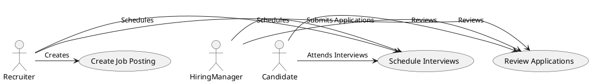
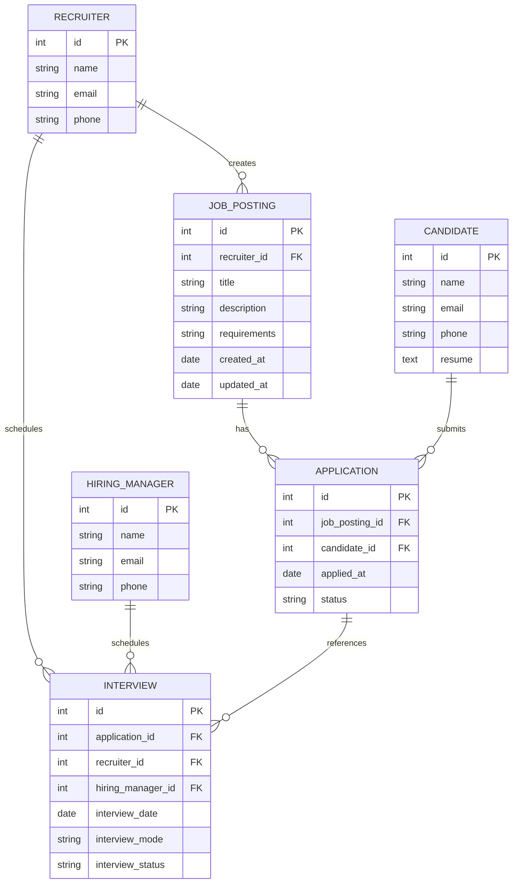

## Brief description and Lean Canvas diagram

### Developing the ATS System for LTI Company

#### Brief Description of LTI's New ATS System

**Name: LTI Recruit**

**Description:**
LTI Recruit is a comprehensive Applicant Tracking System designed to streamline the recruitment process from job creation to hiring. This system leverages the best features of leading ATS systems to provide a seamless and efficient recruitment experience. It includes modules for creating job postings, publishing them across multiple platforms, receiving and reviewing applications, conducting online tests, scheduling interviews, and managing the final hiring process.

**Advantages:**
1. **Structured Hiring Workflow:** Inspired by Greenhouse, LTI Recruit provides a structured and customizable hiring workflow, ensuring consistency and reducing bias in the hiring process.
2. **Integrated CRM Capabilities:** Lever’s CRM functionalities are incorporated to enhance proactive sourcing and candidate relationship management.
3. **Enterprise Integration:** Like Workday, LTI Recruit offers robust integration with other HR and enterprise tools, making it suitable for organizations of all sizes.
4. **Candidate Experience:** Borrowing from Jobvite, LTI Recruit emphasizes a positive candidate experience with user-friendly interfaces and efficient communication tools.
5. **Advanced Analytics:** Comprehensive analytics and reporting tools provide insights into every stage of the recruitment process, enabling data-driven decision-making.
6. **Scalability:** Designed to scale with growing businesses, ensuring it meets the needs of both small companies and large enterprises.

### Lean Canvas Diagram for LTI Recruit

#### 1. Problem
- Inefficient and inconsistent hiring processes
- Difficulty in managing and tracking applications from multiple sources
- Poor candidate experience and communication
- Lack of data-driven insights into the recruitment process

#### 2. Customer Segments
- HR departments of mid-to-large-sized companies
- Recruitment agencies
- Hiring managers
- Talent acquisition teams

#### 3. Unique Value Proposition
- A unified platform for managing the entire recruitment lifecycle
- Enhanced candidate relationship management
- Seamless integration with existing HR tools and systems
- Data-driven insights and advanced analytics

#### 4. Solution
- Structured and customizable hiring workflows
- Multi-channel job posting and application tracking
- CRM capabilities for proactive candidate sourcing
- Comprehensive analytics and reporting tools
- User-friendly interface with a focus on candidate experience

#### 5. Channels
- Direct sales to enterprises
- Partnerships with HR consultancy firms
- Online marketing and social media
- Industry conferences and events

#### 6. Revenue Streams
- Subscription-based model (monthly/yearly)
- Customization and integration services
- Premium features and add-ons
- Training and support packages

#### 7. Cost Structure
- Development and maintenance of the platform
- Marketing and sales expenses
- Customer support and training
- Research and development for continuous improvement

#### 8. Key Metrics
- Number of active users and companies
- Job postings and applications processed
- Customer satisfaction and retention rates
- Time-to-hire and cost-per-hire metrics

#### 9. Key Partners
- HR technology providers for integrations
- Job boards and social media platforms
- Recruitment agencies
- Data analytics providers

### Lean Canvas Diagram

```plaintext
|----------------------------|----------------------------|
|         PROBLEM            |       CUSTOMER SEGMENTS    |
|----------------------------|----------------------------|
| - Inefficient hiring       | - HR departments           |
|   processes                | - Recruitment agencies     |
| - Difficulty in tracking   | - Hiring managers          |
|   applications             | - Talent acquisition teams |
| - Poor candidate experience|                            |
|----------------------------|----------------------------|
|    UNIQUE VALUE PROP.      |          SOLUTION          |
|----------------------------|----------------------------|
| - Unified recruitment      | - Structured workflows     |
|   platform                 | - Multi-channel posting    |
| - Enhanced CRM             | - CRM capabilities         |
| - Seamless integration     | - Advanced analytics       |
| - Data-driven insights     | - User-friendly interface  |
|----------------------------|----------------------------|
|          CHANNELS          |      REVENUE STREAMS       |
|----------------------------|----------------------------|
| - Direct sales             | - Subscription model       |
| - Partnerships             | - Customization services   |
| - Online marketing         | - Premium features         |
| - Industry events          | - Training and support     |
|----------------------------|----------------------------|
|       COST STRUCTURE       |        KEY METRICS         |
|----------------------------|----------------------------|
| - Development and          | - Active users and         |
|   maintenance              |   companies                |
| - Marketing and sales      | - Job postings processed   |
| - Customer support         | - Customer satisfaction    |
| - R&D                      | - Time-to-hire metrics     |
|----------------------------|----------------------------|
|         KEY PARTNERS       |                            |
|----------------------------|----------------------------|
| - HR tech providers        |                            |
| - Job boards/social media  |                            |
| - Recruitment agencies     |                            |
| - Data analytics providers |                            |
|----------------------------|----------------------------|
```

This Lean Canvas provides a comprehensive overview of the key elements required to develop and implement LTI Recruit, ensuring it addresses the critical needs of the market while leveraging the best practices from existing ATS systems.


## Brief description of main 3 use cases

Certainly, here are the top three use cases for the LTI Recruit system, represented in a more simplified and understandable UML diagram.

### Top 3 Use Cases for LTI Recruit



### Explanation of the Top 3 Use Cases:

1. **Create Job Posting**:
    - **Actors**: Recruiter
    - **Description**: Recruiters create and edit job postings, providing job descriptions, requirements, and other necessary details to attract candidates.

2. **Review Applications**:
    - **Actors**: Recruiter, Hiring Manager, Candidate
    - **Description**: Recruiters and hiring managers review the applications submitted by candidates to shortlist the most suitable applicants.

3. **Schedule Interviews**:
    - **Actors**: Recruiter, Hiring Manager, Candidate
    - **Description**: Recruiters and hiring managers schedule interviews with shortlisted candidates. Candidates attend the scheduled interviews.

These use cases cover the critical steps in the recruitment process, ensuring that the key functionalities of job creation, application review, and interview scheduling are efficiently handled.

### Database model on mermaid

Sure, as a software architect, I can provide a database model that supports the three top use cases: creating job postings, reviewing applications, and scheduling interviews. Below is the database model using Mermaid syntax.



### Explanation of the Database Model

1. **RECRUITER Table**: Stores information about recruiters.
   - `id`: Primary key
   - `name`: Name of the recruiter
   - `email`: Email of the recruiter
   - `phone`: Phone number of the recruiter

2. **HIRING_MANAGER Table**: Stores information about hiring managers.
   - `id`: Primary key
   - `name`: Name of the hiring manager
   - `email`: Email of the hiring manager
   - `phone`: Phone number of the hiring manager

3. **CANDIDATE Table**: Stores information about candidates.
   - `id`: Primary key
   - `name`: Name of the candidate
   - `email`: Email of the candidate
   - `phone`: Phone number of the candidate
   - `resume`: Resume text of the candidate

4. **JOB_POSTING Table**: Stores job postings created by recruiters.
   - `id`: Primary key
   - `recruiter_id`: Foreign key to the RECRUITER table
   - `title`: Title of the job posting
   - `description`: Description of the job
   - `requirements`: Job requirements
   - `created_at`: Timestamp when the job posting was created
   - `updated_at`: Timestamp when the job posting was last updated

5. **APPLICATION Table**: Stores applications submitted by candidates for job postings.
   - `id`: Primary key
   - `job_posting_id`: Foreign key to the JOB_POSTING table
   - `candidate_id`: Foreign key to the CANDIDATE table
   - `applied_at`: Timestamp when the application was submitted
   - `status`: Status of the application (e.g., pending, reviewed, rejected, accepted)

6. **INTERVIEW Table**: Stores scheduled interviews for job applications.
   - `id`: Primary key
   - `application_id`: Foreign key to the APPLICATION table
   - `recruiter_id`: Foreign key to the RECRUITER table
   - `hiring_manager_id`: Foreign key to the HIRING_MANAGER table
   - `interview_date`: Date and time of the interview
   - `interview_mode`: Mode of the interview (e.g., in-person, video call)
   - `interview_status`: Status of the interview (e.g., scheduled, completed, cancelled)

This database model captures the essential entities and relationships necessary to support the main use cases of creating job postings, reviewing applications, and scheduling interviews.