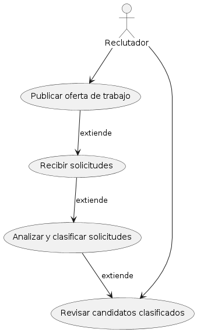
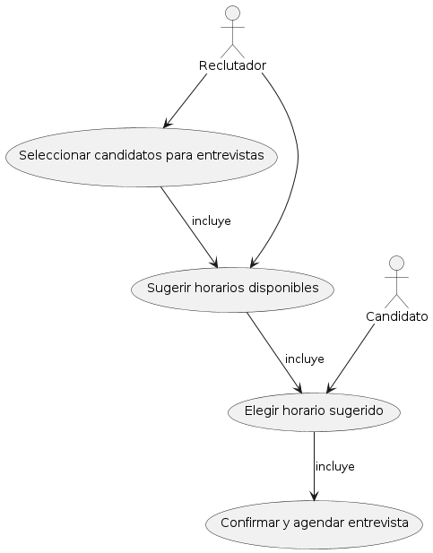
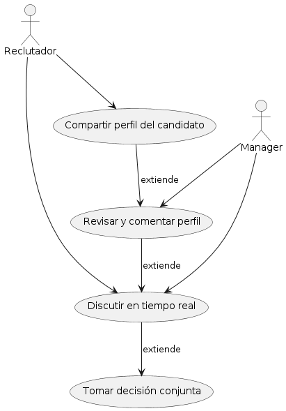
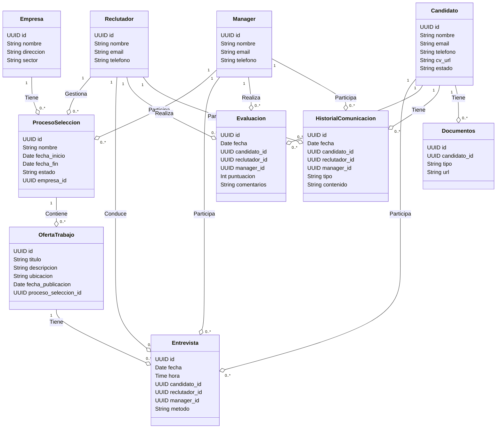
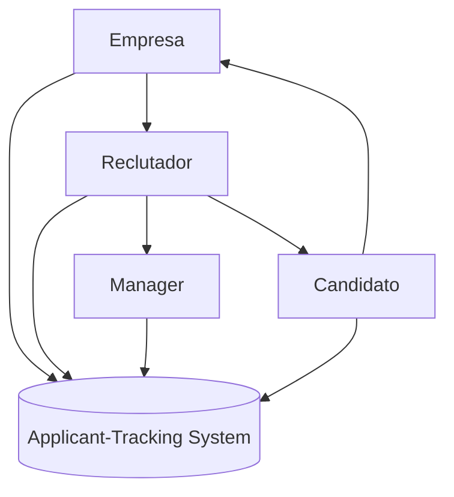
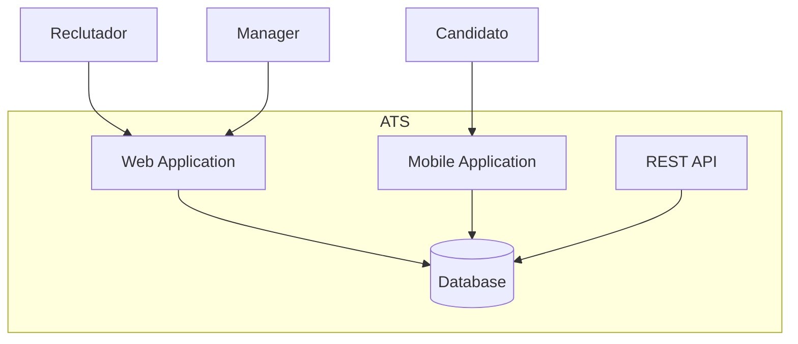
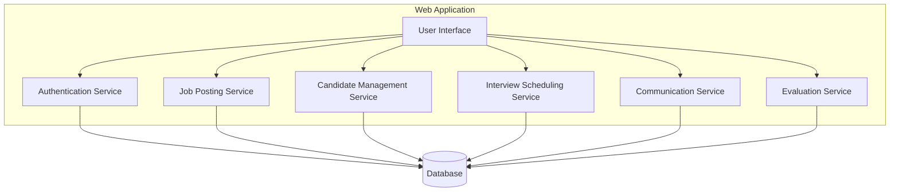
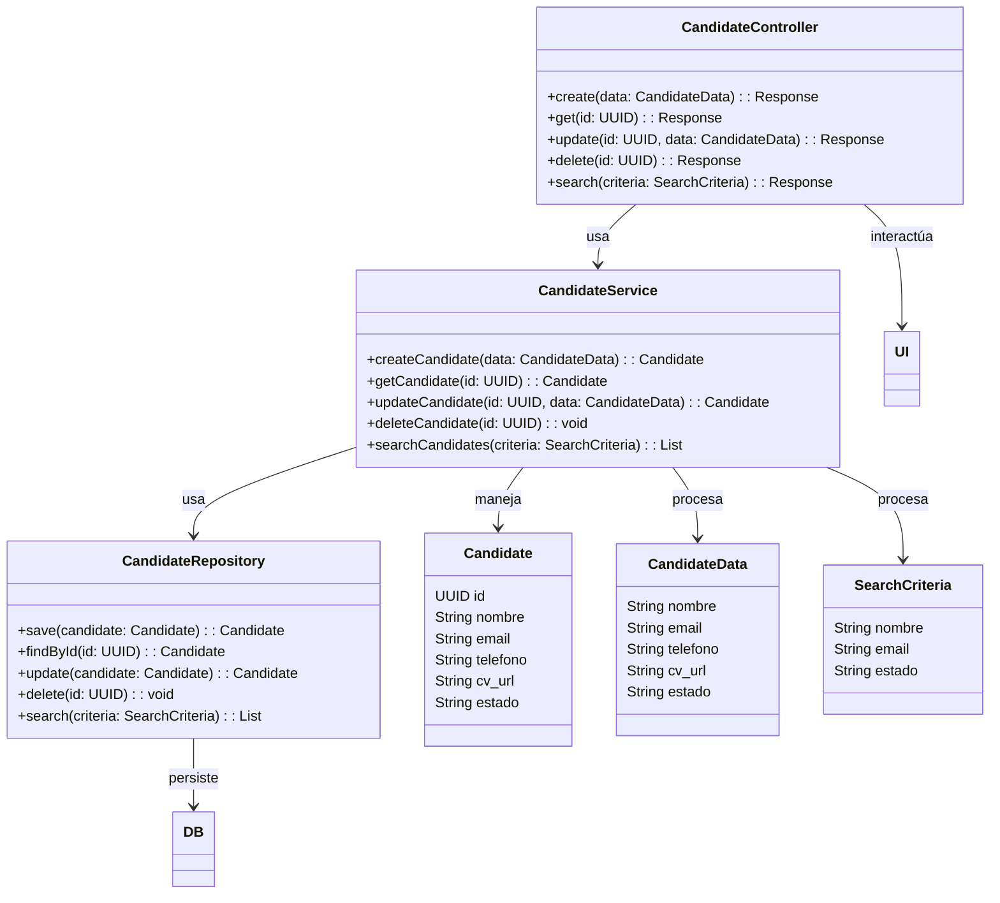

Para destacar a LTI (startup) en el mercado de Applicant-Tracking Systems (ATS), es crucial centrarse en funcionalidades innovadoras y avanzadas que aumenten la eficiencia de los departamentos de Recursos Humanos, mejoren la colaboración en tiempo real entre reclutadores y managers, y aprovechen la inteligencia artificial para automatizar diversas tareas. Aquí tienes una descripción del software, el valor añadido y las ventajas competitivas, así como un diagrama Lean Canvas.

### Descripción del Software para LTI
LTI ofrece un ATS de última generación diseñado para optimizar el proceso de contratación con tecnología avanzada. El sistema está orientado a mejorar la eficiencia y productividad de los departamentos de Recursos Humanos mediante herramientas de colaboración en tiempo real y asistencia de inteligencia artificial.

### Valor Añadido y Ventajas Competitivas

1. **Eficiencia Mejorada para RRHH**
   - **Automatización del Procesamiento de Solicitudes:** El ATS de LTI utiliza IA para filtrar y clasificar automáticamente las solicitudes de empleo, reduciendo el tiempo dedicado a tareas administrativas.
   - **Programación Inteligente de Entrevistas:** La integración con calendarios y herramientas de videoconferencia permite una programación eficiente y sin conflictos de entrevistas.

2. **Colaboración en Tiempo Real**
   - **Espacios de Trabajo Colaborativos:** Los reclutadores y managers pueden trabajar juntos en tiempo real, revisando perfiles de candidatos, dejando comentarios y tomando decisiones de manera conjunta.
   - **Notificaciones y Actualizaciones en Vivo:** Notificaciones instantáneas sobre el estado de los candidatos y las etapas del proceso de selección mantienen a todos los involucrados informados.

3. **Automatización con IA**
   - **Chatbots para Primer Contacto:** Asistentes virtuales para interactuar con candidatos, responder preguntas frecuentes y programar entrevistas preliminares.
   - **Análisis Predictivo de Candidatos:** Uso de algoritmos de IA para prever el desempeño y adecuación de los candidatos basados en datos históricos y tendencias.

### Funciones Principales

1. **Gestión Inteligente de Candidatos**
   - Perfilamiento avanzado con IA para identificar las mejores coincidencias.
   - Almacenamiento y búsqueda de datos de candidatos para futuras posiciones.

2. **Plataforma de Colaboración en Tiempo Real**
   - Herramientas para comentarios y retroalimentación en perfiles de candidatos.
   - Paneles compartidos para seguimiento y toma de decisiones conjunta.

3. **Automatización de Procesos**
   - Filtrado y clasificación automáticos de currículums.
   - Envío automatizado de correos electrónicos y actualizaciones.

4. **Analíticas y Reportes Avanzados**
   - Informes detallados sobre el desempeño del proceso de contratación.
   - Análisis de métricas clave para mejorar continuamente el proceso de selección.

### Diagrama Lean Canvas

```plaintext
|------------------------------------------------------------|
|                         Lean Canvas                        |
|------------------------------------------------------------|
|  PROBLEM                                                    |
|------------------------------------------------------------|
|  1. Procesos de selección ineficientes                     |
|  2. Falta de colaboración entre equipos                    |
|  3. Falta de automatización en tareas repetitivas          |
|------------------------------------------------------------|
|  CUSTOMER SEGMENTS                                          |
|------------------------------------------------------------|
|  1. Departamentos de RRHH                                   |
|  2. Managers y equipos de contratación                     |
|  3. Startups y medianas empresas                           |
|------------------------------------------------------------|
|  UNIQUE VALUE PROPOSITION                                   |
|------------------------------------------------------------|
|  "Optimización de la contratación con IA y colaboración en  |
|  tiempo real para un proceso más eficiente y efectivo"      |
|------------------------------------------------------------|
|  SOLUTION                                                   |
|------------------------------------------------------------|
|  1. Automatización de tareas administrativas                |
|  2. Herramientas colaborativas en tiempo real               |
|  3. Análisis predictivo y chatbots para interacción inicial |
|------------------------------------------------------------|
|  CHANNELS                                                   |
|------------------------------------------------------------|
|  1. Ventas directas a empresas                              |
|  2. Alianzas con portales de empleo                         |
|  3. Marketing digital y redes sociales                      |
|------------------------------------------------------------|
|  REVENUE STREAMS                                            |
|------------------------------------------------------------|
|  1. Suscripción mensual/anual                               |
|  2. Tarifas por usuario activo                              |
|  3. Servicios premium y personalización                     |
|------------------------------------------------------------|
|  COST STRUCTURE                                             |
|------------------------------------------------------------|
|  1. Desarrollo de software y mantenimiento                  |
|  2. Marketing y ventas                                      |
|  3. Soporte al cliente                                      |
|------------------------------------------------------------|
|  KEY METRICS                                                |
|------------------------------------------------------------|
|  1. Tiempo de contratación                                  |
|  2. Tasa de retención de candidatos                         |
|  3. Satisfacción del usuario                                |
|------------------------------------------------------------|
|  UNFAIR ADVANTAGE                                           |
|------------------------------------------------------------|
|  1. Algoritmos de IA propios                                |
|  2. Integración fluida con herramientas existentes          |
|  3. Plataforma altamente personalizable                     |
|------------------------------------------------------------|
```

Este enfoque ayudará a LTI a destacar en el mercado de ATS, ofreciendo soluciones avanzadas que mejoran significativamente la eficiencia, colaboración y automatización en los procesos de contratación.

Como analista de software experto, aquí tienes una breve descripción de los tres casos de uso más importantes para lograr la funcionalidad básica del ATS para LTI, seguidos de su representación en formato mermaid:

### Casos de Uso

1. **Automatización del Procesamiento de Solicitudes**
   - **Descripción:** El sistema debe filtrar y clasificar automáticamente las solicitudes de empleo utilizando IA para identificar a los candidatos más adecuados.
   - **Actores:** Reclutador
   - **Flujo Principal:**
     1. El reclutador publica una oferta de trabajo.
     2. Los candidatos envían sus solicitudes.
     3. El sistema analiza y clasifica las solicitudes.
     4. El reclutador revisa la lista de candidatos clasificados.

2. **Programación Inteligente de Entrevistas**
   - **Descripción:** El sistema debe integrar calendarios y herramientas de videoconferencia para permitir la programación eficiente de entrevistas sin conflictos.
   - **Actores:** Reclutador, Candidato
   - **Flujo Principal:**
     1. El reclutador selecciona candidatos para entrevistas.
     2. El sistema sugiere horarios disponibles basados en los calendarios de los entrevistadores.
     3. El candidato elige un horario sugerido.
     4. El sistema confirma y agenda la entrevista.

3. **Colaboración en Tiempo Real**
   - **Descripción:** El sistema debe proporcionar herramientas para la colaboración en tiempo real entre reclutadores y managers, permitiendo la revisión conjunta de perfiles de candidatos y toma de decisiones.
   - **Actores:** Reclutador, Manager
   - **Flujo Principal:**
     1. El reclutador comparte el perfil de un candidato con el manager.
     2. El manager revisa el perfil y deja comentarios.
     3. El reclutador y el manager discuten en tiempo real sobre el candidato.
     4. Se toma una decisión conjunta sobre el siguiente paso para el candidato.

### Descripción Detallada de los Casos de Uso

#### Caso de Uso 1: Automatización del Procesamiento de Solicitudes
- **Actor Principal:** Reclutador
- **Propósito:** Reducir el tiempo y esfuerzo necesarios para filtrar y clasificar solicitudes de empleo.
- **Precondiciones:** La oferta de trabajo está publicada.
- **Postcondiciones:** Los candidatos están clasificados y listos para revisión.
- **Flujo Principal:**
  1. El reclutador publica una oferta de trabajo en el sistema.
  2. Los candidatos envían sus solicitudes.
  3. El sistema analiza las solicitudes utilizando algoritmos de IA.
  4. Las solicitudes son clasificadas y presentadas al reclutador.



#### Caso de Uso 2: Programación Inteligente de Entrevistas
- **Actor Principal:** Reclutador
- **Actores Secundarios:** Candidato
- **Propósito:** Facilitar la programación de entrevistas de manera eficiente y sin conflictos.
- **Precondiciones:** El reclutador ha seleccionado candidatos para entrevistas.
- **Postcondiciones:** Las entrevistas están programadas y confirmadas.
- **Flujo Principal:**
  1. El reclutador selecciona candidatos para entrevistas.
  2. El sistema accede a los calendarios de los entrevistadores para verificar disponibilidad.
  3. El sistema sugiere horarios disponibles al candidato.
  4. El candidato selecciona un horario sugerido.
  5. El sistema confirma y agenda la entrevista.



#### Caso de Uso 3: Colaboración en Tiempo Real
- **Actor Principal:** Reclutador
- **Actores Secundarios:** Manager
- **Propósito:** Permitir la revisión conjunta y la toma de decisiones sobre candidatos en tiempo real.
- **Precondiciones:** El perfil del candidato está disponible en el sistema.
- **Postcondiciones:** Se ha tomado una decisión conjunta sobre el candidato.
- **Flujo Principal:**
  1. El reclutador comparte el perfil del candidato con el manager.
  2. El manager revisa el perfil y deja comentarios.
  3. El reclutador y el manager discuten en tiempo real sobre el candidato.
  4. Se toma una decisión conjunta sobre el siguiente paso para el candidato.



Estos casos de uso representan las funcionalidades clave que permitirán a LTI ofrecer un ATS eficiente y competitivo.

Para un sistema Applicant-Tracking System (ATS) bien diseñado, además de las entidades Reclutador, Manager, Candidato, Empresa y Procesos de selección, las siguientes entidades también son importantes:

1. **Oferta de Trabajo**: Representa las posiciones disponibles en una empresa.
2. **Entrevista**: Registra las entrevistas programadas para los candidatos.
3. **Evaluación**: Almacena los resultados y comentarios de las evaluaciones de los candidatos.
4. **Historial de Comunicación**: Rastrea todas las interacciones y comunicaciones con los candidatos.
5. **Documentos**: Almacena los archivos adjuntos relacionados con los candidatos y el proceso de selección (CV, cartas de presentación, etc.).

### Definición de Campos

#### Entidades y Campos

1. **Reclutador**
   - `id: UUID`
   - `nombre: String`
   - `email: String`
   - `telefono: String`

2. **Manager**
   - `id: UUID`
   - `nombre: String`
   - `email: String`
   - `telefono: String`

3. **Candidato**
   - `id: UUID`
   - `nombre: String`
   - `email: String`
   - `telefono: String`
   - `cv_url: String`
   - `estado: String` (Estado del candidato en el proceso de selección)

4. **Empresa**
   - `id: UUID`
   - `nombre: String`
   - `direccion: String`
   - `sector: String`

5. **Proceso de Selección**
   - `id: UUID`
   - `nombre: String`
   - `fecha_inicio: Date`
   - `fecha_fin: Date`
   - `estado: String` (Estado del proceso)
   - `empresa_id: UUID`

6. **Oferta de Trabajo**
   - `id: UUID`
   - `titulo: String`
   - `descripcion: String`
   - `ubicacion: String`
   - `fecha_publicacion: Date`
   - `proceso_seleccion_id: UUID`

7. **Entrevista**
   - `id: UUID`
   - `fecha: Date`
   - `hora: Time`
   - `candidato_id: UUID`
   - `reclutador_id: UUID`
   - `manager_id: UUID`
   - `metodo: String` (Presencial, Videoconferencia, etc.)

8. **Evaluación**
   - `id: UUID`
   - `fecha: Date`
   - `candidato_id: UUID`
   - `reclutador_id: UUID`
   - `manager_id: UUID`
   - `puntuacion: Int`
   - `comentarios: String`

9. **Historial de Comunicación**
   - `id: UUID`
   - `fecha: Date`
   - `candidato_id: UUID`
   - `reclutador_id: UUID`
   - `manager_id: UUID`
   - `tipo: String` (Email, Llamada, Mensaje, etc.)
   - `contenido: String`

10. **Documentos**
    - `id: UUID`
    - `candidato_id: UUID`
    - `tipo: String` (CV, Carta de Presentación, etc.)
    - `url: String`

### Relaciones entre Entidades

- Un **Reclutador** puede estar asociado a múltiples **Procesos de Selección**.
- Un **Manager** puede participar en múltiples **Procesos de Selección**.
- Un **Candidato** puede aplicar a múltiples **Ofertas de Trabajo**.
- Una **Empresa** puede tener múltiples **Procesos de Selección**.
- Un **Proceso de Selección** puede incluir múltiples **Ofertas de Trabajo**.
- Una **Oferta de Trabajo** puede tener múltiples **Entrevistas**.
- Una **Entrevista** está relacionada con un **Candidato**, un **Reclutador** y un **Manager**.
- Una **Evaluación** está relacionada con un **Candidato**, un **Reclutador** y un **Manager**.
- Un **Candidato** puede tener múltiples **Historiales de Comunicación**.
- Un **Candidato** puede tener múltiples **Documentos**.

### Diagrama en formato Mermaid



Este diagrama muestra las entidades principales del sistema ATS, sus campos más importantes y las relaciones entre ellas, proporcionando una visión clara del modelo de datos.

Para crear un diagrama C4 y profundizar en uno de los componentes del sistema ATS de LTI, seguimos las cuatro capas del modelo C4: Contexto, Contenedores, Componentes y Código.

### Diagrama de Contexto (C4 Nivel 1)


### Diagrama de Contenedores (C4 Nivel 2)


### Diagrama de Componentes (C4 Nivel 3)
Para la Web Application, detallamos los componentes internos:



### Diagrama de Código (C4 Nivel 4)
Profundizando en el componente **Candidate Management Service**:



### Descripción del Componente: Candidate Management Service

**Candidate Management Service** es responsable de manejar todas las operaciones relacionadas con los candidatos dentro del sistema ATS. Esto incluye la creación, actualización, eliminación, búsqueda y recuperación de datos de candidatos.

- **CandidateController**: Actúa como la interfaz entre la capa de presentación (UI) y la lógica de negocio (CandidateService). Maneja las solicitudes HTTP y devuelve las respuestas adecuadas.
- **CandidateService**: Contiene la lógica de negocio para manejar los datos de los candidatos. Realiza operaciones CRUD y búsquedas según los criterios proporcionados.
- **CandidateRepository**: Interactúa directamente con la base de datos para almacenar y recuperar datos de los candidatos.
- **Candidate**: Representa el modelo de datos del candidato.
- **CandidateData**: Utilizado para transferir datos de candidatos entre las capas del sistema.
- **SearchCriteria**: Contiene los criterios de búsqueda para filtrar candidatos.

Este componente es fundamental para la gestión eficiente de candidatos, asegurando que los datos sean precisos, accesibles y seguros. La separación clara de responsabilidades entre controladores, servicios y repositorios sigue los principios de arquitectura limpia, facilitando la mantenibilidad y escalabilidad del sistema.