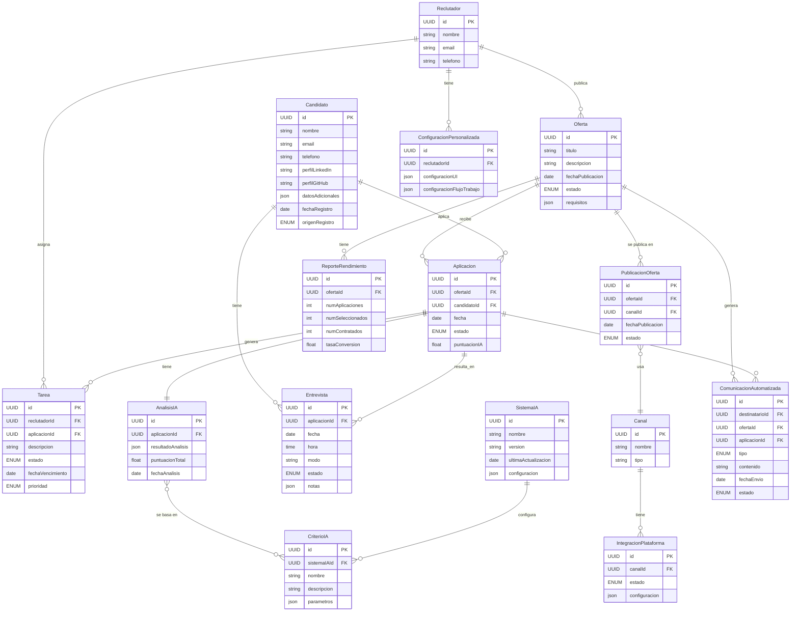

# 1️⃣ Propuesta de Sistema ATS (Applicant Tracking System) para LTI

## Descripción del Sistema

LTI se propone desarrollar un sistema ATS de vanguardia que revolucione la gestión del proceso de reclutamiento y selección. Nuestro ATS será una plataforma integral, intuitiva y altamente eficiente que permitirá a las empresas optimizar sus procesos de contratación, desde la publicación de ofertas hasta la incorporación de nuevos empleados.

### Funcionalidades Básicas

1. Gestión de ofertas de trabajo
2. Base de datos de candidatos
3. Seguimiento del proceso de selección
4. Programación de entrevistas
5. Evaluación de candidatos
6. Generación de informes
7. Integración con sistemas de RRHH
8. Comunicación con candidatos
9. Gestión de documentos
10. Cumplimiento normativo y seguridad de datos

## Propuestas de Más Valor del Producto

Basándonos en el análisis comparativo de las propuestas, hemos identificado las siguientes funcionalidades como las de mayor valor añadido y potencial ventaja competitiva:

1. Publicación e Integración Multicanal
2. Gestión Inteligente de Candidatos con IA
3. Interfaz de Usuario Intuitiva y Personalizable
4. Automatización Avanzada del Proceso de Selección
5. Análisis y Reportes en Tiempo Real

## Descripción de las Propuestas de Más Valor

### 1. Publicación e Integración Multicanal

Nuestro ATS ofrecerá una integración sin precedentes con múltiples plataformas de empleo y redes sociales profesionales. Esto permitirá:

- Publicación automática de ofertas en diversos canales simultáneamente.
- Búsqueda proactiva de candidatos en plataformas como LinkedIn, GitHub, etc.
- Consolidación de todas las aplicaciones en un único sistema, independientemente de su origen.

**Ventaja Competitiva:** Ampliación significativa del alcance de las ofertas y acceso a un pool de talento más diverso y cualificado.

### 2. Gestión Inteligente de Candidatos con IA

Implementaremos algoritmos de IA avanzados para revolucionar la gestión de candidatos:

- Análisis predictivo para identificar a los candidatos más prometedores.
- Recomendaciones personalizadas de candidatos para cada puesto.
- Preselección automatizada basada en criterios predefinidos.

**Ventaja Competitiva:** Reducción drástica del tiempo de selección y mejora en la calidad de los candidatos preseleccionados.

### 3. Interfaz de Usuario Intuitiva y Personalizable

Diseñaremos una interfaz de usuario altamente intuitiva y adaptable:

- Dashboards configurables para diferentes roles (reclutadores, gerentes, etc.).
- Experiencia móvil optimizada para candidatos y reclutadores.
- Flujos de trabajo personalizables según las necesidades específicas de cada empresa.

**Ventaja Competitiva:** Mayor adopción por parte de los usuarios y adaptabilidad a diversos procesos de reclutamiento.

### 4. Automatización Avanzada del Proceso de Selección

Llevaremos la automatización al siguiente nivel:

- Programación inteligente de entrevistas basada en la disponibilidad de todas las partes.
- Envío automatizado de comunicaciones personalizadas en cada etapa del proceso.
- Asignación automática de tareas a los miembros del equipo de reclutamiento.

**Ventaja Competitiva:** Aumento significativo de la eficiencia del proceso y mejora de la experiencia tanto para reclutadores como para candidatos.

### 5. Análisis y Reportes en Tiempo Real

Ofreceremos capacidades de análisis avanzadas:

- Métricas de rendimiento del proceso de contratación en tiempo real.
- Informes personalizables y exportables.
- Insights accionables para mejorar continuamente las estrategias de reclutamiento.

**Ventaja Competitiva:** Toma de decisiones basada en datos, permitiendo una mejora continua y medible del proceso de reclutamiento.

Con estas propuestas de alto valor, nuestro ATS no solo cubrirá las necesidades básicas de gestión de candidatos, sino que también proporcionará herramientas avanzadas que marcarán la diferencia en el mercado. Esto posicionará a LTI como líder en soluciones de reclutamiento, ofreciendo a nuestros clientes una ventaja competitiva significativa en la guerra por el talento.

## Lean Canvas

----

# 2️⃣ Casos de uso

Este diagrama PlantUML muestra los casos de uso principales organizados en tres subsistemas correspondientes a las funcionalidades clave del ATS. Los casos de uso están listados en orden de importancia dentro de cada subsistema, con los más críticos y de mayor valor en la parte superior.

Explicación de la priorización:

1. Publicación e Integración Multicanal:
    - "Publicar oferta en múltiples canales" es la funcionalidad más crítica.
    - "Consolidar aplicaciones" es esencial para centralizar la información.
    - "Buscar candidatos proactivamente" añade valor significativo al proceso de reclutamiento.
    - "Monitorear rendimiento de ofertas" proporciona insights valiosos.
    - "Gestionar integraciones de plataformas" es importante pero menos crítico para el uso diario.
2. Gestión Inteligente de Candidatos con IA:
    - "Analizar predictivamente candidatos" es la funcionalidad clave de IA.
    - "Recomendar candidatos para puestos" ofrece un valor directo a los reclutadores.
    - "Preseleccionar automáticamente candidatos" ahorra tiempo significativo.
    - "Configurar criterios de selección IA" es importante pero menos frecuente.
3. Automatización Avanzada del Proceso:
    - "Programar entrevistas inteligentemente" optimiza un proceso crucial y ahorra tiempo.
    - "Enviar comunicaciones automatizadas" mejora la eficiencia y la experiencia del candidato.
    - "Asignar tareas automáticamente" agiliza el flujo de trabajo del equipo.
    - "Gestionar flujo del proceso de selección" proporciona control y visibilidad general.

Esta priorización se basa en el impacto potencial de cada caso de uso en la eficiencia del proceso de reclutamiento, la experiencia del usuario y el valor añadido para la empresa.

----

# 3️⃣ Modelado de datos

## Entidades y Campos

- **Reclutador**: Representa al usuario reclutador con sus datos de contacto.
- **Candidato**: Representa al candidato con sus datos personales y perfiles en plataformas profesionales.
- **Oferta**: Contiene información sobre las ofertas de trabajo publicadas.
- **Aplicacion**: Representa una aplicación a una oferta de trabajo hecha por un candidato.
- **Canal**: Define los distintos canales de publicación (e.g., LinkedIn, GitHub).
- **IntegracionPlataforma**: Representa las integraciones con distintas plataformas de empleo.
- **CriterioIA**: Define los criterios utilizados por la IA para la preselección y análisis de candidatos.
- **Entrevista**: Detalles de las entrevistas programadas con los candidatos.
- **Tarea**: Representa las tareas asignadas a los miembros del equipo de reclutamiento.
- **ReporteRendimiento**: Contiene los datos de rendimiento de las ofertas publicadas.

## Relaciones entre Entidades

- Un **Reclutador** puede publicar múltiples **Ofertas** y asignar múltiples **Tareas**.
- Una **Oferta** puede recibir múltiples **Aplicaciones** y publicarse en múltiples **Canales**.
- Una **Oferta** tiene múltiples **Reportes de Rendimiento**.
- Un **Candidato** puede realizar múltiples **Aplicaciones** y tener múltiples **Entrevistas**.
- Una **Aplicacion** puede resultar en múltiples **Entrevistas** y generar múltiples **Tareas**.
- Un **Canal** puede tener múltiples **Integraciones de Plataforma**.
- Un **Administrador** gestiona múltiples **Integraciones de Plataforma**.
- Un **CriterioIA** se aplica a múltiples **Aplicaciones**.
- El **SistemaIA** configura múltiples **CriteriosIA**.

Este modelo de datos asegura que todos los casos de uso descritos en el diagrama están soportados y estructurados adecuadamente.

----

# 4️⃣ Diseño de alto nivel (arquitectura)

## Descripción de las capas y principales tecnologías

1. Interfaz de Usuario:
    - Aplicación Web para Reclutadores (React.JS)
    - Aplicación Web para Candidatos (React.JS)
2. Capa de API y Seguridad:
    - AWS API Gateway para manejar las solicitudes de los clientes
    - AWS Cognito para la autenticación y autorización
3. Microservicios, divididos en dos grupos principales:
    - Servicios Reclutadores:
        * Servicio de Publicación (EKS: Node.JS con RDS-PostgreSQL)
        * Servicio de Integración (EKS: Python con DynamoDB)
        * Servicio de Automatización (EKS: Spring Boot con RDS-Mysql)
    - Servicios Candidatos:
        * Servicio de Gestión de Candidatos (EKS: Node.JS con RDS-PostgreSQL)
        * Servicio de Aplicaciones (EKS: Python con DynamoDB)
        * Servicio de Entrevistas (EKS: Spring Boot con RDS-Mysql)
4. Servicios Compartidos:
    - Amazon ElastiCache para caché
    - Amazon SQS/SNS para mensajería
    - Amazon S3 para almacenamiento de objetos
    - Amazon Redshift para análisis de datos
5. Infraestructura y Monitoreo:
    - Amazon EKS para la orquestación de contenedores
    - Amazon CloudWatch para monitoreo y logs
    - Amazon OpenSearch Service para búsqueda y análisis de logs

# Diagramas C4

## Diagrama de contexto

## Diagrama de Contenedores

## Diagrama de Componentes

A continuación se detalla el diagrama de componentes C4 para el servicio de publicación de ofertas:

## Diagrama de Código

Se profundiza en el caso de uso "Publicación de oferta en múltiples canales" con un diagrama de código detallado:

