# Introducción y leyenda
Se ha realizado el ejercicio usando tanto Claude 3.5 como ChatGPT 4o y se ha ido comparando las respuestas.
En la fase inicial de investigación y análisis se ha combinado ambas respuesta (usando también la IA para el mix).

## Leyenda
- Se ha marcado con el emoji :top: las respuestas que han sido consideradas como las mejores en cada prompt.
- Los prompts estan dentro de un bloque de código 
- Los diagramas se han renderizado con una herramienta online y adjuntado como imagen en formato markdown.

## Conclusiones tras el ejercicio
En general Claude 3.5 ha sido más preciso y ha dado respuestas más completas y detalladas. ChatGPT ha tenido errores a la hora de generar el código de los diagramas.


# 1️⃣ Investigación y análisis

## Prompt 1: Brainstorm de funcionalidad

```
Eres un experto en producto que trabaja para LTI, una startup. Tienes experiencia en sistemas para Recursos Humanos de empresas. LTI quiere crear el mejor **ATS (Applicant-Tracking System)**
¿Puedes darme un listado de funcionalidades básicas que debe cubrir un ATS? El listado debe estar ordenado de mayor a menor prioridad.
La prioridad estará marcada de la siguiente forma: Si una funcionalidad básica puede ser diferenciadora para brillar por encima de los competidores, tendrá más prioridad. Sin embarco, una funcionalidad básica que no pueda mejorarse o aportar nada en especial, tendrá menos prioridad.
```

### Respuestas de los modelos 🤖

- **Notion AI**:
    1. Publicación automatizada de ofertas de trabajo en múltiples plataformas
    2. Recopilación y organización de solicitudes de empleo
    3. Herramientas de evaluación automatizadas y personalizables (tests online, análisis de CVs...)
    4. Programación inteligente de entrevistas basada en la disponibilidad de los candidatos y los entrevistadores
    5. Seguimiento del progreso del candidato durante el proceso de selección
    6. Herramientas de colaboración para permitir la discusión y evaluación en equipo de los candidatos
    7. Generación de informes y análisis para evaluar la eficacia de las estrategias de contratación
    8. Integración con sistemas de recursos humanos existentes para una contratación sin problemas.
    9. Asistencia a la IA para la revisión de solicitudes y la preselección de candidatos
    10. Opciones de personalización para adaptar el ATS a las necesidades específicas de la empresa
    11. Funcionalidad de búsqueda avanzada para facilitar la localización de candidatos o trabajos específicos
    12. Opciones para la interacción directa con los candidatos (correo electrónico, chat...)
    13. Capacidad para manejar múltiples procesos de contratación simultáneamente
    14. Funcionalidad de retroalimentación para mejorar continuamente el proceso de contratación.
- **ChatGTP 4o** (🔻Ha priorizado la Interfaz de usuario sobre funcionalidad)
    Por supuesto, aquí tienes un listado de funcionalidades básicas que debe cubrir un ATS (Applicant Tracking System) para LTI, ordenado de mayor a menor prioridad:
    
    1. **Interfaz de Usuario Intuitiva y Personalizable**: Una interfaz fácil de usar y personalizable puede marcar una gran diferencia. Debe permitir a los usuarios configurar vistas, paneles y flujos de trabajo según sus necesidades específicas.
    2. **Automatización del Proceso de Reclutamiento**: Herramientas que automaticen tareas repetitivas, como el envío de correos electrónicos de confirmación, recordatorios y la programación de entrevistas. La automatización puede incluir bots de inteligencia artificial para la selección inicial de candidatos.
    3. **Integración con Redes Sociales y Portales de Empleo**: Capacidad para publicar vacantes automáticamente en diversas plataformas (LinkedIn, Indeed, Glassdoor, etc.) y recibir aplicaciones directamente en el ATS. Esto puede diferenciar el sistema al mejorar el alcance y la eficiencia del proceso de reclutamiento.
    4. **Base de Datos Centralizada de Candidatos**: Un repositorio único y bien organizado de todos los candidatos con perfiles detallados, historial de interacciones y documentos relevantes. La capacidad de búsqueda avanzada en esta base de datos es crucial.
    5. **Análisis y Reportes Avanzados**: Herramientas de análisis que proporcionen insights sobre el proceso de contratación, incluyendo tiempo de contratación, costo por contratación, fuentes de candidatos más efectivas, etc. Los reportes deben ser personalizables y visualmente atractivos.
    6. **Evaluación y Comparación de Candidatos**: Funcionalidades para comparar perfiles de candidatos, almacenar notas de entrevistas y calificaciones, y generar listas cortas de los mejores candidatos basadas en criterios predefinidos.
    7. **Gestión de Entrevistas**: Herramientas para programar entrevistas, enviar recordatorios automáticos, y permitir la calificación y el feedback posterior a la entrevista.
    8. **Portal de Candidatos**: Un portal donde los candidatos puedan aplicar a vacantes, ver el estado de sus aplicaciones y actualizar su información. Un portal bien diseñado mejora la experiencia del candidato y puede ser un factor diferenciador.
    9. **Gestión de Ofertas y Contrataciones**: Facilitar la creación, envío y seguimiento de ofertas laborales, incluyendo la posibilidad de firmar contratos digitalmente.
    10. **Compatibilidad Móvil**: Una versión móvil del ATS que permita a los reclutadores y candidatos acceder y utilizar el sistema desde cualquier dispositivo, en cualquier lugar.
    11. **Integración con Sistemas de RRHH y Herramientas de Terceros**: Capacidad para integrarse fácilmente con otros sistemas de RRHH y herramientas de terceros (e.g., sistemas de nómina, software de evaluación de habilidades, etc.) para una gestión más holística.
    12. **Seguridad y Cumplimiento**: Funcionalidades robustas de seguridad para proteger los datos de los candidatos y garantizar el cumplimiento con normativas de privacidad (e.g., GDPR, CCPA).
    13. **Almacenamiento y Gestión de Documentos**: Capacidad para almacenar y gestionar documentos relevantes como currículums, cartas de presentación, referencias, etc., de manera segura y accesible.
    14. **Funcionalidad Multilingüe y Multinacional**: Soporte para múltiples idiomas y capacidad para gestionar procesos de reclutamiento en diferentes países, cumpliendo con las regulaciones locales.
    15. **Feedback y Comunicación con los Candidatos**: Herramientas para mantener una comunicación fluida con los candidatos, incluyendo la posibilidad de enviar feedback constructivo a los no seleccionados.
    
    Estas funcionalidades están ordenadas de acuerdo a su potencial diferenciador y la capacidad de mejorar la experiencia de usuarios y candidatos. Las primeras en la lista no solo son fundamentales, sino que también pueden ser optimizadas para ofrecer ventajas competitivas claras.
    
- **Claude 3.5**
    
    Entendido. Como experto en producto para LTI, te proporcionaré un listado de funcionalidades básicas para un ATS (Applicant Tracking System), ordenadas de mayor a menor prioridad según el criterio mencionado. Aquí está el listado:
    
    1. Gestión de candidatos inteligente con IA
        - Análisis predictivo para identificar los mejores candidatos
        - Recomendaciones personalizadas de candidatos para cada puesto
    2. Integración con plataformas de redes sociales y profesionales
        - Búsqueda proactiva de candidatos en LinkedIn, GitHub, etc.
        - Publicación automática de ofertas en múltiples plataformas
    3. Interfaz de usuario intuitiva y personalizable
        - Dashboards configurables para diferentes roles (reclutadores, gerentes, etc.)
        - Experiencia móvil optimizada para candidatos y reclutadores
    4. Automatización del proceso de selección
        - Programación automática de entrevistas
        - Envío de comunicaciones personalizadas en cada etapa del proceso
    5. Análisis avanzado y reportes en tiempo real
        - Métricas de rendimiento del proceso de contratación
        - Informes personalizables y exportables
    6. Gestión de flujos de trabajo configurables
        - Creación de flujos de trabajo adaptados a cada tipo de puesto
        - Asignación automática de tareas a los miembros del equipo
    7. Evaluación de candidatos basada en competencias
        - Cuestionarios y pruebas integradas en la plataforma
        - Comparación automática de perfiles con requisitos del puesto
    8. Colaboración en equipo y feedback
        - Herramientas de comunicación interna para el equipo de RRHH
        - Sistema de evaluación y comentarios para cada candidato
    9. Gestión de ofertas y onboarding
        - Generación y envío de ofertas de trabajo
        - Seguimiento del proceso de incorporación de nuevos empleados
    10. Cumplimiento normativo y privacidad de datos
        - Conformidad con GDPR y otras regulaciones de protección de datos
        - Gestión de consentimientos y preferencias de los candidatos
    11. Gestión de base de datos de candidatos
        - Búsqueda avanzada y filtrado de candidatos
        - Etiquetado y categorización de perfiles
    12. Integración con sistemas de RRHH existentes
        - Conexión con sistemas de nómina, gestión de empleados, etc.
        - Sincronización de datos entre plataformas
    
    Este listado prioriza las funcionalidades que pueden ser diferenciadoras y aportar un valor añadido significativo al ATS de LTI. Las funcionalidades más básicas y comunes se encuentran en posiciones inferiores, ya que ofrecen menos oportunidades de destacar frente a la competencia.
    

## Prompt 2: Tabla comparativa

```
Tengo 3 listados de propuestas de funcionalidades básicas para el sistema ATS. Éstas propuestas están ordenadas por prioridad según la persona que las presenta.
Necesito sacar en formato Markdown una tabla que me permita comparar éstas propuestas. 

Primero se deberá relacionar las propuestas de las 3 listas, agrupando las que contengan la misma idea.

Luego se construirá la tabla de la siguiente forma:
- En la primera fila debe aparecer como encabezado el nombre de la persona que propone (Nacho, Claudia y Gepeto)
- A partir de la segunda fila apareceran las propuestas:
- En la primera columna las de Nacho, una propuesta por fila. Entre paréntesis debe aparecer la posición original en la lista de Nacho.
- En la segunda columna, de Claudia, se colocaran las propuestas en la misma fila de la propuesta de Nacho que signifique lo mismo. Además deberá aparecer entre paréntesis la posición que ocupaba en el listado original de Claudia.
- Para la tercera columna repetiremos el proceso, colocando cada propuesta de Gepeto en la misma fila que la propuesta de Nacho que coincida en significado.
- Si hay propuestas que no tengan correspondencia entre las listas, aparecerán en una fila extra. 
- El orden de cada idea vendrá determinado por la media de la posición en que aparece en cada listado. Si una idea no aparece en un listado, contará con el valor 15 para esa lista de prioridad.
- Una idea puede coincidir con varias de otra lista. En tal caso aparecerán en la misma fila.
```

- **Claude 3.5** 🔝 (respuesta con la tabla ordenada)
    
    Entendido. He analizado las tres listas de propuestas y he creado una tabla comparativa en formato Markdown, agrupando las ideas similares y ordenándolas según la media de sus posiciones en los listados originales. Aquí está el resultado:
    
    | Nacho | Claudia | Gepeto |
    | --- | --- | --- |
    | Publicación automatizada de ofertas de trabajo en múltiples plataformas (1) | Integración con plataformas de redes sociales y profesionales (2) | Integración con Redes Sociales y Portales de Empleo (3) |
    | Asistencia a la IA para la revisión de solicitudes y la preselección de candidatos (9) | Gestión de candidatos inteligente con IA (1) | Automatización del Proceso de Reclutamiento (2) |
    | Opciones de personalización para adaptar el ATS a las necesidades específicas de la empresa (10) | Interfaz de usuario intuitiva y personalizable (3) | Interfaz de Usuario Intuitiva y Personalizable (1) |
    | Programación inteligente de entrevistas basada en la disponibilidad de los candidatos y los entrevistadores (4) | Automatización del proceso de selección (4) | Gestión de Entrevistas (7) |
    | Generación de informes y análisis para evaluar la eficacia de las estrategias de contratación (7) | Análisis avanzado y reportes en tiempo real (5) | Análisis y Reportes Avanzados (5) |
    | Herramientas de colaboración para permitir la discusión y evaluación en equipo de los candidatos (6) | Colaboración en equipo y feedback (8) | Evaluación y Comparación de Candidatos (6) |
    | Integración con sistemas de recursos humanos existentes para una contratación sin problemas (8) | Integración con sistemas de RRHH existentes (12) | Integración con Sistemas de RRHH y Herramientas de Terceros (11) |
    | Recopilación y organización de solicitudes de empleo (2) | Gestión de base de datos de candidatos (11) | Base de Datos Centralizada de Candidatos (4) |
    | Herramientas de evaluación automatizadas y personalizables (tests online, análisis de CVs...) (3) | Evaluación de candidatos basada en competencias (7) |  |
    | Seguimiento del progreso del candidato durante el proceso de selección (5) | Gestión de flujos de trabajo configurables (6) |  |
    | Funcionalidad de búsqueda avanzada para facilitar la localización de candidatos o trabajos específicos (11) |  |  |
    | Opciones para la interacción directa con los candidatos (correo electrónico, chat...) (12) |  | Feedback y Comunicación con los Candidatos (15) |
    | Capacidad para manejar múltiples procesos de contratación simultáneamente (13) |  |  |
    | Funcionalidad de retroalimentación para mejorar continuamente el proceso de contratación (14) |  |  |
    |  | Gestión de ofertas y onboarding (9) | Gestión de Ofertas y Contrataciones (9) |
    |  | Cumplimiento normativo y privacidad de datos (10) | Seguridad y Cumplimiento (12) |
    |  |  | Portal de Candidatos (8) |
    |  |  | Compatibilidad Móvil (10) |
    |  |  | Almacenamiento y Gestión de Documentos (13) |
    |  |  | Funcionalidad Multilingüe y Multinacional (14) |
    
    Esta tabla compara las propuestas de los tres listados, agrupando las ideas similares y manteniendo el orden de prioridad según la media de sus posiciones en los listados originales. Las propuestas que no tienen correspondencia directa en otras listas aparecen en filas separadas.
    

- **ChatGPT 4o**
    
    
    | Nacho | Claudia | Gepeto | Media de posiciones |
    | --- | --- | --- | --- |
    | Publicación automatizada de ofertas de trabajo en múltiples plataformas (1) | Integración con plataformas de redes sociales y profesionales (2) | Integración con Redes Sociales y Portales de Empleo (3) | 2.00 |
    | Herramientas de evaluación automatizadas y personalizables (tests online, análisis de CVs...) (3) | Evaluación de candidatos basada en competencias (7) | Evaluación y Comparación de Candidatos (6) | 5.33 |
    | Programación inteligente de entrevistas basada en la disponibilidad de candidatos y entrevistadores (4) | Automatización del proceso de selección (4) | Gestión de Entrevistas (7) | 5.00 |
    | Generación de informes y análisis para evaluar la eficacia de las estrategias de contratación (7) | Análisis avanzado y reportes en tiempo real (5) | Análisis y Reportes Avanzados (5) | 5.67 |
    | Asistencia a la IA para la revisión de solicitudes y la preselección de candidatos (9) | Gestión de candidatos inteligente con IA (1) | Automatización del Proceso de Reclutamiento (2) | 4.00 |
    | Opciones de personalización para adaptar el ATS a las necesidades específicas de la empresa (10) | Interfaz de usuario intuitiva y personalizable (3) | Interfaz de Usuario Intuitiva y Personalizable (1) | 4.67 |
    | Integración con sistemas de recursos humanos existentes para una contratación sin problemas (8) | Integración con sistemas de RRHH existentes (12) | Integración con Sistemas de RRHH y Herramientas de Terceros (11) | 10.33 |
    | Funcionalidad de búsqueda avanzada para facilitar la localización de candidatos o trabajos específicos (11) | Gestión de base de datos de candidatos (11) | Base de Datos Centralizada de Candidatos (4) | 8.67 |
    | Herramientas de colaboración para permitir la discusión y evaluación en equipo de los candidatos (6) | Colaboración en equipo y feedback (8) | No especificado | 9.67 |
    | Opciones para la interacción directa con los candidatos (correo electrónico, chat...) (12) | Envío de comunicaciones personalizadas en cada etapa del proceso (4) | Feedback y Comunicación con los Candidatos (15) | 10.33 |
    | Capacidad para manejar múltiples procesos de contratación simultáneamente (13) | Gestión de flujos de trabajo configurables (6) | No especificado | 11.33 |
    | Funcionalidad de retroalimentación para mejorar continuamente el proceso de contratación (14) | Colaboración en equipo y feedback (8) | Feedback y Comunicación con los Candidatos (15) | 12.33 |
    | Recopilación y organización de solicitudes de empleo (2) | Gestión de base de datos de candidatos (11) | Base de Datos Centralizada de Candidatos (4) | 5.67 |
    
    Las propuestas han sido ordenadas por la media de sus posiciones en las listas originales. He agrupado las ideas similares y he tenido en cuenta las posiciones para calcular la media. Si una idea no aparecía en un listado, se consideró con valor 15 para esa lista de prioridad.
    

## Prompt 3: Redacción del primer punto

```
Muy bien. Ahora, seguimos en el papel de Product Manager y tenemos que escribir un documento donde se realice la propuesta utilizando la tabla anterior.
En este documento debe figurar:
- Descripción breve del sistema ATS que vamos a desarrollar y un listado de las funcionalidades básicas
- Propuestas de más valor del producto. Aquí se incluirá las propuestas mejor puntuadas de forma global en la tabla anterior. En este apartado se debe resaltar su ventaja competitiva que pueden aportar
- Descripción de las propuestas de más valor
```

- **Claude 3.5** 🔝
    
    # Propuesta de Sistema ATS (Applicant Tracking System) para LTI
    
    ## Descripción del Sistema
    
    LTI se propone desarrollar un sistema ATS de vanguardia que revolucione la gestión del proceso de reclutamiento y selección. Nuestro ATS será una plataforma integral, intuitiva y altamente eficiente que permitirá a las empresas optimizar sus procesos de contratación, desde la publicación de ofertas hasta la incorporación de nuevos empleados.
    
    ### Funcionalidades Básicas
    
    1. Gestión de ofertas de trabajo
    2. Base de datos de candidatos
    3. Seguimiento del proceso de selección
    4. Programación de entrevistas
    5. Evaluación de candidatos
    6. Generación de informes
    7. Integración con sistemas de RRHH
    8. Comunicación con candidatos
    9. Gestión de documentos
    10. Cumplimiento normativo y seguridad de datos
    
    ## Propuestas de Más Valor del Producto
    
    Basándonos en el análisis comparativo de las propuestas, hemos identificado las siguientes funcionalidades como las de mayor valor añadido y potencial ventaja competitiva:
    
    1. Publicación e Integración Multicanal
    2. Gestión Inteligente de Candidatos con IA
    3. Interfaz de Usuario Intuitiva y Personalizable
    4. Automatización Avanzada del Proceso de Selección
    5. Análisis y Reportes en Tiempo Real
    
    ## Descripción de las Propuestas de Más Valor
    
    ### 1. Publicación e Integración Multicanal
    
    Nuestro ATS ofrecerá una integración sin precedentes con múltiples plataformas de empleo y redes sociales profesionales. Esto permitirá:
    
    - Publicación automática de ofertas en diversos canales simultáneamente.
    - Búsqueda proactiva de candidatos en plataformas como LinkedIn, GitHub, etc.
    - Consolidación de todas las aplicaciones en un único sistema, independientemente de su origen.
    
    **Ventaja Competitiva:** Ampliación significativa del alcance de las ofertas y acceso a un pool de talento más diverso y cualificado.
    
    ### 2. Gestión Inteligente de Candidatos con IA
    
    Implementaremos algoritmos de IA avanzados para revolucionar la gestión de candidatos:
    
    - Análisis predictivo para identificar a los candidatos más prometedores.
    - Recomendaciones personalizadas de candidatos para cada puesto.
    - Preselección automatizada basada en criterios predefinidos.
    
    **Ventaja Competitiva:** Reducción drástica del tiempo de selección y mejora en la calidad de los candidatos preseleccionados.
    
    ### 3. Interfaz de Usuario Intuitiva y Personalizable
    
    Diseñaremos una interfaz de usuario altamente intuitiva y adaptable:
    
    - Dashboards configurables para diferentes roles (reclutadores, gerentes, etc.).
    - Experiencia móvil optimizada para candidatos y reclutadores.
    - Flujos de trabajo personalizables según las necesidades específicas de cada empresa.
    
    **Ventaja Competitiva:** Mayor adopción por parte de los usuarios y adaptabilidad a diversos procesos de reclutamiento.
    
    ### 4. Automatización Avanzada del Proceso de Selección
    
    Llevaremos la automatización al siguiente nivel:
    
    - Programación inteligente de entrevistas basada en la disponibilidad de todas las partes.
    - Envío automatizado de comunicaciones personalizadas en cada etapa del proceso.
    - Asignación automática de tareas a los miembros del equipo de reclutamiento.
    
    **Ventaja Competitiva:** Aumento significativo de la eficiencia del proceso y mejora de la experiencia tanto para reclutadores como para candidatos.
    
    ### 5. Análisis y Reportes en Tiempo Real
    
    Ofreceremos capacidades de análisis avanzadas:
    
    - Métricas de rendimiento del proceso de contratación en tiempo real.
    - Informes personalizables y exportables.
    - Insights accionables para mejorar continuamente las estrategias de reclutamiento.
    
    **Ventaja Competitiva:** Toma de decisiones basada en datos, permitiendo una mejora continua y medible del proceso de reclutamiento.
    
    Con estas propuestas de alto valor, nuestro ATS no solo cubrirá las necesidades básicas de gestión de candidatos, sino que también proporcionará herramientas avanzadas que marcarán la diferencia en el mercado. Esto posicionará a LTI como líder en soluciones de reclutamiento, ofreciendo a nuestros clientes una ventaja competitiva significativa en la guerra por el talento.
    

- **ChatGPT 4o**
    
    # Propuesta de Desarrollo del Sistema ATS de LTI
    
    ## Descripción del Sistema ATS
    
    El sistema ATS (Applicant Tracking System) que vamos a desarrollar en LTI está diseñado para optimizar y automatizar el proceso de reclutamiento y selección de personal. Nuestro ATS permitirá a las empresas gestionar de manera eficiente todas las etapas del proceso de contratación, desde la publicación de ofertas de trabajo hasta la incorporación de nuevos empleados. El sistema estará equipado con una serie de funcionalidades básicas y avanzadas que facilitarán el trabajo de los reclutadores, mejorarán la experiencia de los candidatos y proporcionarán datos valiosos para la toma de decisiones estratégicas.
    
    ### Funcionalidades Básicas
    
    1. Publicación automatizada de ofertas de trabajo en múltiples plataformas.
    2. Recopilación y organización de solicitudes de empleo.
    3. Herramientas de evaluación automatizadas y personalizables (tests online, análisis de CVs...).
    4. Programación inteligente de entrevistas basada en la disponibilidad de los candidatos y los entrevistadores.
    5. Seguimiento del progreso del candidato durante el proceso de selección.
    6. Herramientas de colaboración para permitir la discusión y evaluación en equipo de los candidatos.
    7. Generación de informes y análisis para evaluar la eficacia de las estrategias de contratación.
    8. Integración con sistemas de recursos humanos existentes para una contratación sin problemas.
    9. Asistencia a la IA para la revisión de solicitudes y la preselección de candidatos.
    10. Opciones de personalización para adaptar el ATS a las necesidades específicas de la empresa.
    11. Funcionalidad de búsqueda avanzada para facilitar la localización de candidatos o trabajos específicos.
    12. Opciones para la interacción directa con los candidatos (correo electrónico, chat...).
    13. Capacidad para manejar múltiples procesos de contratación simultáneamente.
    14. Funcionalidad de retroalimentación para mejorar continuamente el proceso de contratación.
    
    ## Propuestas de Más Valor del Producto
    
    Las siguientes propuestas son las que han obtenido mejor puntuación global en nuestra tabla comparativa. Estas funcionalidades no solo son fundamentales, sino que también ofrecen ventajas competitivas significativas que pueden diferenciarnos en el mercado.
    
    ### Propuestas Destacadas y sus Ventajas Competitivas
    
    1. **Publicación automatizada de ofertas de trabajo en múltiples plataformas**
        - **Ventaja Competitiva**: Permite una mayor difusión de las ofertas de empleo en diversas plataformas de forma automática, lo que aumenta significativamente el alcance y la visibilidad de las vacantes, atrayendo a un mayor número de candidatos potenciales.
    2. **Asistencia a la IA para la revisión de solicitudes y la preselección de candidatos**
        - **Ventaja Competitiva**: Utiliza inteligencia artificial para filtrar y preseleccionar candidatos, reduciendo el tiempo y los recursos necesarios para identificar a los mejores talentos. Mejora la eficiencia del proceso de selección y minimiza el sesgo humano.
    3. **Opciones de personalización para adaptar el ATS a las necesidades específicas de la empresa**
        - **Ventaja Competitiva**: Ofrece una flexibilidad total para personalizar el sistema según las necesidades específicas de cada empresa, mejorando la experiencia del usuario y la adecuación del sistema a los procesos internos de la organización.
    4. **Herramientas de evaluación automatizadas y personalizables (tests online, análisis de CVs...)**
        - **Ventaja Competitiva**: Facilita la evaluación objetiva de los candidatos mediante herramientas automatizadas y personalizables, lo que asegura que solo los candidatos más adecuados avancen en el proceso de selección.
    5. **Programación inteligente de entrevistas basada en la disponibilidad de los candidatos y los entrevistadores**
        - **Ventaja Competitiva**: Automatiza la programación de entrevistas, optimizando los horarios y reduciendo los conflictos de agenda, lo que agiliza el proceso de contratación y mejora la experiencia tanto de candidatos como de entrevistadores.
    
    ### Descripción de las Propuestas de Más Valor
    
    1. **Publicación automatizada de ofertas de trabajo en múltiples plataformas** 
    Esta funcionalidad permite a los reclutadores publicar automáticamente las ofertas de empleo en una variedad de plataformas y redes sociales, incluyendo LinkedIn, Indeed, Glassdoor, y más. La automatización asegura que las vacantes tengan la máxima exposición sin necesidad de esfuerzo manual repetitivo, lo que incrementa la eficiencia y efectividad del proceso de reclutamiento.
    2. **Asistencia a la IA para la revisión de solicitudes y la preselección de candidatos**
    La incorporación de inteligencia artificial en el proceso de revisión de solicitudes permite un análisis rápido y preciso de los currículums y las cartas de presentación. La IA puede identificar patrones y habilidades clave, preseleccionando a los candidatos más prometedores y reduciendo considerablemente el tiempo dedicado a esta tarea por los reclutadores. Además, la IA ayuda a eliminar sesgos inconscientes, promoviendo una selección más justa y basada en méritos.
    3. **Opciones de personalización para adaptar el ATS a las necesidades específicas de la empresa** 
    Nuestro ATS ofrecerá una amplia gama de opciones de personalización, permitiendo a las empresas ajustar el sistema para que se alinee perfectamente con sus procesos y necesidades específicas. Desde la configuración de dashboards y paneles de control hasta la personalización de flujos de trabajo y formularios de evaluación, esta flexibilidad asegura que el ATS pueda adaptarse a cualquier entorno empresarial, mejorando la adopción y satisfacción del usuario.
    4. **Herramientas de evaluación automatizadas y personalizables (tests online, análisis de CVs...)**
    Estas herramientas permiten a las empresas implementar pruebas y evaluaciones automatizadas que pueden ser personalizadas según los requisitos del puesto. Ya sea mediante cuestionarios, tests de habilidades o análisis automáticos de currículums, estas herramientas aseguran que los candidatos se evalúen de manera objetiva y consistente, proporcionando datos valiosos que facilitan la toma de decisiones informada.
    5. **Programación inteligente de entrevistas basada en la disponibilidad de los candidatos y los entrevistadores**
    Esta funcionalidad utiliza algoritmos inteligentes para coordinar las agendas de los candidatos y los entrevistadores, programando entrevistas de manera eficiente y minimizando los conflictos de horarios. La automatización de esta tarea no solo ahorra tiempo, sino que también mejora la experiencia del candidato, que se siente valorado y atendido desde el primer contacto con la empresa.
    
    Con estas propuestas de alto valor y sus ventajas competitivas, estamos seguros de que nuestro ATS no solo cumplirá con las expectativas de nuestros clientes, sino que también se destacará en el mercado por su eficiencia, flexibilidad y capacidad para atraer y seleccionar a los mejores talentos.
    

## Prompt 4: Diagrama Lean Canvas

```
En base a esta propuesta de desarrollo del ATS, podrías crear un diagrama Lean Canvas? Este diagrama debe estar en formato Mermaid
```

- **Claude 3.5** 🔝
    
    Ciertamente, puedo crear un diagrama Lean Canvas en formato Mermaid basado en la propuesta de desarrollo del ATS. El Lean Canvas es una herramienta excelente para visualizar el modelo de negocio de manera concisa. Aquí tienes el diagrama:
    
    ```mermaid
    graph TB
        subgraph Lean Canvas - ATS de LTI
        A[Problema<br>1. Procesos de reclutamiento ineficientes<br>2. Dificultad para encontrar candidatos adecuados<br>3. Falta de análisis de datos en RRHH] --> B[Solución<br>1. Automatización avanzada<br>2. IA para gestión de candidatos<br>3. Análisis en tiempo real]
        B --> C[Propuesta de Valor Única<br>ATS inteligente y altamente personalizable<br>con integración multicanal y análisis predictivo]
        C --> D[Ventaja Injusta<br>Tecnología IA avanzada y<br>experiencia en RRHH de LTI]
        D --> E[Segmento de Clientes<br>Empresas medianas y grandes<br>con procesos de contratación frecuentes]
        E --> F[Métricas Clave<br>1. Tasa de adopción<br>2. Tiempo de contratación<br>3. Calidad de contrataciones<br>4. Satisfacción del cliente]
        F --> G[Canales<br>1. Ventas directas B2B<br>2. Partnerships con consultoras de RRHH<br>3. Marketing digital especializado]
        G --> H[Estructura de Costes<br>1. Desarrollo de software<br>2. Mantenimiento de infraestructura<br>3. Soporte al cliente<br>4. Marketing y ventas]
        H --> I[Fuentes de Ingresos<br>1. Suscripción mensual/anual<br>2. Servicios de implementación<br>3. Módulos adicionales premium]
        end
    
    ```
    
    Este diagrama Lean Canvas resume los aspectos clave del ATS propuesto:
    
    1. **Problema**: Identifica los principales desafíos que enfrenta el mercado objetivo.
    2. **Solución**: Presenta las características clave del ATS que abordan estos problemas.
    3. **Propuesta de Valor Única**: Destaca lo que hace único y valioso al ATS de LTI.
    4. **Ventaja Injusta**: Señala los activos o condiciones que hacen difícil copiar o comprar el producto.
    5. **Segmento de Clientes**: Define el mercado objetivo principal.
    6. **Métricas Clave**: Indica los indicadores principales para medir el éxito del producto.
    7. **Canales**: Muestra cómo se llegará a los clientes.
    8. **Estructura de Costes**: Enumera los principales gastos asociados con el desarrollo y mantenimiento del ATS.
    9. **Fuentes de Ingresos**: Describe cómo el producto generará ingresos.
    
    Este Lean Canvas proporciona una visión general del modelo de negocio del ATS, destacando sus aspectos más importantes y cómo se espera que genere valor tanto para LTI como para sus clientes.
    

- **Chat GPT 4o**
    
    Claro, aquí tienes un diagrama Lean Canvas en formato Mermaid para la propuesta de desarrollo del ATS:
    
    ```mermaid
    graph TD
        A[Problem] --> B[Customer Segments]
        A --> C[Unique Value Proposition]
        A --> D[Solution]
        A --> E[Channels]
        A --> F[Revenue Streams]
        A --> G[Cost Structure]
        A --> H[Key Metrics]
        A --> I[Unfair Advantage]
    
        B[Customer Segments] --> |"Empresas medianas y grandes"| J[Startups]
        B --> |"Empresas medianas y grandes"| K[Consultoras de RRHH]
        B --> |"Empresas medianas y grandes"| L[Multinacionales]
    
        C[Unique Value Proposition] --> |"Optimización y automatización del proceso de reclutamiento"| M[Mejora de la eficiencia y experiencia del candidato]
    
        D[Solution] --> |"Publicación automatizada de ofertas"| N[Asistencia de IA para preselección]
        D --> |"Publicación automatizada de ofertas"| O[Personalización del ATS]
        D --> |"Publicación automatizada de ofertas"| P[Evaluación automatizada]
        D --> |"Publicación automatizada de ofertas"| Q[Programación inteligente de entrevistas]
    
        E[Channels] --> |"Ventas directas"| R[Socios estratégicos]
        E --> |"Ventas directas"| S[Marketing digital]
    
        F[Revenue Streams] --> |"Suscripción mensual"| T[Modelo freemium]
        F --> |"Suscripción mensual"| U[Licencias]
    
        G[Cost Structure] --> |"Desarrollo de software"| V[Marketing]
        G --> |"Desarrollo de software"| W[Infraestructura de TI]
        G --> |"Desarrollo de software"| X[Soporte al cliente]
    
        H[Key Metrics] --> |"Tasa de adopción"| Y[Tasa de conversión]
        H --> |"Tasa de adopción"| Z[Tiempo de contratación]
    
        I[Unfair Advantage] --> |"Tecnología de IA avanzada"| AA[Alta personalización]
        I --> |"Tecnología de IA avanzada"| AB[Automatización completa]
    
        A[Problem]
        B[Customer Segments]
        C[Unique Value Proposition]
        D[Solution]
        E[Channels]
        F[Revenue Streams]
        G[Cost Structure]
        H[Key Metrics]
        I[Unfair Advantage]
    
        J[Startups]
        K[Consultoras de RRHH]
        L[Multinacionales]
    
        M[Mejora de la eficiencia y experiencia del candidato]
    
        N[Asistencia de IA para preselección]
        O[Personalización del ATS]
        P[Evaluación automatizada]
        Q[Programación inteligente de entrevistas]
    
        R[Socios estratégicos]
        S[Marketing digital]
    
        T[Modelo freemium]
        U[Licencias]
    
        V[Marketing]
        W[Infraestructura de TI]
        X[Soporte al cliente]
    
        Y[Tasa de conversión]
        Z[Tiempo de contratación]
    
        AA[Alta personalización]
        AB[Automatización completa]
    
    ```
    
    Este diagrama representa el Lean Canvas para la propuesta de desarrollo del ATS, detallando los problemas, segmentos de clientes, propuesta de valor única, soluciones, canales, fuentes de ingresos, estructura de costos, métricas clave y ventajas competitivas.
    

# 2️⃣ Casos de uso

## Prompt 5: Principales casos de uso

En base a lo anterior escogemos los siguientes requisitos para entrar en más detalle, que se corresponden con las funcionalidades priorizadas 1, 2 y 4. La 3 (IU personalizable) se descarta en favor de 4 (Automatización Avanzada del Proceso de Selección), puesto que es más un Requisito no funcional que un Requisito funcional:

1. Publicación e Integración Multicanal
2. Gestión Inteligente de Candidatos con IA
3. Automatización Avanzada del Proceso de Selección

```
Seguimos como un experto Analista de Software y desgranaremos en Casos de Uso las 3 principales funcionalidades del producto ATS que describimos a continuación.

----
### 1. Publicación e Integración multicanal

Nuestro ATS ofrecerá una integración sin precedentes con múltiples plataformas de empleo y redes sociales profesionales. Esto permitirá:

- Publicación automática de ofertas en diversos canales simultáneamente.
- Búsqueda proactiva de candidatos en plataformas como LinkedIn, GitHub, etc.
- Consolidación de todas las aplicaciones en un único sistema, independientemente de su origen.

**Ventaja Competitiva:** Ampliación significativa del alcance de las ofertas y acceso a un pool de talento más diverso y cualificado.

### 2. Gestión Inteligente de Candidatos con IA

Implementaremos algoritmos de IA avanzados para revolucionar la gestión de candidatos:

- Análisis predictivo para identificar a los candidatos más prometedores.
- Recomendaciones personalizadas de candidatos para cada puesto.
- Preselección automatizada basada en criterios predefinidos.

**Ventaja Competitiva:** Reducción drástica del tiempo de selección y mejora en la calidad de los candidatos preseleccionados.

### 3. Automatización Avanzada del Proceso de Selección

Llevaremos la automatización al siguiente nivel:

- Programación inteligente de entrevistas basada en la disponibilidad de todas las partes.
- Envío automatizado de comunicaciones personalizadas en cada etapa del proceso.
- Asignación automática de tareas a los miembros del equipo de reclutamiento.

**Ventaja Competitiva:** Aumento significativo de la eficiencia del proceso y mejora de la experiencia tanto para reclutadores como para candidatos.
----

¿Puedes extraer los casos de uso principales de estas funcionalidades?
Ordénalos en función de su importancia, priorizando aquellos imprescindibles y que aporten más valor.

El formato de salida debe ser un diagrama PlantUML donde se visualicen los Casos de Uso organizados por sistema y los actores principales, internos y externos de cada uno.

```

- **Claude 3.5** 🔝 (identifica mejores roles, indica por qué es más crítico cada CU, …)
    
    Ciertamente. Aquí tienes un diagrama PlantUML que representa los casos de uso principales de las tres funcionalidades del ATS, organizados por sistema y conectados a los actores relevantes. Los casos de uso están ordenados por importancia dentro de cada subsistema.
    
    ```
    @startuml ATS - Casos de Uso Principales
    
    left to right direction
    skinparam packageStyle rectangle
    
    actor Reclutador as R
    actor Candidato as C
    actor "Sistema IA" as IA
    actor Administrador as A
    
    rectangle "Publicación e Integración Multicanal" {
      usecase "Publicar oferta en múltiples canales" as UC1
      usecase "Consolidar aplicaciones" as UC2
      usecase "Buscar candidatos proactivamente" as UC3
      usecase "Monitorear rendimiento de ofertas" as UC4
      usecase "Gestionar integraciones de plataformas" as UC5
    }
    
    rectangle "Gestión Inteligente de Candidatos con IA" {
      usecase "Analizar predictivamente candidatos" as UC6
      usecase "Recomendar candidatos para puestos" as UC7
      usecase "Preseleccionar automáticamente candidatos" as UC8
      usecase "Configurar criterios de selección IA" as UC9
    }
    
    rectangle "Automatización Avanzada del Proceso" {
      usecase "Programar entrevistas inteligentemente" as UC10
      usecase "Enviar comunicaciones automatizadas" as UC11
      usecase "Asignar tareas automáticamente" as UC12
      usecase "Gestionar flujo del proceso de selección" as UC13
    }
    
    R --> UC1
    R --> UC4
    R --> UC7
    R --> UC10
    R --> UC13
    
    C --> UC2
    
    IA --> UC3
    IA --> UC6
    IA --> UC7
    IA --> UC8
    IA --> UC10
    IA --> UC11
    IA --> UC12
    
    A --> UC5
    A --> UC9
    
    @enduml
    
    ```
    
    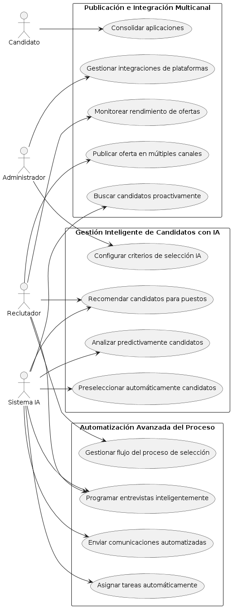
    
    Este diagrama PlantUML muestra los casos de uso principales organizados en tres subsistemas correspondientes a las funcionalidades clave del ATS. Los casos de uso están listados en orden de importancia dentro de cada subsistema, con los más críticos y de mayor valor en la parte superior.
    
    Explicación de la priorización:
    
    1. Publicación e Integración Multicanal:
        - "Publicar oferta en múltiples canales" es la funcionalidad más crítica.
        - "Consolidar aplicaciones" es esencial para centralizar la información.
        - "Buscar candidatos proactivamente" añade valor significativo al proceso de reclutamiento.
        - "Monitorear rendimiento de ofertas" proporciona insights valiosos.
        - "Gestionar integraciones de plataformas" es importante pero menos crítico para el uso diario.
    2. Gestión Inteligente de Candidatos con IA:
        - "Analizar predictivamente candidatos" es la funcionalidad clave de IA.
        - "Recomendar candidatos para puestos" ofrece un valor directo a los reclutadores.
        - "Preseleccionar automáticamente candidatos" ahorra tiempo significativo.
        - "Configurar criterios de selección IA" es importante pero menos frecuente.
    3. Automatización Avanzada del Proceso:
        - "Programar entrevistas inteligentemente" optimiza un proceso crucial y ahorra tiempo.
        - "Enviar comunicaciones automatizadas" mejora la eficiencia y la experiencia del candidato.
        - "Asignar tareas automáticamente" agiliza el flujo de trabajo del equipo.
        - "Gestionar flujo del proceso de selección" proporciona control y visibilidad general.
    
    Esta priorización se basa en el impacto potencial de cada caso de uso en la eficiencia del proceso de reclutamiento, la experiencia del usuario y el valor añadido para la empresa.
    

- **ChatGPT 4o**
    
    Claro, aquí tienes los casos de uso principales extraídos y organizados por su importancia en un diagrama PlantUML:
    
    ```
    @startuml
    actor Reclutador
    actor Candidato
    
    rectangle "Publicación e Integración Multicanal" {
      usecase "Publicación Automática de Ofertas" as U1
      usecase "Búsqueda Proactiva de Candidatos" as U2
      usecase "Consolidación de Aplicaciones" as U3
      usecase "Gestión y Seguimiento de Aplicaciones" as U4
      usecase "Reportes y Análisis de Efectividad" as U5
    }
    
    rectangle "Gestión Inteligente de Candidatos con IA" {
      usecase "Análisis Predictivo de Candidatos" as U6
      usecase "Recomendaciones Personalizadas de Candidatos" as U7
      usecase "Preselección Automatizada" as U8
    }
    
    rectangle "Automatización Avanzada del Proceso de Selección" {
      usecase "Programación Inteligente de Entrevistas" as U9
      usecase "Envío Automatizado de Comunicaciones" as U10
      usecase "Asignación Automática de Tareas" as U11
    }
    
    Reclutador --> U1
    Reclutador --> U2
    Reclutador --> U3
    Reclutador --> U4
    Reclutador --> U5
    Reclutador --> U6
    Reclutador --> U7
    Reclutador --> U8
    Reclutador --> U9
    Reclutador --> U10
    Reclutador --> U11
    
    Candidato --> U4
    Candidato --> U9
    Candidato --> U10
    
    @enduml
    ```
    
    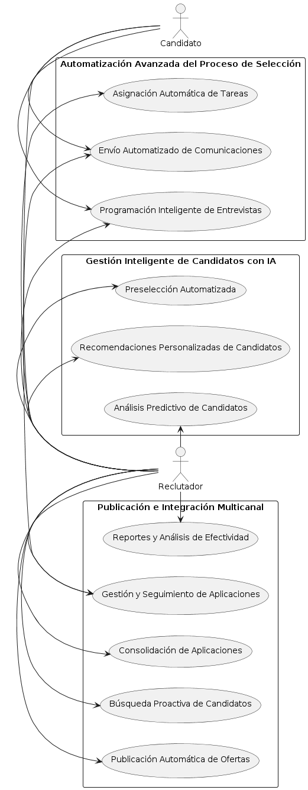
    
    ### Casos de Uso Principales
    
    ### Publicación e Integración Multicanal
    
    1. **Publicación Automática de Ofertas**: Permitir a los reclutadores crear y publicar ofertas de trabajo automáticamente en múltiples plataformas de empleo y redes sociales de manera simultánea.
    2. **Búsqueda Proactiva de Candidatos**: Utilizar algoritmos de inteligencia artificial para buscar y recomendar candidatos adecuados en diversas plataformas profesionales y redes sociales.
    3. **Consolidación de Aplicaciones**: Agrupar todas las aplicaciones recibidas desde diferentes plataformas en un único sistema centralizado para facilitar la gestión.
    4. **Gestión y Seguimiento de Aplicaciones**: Facilitar el seguimiento y la gestión de las aplicaciones recibidas, incluyendo la comunicación con los candidatos y la programación de entrevistas.
    5. **Reportes y Análisis de Efectividad**: Generar informes y análisis sobre la efectividad de la publicación y la integración multicanal para optimizar futuras estrategias de reclutamiento.
    
    ### Gestión Inteligente de Candidatos con IA
    
    1. **Análisis Predictivo de Candidatos**: Implementar algoritmos de IA para analizar y predecir qué candidatos son los más prometedores para una posición específica.
    2. **Recomendaciones Personalizadas de Candidatos**: Proporcionar recomendaciones personalizadas de candidatos para cada puesto basadas en criterios predefinidos y el análisis de IA.
    3. **Preselección Automatizada**: Automatizar la preselección de candidatos basándose en criterios definidos previamente para reducir el tiempo y mejorar la calidad de los candidatos seleccionados.
    
    ### Automatización Avanzada del Proceso de Selección
    
    1. **Programación Inteligente de Entrevistas**: Automatizar la programación de entrevistas basada en la disponibilidad de los candidatos y los entrevistadores.
    2. **Envío Automatizado de Comunicaciones**: Enviar comunicaciones personalizadas y automatizadas a los candidatos en cada etapa del proceso de selección.
    3. **Asignación Automática de Tareas**: Asignar automáticamente tareas a los miembros del equipo de reclutamiento para aumentar la eficiencia del proceso.
    
    ### Actores Principales
    
    - **Reclutador**: Usuario principal del ATS que gestiona las ofertas de trabajo y el proceso de selección de candidatos.
    - **Candidato**: Persona que aplica a las ofertas de trabajo y participa en el proceso de selección.
    
    ---
    
    ```
    Puedes modificar el diagrama PlantUML para que las relaciones sean de izquierda a derecha en vez de arriba a abajo?
    
    ```
    
    Claro, aquí tienes el diagrama PlantUML modificado para que las relaciones sean de izquierda a derecha:
    
    ```
    @startuml
    left to right direction
    
    actor Reclutador
    actor Candidato
    
    rectangle "Publicación e Integración Multicanal" {
      usecase "Publicación Automática de Ofertas" as U1
      usecase "Búsqueda Proactiva de Candidatos" as U2
      usecase "Consolidación de Aplicaciones" as U3
      usecase "Gestión y Seguimiento de Aplicaciones" as U4
      usecase "Reportes y Análisis de Efectividad" as U5
    }
    
    rectangle "Gestión Inteligente de Candidatos con IA" {
      usecase "Análisis Predictivo de Candidatos" as U6
      usecase "Recomendaciones Personalizadas de Candidatos" as U7
      usecase "Preselección Automatizada" as U8
    }
    
    rectangle "Automatización Avanzada del Proceso de Selección" {
      usecase "Programación Inteligente de Entrevistas" as U9
      usecase "Envío Automatizado de Comunicaciones" as U10
      usecase "Asignación Automática de Tareas" as U11
    }
    
    Reclutador -left-> U1
    Reclutador -left-> U2
    Reclutador -left-> U3
    Reclutador -left-> U4
    Reclutador -left-> U5
    Reclutador -left-> U6
    Reclutador -left-> U7
    Reclutador -left-> U8
    Reclutador -left-> U9
    Reclutador -left-> U10
    Reclutador -left-> U11
    
    Candidato -left-> U4
    Candidato -left-> U9
    Candidato -left-> U10
    
    @enduml
    
    ```
    
    Este diagrama PlantUML muestra las relaciones de izquierda a derecha, con los actores a la izquierda y los casos de uso organizados en los tres sistemas a la derecha.
    

# 3️⃣ Modelado de datos

## Prompt 6: Modelo de datos

```
Ahora eres un Arquitecto de Software, por lo que eres capaz de crear modelos de datos claros para cumplir con los Casos de Uso que se te plantean. 
A partir del diagrama de CU adjunto, en formato PlantUML, puedes generar un modelo de datos que permita cumplir con todos los CU?
En este diagrama solo deben aparecer las entidades y sus principales campos, además de las relaciones entre éstas entidades.
El formato de salida será PlantUML.

(seleccionado diagrama del Prompt 5 de Claude 3.5)
```

### Respuestas (texto)

- **Claude 3.5**
    
    Ciertamente. Basándome en los casos de uso proporcionados, he creado un modelo de datos que permitirá cumplir con todos los casos de uso mencionados. Aquí tienes el diagrama en formato PlantUML:
    
    ```
    @startuml ATS - Modelo de Datos
    
    !define TABLE_BORDER_COLOR #073B4C
    !define TABLE_HEADER_COLOR #118AB2
    !define TABLE_ROW_COLOR #EFF2F1
    
    skinparam class {
        BackgroundColor TABLE_ROW_COLOR
        BorderColor TABLE_BORDER_COLOR
        HeaderBackgroundColor TABLE_HEADER_COLOR
    }
    
    entity "OfertaTrabajo" as OT {
        * id : UUID
        --
        titulo : String
        descripcion : Text
        requisitos : Text
        fecha_publicacion : Date
        fecha_cierre : Date
        estado : Enum
    }
    
    entity "Candidato" as C {
        * id : UUID
        --
        nombre : String
        email : String
        cv : Text
        habilidades : Text[]
        puntuacion_ia : Float
    }
    
    entity "Aplicacion" as A {
        * id : UUID
        --
        fecha_aplicacion : Date
        estado : Enum
        notas : Text
    }
    
    entity "PlataformaPublicacion" as PP {
        * id : UUID
        --
        nombre : String
        tipo : Enum
        credenciales : JSON
    }
    
    entity "PublicacionOferta" as PO {
        * id : UUID
        --
        fecha_publicacion : Date
        estado : Enum
        metricas : JSON
    }
    
    entity "Entrevista" as E {
        * id : UUID
        --
        fecha : DateTime
        tipo : Enum
        notas : Text
    }
    
    entity "Tarea" as T {
        * id : UUID
        --
        descripcion : Text
        fecha_vencimiento : Date
        estado : Enum
    }
    
    entity "Usuario" as U {
        * id : UUID
        --
        nombre : String
        email : String
        rol : Enum
    }
    
    entity "CriteriosSeleccionIA" as CS {
        * id : UUID
        --
        nombre : String
        parametros : JSON
    }
    
    OT ||--o{ PO
    OT ||--o{ A
    OT ||--o{ T
    
    C ||--o{ A
    C ||--o{ E
    
    PP ||--o{ PO
    
    A ||--o{ E
    A ||--o{ T
    
    U ||--o{ T
    U ||--o{ E
    
    CS ||--o{ OT
    
    @enduml
    
    ```
    
    Este modelo de datos incluye las siguientes entidades principales y sus relaciones:
    
    1. OfertaTrabajo: Representa una oferta de trabajo, con campos para título, descripción, requisitos, fechas y estado.
    2. Candidato: Almacena información sobre los candidatos, incluyendo su CV, habilidades y una puntuación generada por IA.
    3. Aplicacion: Representa la aplicación de un candidato a una oferta de trabajo específica.
    4. PlataformaPublicacion: Contiene información sobre las diferentes plataformas donde se pueden publicar ofertas.
    5. PublicacionOferta: Representa la publicación de una oferta en una plataforma específica, incluyendo métricas de rendimiento.
    6. Entrevista: Almacena información sobre las entrevistas programadas.
    7. Tarea: Representa las tareas asignadas a los usuarios del sistema durante el proceso de selección.
    8. Usuario: Almacena información sobre los usuarios del sistema (reclutadores, administradores, etc.).
    9. CriteriosSeleccionIA: Contiene los criterios configurados para la selección automática de candidatos por IA.
    
    Este modelo de datos permite:
    
    - Publicar ofertas en múltiples canales (OT -> PO -> PP)
    - Consolidar aplicaciones de diferentes fuentes (A -> OT)
    - Buscar y analizar candidatos (C, CS)
    - Monitorear el rendimiento de las ofertas (PO)
    - Gestionar el proceso de selección (E, T)
    - Automatizar comunicaciones y asignación de tareas (T, U)
    
    El modelo es flexible y puede ser expandido según sea necesario para cubrir más detalles específicos de cada caso de uso.
    

- **ChatGPT 4o**  🔝 (Tiene más detalles que Claude, aunque ha metido roles como entidades)
    
    Claro, a partir del diagrama de casos de uso, aquí tienes el modelo de datos en formato PlantUML para cumplir con los casos de uso:
    
    ```
    @startuml ATS - Modelo de Datos
    
    entity "Reclutador" {
      * id: UUID
      * nombre: String
      * email: String
      * telefono: String
    }
    
    entity "Candidato" {
      * id: UUID
      * nombre: String
      * email: String
      * telefono: String
      * perfilLinkedIn: String
      * perfilGitHub: String
    }
    
    entity "Oferta" {
      * id: UUID
      * titulo: String
      * descripcion: Text
      * fechaPublicacion: Date
      * estado: String
    }
    
    entity "Aplicacion" {
      * id: UUID
      * fecha: Date
      * estado: String
    }
    
    entity "Canal" {
      * id: UUID
      * nombre: String
      * tipo: String
    }
    
    entity "IntegracionPlataforma" {
      * id: UUID
      * plataforma: String
      * estado: String
    }
    
    entity "CriterioIA" {
      * id: UUID
      * nombre: String
      * descripcion: Text
    }
    
    entity "Entrevista" {
      * id: UUID
      * fecha: Date
      * hora: Time
      * modo: String
      * estado: String
    }
    
    entity "Tarea" {
      * id: UUID
      * descripcion: Text
      * asignadoA: String
      * estado: String
    }
    
    entity "ReporteRendimiento" {
      * id: UUID
      * ofertaId: UUID
      * numAplicaciones: Int
      * numSeleccionados: Int
      * numContratados: Int
    }
    
    Reclutador "1" -- "0..*" Oferta : publica >
    Reclutador "1" -- "0..*" Tarea : asigna >
    Oferta "1" -- "0..*" Aplicacion : recibe >
    Oferta "1" -- "0..*" Canal : publica_en >
    Oferta "1" -- "0..*" ReporteRendimiento : tiene >
    Candidato "1" -- "0..*" Aplicacion : aplica >
    Candidato "1" -- "0..*" Entrevista : tiene >
    Aplicacion "1" -- "0..*" Entrevista : resulta_en >
    Aplicacion "1" -- "0..*" Tarea : genera >
    Canal "1" -- "0..*" IntegracionPlataforma : tiene >
    IntegracionPlataforma "0..*" -- "1" Administrador : gestiona >
    CriterioIA "1" -- "0..*" Aplicacion : aplica_a >
    SistemaIA "0..*" -- "1" CriterioIA : configura >
    
    @enduml
    
    ```
    
    ### Explicación del Modelo de Datos
    
    ### Entidades y Campos
    
    - **Reclutador**: Representa al usuario reclutador con sus datos de contacto.
    - **Candidato**: Representa al candidato con sus datos personales y perfiles en plataformas profesionales.
    - **Oferta**: Contiene información sobre las ofertas de trabajo publicadas.
    - **Aplicacion**: Representa una aplicación a una oferta de trabajo hecha por un candidato.
    - **Canal**: Define los distintos canales de publicación (e.g., LinkedIn, GitHub).
    - **IntegracionPlataforma**: Representa las integraciones con distintas plataformas de empleo.
    - **CriterioIA**: Define los criterios utilizados por la IA para la preselección y análisis de candidatos.
    - **Entrevista**: Detalles de las entrevistas programadas con los candidatos.
    - **Tarea**: Representa las tareas asignadas a los miembros del equipo de reclutamiento.
    - **ReporteRendimiento**: Contiene los datos de rendimiento de las ofertas publicadas.
    
    ### Relaciones entre Entidades
    
    - Un **Reclutador** puede publicar múltiples **Ofertas** y asignar múltiples **Tareas**.
    - Una **Oferta** puede recibir múltiples **Aplicaciones** y publicarse en múltiples **Canales**.
    - Una **Oferta** tiene múltiples **Reportes de Rendimiento**.
    - Un **Candidato** puede realizar múltiples **Aplicaciones** y tener múltiples **Entrevistas**.
    - Una **Aplicacion** puede resultar en múltiples **Entrevistas** y generar múltiples **Tareas**.
    - Un **Canal** puede tener múltiples **Integraciones de Plataforma**.
    - Un **Administrador** gestiona múltiples **Integraciones de Plataforma**.
    - Un **CriterioIA** se aplica a múltiples **Aplicaciones**.
    - El **SistemaIA** configura múltiples **CriteriosIA**.
    
    Este modelo de datos asegura que todos los casos de uso descritos en el diagrama están soportados y estructurados adecuadamente.
    

### Respuestas (diagrama/imagen)

- **Claude 3.5**
    
    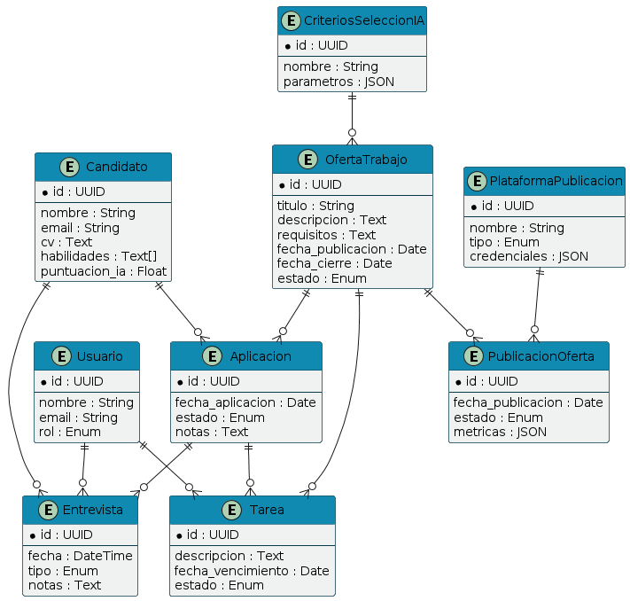
    

- **ChatGPT 4o** 🔝 (Tiene más detalles que Claude, aunque ha metido roles como entidades)
    
    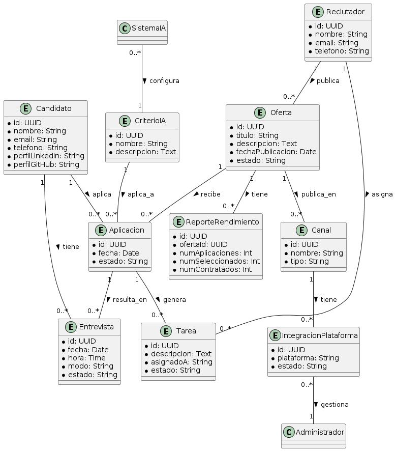
    

- **DiagramGPT** (no ofrece descripción, solo diagrama. Contempla bastantes cosas, pero el formato no es as-code)
    
    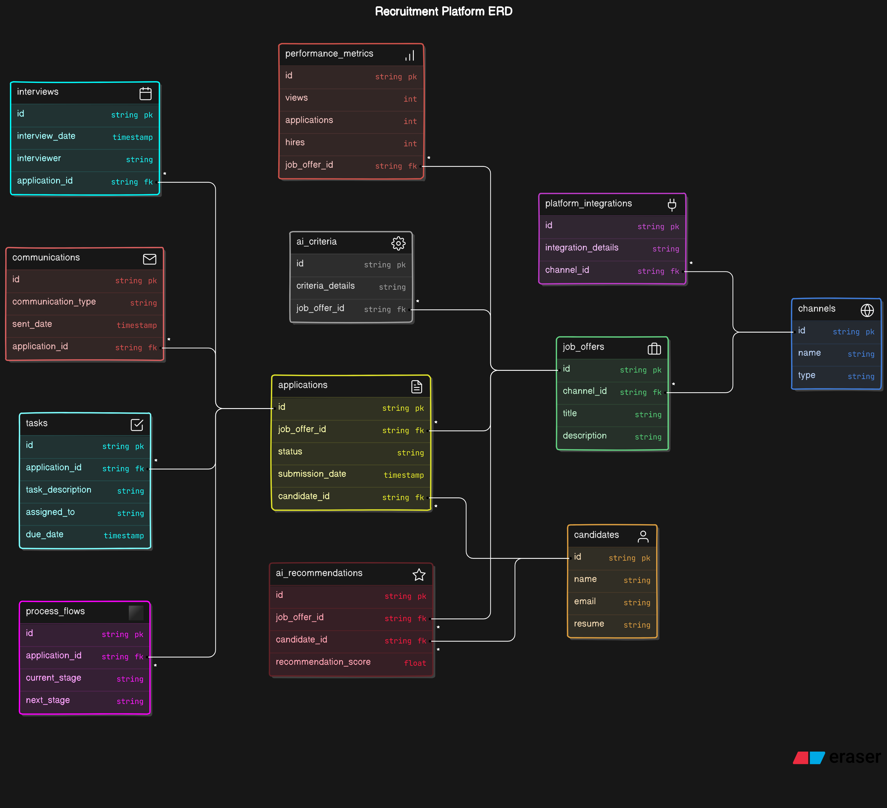
    

# 4️⃣ Diseño de alto nivel (arquitectura)

## Prompt 7: Pregunta por requisitos para diseñar sistema

```
Ahora eres un Ingeniero de Software, experto en diseñar sistemas de software. A partir de los Casos de uso debes diseñar una arquitectura que los soporte. 

¿Qué requisitos necesitas aclarar primero?
```

### Respuestas

…

## Prompt 8: Respuesta a los requisitos

```
En este sistema se espera un volumen muy bajo en cuanto a backoffice: 5 reclutadores.
En cuanto a usuarios o candidatos se espera unos 50.000 usuarios registrados por ahora.
El volumen de ofertas a publicar será de 10 a la semana. 
No se espera picos.
Se integrará con varias plataformas como LinkedIn a través de sus API pero nosotros no ofreceremos ninguna API expuesta.
Debemos cumplir con la regulacíon GDPR de privacidad de datos.
Todos los accesos seran autenticados y autorizados, puesto que trabajamos con datos personales.
Una vez la aplicación sea cerrada, se podrá archivar su información, siendo procesada primero para su tratamiento en BI.
La internacionalización debe estar contemplada desde un principio.
```

### Respuestas (texto)

- **Claude 3.5**
    
    Entendido. Basándome en esta información, puedo proponer una arquitectura que se ajuste a estos requisitos. Aquí está un diseño de alto nivel para el sistema ATS:
    
    ```
    @startuml
    !define RECTANGLE class
    
    skinparam componentStyle uml2
    skinparam component {
      FontColor #000000
      BackgroundColor #EEEBDC
      BorderColor #999999
      ArrowColor #999999
    }
    
    cloud "Plataformas Externas" {
      [LinkedIn API]
      [Otras APIs de Empleo]
    }
    
    RECTANGLE "Frontend" {
      [Aplicación Web SPA]
      [Aplicación Móvil]
    }
    
    RECTANGLE "Backend" {
      [API Gateway]
      [Servicio de Autenticación]
      [Servicio de Gestión de Ofertas]
      [Servicio de Gestión de Candidatos]
      [Servicio de IA]
      [Servicio de Integración]
      [Servicio de Reportes]
    }
    
    database "Base de Datos" {
      [PostgreSQL]
    }
    
    database "Almacenamiento de Objetos" {
      [MinIO]
    }
    
    [Servicio de Caché] as Cache
    
    [Servicio de Cola de Mensajes] as Queue
    
    [Servicio de Logging y Monitoreo] as Logging
    
    Frontend -down-> [API Gateway] : HTTPS
    
    [API Gateway] -down-> [Servicio de Autenticación]
    [API Gateway] -down-> [Servicio de Gestión de Ofertas]
    [API Gateway] -down-> [Servicio de Gestión de Candidatos]
    [API Gateway] -down-> [Servicio de IA]
    [API Gateway] -down-> [Servicio de Integración]
    [API Gateway] -down-> [Servicio de Reportes]
    
    [Servicio de Gestión de Ofertas] --> PostgreSQL
    [Servicio de Gestión de Candidatos] --> PostgreSQL
    [Servicio de IA] --> PostgreSQL
    [Servicio de Integración] --> PostgreSQL
    [Servicio de Reportes] --> PostgreSQL
    
    [Servicio de Gestión de Ofertas] --> MinIO
    [Servicio de Gestión de Candidatos] --> MinIO
    
    [Servicio de Integración] -up-> [LinkedIn API] : HTTPS
    [Servicio de Integración] -up-> [Otras APIs de Empleo] : HTTPS
    
    Backend -right-> Cache
    Backend -right-> Queue
    Backend -right-> Logging
    
    @enduml
    ```
    
    Explicación de la arquitectura propuesta:
    
    1. Frontend:
        - Aplicación Web SPA (Single Page Application): Utilizando frameworks como React o Vue.js para una experiencia de usuario fluida.
        - Aplicación Móvil: Para acceso desde dispositivos móviles, posiblemente usando tecnologías híbridas como React Native.
    2. Backend:
        - API Gateway: Punto de entrada único para todas las solicitudes, maneja la autenticación y el enrutamiento.
        - Microservicios:
            - Servicio de Autenticación: Gestiona la autenticación y autorización de usuarios.
            - Servicio de Gestión de Ofertas: Maneja la creación y gestión de ofertas de trabajo.
            - Servicio de Gestión de Candidatos: Gestiona los perfiles y aplicaciones de los candidatos.
            - Servicio de IA: Realiza análisis predictivo y preselección de candidatos.
            - Servicio de Integración: Maneja la comunicación con plataformas externas como LinkedIn.
            - Servicio de Reportes: Genera informes y análisis para los reclutadores.
    3. Base de Datos:
        - PostgreSQL: Base de datos relacional para almacenar la mayoría de los datos estructurados.
        - MinIO: Almacenamiento de objetos para archivos grandes como CVs y documentos.
    4. Servicios Auxiliares:
        - Servicio de Caché: Para mejorar el rendimiento y reducir la carga en la base de datos.
        - Servicio de Cola de Mensajes: Para manejar tareas asíncronas y garantizar la escalabilidad.
        - Servicio de Logging y Monitoreo: Para seguimiento de errores y monitoreo del rendimiento.
    5. Seguridad:
        - Toda la comunicación se realiza a través de HTTPS.
        - Autenticación y autorización centralizadas.
        - Cifrado de datos en reposo y en tránsito para cumplir con GDPR.
    6. Escalabilidad:
        - La arquitectura de microservicios permite escalar componentes individuales según sea necesario.
        - El uso de caché y colas de mensajes ayuda a manejar cargas variables.
    7. Internacionalización:
        - Implementada a nivel de frontend y backend para soportar múltiples idiomas y regiones.
    8. Integración y Extensibilidad:
        - El Servicio de Integración permite conectar fácilmente con APIs externas.
        - La arquitectura modular facilita futuras extensiones y personalizaciones.
    
    Esta arquitectura proporciona una base sólida para manejar el volumen esperado de usuarios y ofertas, cumpliendo con los requisitos de seguridad y privacidad, y permitiendo futuras expansiones y personalizaciones.
    

- **ChatGPT 4o**
    
    Gracias por la información adicional. Con estos detalles, puedo diseñar una arquitectura que soporte adecuadamente los casos de uso planteados. Aquí te presento una arquitectura de software que aborden estos requisitos:
    
    ### Arquitectura de Software
    
    ```
    @startuml
    package "Frontend" {
      [React.js] --> [i18next]
    }
    
    package "Backend" {
      [Node.js] --> [Express]
    
      package "Servicios" {
        [Servicio de Publicación]
        [Servicio de Integración]
        [Servicio de Gestión de Candidatos]
        [Servicio de Automatización]
      }
    }
    
    package "Datos" {
      [PostgreSQL]
      [Amazon S3]
      [Amazon Redshift]
    }
    
    package "Integración" {
      [API Gateway]
      [Microservicios de Integración]
    }
    
    package "Seguridad" {
      [OAuth 2.0]
      [OpenID Connect]
      [ELK Stack]
    }
    
    package "Infraestructura" {
      [Kubernetes]
      [Jenkins]
      [Prometheus]
      [Grafana]
    }
    
    [React.js] --> [Node.js]
    [Node.js] --> [PostgreSQL]
    [Node.js] --> [Amazon S3]
    [Node.js] --> [Amazon Redshift]
    [Node.js] --> [API Gateway]
    [Node.js] --> [OAuth 2.0]
    [Node.js] --> [OpenID Connect]
    [Node.js] --> [ELK Stack]
    
    @enduml
    ```
    
    ### 1. **Capa de Presentación**
    
    - **Frontend**: React.js para una interfaz de usuario intuitiva y receptiva.
    - **Internacionalización**: Uso de i18next para soporte multilingüe desde el principio.
    - **Autenticación y Autorización**: Utilización de OAuth 2.0 con OpenID Connect para manejar autenticación y autorización.
    
    ### 2. **Capa de Aplicación**
    
    - **Backend**: Node.js con Express para manejar las solicitudes HTTP y coordinar las operaciones.
    - **Servicios**:
        - **Servicio de Publicación**: Maneja la publicación automática de ofertas en múltiples plataformas.
        - **Servicio de Integración**: Interactúa con APIs de plataformas como LinkedIn y GitHub.
        - **Servicio de Gestión de Candidatos**: Implementa lógica de IA para análisis predictivo y recomendaciones.
        - **Servicio de Automatización**: Gestiona la programación de entrevistas y envíos automatizados de comunicaciones.
    
    ### 3. **Capa de Datos**
    
    - **Base de Datos**: PostgreSQL para almacenamiento relacional y soporte de transacciones. Se asegurará el cifrado de datos en reposo y en tránsito.
    - **Almacenamiento de Archivos**: Amazon S3 para almacenar documentos y archivos relacionados con las aplicaciones.
    - **Data Warehouse**: Amazon Redshift para procesamiento y análisis de datos en BI.
    
    ### 4. **Capa de Integración**
    
    - **API Gateway**: AWS API Gateway para gestionar y monitorizar las llamadas a APIs externas.
    - **Servicios de Integración**: Microservicios que se comunican con APIs de terceros para publicar ofertas y buscar candidatos.
    
    ### 5. **Capa de Seguridad**
    
    - **Autenticación y Autorización**: Implementación de OAuth 2.0 con soporte de OpenID Connect.
    - **Cifrado**: Uso de HTTPS para todas las comunicaciones y cifrado de datos sensibles en la base de datos.
    - **Auditoría y Monitoreo**: Implementación de logging detallado con ELK Stack (Elasticsearch, Logstash, Kibana) para auditorías y monitoreo.
    
    ### 6. **Capa de Infraestructura**
    
    - **Despliegue**: Kubernetes para orquestación de contenedores y despliegue de microservicios.
    - **CI/CD**: Jenkins para integración continua y despliegue continuo.
    - **Monitoreo**: Prometheus y Grafana para monitoreo y visualización de métricas de sistema.
    
    ### 7. **Requisitos Adicionales**
    
    - **Cumplimiento de GDPR**: Implementación de procesos y herramientas para manejar solicitudes de acceso y borrado de datos de usuarios, así como para asegurar el consentimiento explícito para el procesamiento de datos personales.
    - **Archivado de Datos**: Automatización del archivado de aplicaciones cerradas y su procesamiento para BI.
    
    Este diseño de arquitectura asegura que se cumplan los requisitos funcionales y no funcionales, así como los de seguridad y cumplimiento con GDPR. Además, permite la escalabilidad y mantenibilidad del sistema a largo plazo.
    

### Respuestas (diagramas)

- **ChatGPT 4o**
    
    
    
- **Claude 3.5**
    
    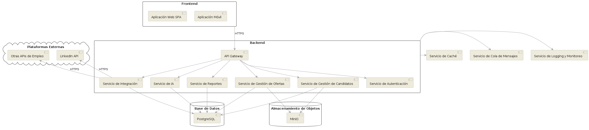
    

## Prompt 9: Mejorar diagrama usando librerías de PlantUML

```
Puedes añadir al diagrama de componentes alguna librería de PlantUML para añadir iconos y hacerlo más bonito?
```

### Respuestas (diagramas)

- **Claude 3.5**
    
    ```
    @startuml
    !include https://raw.githubusercontent.com/plantuml-stdlib/C4-PlantUML/master/C4_Container.puml
    
    !define DEVICONS https://raw.githubusercontent.com/tupadr3/plantuml-icon-font-sprites/master/devicons
    !define FONTAWESOME https://raw.githubusercontent.com/tupadr3/plantuml-icon-font-sprites/master/font-awesome-5
    !include DEVICONS/react.puml
    !include DEVICONS/postgresql.puml
    !include DEVICONS/nginx.puml
    !include FONTAWESOME/users.puml
    !include FONTAWESOME/server.puml
    
    LAYOUT_WITH_LEGEND()
    
    Person(reclutador, "Reclutador", "Usuario del sistema ATS")
    Person(candidato, "Candidato", "Aplica a ofertas de trabajo")
    
    System_Boundary(ats, "Sistema ATS") {
        Container(spa, "Aplicación Web SPA", "React", "Interfaz de usuario principal", $sprite="react")
        Container(mobile_app, "Aplicación Móvil", "React Native", "Acceso móvil al sistema")
        
        Container(api_gateway, "API Gateway", "Nginx", "Punto de entrada y enrutamiento", $sprite="nginx")
        
        Container(auth_service, "Servicio de Autenticación", "Node.js", "Gestiona autenticación y autorización")
        Container(job_service, "Servicio de Gestión de Ofertas", "Node.js", "Maneja ofertas de trabajo")
        Container(candidate_service, "Servicio de Gestión de Candidatos", "Node.js", "Gestiona perfiles y aplicaciones")
        Container(ai_service, "Servicio de IA", "Python", "Análisis predictivo y preselección")
        Container(integration_service, "Servicio de Integración", "Node.js", "Comunicación con APIs externas")
        Container(report_service, "Servicio de Reportes", "Node.js", "Genera informes y análisis")
        
        ContainerDb(db, "Base de Datos", "PostgreSQL", "Almacena datos estructurados", $sprite="postgresql")
        ContainerDb(object_storage, "Almacenamiento de Objetos", "MinIO", "Almacena CVs y documentos")
        
        Container(cache, "Servicio de Caché", "Redis", "Mejora el rendimiento")
        Container(queue, "Cola de Mensajes", "RabbitMQ", "Maneja tareas asíncronas")
        Container(logging, "Logging y Monitoreo", "ELK Stack", "Seguimiento de errores y rendimiento")
    }
    
    System_Ext(linkedin, "LinkedIn API", "API externa para publicación de ofertas")
    System_Ext(job_boards, "Otras plataformas de empleo", "APIs externas adicionales")
    
    Rel(reclutador, spa, "Usa", "HTTPS")
    Rel(reclutador, mobile_app, "Usa", "HTTPS")
    Rel(candidato, spa, "Usa", "HTTPS")
    Rel(candidato, mobile_app, "Usa", "HTTPS")
    
    Rel(spa, api_gateway, "API calls", "JSON/HTTPS")
    Rel(mobile_app, api_gateway, "API calls", "JSON/HTTPS")
    
    Rel(api_gateway, auth_service, "Autentica y autoriza")
    Rel(api_gateway, job_service, "Gestiona ofertas")
    Rel(api_gateway, candidate_service, "Gestiona candidatos")
    Rel(api_gateway, ai_service, "Análisis y predicciones")
    Rel(api_gateway, integration_service, "Integra con plataformas externas")
    Rel(api_gateway, report_service, "Genera reportes")
    
    Rel(job_service, db, "Lee y escribe")
    Rel(candidate_service, db, "Lee y escribe")
    Rel(ai_service, db, "Lee")
    Rel(integration_service, db, "Lee y escribe")
    Rel(report_service, db, "Lee")
    
    Rel(job_service, object_storage, "Almacena documentos")
    Rel(candidate_service, object_storage, "Almacena CVs")
    
    Rel(integration_service, linkedin, "Publica ofertas", "HTTPS")
    Rel(integration_service, job_boards, "Publica ofertas", "HTTPS")
    
    Rel_U(job_service, cache, "Utiliza")
    Rel_U(candidate_service, cache, "Utiliza")
    Rel_U(ai_service, cache, "Utiliza")
    
    Rel_U(job_service, queue, "Publica y consume")
    Rel_U(candidate_service, queue, "Publica y consume")
    Rel_U(ai_service, queue, "Consume")
    
    Rel(ats, logging, "Envía logs y métricas")
    
    @enduml
    ```
    
    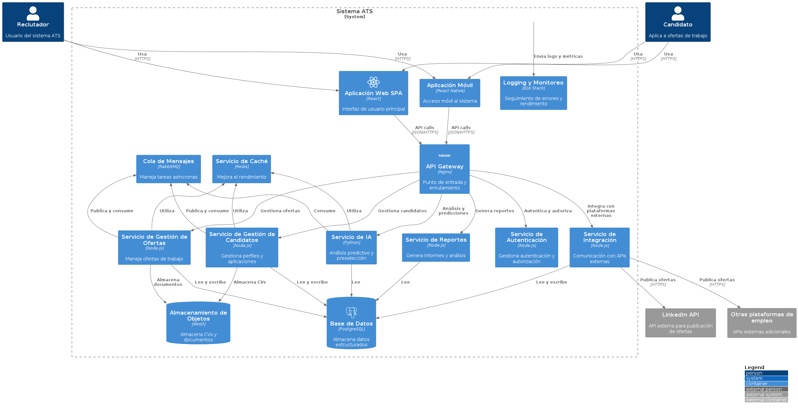
    

```
Puedes modificar el diagrama haciendo que la aplicación que usen los candidatos y la aplicación web de los reclutadores sean distintas? Cada una debe acceder a los servicios que necesite y tener su front y backend.
Los usuarios del sistema deben estar representados en este diagrama C4
```

- **Claude 3.5**
    
    Ciertamente. He modificado el diagrama para separar las aplicaciones de candidatos y reclutadores, cada una con su propio frontend y backend. También he incluido la representación de los usuarios del sistema. Aquí tienes el diagrama actualizado:
    
    ```
    @startuml
    !include <https://raw.githubusercontent.com/plantuml-stdlib/C4-PlantUML/master/C4_Container.puml>
    
    !define DEVICONS <https://raw.githubusercontent.com/tupadr3/plantuml-icon-font-sprites/master/devicons>
    !define FONTAWESOME <https://raw.githubusercontent.com/tupadr3/plantuml-icon-font-sprites/master/font-awesome-5>
    !include DEVICONS/react.puml
    !include DEVICONS/postgresql.puml
    !include DEVICONS/nginx.puml
    !include FONTAWESOME/users.puml
    !include FONTAWESOME/server.puml
    
    LAYOUT_WITH_LEGEND()
    
    Person(reclutador, "Reclutador", "Usuario del sistema ATS")
    Person(candidato, "Candidato", "Aplica a ofertas de trabajo")
    Person(admin, "Administrador", "Gestiona el sistema ATS")
    
    System_Boundary(ats, "Sistema ATS") {
        Container(recruiter_spa, "Aplicación Web Reclutadores", "React", "Interfaz para reclutadores", $sprite="react")
        Container(recruiter_mobile, "App Móvil Reclutadores", "React Native", "Acceso móvil para reclutadores")
    
        Container(candidate_spa, "Aplicación Web Candidatos", "React", "Portal para candidatos", $sprite="react")
        Container(candidate_mobile, "App Móvil Candidatos", "React Native", "Acceso móvil para candidatos")
    
        Container(recruiter_api, "API Reclutadores", "Node.js", "Backend para reclutadores")
        Container(candidate_api, "API Candidatos", "Node.js", "Backend para candidatos")
    
        Container(auth_service, "Servicio de Autenticación", "Node.js", "Gestiona autenticación y autorización")
        Container(job_service, "Servicio de Gestión de Ofertas", "Node.js", "Maneja ofertas de trabajo")
        Container(candidate_service, "Servicio de Gestión de Candidatos", "Node.js", "Gestiona perfiles y aplicaciones")
        Container(ai_service, "Servicio de IA", "Python", "Análisis predictivo y preselección")
        Container(integration_service, "Servicio de Integración", "Node.js", "Comunicación con APIs externas")
        Container(report_service, "Servicio de Reportes", "Node.js", "Genera informes y análisis")
    
        ContainerDb(db, "Base de Datos", "PostgreSQL", "Almacena datos estructurados", $sprite="postgresql")
        ContainerDb(object_storage, "Almacenamiento de Objetos", "MinIO", "Almacena CVs y documentos")
    
        Container(cache, "Servicio de Caché", "Redis", "Mejora el rendimiento")
        Container(queue, "Cola de Mensajes", "RabbitMQ", "Maneja tareas asíncronas")
        Container(logging, "Logging y Monitoreo", "ELK Stack", "Seguimiento de errores y rendimiento")
    }
    
    System_Ext(linkedin, "LinkedIn API", "API externa para publicación de ofertas")
    System_Ext(job_boards, "Otras plataformas de empleo", "APIs externas adicionales")
    
    Rel(reclutador, recruiter_spa, "Usa", "HTTPS")
    Rel(reclutador, recruiter_mobile, "Usa", "HTTPS")
    Rel(candidato, candidate_spa, "Usa", "HTTPS")
    Rel(candidato, candidate_mobile, "Usa", "HTTPS")
    Rel(admin, recruiter_spa, "Administra", "HTTPS")
    
    Rel(recruiter_spa, recruiter_api, "API calls", "JSON/HTTPS")
    Rel(recruiter_mobile, recruiter_api, "API calls", "JSON/HTTPS")
    Rel(candidate_spa, candidate_api, "API calls", "JSON/HTTPS")
    Rel(candidate_mobile, candidate_api, "API calls", "JSON/HTTPS")
    
    Rel(recruiter_api, auth_service, "Autentica")
    Rel(recruiter_api, job_service, "Gestiona ofertas")
    Rel(recruiter_api, candidate_service, "Gestiona candidatos")
    Rel(recruiter_api, ai_service, "Análisis y predicciones")
    Rel(recruiter_api, report_service, "Genera reportes")
    
    Rel(candidate_api, auth_service, "Autentica")
    Rel(candidate_api, job_service, "Consulta ofertas")
    Rel(candidate_api, candidate_service, "Gestiona perfil y aplicaciones")
    
    Rel(integration_service, linkedin, "Publica ofertas", "HTTPS")
    Rel(integration_service, job_boards, "Publica ofertas", "HTTPS")
    
    Rel_R(job_service, db, "Lee y escribe")
    Rel_R(candidate_service, db, "Lee y escribe")
    Rel_R(ai_service, db, "Lee")
    Rel_R(integration_service, db, "Lee y escribe")
    Rel_R(report_service, db, "Lee")
    
    Rel_D(job_service, object_storage, "Almacena documentos")
    Rel_D(candidate_service, object_storage, "Almacena CVs")
    
    Rel_U(job_service, cache, "Utiliza")
    Rel_U(candidate_service, cache, "Utiliza")
    Rel_U(ai_service, cache, "Utiliza")
    
    Rel_U(job_service, queue, "Publica y consume")
    Rel_U(candidate_service, queue, "Publica y consume")
    Rel_U(ai_service, queue, "Consume")
    
    Rel(ats, logging, "Envía logs y métricas")
    
    @enduml
    
    ```
    
    En este diagrama actualizado:
    
    1. Se han separado las aplicaciones para reclutadores y candidatos, cada una con su propio frontend (web y móvil) y backend API.
    2. La aplicación de reclutadores (recruiter_spa y recruiter_mobile) se conecta a recruiter_api, que a su vez interactúa con todos los servicios internos.
    3. La aplicación de candidatos (candidate_spa y candidate_mobile) se conecta a candidate_api, que interactúa principalmente con los servicios de autenticación, gestión de ofertas y gestión de candidatos.
    4. Se ha añadido un usuario administrador que utiliza la aplicación de reclutadores para gestionar el sistema.
    5. Los servicios internos (job_service, candidate_service, etc.) siguen interactuando con la base de datos, almacenamiento de objetos, caché y cola de mensajes como en el diseño anterior.
    6. El servicio de integración sigue manejando las comunicaciones con APIs externas como LinkedIn y otras plataformas de empleo.
    
    Este diseño proporciona una separación clara entre las funcionalidades para reclutadores y candidatos, mejorando la seguridad y la escalabilidad del sistema. Además, permite una mejor gestión de los permisos y accesos a los diferentes servicios según el tipo de usuario.
    

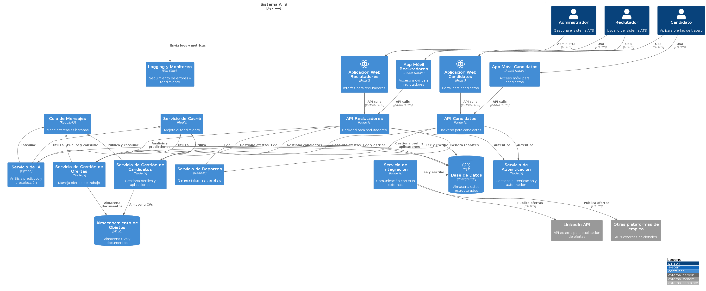

- **ChatGPT 4o** ⚠️ Falla include de librerías y no se corrige aunque se pida
    
    ```
    @startuml
    !define RECTANGLE class
    !define AWS https://raw.githubusercontent.com/tmorin/plantuml-libs/main/icons/aws/aws
    !includeurl AWS/Compute/EKS.puml
    !includeurl AWS/Database/RDS.puml
    !includeurl AWS/Storage/S3.puml
    !includeurl AWS/Analytics/Redshift.puml
    !includeurl AWS/Networking/APIGateway.puml
    !includeurl AWS/DevTools/CodeBuild.puml
    !includeurl AWS/Management/CloudWatch.puml
    !includeurl AWS/Security/CertificateManager.puml
    !includeurl AWS/Security/WAF.puml
    
    !includeurl https://raw.githubusercontent.com/plantuml-stdlib/C4-PlantUML/master/C4_Component.puml
    !includeurl https://raw.githubusercontent.com/plantuml-stdlib/C4-PlantUML/master/C4_Context.puml
    
    AddElementTag("container", $shape=RECTANGLE)
    
    Person(recruiter, "Reclutador")
    Person(candidate, "Candidato")
    
    Boundary(c1, "Frontend") {
        Component(frontend, "React.js", "UI Framework") 
        Component(i18next, "i18next", "Internationalization")
    }
    
    Boundary(c2, "Backend") {
        Component(node, "Node.js", "Runtime") 
        Component(express, "Express", "Web Framework")
        
        Container_Boundary(c3, "Servicios") {
            Component(publicationService, "Servicio de Publicación", "Microservicio")
            Component(integrationService, "Servicio de Integración", "Microservicio")
            Component(candidateService, "Servicio de Gestión de Candidatos", "Microservicio")
            Component(automationService, "Servicio de Automatización", "Microservicio")
        }
    }
    
    Boundary(c4, "Datos") {
        Component(db, "PostgreSQL", "Database")
        Component(s3, "Amazon S3", "Storage Service")
        Component(redshift, "Amazon Redshift", "Data Warehouse")
    }
    
    Boundary(c5, "Integración") {
        Component(apiGateway, "AWS API Gateway", "API Gateway")
        Component(integrationMicroservices, "Microservicios de Integración", "Microservicio")
    }
    
    Boundary(c6, "Seguridad") {
        Component(oauth, "OAuth 2.0", "Auth Framework")
        Component(openid, "OpenID Connect", "Identity Layer")
        Component(elk, "ELK Stack", "Logging and Monitoring")
    }
    
    Boundary(c7, "Infraestructura") {
        Component(kubernetes, "AWS EKS", "Orchestration Service")
        Component(jenkins, "Jenkins", "CI/CD Tool")
        Component(prometheus, "Prometheus", "Monitoring")
        Component(grafana, "Grafana", "Dashboarding")
    }
    
    System_Boundary(sb, "Frontend") {
        recruiter -> frontend : "Acceso UI"
        candidate -> frontend : "Acceso UI"
        frontend -> i18next : "Traducciones"
    }
    
    System_Boundary(sb, "Backend") {
        frontend -> node : "Solicitudes HTTP"
        node -> express : "Rutas y Controladores"
        express -> publicationService : "Gestión de Publicaciones"
        express -> integrationService : "Integraciones"
        express -> candidateService : "Gestión de Candidatos"
        express -> automationService : "Automatización de Procesos"
        express -> db : "Consultas y Almacenamiento"
        express -> s3 : "Almacenamiento de Archivos"
        express -> redshift : "Análisis de Datos"
        express -> apiGateway : "Gestión de APIs"
        express -> oauth : "Autenticación"
        express -> openid : "Autorización"
        express -> elk : "Registro y Monitoreo"
    }
    
    System_Boundary(sb, "Infraestructura") {
        publicationService --> kubernetes
        integrationService --> kubernetes
        candidateService --> kubernetes
        automationService --> kubernetes
        kubernetes --> jenkins : "Despliegue"
        kubernetes --> prometheus : "Monitoreo"
        kubernetes --> grafana : "Dashboarding"
    }
    
    @enduml
    
    ```
    
    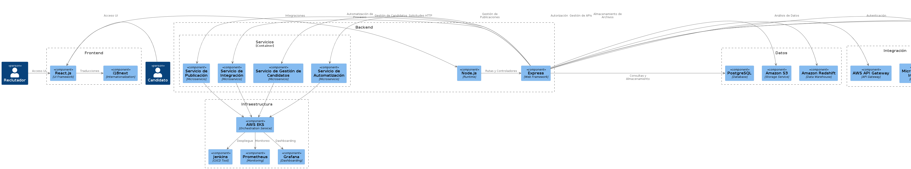
    

```
Puedes modificar el diagrama haciendo que la aplicación que usen los candidatos y la aplicación web de los reclutadores sean distintas? Cada una debe acceder a los servicios que necesite y tener su front y backend.
```

- **ChatGPT 4o**
    
    Claro, aquí tienes el diagrama de componentes actualizado, separando la aplicación para candidatos y la aplicación web para reclutadores, cada una con su propio frontend y backend, accediendo a los servicios necesarios:
    
    ```
    @startuml
    !define RECTANGLE class
    !define AWS <https://raw.githubusercontent.com/tmorin/plantuml-libs/main/dist/plantuml>
    
    !includeurl AWS/Compute/ElasticKubernetesService.puml
    !includeurl AWS/Database/RDS.puml
    !includeurl AWS/Storage/S3.puml
    !includeurl AWS/Analytics/Redshift.puml
    !includeurl AWS/Networking/APIGateway.puml
    !includeurl AWS/DevTools/CodeBuild.puml
    !includeurl AWS/Management/CloudWatch.puml
    !includeurl AWS/Security/CertificateManager.puml
    !includeurl AWS/Security/WAF.puml
    
    !includeurl <https://raw.githubusercontent.com/plantuml-stdlib/C4-PlantUML/master/C4_Component.puml>
    !includeurl <https://raw.githubusercontent.com/plantuml-stdlib/C4-PlantUML/master/C4_Context.puml>
    
    AddElementTag("container", $shape=RECTANGLE)
    
    Person(recruiter, "Reclutador")
    Person(candidate, "Candidato")
    
    Boundary(c1, "Aplicación Web de Reclutadores") {
        Component(recruiterFrontend, "React.js", "UI Framework")
        Component(recruiterBackend, "Node.js + Express", "Backend")
    
        Container_Boundary(c3, "Servicios para Reclutadores") {
            Component(publicationService, "Servicio de Publicación", "Microservicio")
            Component(integrationService, "Servicio de Integración", "Microservicio")
            Component(automationService, "Servicio de Automatización", "Microservicio")
        }
    }
    
    Boundary(c2, "Aplicación para Candidatos") {
        Component(candidateFrontend, "React.js", "UI Framework")
        Component(candidateBackend, "Node.js + Express", "Backend")
    
        Container_Boundary(c4, "Servicios para Candidatos") {
            Component(candidateService, "Servicio de Gestión de Candidatos", "Microservicio")
            Component(applicationService, "Servicio de Aplicaciones", "Microservicio")
            Component(interviewService, "Servicio de Entrevistas", "Microservicio")
        }
    }
    
    Boundary(c5, "Datos") {
        Component(db, "Amazon RDS", "Database")
        Component(s3, "Amazon S3", "Storage Service")
        Component(redshift, "Amazon Redshift", "Data Warehouse")
    }
    
    Boundary(c6, "Integración") {
        Component(apiGateway, "AWS API Gateway", "API Gateway")
        Component(integrationMicroservices, "Microservicios de Integración", "Microservicio")
    }
    
    Boundary(c7, "Seguridad") {
        Component(oauth, "OAuth 2.0", "Auth Framework")
        Component(openid, "OpenID Connect", "Identity Layer")
        Component(elk, "ELK Stack", "Logging and Monitoring")
    }
    
    Boundary(c8, "Infraestructura") {
        Component(kubernetes, "AWS Elastic Kubernetes Service", "Orchestration Service")
        Component(jenkins, "Jenkins", "CI/CD Tool")
        Component(prometheus, "Prometheus", "Monitoring")
        Component(grafana, "Grafana", "Dashboarding")
    }
    
    System_Boundary(sb, "Aplicación Web de Reclutadores") {
        recruiter --> recruiterFrontend : "Acceso UI"
        recruiterFrontend --> recruiterBackend : "Solicitudes HTTP"
        recruiterBackend --> publicationService : "Gestión de Publicaciones"
        recruiterBackend --> integrationService : "Integraciones"
        recruiterBackend --> automationService : "Automatización de Procesos"
        recruiterBackend --> db : "Consultas y Almacenamiento"
        recruiterBackend --> s3 : "Almacenamiento de Archivos"
        recruiterBackend --> redshift : "Análisis de Datos"
        recruiterBackend --> apiGateway : "Gestión de APIs"
        recruiterBackend --> oauth : "Autenticación"
        recruiterBackend --> openid : "Autorización"
        recruiterBackend --> elk : "Registro y Monitoreo"
    }
    
    System_Boundary(sb2, "Aplicación para Candidatos") {
        candidate --> candidateFrontend : "Acceso UI"
        candidateFrontend --> candidateBackend : "Solicitudes HTTP"
        candidateBackend --> candidateService : "Gestión de Candidatos"
        candidateBackend --> applicationService : "Gestión de Aplicaciones"
        candidateBackend --> interviewService : "Gestión de Entrevistas"
        candidateBackend --> db : "Consultas y Almacenamiento"
        candidateBackend --> s3 : "Almacenamiento de Archivos"
        candidateBackend --> redshift : "Análisis de Datos"
        candidateBackend --> apiGateway : "Gestión de APIs"
        candidateBackend --> oauth : "Autenticación"
        candidateBackend --> openid : "Autorización"
        candidateBackend --> elk : "Registro y Monitoreo"
    }
    
    System_Boundary(sb, "Infraestructura") {
        publicationService --> kubernetes
        integrationService --> kubernetes
        candidateService --> kubernetes
        applicationService --> kubernetes
        interviewService --> kubernetes
        automationService --> kubernetes
        kubernetes --> jenkins : "Despliegue"
        kubernetes --> prometheus : "Monitoreo"
        kubernetes --> grafana : "Dashboarding"
    }
    
    @enduml
    
    ```
    
    ### Explicación del Diagrama de Componentes
    
    1. **Aplicación Web de Reclutadores**:
        - **Frontend**:
            - **React.js**: Utilizado para la interfaz de usuario.
        - **Backend**:
            - **Node.js + Express**: Runtime y framework para manejar las solicitudes HTTP y coordinar las operaciones.
        - **Servicios**:
            - **Servicio de Publicación**: Maneja la publicación de ofertas.
            - **Servicio de Integración**: Gestiona las integraciones con plataformas externas.
            - **Servicio de Automatización**: Gestiona la automatización de tareas y comunicaciones.
    2. **Aplicación para Candidatos**:
        - **Frontend**:
            - **React.js**: Utilizado para la interfaz de usuario.
        - **Backend**:
            - **Node.js + Express**: Runtime y framework para manejar las solicitudes HTTP y coordinar las operaciones.
        - **Servicios**:
            - **Servicio de Gestión de Candidatos**: Implementa lógica para la gestión y análisis de candidatos.
            - **Servicio de Aplicaciones**: Maneja las aplicaciones de los candidatos.
            - **Servicio de Entrevistas**: Gestiona la programación y el seguimiento de entrevistas.
    3. **Datos**:
        - **Amazon RDS**: Base de datos relacional para almacenamiento de datos.
        - **Amazon S3**: Almacenamiento de archivos y documentos.
        - **Amazon Redshift**: Almacenamiento y análisis de datos para BI.
    4. **Integración**:
        - **AWS API Gateway**: Puerta de enlace para manejar llamadas a APIs externas.
        - **Microservicios de Integración**: Servicios que interactúan con APIs de terceros.
    5. **Seguridad**:
        - **OAuth 2.0**: Framework de autenticación.
        - **OpenID Connect**: Capa de identidad para autorización.
        - **ELK Stack**: Herramientas para registro y monitoreo.
    6. **Infraestructura**:
        - **AWS Elastic Kubernetes Service**: Servicio de orquestación de contenedores.
        - **Jenkins**: Herramienta de CI/CD.
        - **Prometheus**: Monitoreo de servicios.
        - **Grafana**: Visualización de datos y métricas.
    
    Este diseño asegura que tanto los reclutadores como los candidatos tengan aplicaciones dedicadas con sus propios frontends y backends, mientras comparten servicios y recursos comunes según sea necesario. Esto garantiza una separación clara de responsabilidades y una arquitectura escalable y mantenible.
    

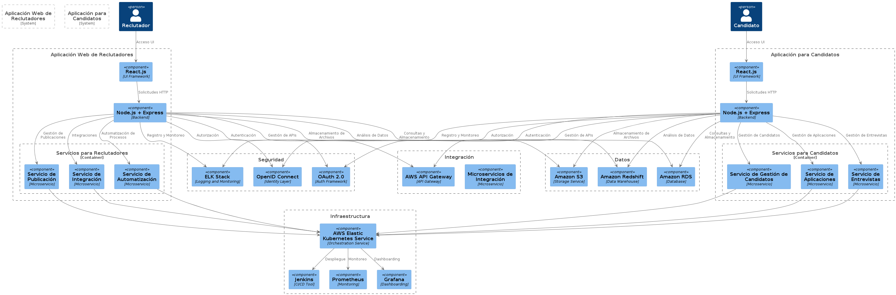

```
Puedes realizar el siguiente cambio en el diagrama de arquitectura?
Cada servicio debe tener su propia base de datos. 
Además, la comunicación entre servicios se realizará bien vía sus API o bien eventos en un sistema de mensajería.
Sigue aplicando buenas prácticas para sistemas escalables.
```

- **Claude 3.5**
    
    Por supuesto. He actualizado el diagrama de arquitectura para reflejar estos cambios, aplicando el patrón de base de datos por servicio y comunicación entre servicios a través de APIs o eventos. Esto mejora la escalabilidad y la independencia de los servicios. Aquí está el diagrama actualizado:
    
    ```
    @startuml
    !include <https://raw.githubusercontent.com/plantuml-stdlib/C4-PlantUML/master/C4_Container.puml>
    
    !define DEVICONS <https://raw.githubusercontent.com/tupadr3/plantuml-icon-font-sprites/master/devicons>
    !define FONTAWESOME <https://raw.githubusercontent.com/tupadr3/plantuml-icon-font-sprites/master/font-awesome-5>
    !include DEVICONS/react.puml
    !include DEVICONS/postgresql.puml
    !include DEVICONS/nginx.puml
    !include FONTAWESOME/users.puml
    !include FONTAWESOME/server.puml
    
    LAYOUT_WITH_LEGEND()
    
    Person(reclutador, "Reclutador", "Usuario del sistema ATS")
    Person(candidato, "Candidato", "Aplica a ofertas de trabajo")
    Person(admin, "Administrador", "Gestiona el sistema ATS")
    
    System_Boundary(ats, "Sistema ATS") {
        Container(recruiter_spa, "Aplicación Web Reclutadores", "React", "Interfaz para reclutadores", $sprite="react")
        Container(recruiter_mobile, "App Móvil Reclutadores", "React Native", "Acceso móvil para reclutadores")
    
        Container(candidate_spa, "Aplicación Web Candidatos", "React", "Portal para candidatos", $sprite="react")
        Container(candidate_mobile, "App Móvil Candidatos", "React Native", "Acceso móvil para candidatos")
    
        Container(api_gateway, "API Gateway", "Nginx", "Enrutamiento y autenticación", $sprite="nginx")
    
        Container(auth_service, "Servicio de Autenticación", "Node.js", "Gestiona autenticación y autorización")
        ContainerDb(auth_db, "BD Autenticación", "PostgreSQL", "Almacena datos de usuarios y tokens")
    
        Container(job_service, "Servicio de Gestión de Ofertas", "Node.js", "Maneja ofertas de trabajo")
        ContainerDb(job_db, "BD Ofertas", "PostgreSQL", "Almacena datos de ofertas de trabajo")
    
        Container(candidate_service, "Servicio de Gestión de Candidatos", "Node.js", "Gestiona perfiles y aplicaciones")
        ContainerDb(candidate_db, "BD Candidatos", "PostgreSQL", "Almacena datos de candidatos")
    
        Container(ai_service, "Servicio de IA", "Python", "Análisis predictivo y preselección")
        ContainerDb(ai_db, "BD IA", "PostgreSQL", "Almacena modelos y resultados de IA")
    
        Container(integration_service, "Servicio de Integración", "Node.js", "Comunicación con APIs externas")
        ContainerDb(integration_db, "BD Integración", "PostgreSQL", "Almacena logs de integraciones")
    
        Container(report_service, "Servicio de Reportes", "Node.js", "Genera informes y análisis")
        ContainerDb(report_db, "BD Reportes", "PostgreSQL", "Almacena datos para reportes")
    
        ContainerDb(object_storage, "Almacenamiento de Objetos", "MinIO", "Almacena CVs y documentos")
    
        Container(event_bus, "Bus de Eventos", "Apache Kafka", "Maneja eventos entre servicios")
        Container(cache, "Servicio de Caché", "Redis", "Mejora el rendimiento")
        Container(logging, "Logging y Monitoreo", "ELK Stack", "Seguimiento de errores y rendimiento")
    }
    
    System_Ext(linkedin, "LinkedIn API", "API externa para publicación de ofertas")
    System_Ext(job_boards, "Otras plataformas de empleo", "APIs externas adicionales")
    
    Rel(reclutador, recruiter_spa, "Usa", "HTTPS")
    Rel(reclutador, recruiter_mobile, "Usa", "HTTPS")
    Rel(candidato, candidate_spa, "Usa", "HTTPS")
    Rel(candidato, candidate_mobile, "Usa", "HTTPS")
    Rel(admin, recruiter_spa, "Administra", "HTTPS")
    
    Rel(recruiter_spa, api_gateway, "API calls", "JSON/HTTPS")
    Rel(recruiter_mobile, api_gateway, "API calls", "JSON/HTTPS")
    Rel(candidate_spa, api_gateway, "API calls", "JSON/HTTPS")
    Rel(candidate_mobile, api_gateway, "API calls", "JSON/HTTPS")
    
    Rel(api_gateway, auth_service, "Autentica")
    Rel(api_gateway, job_service, "Gestiona ofertas")
    Rel(api_gateway, candidate_service, "Gestiona candidatos")
    Rel(api_gateway, ai_service, "Análisis y predicciones")
    Rel(api_gateway, report_service, "Genera reportes")
    
    Rel_R(auth_service, auth_db, "Lee y escribe")
    Rel_R(job_service, job_db, "Lee y escribe")
    Rel_R(candidate_service, candidate_db, "Lee y escribe")
    Rel_R(ai_service, ai_db, "Lee y escribe")
    Rel_R(integration_service, integration_db, "Lee y escribe")
    Rel_R(report_service, report_db, "Lee y escribe")
    
    Rel_D(job_service, object_storage, "Almacena documentos")
    Rel_D(candidate_service, object_storage, "Almacena CVs")
    
    BiRel_U(auth_service, event_bus, "Publica/Consume eventos")
    BiRel_U(job_service, event_bus, "Publica/Consume eventos")
    BiRel_U(candidate_service, event_bus, "Publica/Consume eventos")
    BiRel_U(ai_service, event_bus, "Publica/Consume eventos")
    BiRel_U(integration_service, event_bus, "Publica/Consume eventos")
    BiRel_U(report_service, event_bus, "Publica/Consume eventos")
    
    Rel_U(auth_service, cache, "Utiliza")
    Rel_U(job_service, cache, "Utiliza")
    Rel_U(candidate_service, cache, "Utiliza")
    Rel_U(ai_service, cache, "Utiliza")
    
    Rel(integration_service, linkedin, "Publica ofertas", "HTTPS")
    Rel(integration_service, job_boards, "Publica ofertas", "HTTPS")
    
    Rel(ats, logging, "Envía logs y métricas")
    
    @enduml
    
    ```
    
    Cambios y mejoras en este diagrama:
    
    1. Base de datos por servicio: Cada servicio ahora tiene su propia base de datos PostgreSQL, lo que mejora la independencia y escalabilidad de los servicios.
    2. Bus de eventos: Se ha añadido un bus de eventos (Apache Kafka) para manejar la comunicación asincrónica entre servicios. Esto permite un acoplamiento más flexible y mejora la escalabilidad.
    3. API Gateway: Se mantiene como punto de entrada único para todas las solicitudes externas, manejando el enrutamiento y la autenticación inicial.
    4. Comunicación entre servicios: Los servicios pueden comunicarse entre sí a través del API Gateway para solicitudes síncronas o mediante eventos publicados en el bus de eventos para comunicación asincrónica.
    5. Caché compartida: Se mantiene un servicio de caché Redis compartido para mejorar el rendimiento general del sistema.
    6. Almacenamiento de objetos: Se mantiene un servicio de almacenamiento de objetos (MinIO) compartido para documentos y CVs.
    7. Logging y monitoreo: Se mantiene un sistema centralizado de logging y monitoreo para todos los servicios.
    
    Esta arquitectura sigue las buenas prácticas para sistemas escalables:
    
    - Desacoplamiento de servicios
    - Bases de datos independientes por servicio
    - Comunicación asincrónica a través de eventos
    - Caché compartida para mejorar el rendimiento
    - API Gateway para manejar el tráfico entrante
    - Almacenamiento de objetos centralizado
    - Sistema de logging y monitoreo centralizado
    
    Esta estructura permite escalar cada servicio de forma independiente según las necesidades, facilita el desarrollo y despliegue independiente de cada componente, y proporciona una mayor resiliencia al sistema en general.
    

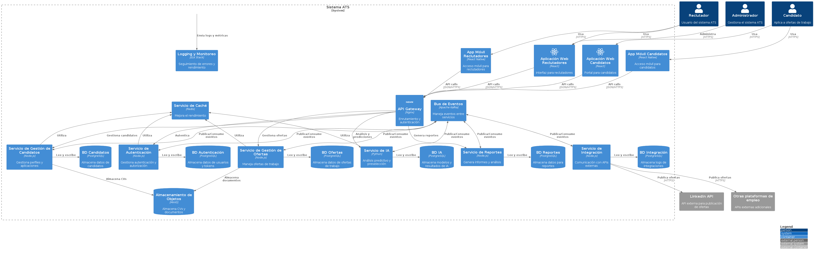

- **ChatGPT 4o** 🔝 Separa mejor los componentes, pero mezcla mucho las flechas (culpa de PlantUML)
    
    Claro, aquí tienes el diagrama de componentes actualizado, considerando que cada servicio tiene su propia base de datos y la comunicación entre servicios se realiza a través de APIs o mediante un sistema de mensajería para asegurar escalabilidad y buenas prácticas:
    
    ```
    @startuml
    !define RECTANGLE class
    !define AWS <https://raw.githubusercontent.com/tmorin/plantuml-libs/main/dist/plantuml>
    
    !includeurl AWS/Compute/ElasticKubernetesService.puml
    !includeurl AWS/Database/RDS.puml
    !includeurl AWS/Storage/S3.puml
    !includeurl AWS/Analytics/Redshift.puml
    !includeurl AWS/Networking/APIGateway.puml
    !includeurl AWS/DevTools/CodeBuild.puml
    !includeurl AWS/Management/CloudWatch.puml
    !includeurl AWS/Security/CertificateManager.puml
    !includeurl AWS/Security/WAF.puml
    
    !includeurl <https://raw.githubusercontent.com/plantuml-stdlib/C4-PlantUML/master/C4_Component.puml>
    !includeurl <https://raw.githubusercontent.com/plantuml-stdlib/C4-PlantUML/master/C4_Context.puml>
    
    AddElementTag("container", $shape=RECTANGLE)
    
    Person(recruiter, "Reclutador")
    Person(candidate, "Candidato")
    
    Boundary(c1, "Aplicación Web de Reclutadores") {
        Component(recruiterFrontend, "React.js", "UI Framework")
        Component(recruiterBackend, "Node.js + Express", "Backend")
    
        Container_Boundary(c3, "Servicios para Reclutadores") {
            Component(publicationService, "Servicio de Publicación", "Microservicio")
            Component(publicationDB, "Publicación DB", "Database")
    
            Component(integrationService, "Servicio de Integración", "Microservicio")
            Component(integrationDB, "Integración DB", "Database")
    
            Component(automationService, "Servicio de Automatización", "Microservicio")
            Component(automationDB, "Automatización DB", "Database")
        }
    }
    
    Boundary(c2, "Aplicación para Candidatos") {
        Component(candidateFrontend, "React.js", "UI Framework")
        Component(candidateBackend, "Node.js + Express", "Backend")
    
        Container_Boundary(c4, "Servicios para Candidatos") {
            Component(candidateService, "Servicio de Gestión de Candidatos", "Microservicio")
            Component(candidateDB, "Candidatos DB", "Database")
    
            Component(applicationService, "Servicio de Aplicaciones", "Microservicio")
            Component(applicationDB, "Aplicaciones DB", "Database")
    
            Component(interviewService, "Servicio de Entrevistas", "Microservicio")
            Component(interviewDB, "Entrevistas DB", "Database")
        }
    }
    
    Boundary(c5, "Datos Compartidos") {
        Component(sharedS3, "Amazon S3", "Storage Service")
        Component(sharedRedshift, "Amazon Redshift", "Data Warehouse")
    }
    
    Boundary(c6, "Integración") {
        Component(apiGateway, "AWS API Gateway", "API Gateway")
        Component(eventBus, "Sistema de Mensajería", "Message Bus")
    }
    
    Boundary(c7, "Seguridad") {
        Component(oauth, "OAuth 2.0", "Auth Framework")
        Component(openid, "OpenID Connect", "Identity Layer")
        Component(elk, "ELK Stack", "Logging and Monitoring")
    }
    
    Boundary(c8, "Infraestructura") {
        Component(kubernetes, "AWS Elastic Kubernetes Service", "Orchestration Service")
        Component(jenkins, "Jenkins", "CI/CD Tool")
        Component(prometheus, "Prometheus", "Monitoring")
        Component(grafana, "Grafana", "Dashboarding")
    }
    
    System_Boundary(sb, "Aplicación Web de Reclutadores") {
        recruiter --> recruiterFrontend : "Acceso UI"
        recruiterFrontend --> recruiterBackend : "Solicitudes HTTP"
        recruiterBackend --> publicationService : "Gestión de Publicaciones"
        recruiterBackend --> integrationService : "Integraciones"
        recruiterBackend --> automationService : "Automatización de Procesos"
        publicationService --> publicationDB : "Consultas y Almacenamiento"
        integrationService --> integrationDB : "Consultas y Almacenamiento"
        automationService --> automationDB : "Consultas y Almacenamiento"
        publicationService --> eventBus : "Publica Eventos"
        integrationService --> eventBus : "Publica y Suscribe Eventos"
        automationService --> eventBus : "Publica y Suscribe Eventos"
        recruiterBackend --> apiGateway : "Gestión de APIs"
        recruiterBackend --> oauth : "Autenticación"
        recruiterBackend --> openid : "Autorización"
        recruiterBackend --> elk : "Registro y Monitoreo"
    }
    
    System_Boundary(sb2, "Aplicación para Candidatos") {
        candidate --> candidateFrontend : "Acceso UI"
        candidateFrontend --> candidateBackend : "Solicitudes HTTP"
        candidateBackend --> candidateService : "Gestión de Candidatos"
        candidateBackend --> applicationService : "Gestión de Aplicaciones"
        candidateBackend --> interviewService : "Gestión de Entrevistas"
        candidateService --> candidateDB : "Consultas y Almacenamiento"
        applicationService --> applicationDB : "Consultas y Almacenamiento"
        interviewService --> interviewDB : "Consultas y Almacenamiento"
        candidateService --> eventBus : "Publica y Suscribe Eventos"
        applicationService --> eventBus : "Publica Eventos"
        interviewService --> eventBus : "Publica y Suscribe Eventos"
        candidateBackend --> apiGateway : "Gestión de APIs"
        candidateBackend --> oauth : "Autenticación"
        candidateBackend --> openid : "Autorización"
        candidateBackend --> elk : "Registro y Monitoreo"
    }
    
    System_Boundary(sb, "Datos Compartidos") {
        publicationService --> sharedS3 : "Almacenamiento de Archivos"
        integrationService --> sharedS3 : "Almacenamiento de Archivos"
        automationService --> sharedS3 : "Almacenamiento de Archivos"
        candidateService --> sharedS3 : "Almacenamiento de Archivos"
        applicationService --> sharedS3 : "Almacenamiento de Archivos"
        interviewService --> sharedS3 : "Almacenamiento de Archivos"
        publicationService --> sharedRedshift : "Análisis de Datos"
        integrationService --> sharedRedshift : "Análisis de Datos"
        automationService --> sharedRedshift : "Análisis de Datos"
        candidateService --> sharedRedshift : "Análisis de Datos"
        applicationService --> sharedRedshift : "Análisis de Datos"
        interviewService --> sharedRedshift : "Análisis de Datos"
    }
    
    System_Boundary(sb, "Infraestructura") {
        publicationService --> kubernetes
        integrationService --> kubernetes
        candidateService --> kubernetes
        applicationService --> kubernetes
        interviewService --> kubernetes
        automationService --> kubernetes
        kubernetes --> jenkins : "Despliegue"
        kubernetes --> prometheus : "Monitoreo"
        kubernetes --> grafana : "Dashboarding"
    }
    
    @enduml
    
    ```
    
    ### Explicación del Diagrama de Componentes
    
    1. **Aplicación Web de Reclutadores**:
        - **Frontend**:
            - **React.js**: Utilizado para la interfaz de usuario.
        - **Backend**:
            - **Node.js + Express**: Runtime y framework para manejar las solicitudes HTTP y coordinar las operaciones.
        - **Servicios**:
            - **Servicio de Publicación**: Maneja la publicación de ofertas. Tiene su propia base de datos (**Publicación DB**).
            - **Servicio de Integración**: Gestiona las integraciones con plataformas externas. Tiene su propia base de datos (**Integración DB**).
            - **Servicio de Automatización**: Gestiona la automatización de tareas y comunicaciones. Tiene su propia base de datos (**Automatización DB**).
    2. **Aplicación para Candidatos**:
        - **Frontend**:
            - **React.js**: Utilizado para la interfaz de usuario.
        - **Backend**:
            - **Node.js + Express**: Runtime y framework para manejar las solicitudes HTTP y coordinar las operaciones.
        - **Servicios**:
            - **Servicio de Gestión de Candidatos**: Implementa lógica para la gestión y análisis de candidatos. Tiene su propia base de datos (**Candidatos DB**).
            - **Servicio de Aplicaciones**: Maneja las aplicaciones de los candidatos. Tiene su propia base de datos (**Aplicaciones DB**).
            - **Servicio de Entrevistas**: Gestiona la programación y el seguimiento de entrevistas. Tiene su propia base de datos (**Entrevistas DB**).
    3. **Datos Compartidos**:
        - **Amazon S3**: Almacenamiento de archivos y documentos.
        - **Amazon Redshift**: Almacenamiento y análisis de datos para BI.
    4. **Integración**:
        - **AWS API Gateway**: Puerta de enlace para manejar llamadas a APIs externas.
        - **Sistema de Mensajería**: Bus de mensajes para la comunicación entre microservicios.
    5. **Seguridad**:
        - **OAuth 2.0**: Framework de autenticación.
        - **OpenID Connect**: Capa de identidad para autorización.
        - **ELK Stack**: Herramientas para registro y monitoreo.
    6. **Infraestructura**:
        - **AWS Elastic Kubernetes Service**: Servicio de orquestación de contenedores.
        - **Jenkins**: Herramienta de CI/CD.
        - **Prometheus**

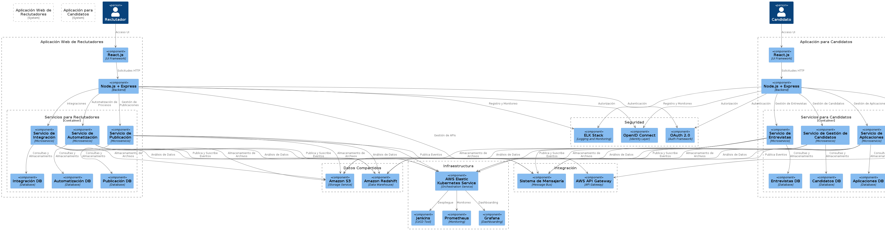

---

# ▶️ Fases y entregables

1. Investigación y análisis → Product Manager
    - [x]  Descripción breve del software LTI
    - [x]  Valor añadido y ventajas competitivas
    - [x]  Explicación de las funciones principales
    - [x]  Diagrama Lean Canvas
2. Casos de uso
    - [x]  3 Casos de uso
    - [x]  Diagramas de cada CU
3. Modelado de datos
    - [x]  Diagrama con entidades, atributos (nombre y tipo) y relaciones
4. Diseño de alto nivel (arquitectura):
    - [x]  Explicación
    - [x]  Diagrama
5. Diagrama C4 de uno de los componentes del sistema
    - [ ]  Diagrama C4 de un componente