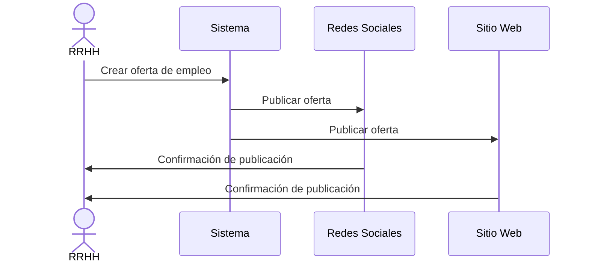
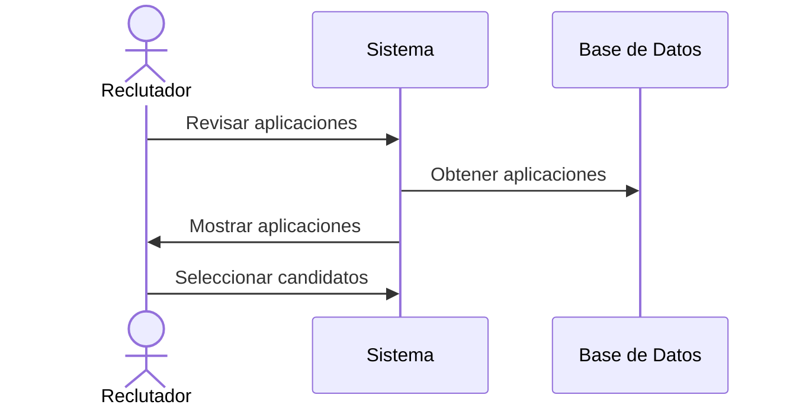
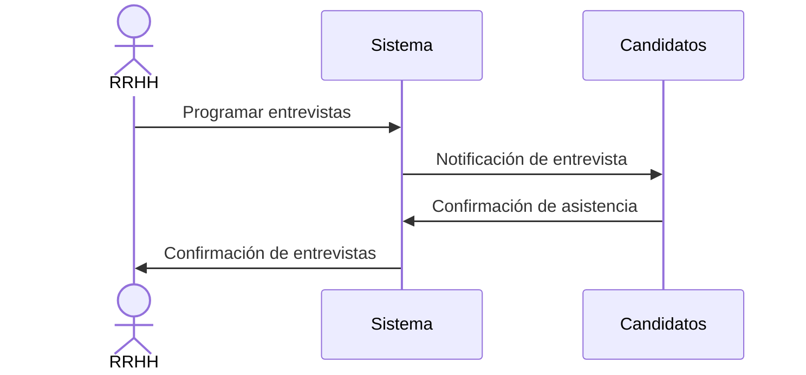
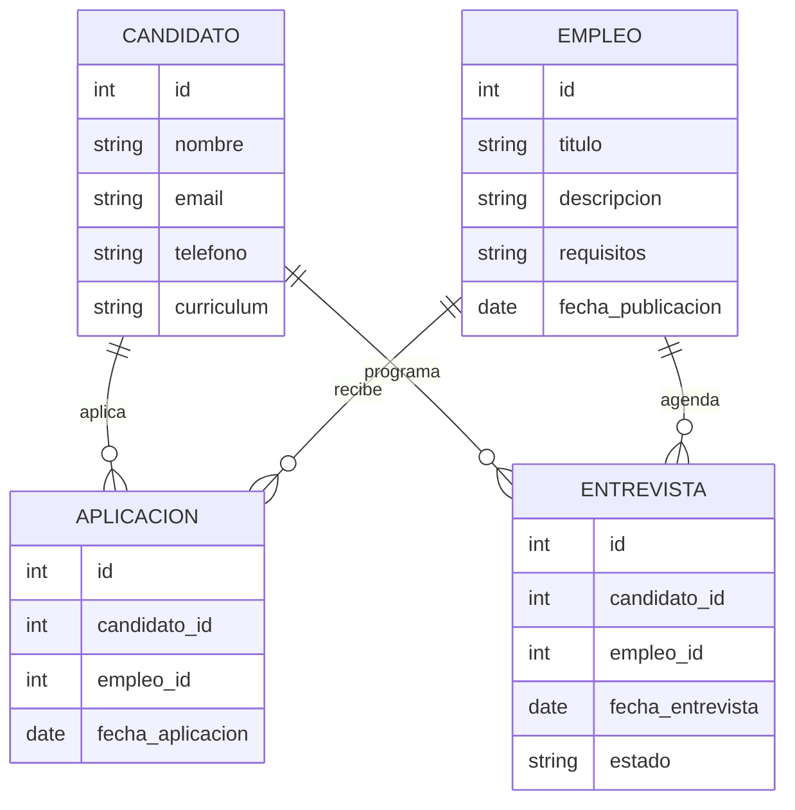

```markdown
# **SMART PEOPLE LTI** 

## Descripción del Software
**SMART PEOPLE LTI** es un sistema de seguimiento de candidatos (ATS) innovador que promete revolucionar la eficiencia de los departamentos de recursos humanos, mejorando en un 50% su efectividad en comparación con los sistemas ATS más vendidos en el mercado. Este software facilita la colaboración en tiempo real entre reclutadores y managers, automatiza tareas repetitivas y utiliza inteligencia artificial para optimizar la selección de candidatos.

## Valor Añadido y Ventajas Competitivas
### Valor Añadido:
- **Automatización Inteligente**: Automatiza tareas repetitivas utilizando IA, permitiendo que los reclutadores se enfoquen en tareas estratégicas.
- **Colaboración en Tiempo Real**: Mejora la comunicación y colaboración entre los miembros del equipo de recursos humanos.
- **Aprendizaje Automático**: Utiliza modelos de machine learning para aprender de los candidatos mejor seleccionados y mejorar continuamente el proceso de selección.

### Ventajas Competitivas:
- **Eficiencia Mejorada**: Asegura una mejora del 50% en la eficiencia de los departamentos de recursos humanos.
- **Integración Sencilla**: Se integra fácilmente con otros sistemas y herramientas de recursos humanos.
- **Interfaz Amigable**: Ofrece una interfaz intuitiva y fácil de usar.

## Funciones Principales
1. **Creación de Empleos**
2. **Publicación de Empleos**
3. **Recepción de Aplicaciones**
4. **Revisión de Aplicaciones**
5. **Realización de Pruebas en Línea**
6. **Programación de Entrevistas**
7. **Contratación de Candidatos**

### ¿Cómo Ayudan Estas Funciones?
- **Creación y Publicación de Empleos**: Facilita la creación de ofertas de trabajo y su publicación en múltiples plataformas.
- **Recepción y Revisión de Aplicaciones**: Centraliza y organiza todas las aplicaciones recibidas, permitiendo una revisión eficiente.
- **Realización de Pruebas y Programación de Entrevistas**: Automatiza el proceso de pruebas en línea y la programación de entrevistas, ahorrando tiempo y recursos.
- **Contratación de Candidatos**: Mejora el proceso de contratación mediante la colaboración en tiempo real y la evaluación basada en datos.

## Lean Canvas
- **Problema**: Ineficiencia en el proceso de selección de candidatos.
- **Segmento de Clientes**: Departamentos de recursos humanos de medianas y grandes empresas.
- **Propuesta de Valor**: Mejora en un 50% la eficiencia en la selección de candidatos mediante automatización e inteligencia artificial.
- **Solución**: Sistema ATS con funciones avanzadas de automatización, colaboración y aprendizaje automático.
- **Canales**: Venta directa, marketing digital, partnerships.
- **Flujos de Ingresos**: Suscripciones mensuales, licencias por usuario.
- **Recursos Clave**: Tecnología de IA, infraestructura en la nube, equipo de soporte técnico.
- **Actividades Clave**: Desarrollo de software, soporte al cliente, marketing y ventas.
- **Socios Clave**: Plataformas de empleo, empresas de tecnología de recursos humanos.
- **Estructura de Costos**: Desarrollo y mantenimiento del software, marketing, soporte al cliente.

## Casos de Uso Principales

### Caso de Uso 1: Publicación de Empleos


### Caso de Uso 2: Revisión de Aplicaciones


### Caso de Uso 3: Programación de Entrevistas


## Modelo de Datos del Sistema


## Diseño del Sistema a Alto Nivel
```python
from diagrams import Diagram, Cluster, Node
from diagrams.aws.compute import EC2
from diagrams.aws.database import RDS
from diagrams.aws.network import ELB

with Diagram("Arquitectura de SMART PEOPLE LTI", show=False):
    elb = ELB("Load Balancer")

    with Cluster("Backend"):
        with Cluster("Cluster Web"):
            web = [EC2("web1"), EC2("web2"), EC2("web3")]

        with Cluster("Cluster de Base de Datos"):
            db_master = RDS("Master DB")
            db_master - [RDS("Replica DB1"), RDS("Replica DB2")]

    elb >> web
    web >> db_master
```

## Diagrama C4
### Nivel 1: Contexto del Sistema
```mermaid
C4Context
    title Sistema SMART PEOPLE LTI

    Person(cliente, "Cliente", "Usuario del sistema de ATS")
    System(smart_people_lti, "SMART PEOPLE LTI", "Sistema de seguimiento de candidatos")

    cliente --> smart_people_lti
```

### Nivel 2: Contenedor del Sistema
```mermaid
C4Container
    title Contenedores del Sistema SMART PEOPLE LTI

    Container(cliente, "Cliente", "Navegador Web", "Usuario del sistema de ATS")
    Container(smart_people_lti, "SMART PEOPLE LTI", "Aplicación Web", "Sistema de seguimiento de candidatos")
    ContainerDb(base_datos, "Base de Datos", "RDS", "Almacena datos de candidatos y empleos")

    cliente --> smart_people_lti
    smart_people_lti --> base_datos
```

### Nivel 3: Componente del Sistema
```mermaid
C4Component
    title Componentes del Sistema SMART PEOPLE LTI

    Component(cliente, "Cliente", "Navegador Web", "Usuario del sistema de ATS")
    Component(aplicacion_web, "Aplicación Web", "Django", "Maneja la lógica de negocio")
    Component(api_rest, "API REST", "Django REST Framework", "Provee servicios REST")
    Component(base_datos, "Base de Datos", "PostgreSQL", "Almacena datos de candidatos y empleos")
    Component(ia_modulo, "Módulo de IA", "TensorFlow", "Optimiza la selección de candidatos")

    cliente --> aplicacion_web
    aplicacion_web --> api_rest
    api_rest --> base_datos
    api_rest --> ia_modulo
```

### Nivel 4: Diagrama de Código para "Selección de Candidatos"
```mermaid
C4Component
    title Selección de Candidatos

    Component(cliente, "Cliente", "Navegador Web", "Usuario del sistema de ATS")
    Component(aplicacion_web, "Aplicación Web", "Django", "Maneja la lógica de negocio para la selección de candidatos")
    Component(api_rest, "API REST", "Django REST Framework", "Provee servicios REST para la selección de candidatos")
    Component(base_datos, "Base de Datos", "PostgreSQL", "Almacena datos de candidatos y empleos")
    Component(ia_modulo, "Módulo de IA", "TensorFlow", "Optimiza la selección de candidatos")

    cliente --> aplicacion_web
    aplicacion_web --> api_rest
    api_rest --> base_datos
    api_rest --> ia_modulo
```
```
