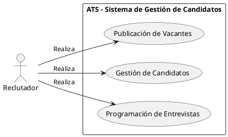
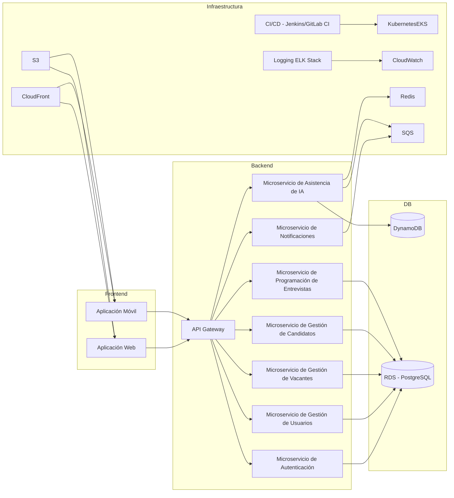
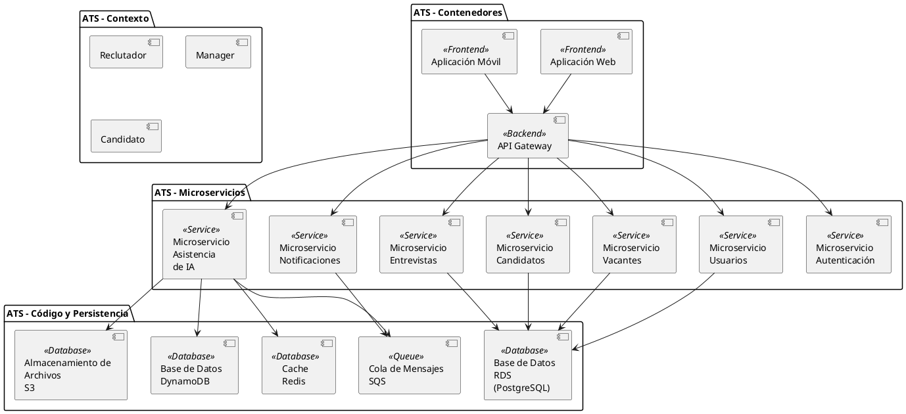

# Desarrollo del Sistema de Gestión de Candidatos (ATS) para LTI

## Descripción Breve del Software ATS de LTI

El sistema de gestión de candidatos (ATS) desarrollado por LTI será una plataforma de última generación diseñada para optimizar y automatizar el proceso de reclutamiento. Este ATS se enfocará en aumentar la eficiencia de los departamentos de Recursos Humanos, mejorar la colaboración en tiempo real entre reclutadores y managers, y proporcionar asistencia mediante inteligencia artificial (IA) en diversas tareas críticas del reclutamiento.

## Valor Añadido y Ventajas Competitivas

El ATS de LTI se destacará en el mercado por las siguientes razones:

1. **Colaboración en Tiempo Real**: A diferencia de muchos ATS existentes, nuestro sistema permitirá una colaboración en tiempo real sin fricciones entre reclutadores y managers, facilitando la toma de decisiones rápida y eficiente.
2. **Automatizaciones Avanzadas**: Incluirá un alto nivel de automatización para tareas repetitivas como la programación de entrevistas, el seguimiento de candidatos y la actualización de estados, liberando tiempo para actividades estratégicas.
3. **Asistencia de IA**: Integrará capacidades avanzadas de IA para la filtración de candidatos, recomendaciones de perfiles y análisis predictivo, mejorando la precisión y efectividad del proceso de selección.
4. **Experiencia de Usuario Intuitiva**: Ofrecerá una interfaz amigable y altamente personalizable que mejorará la experiencia de usuario tanto para los equipos de HR como para los candidatos.
5. **Integración Sencilla**: Será compatible con una amplia gama de herramientas y plataformas de terceros, permitiendo una integración sin problemas con los sistemas existentes en la empresa.

## Funciones Principales del ATS de LTI

1. **Publicación de Vacantes**: Permitir la creación y publicación de ofertas de trabajo en múltiples plataformas con un solo clic.
2. **Gestión de Candidatos**: Unificar y gestionar todas las aplicaciones en un solo lugar, con filtros avanzados para buscar y clasificar candidatos.
3. **Programación de Entrevistas**: Automatizar la programación de entrevistas y enviar recordatorios a candidatos y entrevistadores.
4. **Evaluaciones y Feedback**: Facilitar la evaluación estructurada de candidatos y la recopilación de feedback de los entrevistadores en tiempo real.
5. **Análisis y Reportes**: Proporcionar análisis detallados y reportes personalizados sobre el proceso de reclutamiento, identificando áreas de mejora.
6. **Integración con Herramientas de Terceros**: Conectarse fácilmente con otras herramientas de HR, correo electrónico, calendarios y plataformas de comunicación.
7. **Portal de Candidatos**: Ofrecer un portal intuitivo donde los candidatos puedan ver el estado de su aplicación, programar entrevistas y comunicarse con los reclutadores.
8. **Seguridad y Cumplimiento**: Asegurar que el sistema cumpla con todas las normativas de privacidad de datos y seguridad.

## Diagrama Lean Canvas

```plaintext
|-----------------|-----------------------------------------------------------|
| PROBLEM         | - Procesos de reclutamiento lentos y manuales              |
|                 | - Falta de colaboración en tiempo real entre equipos       |
|                 | - Ineficiencia en la gestión de candidatos                 |
|-----------------|-----------------------------------------------------------|
| CUSTOMER        | - Departamentos de HR                                      |
| SEGMENTS        | - Reclutadores                                             |
|                 | - Managers de contratación                                 |
|-----------------|-----------------------------------------------------------|
| UNIQUE          | - Colaboración en tiempo real                              |
| VALUE           | - Asistencia de IA                                         |
| PROPOSITION     | - Automatizaciones avanzadas                               |
|-----------------|-----------------------------------------------------------|
| SOLUTION        | - Plataforma de gestión de candidatos con IA               |
|                 | - Integración con herramientas existentes                  |
|                 | - Automatización de tareas repetitivas                     |
|-----------------|-----------------------------------------------------------|
| CHANNELS        | - Ventas directas                                          |
|                 | - Marketing digital                                        |
|                 | - Socios estratégicos                                      |
|-----------------|-----------------------------------------------------------|
| REVENUE         | - Suscripciones mensuales                                  |
| STREAMS         | - Licencias anuales                                        |
|-----------------|-----------------------------------------------------------|
| COST STRUCTURE  | - Desarrollo y mantenimiento del software                  |
|                 | - Marketing y ventas                                       |
|                 | - Soporte al cliente                                       |
|-----------------|-----------------------------------------------------------|
| KEY METRICS     | - Tiempo de contratación                                   |
|                 | - Tasa de satisfacción del usuario                         |
|                 | - Tasa de adopción de la plataforma                        |
|-----------------|-----------------------------------------------------------|
| UNFAIR          | - Tecnología avanzada de IA                                |
| ADVANTAGE       | - Integración y automatización superior                    |
|-----------------|-----------------------------------------------------------|
| KEY PARTNERS    | - Proveedores de tecnología                                |
|                 | - Plataformas de reclutamiento                             |
|                 | - Consultoras de HR                                        |
|-----------------|-----------------------------------------------------------|
| KEY ACTIVITIES  | - Desarrollo de software                                   |
|                 | - Marketing y ventas                                       |
|                 | - Soporte y formación                                      |
|-----------------|-----------------------------------------------------------|
| KEY RESOURCES   | - Equipo de desarrollo de software                         |
|                 | - Equipo de ventas y marketing                             |
|                 | - Recursos de soporte y formación                          |
|-----------------|-----------------------------------------------------------|

```
# Casos de Uso Principales del ATS para LTI

## Caso de Uso 1: Publicación de Vacantes

**Actor Principal:** Reclutador

**Descripción:** Este caso de uso permite a los reclutadores crear y publicar nuevas vacantes de empleo en el sistema ATS.

**Flujo Principal:**
1. El reclutador inicia sesión en el sistema ATS.
2. El reclutador accede al módulo de gestión de vacantes.
3. El reclutador completa los detalles de la vacante (título, descripción, requisitos, etc.).
4. El reclutador selecciona las plataformas externas donde se publicará la vacante.
5. El sistema ATS publica automáticamente la vacante en las plataformas seleccionadas.

**Flujo Alternativo:**
- Si la vacante ya existe en el sistema, el reclutador puede optar por editarla en lugar de crear una nueva.

## Caso de Uso 2: Gestión de Candidatos

**Actor Principal:** Reclutador

**Descripción:** Este caso de uso permite a los reclutadores gestionar el ciclo de vida de los candidatos que han aplicado a las vacantes publicadas.

**Flujo Principal:**
1. El reclutador accede al panel de gestión de candidatos.
2. El reclutador visualiza las aplicaciones recibidas y los perfiles de los candidatos.
3. El reclutador filtra y busca candidatos según criterios específicos (experiencia, habilidades, etc.).
4. El reclutador actualiza el estado de los candidatos (revisión inicial, entrevista programada, oferta extendida, etc.).
5. El sistema ATS notifica automáticamente a los candidatos sobre el estado de su aplicación.

**Flujo Alternativo:**
- Si un candidato destaca en particular, el reclutador puede marcarlo para seguimiento prioritario.

## Caso de Uso 3: Programación de Entrevistas

**Actor Principal:** Reclutador

**Descripción:** Este caso de uso permite a los reclutadores programar y gestionar entrevistas con los candidatos seleccionados.

**Flujo Principal:**
1. El reclutador selecciona a los candidatos que han pasado la revisión inicial.
2. El reclutador elige las fechas y horarios disponibles para las entrevistas.
3. El sistema ATS envía invitaciones de entrevista a los candidatos seleccionados.
4. El reclutador recibe confirmaciones de asistencia y gestiona cualquier cambio de programación.
5. El sistema ATS actualiza automáticamente el estado de los candidatos después de cada entrevista.

**Flujo Alternativo:**
- Si un candidato no puede asistir a una entrevista programada, el reclutador puede reprogramarla según disponibilidad.

## Diagrama de Casos de Uso (PlantUML)




# Modelo de Datos para el ATS de LTI

## Entidades y Atributos

### Entidad: Usuario
- `id_usuario` (INT, PK)
- `nombre` (VARCHAR)
- `apellido` (VARCHAR)
- `correo_electronico` (VARCHAR)
- `contrasena` (VARCHAR)
- `rol` (ENUM: 'reclutador', 'manager', 'candidato')

### Entidad: Vacante
- `id_vacante` (INT, PK)
- `titulo` (VARCHAR)
- `descripcion` (TEXT)
- `requisitos` (TEXT)
- `fecha_publicacion` (DATE)
- `id_usuario` (INT, FK) - referencia a Usuario (reclutador)

### Entidad: Candidato
- `id_candidato` (INT, PK)
- `nombre` (VARCHAR)
- `apellido` (VARCHAR)
- `correo_electronico` (VARCHAR)
- `telefono` (VARCHAR)
- `cv` (TEXT)
- `id_usuario` (INT, FK) - referencia a Usuario (candidato)

### Entidad: Aplicacion
- `id_aplicacion` (INT, PK)
- `fecha_aplicacion` (DATE)
- `estado` (ENUM: 'recibida', 'en revisión', 'entrevista programada', 'oferta extendida', 'rechazada')
- `id_vacante` (INT, FK) - referencia a Vacante
- `id_candidato` (INT, FK) - referencia a Candidato

### Entidad: Entrevista
- `id_entrevista` (INT, PK)
- `fecha_entrevista` (DATETIME)
- `lugar` (VARCHAR)
- `id_aplicacion` (INT, FK) - referencia a Aplicacion
- `id_usuario` (INT, FK) - referencia a Usuario (reclutador o manager)

## Relaciones

- Un **Usuario** puede crear muchas **Vacantes**.
- Un **Candidato** (tipo de Usuario) puede tener muchas **Aplicaciones**.
- Una **Vacante** puede recibir muchas **Aplicaciones**.
- Una **Aplicacion** puede tener muchas **Entrevistas**.
- Un **Reclutador** o **Manager** (tipo de Usuario) puede participar en muchas **Entrevistas**.

## Esquema de la Base de Datos

```plaintext
Table Usuario {
  id_usuario INT [pk]
  nombre VARCHAR
  apellido VARCHAR
  correo_electronico VARCHAR
  contrasena VARCHAR
  rol ENUM('reclutador', 'manager', 'candidato')
}

Table Vacante {
  id_vacante INT [pk]
  titulo VARCHAR
  descripcion TEXT
  requisitos TEXT
  fecha_publicacion DATE
  id_usuario INT
}

Table Candidato {
  id_candidato INT [pk]
  nombre VARCHAR
  apellido VARCHAR
  correo_electronico VARCHAR
  telefono VARCHAR
  cv TEXT
  id_usuario INT
}

Table Aplicacion {
  id_aplicacion INT [pk]
  fecha_aplicacion DATE
  estado ENUM('recibida', 'en revisión', 'entrevista programada', 'oferta extendida', 'rechazada')
  id_vacante INT
  id_candidato INT
}

Table Entrevista {
  id_entrevista INT [pk]
  fecha_entrevista DATETIME
  lugar VARCHAR
  id_aplicacion INT
  id_usuario INT
}

Ref: Usuario.id_usuario > Vacante.id_usuario
Ref: Usuario.id_usuario > Candidato.id_usuario
Ref: Vacante.id_vacante > Aplicacion.id_vacante
Ref: Candidato.id_candidato > Aplicacion.id_candidato
Ref: Aplicacion.id_aplicacion > Entrevista.id_aplicacion
Ref: Usuario.id_usuario > Entrevista.id_usuario

```


# Diseño de Sistema de ATS para LTI

## Visión General del Sistema

El sistema ATS de LTI estará diseñado utilizando una arquitectura de microservicios desplegada en AWS. Esta arquitectura permitirá la escalabilidad, flexibilidad y resiliencia del sistema, facilitando el mantenimiento y la implementación continua.

### Componentes del Sistema

1. **Frontend**:
    - **Aplicación Web**: Desarrollada en React, proporcionará una interfaz de usuario intuitiva para los reclutadores, managers y candidatos.
    - **Aplicación Móvil**: Utilizando React Native para accesibilidad móvil.

2. **Backend**:
    - **Microservicios**: Desplegados en contenedores Docker, orquestados por Kubernetes (EKS en AWS).
        - **Autenticación y Autorización**: Gestionado por un servicio dedicado usando OAuth2.
        - **Gestión de Usuarios**: CRUD de usuarios, perfiles y roles.
        - **Gestión de Vacantes**: CRUD de vacantes y publicación en diferentes plataformas.
        - **Gestión de Candidatos**: CRUD de candidatos y sus aplicaciones.
        - **Programación de Entrevistas**: Gestión de la programación y confirmación de entrevistas.
        - **Notificaciones**: Servicio para manejar notificaciones por correo electrónico y SMS.
        - **Asistencia de IA**: Servicio dedicado a las recomendaciones y análisis predictivo.
    - **API Gateway**: Administra las solicitudes externas y las enruta a los microservicios apropiados.

3. **Base de Datos**:
    - **RDS (PostgreSQL)**: Base de datos relacional para datos transaccionales.
    - **DynamoDB**: Almacenamiento de datos NoSQL para datos no estructurados.

4. **Infraestructura y DevOps**:
    - **CI/CD**: Jenkins o GitLab CI/CD para la integración y entrega continua.
    - **Contenedorización**: Docker para empaquetar los microservicios.
    - **Orquestación**: Kubernetes (EKS) para la gestión de contenedores.
    - **Infraestructura como Código**: Terraform o CloudFormation para gestionar la infraestructura.
    - **Monitoreo y Logging**: CloudWatch, ELK Stack (Elasticsearch, Logstash, Kibana).

5. **Otras Herramientas**:
    - **Colas de Mensajes**: Amazon SQS para la comunicación asíncrona entre servicios.
    - **Caché**: Redis para almacenamiento en caché.
    - **CDN**: Amazon CloudFront para distribución de contenido estático.
    - **Almacenamiento de Archivos**: Amazon S3 para almacenar documentos como CVs y otros archivos subidos.

## Interacción entre Componentes

1. **Frontend** interactúa con el **API Gateway**, que enruta las solicitudes a los microservicios correspondientes.
2. **Microservicios** se comunican entre sí a través de **HTTP/REST** o **mensajería asíncrona** usando **Amazon SQS**.
3. **Autenticación y Autorización** se maneja a través de **OAuth2**, con tokens gestionados por el microservicio de autenticación.
4. **Base de Datos** relacional y NoSQL gestionan los datos estructurados y no estructurados, con los microservicios accediendo a ellos según sea necesario.
5. **Servicios de Asistencia de IA** proporcionan análisis y recomendaciones, interactuando con otros servicios para obtener y procesar datos.
6. **Infraestructura y DevOps** aseguran la entrega continua y el monitoreo del sistema, gestionando los contenedores y la infraestructura a través de Kubernetes y herramientas de CI/CD.

## Diagrama de Arquitectura




## Diagrama C4



