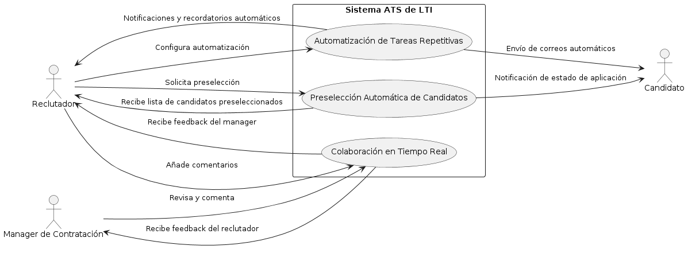
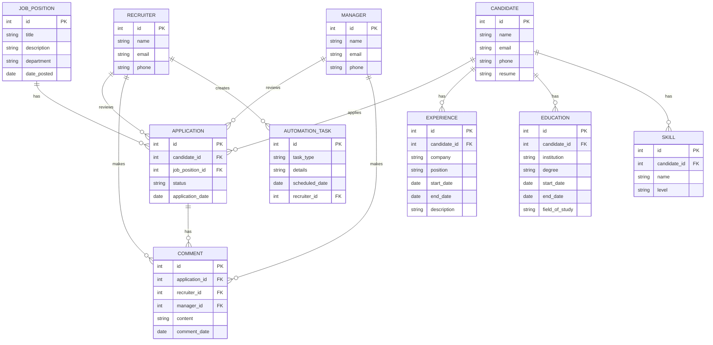
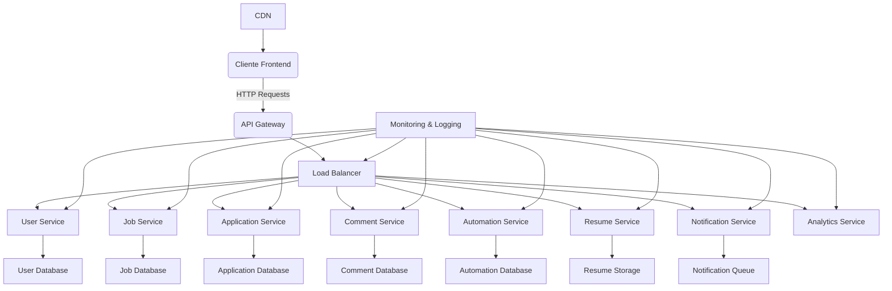
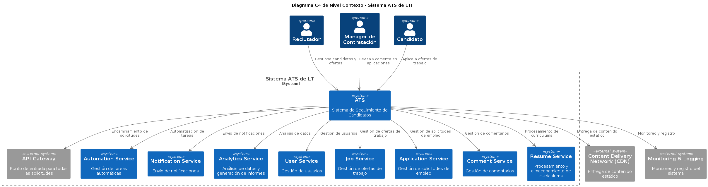
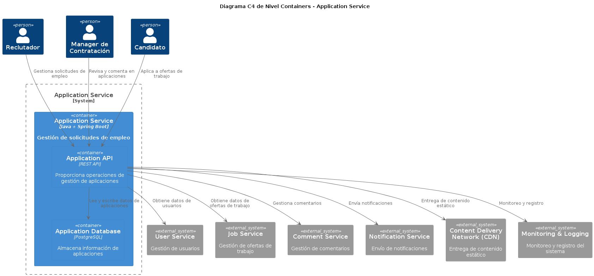
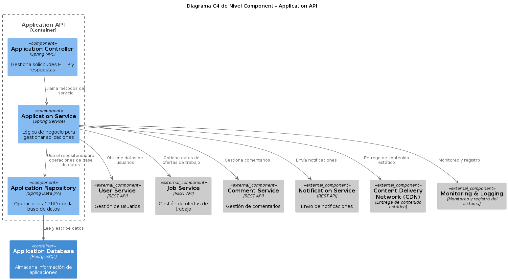
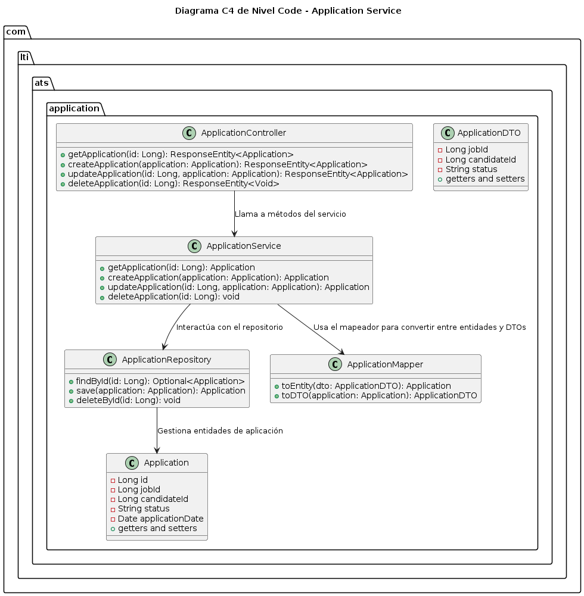

# LTI - Applicant Tracking System (ATS)
## Introducción
### Descripción breve del software LTI
LTI es un innovador sistema de seguimiento de candidatos (ATS) diseñado para revolucionar el proceso de reclutamiento mediante el uso de tecnologías avanzadas. Nuestro objetivo es desbancar a los actuales líderes del mercado al proporcionar una plataforma más eficiente, colaborativa y automatizada que aprovecha la inteligencia artificial en diversas tareas.

### Valor añadido
LTI ofrece una experiencia de usuario intuitiva, mejoras significativas en la colaboración en tiempo real y una automatización avanzada que reduce el tiempo y el esfuerzo requerido para el reclutamiento. Nuestra plataforma se integra perfectamente con otras herramientas de recursos humanos y sistemas de comunicación, asegurando una operación sin interrupciones.

### Ventajas competitivas
- **Automatización Avanzada:** Reducción de tareas manuales mediante la automatización inteligente.
- **Colaboración en Tiempo Real:** Herramientas que facilitan la interacción entre reclutadores y managers.
- **Asistencia de IA:** Utilización de IA para preselección de candidatos, predicción de adecuación y análisis de datos.
- **Experiencia del Usuario Superior:** Interfaz intuitiva y accesible desde cualquier dispositivo.
- **Integración y Escalabilidad:** Compatible con múltiples plataformas y adaptable a empresas de cualquier tamaño.

## Explicación de las funciones principales

1. **Inteligencia Artificial y Machine Learning**
    - Preselección automática de candidatos basándose en descripciones de trabajo y currículums.
    - Análisis predictivo para identificar candidatos con mayor probabilidad de éxito.

2. **Automatización de Tareas**

    - Envío automatizado de correos electrónicos y notificaciones.
    - Programación de entrevistas y seguimiento de candidatos de forma automática.

3. **Interfaz Intuitiva y Portal de Candidatos**

    - Diseño limpio y fácil de usar para reclutadores y candidatos.
    - Portal de candidatos donde pueden gestionar sus aplicaciones y recibir actualizaciones.

4. **Colaboración en Tiempo Real**

    - Herramientas de comunicación integradas para facilitar la colaboración entre miembros del equipo de contratación.
    - Compartir y revisar perfiles de candidatos en tiempo real.

5. **Análisis y Reportes Avanzados**

    - Paneles de control personalizables con informes detallados en tiempo real.
    - Análisis de KPIs y métricas de rendimiento del proceso de contratación.

6. **Base de Datos Centralizada y Gestión de Talento**

    - Almacenamiento y gestión de perfiles de candidatos, incluidos candidatos potenciales para futuras oportunidades.
    - Seguridad y cumplimiento con normativas como GDPR y CCPA.

7. **Chatbots y Asistentes Virtuales**

    - Interacción con candidatos para responder preguntas frecuentes y guiar en el proceso de solicitud.
    - Evaluaciones y pruebas en línea integradas para la preselección.

8. **Integración con Múltiples Plataformas**

    - Compatibilidad con sistemas de RR.HH., redes sociales y otras plataformas de reclutamiento.
    - APIs robustas para una integración fluida con aplicaciones de terceros.

## Modelo de negocio

| **Lean Canvas**                     | **LTI - Applicant Tracking System**               |
|-------------------------------------|---------------------------------------------------|
| **Problema**                        | - Procesos de reclutamiento ineficientes          |
|                                     | - Falta de colaboración en tiempo real            |
|                                     | - Dependencia de tareas manuales                  |
|                                     | - Limitada asistencia tecnológica                 |
|-------------------------------------|---------------------------------------------------|
| **Solución**                        | - Automatización avanzada                         |
|                                     | - Colaboración en tiempo real                     |
|                                     | - Asistencia de IA                                |
|                                     | - Interfaz intuitiva y adaptable                  |
|-------------------------------------|---------------------------------------------------|
| **Métricas Clave**                  | - Tiempo de contratación                          |
|                                     | - Coste por contratación                          |
|                                     | - Tasa de éxito de candidatos                     |
|                                     | - Satisfacción de usuarios                        |
|-------------------------------------|---------------------------------------------------|
| **Propuesta de Valor**              | - Eficiencia mejorada para departamentos de HR    |
|                                     | - Herramientas colaborativas en tiempo real       |
|                                     | - Reducción de tareas manuales                    |
|                                     | - Integración y escalabilidad                     |
|-------------------------------------|---------------------------------------------------|
| **Ventaja Competitiva**             | - Tecnología avanzada y automatización            |
|                                     | - Asistencia de IA en tareas clave                |
|                                     | - Experiencia de usuario superior                 |
|-------------------------------------|---------------------------------------------------|
| **Canales**                         | - Marketing digital                               |
|                                     | - Ferias y conferencias de recursos humanos       |
|                                     | - Publicidad en redes sociales                    |
|                                     | - Alianzas estratégicas con plataformas de RR.HH. |
|-------------------------------------|---------------------------------------------------|
| **Segmento de Clientes**            | - Empresas medianas y grandes                     |
|                                     | - Equipos de recursos humanos                     |
|                                     | - Reclutadores independientes                     |
|-------------------------------------|---------------------------------------------------|
| **Estructura de Costos**            | - Desarrollo y mantenimiento del software         |
|                                     | - Marketing y publicidad                          |
|                                     | - Soporte al cliente                              |
|                                     | - Investigación y desarrollo (I+D)                |
|-------------------------------------|---------------------------------------------------|
| **Flujo de Ingresos**               | - Suscripción mensual/anual                       |
|                                     | - Tarifas por usuario adicional                   |
|                                     | - Servicios premium y personalización             |
|-------------------------------------|---------------------------------------------------|

Este modelo asegura que LTI se enfoque en resolver problemas críticos en el proceso de reclutamiento mientras ofrece valor añadido y ventajas competitivas claras a sus usuarios.

## Casos de uso principales

### Caso de Uso 1: **Preselección Automática de Candidatos**

#### Descripción:

Utilizando inteligencia artificial y machine learning, el sistema preseleccionará automáticamente a los candidatos más adecuados basándose en las descripciones de trabajo y los currículums presentados.

#### Funcionalidades Clave:

-   **Análisis de Currículums**: Escaneo y análisis de currículums para extraer habilidades, experiencias y cualificaciones.
-   **Matching Algorítmico**: Algoritmos de machine learning que comparan las descripciones de trabajo con los perfiles de los candidatos para identificar los mejores ajustes.
-   **Ranking de Candidatos**: Generación de una lista ordenada de candidatos basándose en su adecuación a la posición.

#### Beneficios:

-   **Eficiencia Mejorada**: Reducción del tiempo necesario para revisar manualmente los currículums.
-   **Precisión en la Selección**: Mejora en la precisión al identificar candidatos que cumplen con los requisitos específicos.
-   **Experiencia del Candidato**: Los candidatos más adecuados reciben respuestas más rápidas, mejorando su experiencia.

### Caso de Uso 2: **Colaboración en Tiempo Real entre Reclutadores y Managers**

#### Descripción:

El sistema permite la colaboración en tiempo real entre los reclutadores y los managers de contratación para evaluar y tomar decisiones sobre los candidatos de manera conjunta.

#### Funcionalidades Clave:

-   **Comentarios y Notas Compartidas**: Herramientas para que los usuarios dejen comentarios y notas sobre los candidatos en tiempo real.
-   **Revisión Conjunta de Candidatos**: Funcionalidades que permiten a múltiples usuarios revisar y discutir sobre los candidatos simultáneamente.
-   **Historial de Comunicaciones**: Registro completo de todas las interacciones y decisiones tomadas respecto a cada candidato.

#### Beneficios:

-   **Decisiones Rápidas**: Aceleración del proceso de toma de decisiones gracias a la comunicación en tiempo real.
-   **Mejora en la Colaboración**: Facilita una colaboración más fluida y eficaz entre los equipos de contratación.
-   **Transparencia**: Asegura que todas las partes interesadas tienen acceso a la misma información y comentarios.

### Caso de Uso 3: **Automatización de Tareas Repetitivas**

#### Descripción:

El sistema automatiza tareas repetitivas como el envío de correos electrónicos, la programación de entrevistas y el seguimiento de candidatos, liberando tiempo para que los reclutadores se concentren en actividades de mayor valor.

#### Funcionalidades Clave:

-   **Envío Automático de Correos Electrónicos**: Plantillas de correo y programación automática de envíos para confirmaciones de entrevistas, actualizaciones de estado y comunicaciones de rechazo.
-   **Programación Automática de Entrevistas**: Integración con calendarios y herramientas de programación para organizar entrevistas sin intervención manual.
-   **Seguimiento y Recordatorios Automáticos**: Envío de recordatorios y seguimiento automático de los candidatos en cada etapa del proceso de selección.

#### Beneficios:

-   **Eficiencia Operativa**: Reducción significativa del tiempo dedicado a tareas administrativas.
-   **Mejora en la Precisión**: Minimización de errores humanos en la programación y seguimiento.
-   **Experiencia del Usuario**: Ofrece una experiencia más fluida y profesional tanto para candidatos como para reclutadores.

Estos tres casos de uso son fundamentales para el éxito del sistema ATS de LTI, proporcionando eficiencia, precisión y una experiencia superior para todos los usuarios del sistema.

## Modelo de datos

## Diseño del sistema a alto nivel

A continuación se presenta el diseño del sistema ATS de LTI utilizando una arquitectura de microservicios. Este diseño incluye el uso de API, balanceo de carga y CDN para garantizar escalabilidad, alta disponibilidad y rendimiento.

### Componentes Principales:

1.  **Cliente (Frontend)**
    
    -   Interfaz web y aplicaciones móviles.
    -   Interacción con el sistema a través de API Gateway.
2.  **API Gateway**
    
    -   Punto de entrada único para todos los clientes.
    -   Encaminamiento de solicitudes a los microservicios correspondientes.
    -   Manejo de autenticación, autorización y limitación de tasa.
3.  **Microservicios**
    
    -   **User Service**: Gestión de usuarios (reclutadores, managers y candidatos).
    -   **Job Service**: Gestión de posiciones de trabajo.
    -   **Application Service**: Gestión de aplicaciones a los puestos de trabajo.
    -   **Comment Service**: Gestión de comentarios y notas.
    -   **Automation Service**: Gestión de tareas de automatización.
    -   **Resume Service**: Análisis y almacenamiento de currículums.
    -   **Notification Service**: Envío de notificaciones (correo electrónico, SMS).
    -   **Analytics Service**: Análisis de datos y generación de informes.
4.  **Bases de Datos**
    
    -   Bases de datos dedicadas para cada microservicio para garantizar la descentralización y la independencia.
5.  **Load Balancer**
    
    -   Distribución de la carga entre los microservicios para garantizar alta disponibilidad y escalabilidad.
6.  **Content Delivery Network (CDN)**
    
    -   Distribución de contenido estático (imágenes, scripts, etc.) para mejorar la velocidad de carga y reducir la latencia.
7.  **Monitoring and Logging**
    
    -   Sistemas de monitoreo y registro para supervisar la salud y el rendimiento de los microservicios.

### Diagrama:

## Diagrama C4

### Nivel 1: Context ATS de LTI

### Nivel 2: Containers (Sistema "Application Service")

### Nivel 3: Components (Container Application API)

### Nivel 4: Code (Componente "Application Service")

