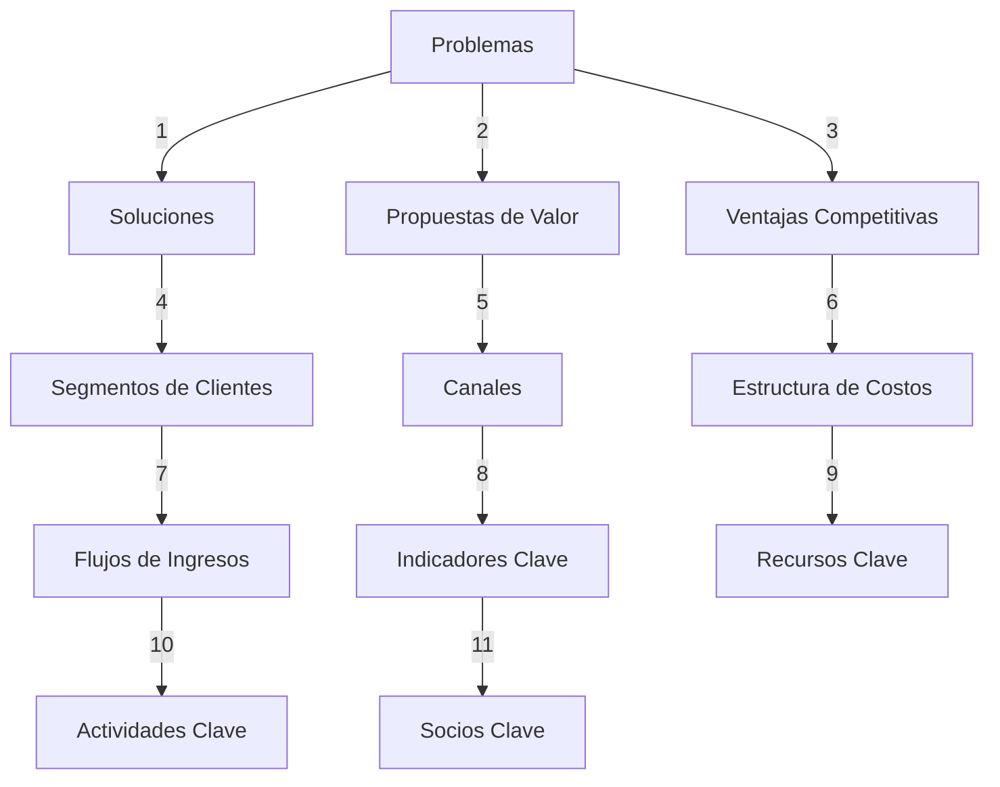
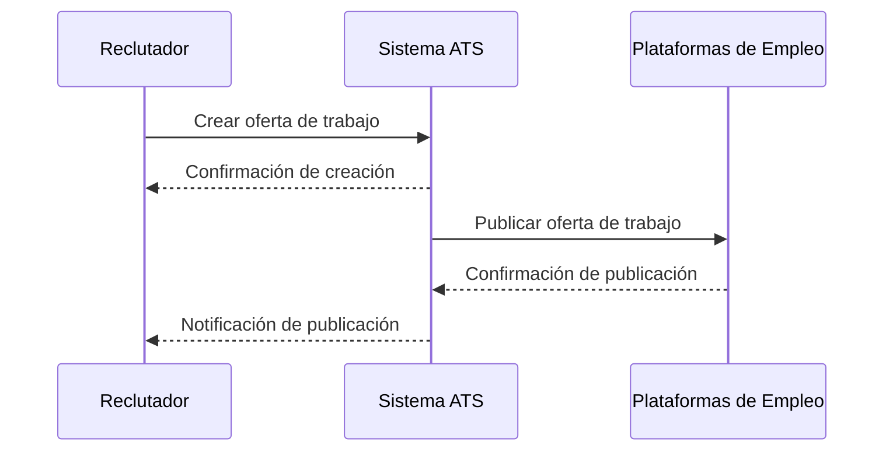
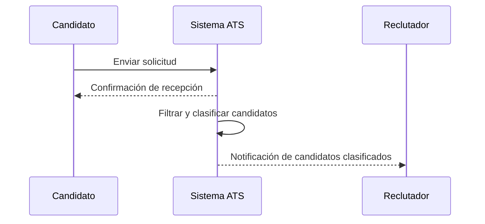
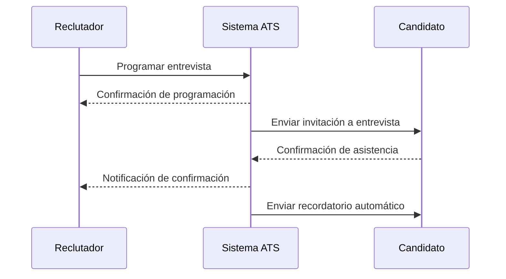
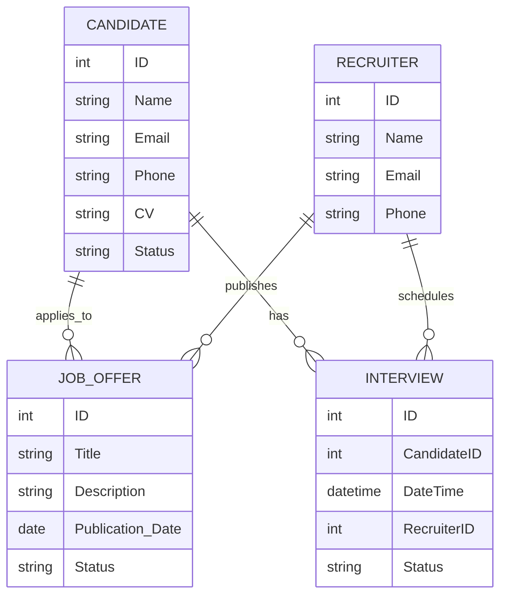

# LTI - Applicant Tracking System

## Descripción Breve del Software LTI
LTI es un sistema de seguimiento de candidatos (ATS) diseñado para revolucionar el proceso de reclutamiento. Nuestro objetivo es aumentar la eficiencia de los departamentos de recursos humanos, mejorar la colaboración en tiempo real entre reclutadores y managers, y automatizar tareas clave con la asistencia de inteligencia artificial.

## Valor Añadido
LTI ofrece una solución integral que no solo gestiona el proceso de reclutamiento, sino que también proporciona herramientas avanzadas de análisis y automatización. A diferencia de otras soluciones en el mercado, LTI se enfoca en la experiencia del usuario, tanto para los reclutadores como para los candidatos, asegurando un proceso de selección más fluido y eficiente.

## Ventajas Competitivas
- **Automatización Avanzada**: LTI utiliza inteligencia artificial para automatizar tareas repetitivas, permitiendo a los reclutadores centrarse en actividades estratégicas.
- **Colaboración en Tiempo Real**: Herramientas integradas para la colaboración entre equipos, facilitando la comunicación y la toma de decisiones.
- **Análisis y Reportes Detallados**: Generación de informes y análisis detallados para medir la eficiencia del proceso de reclutamiento.
- **Integración Sencilla**: Compatible con múltiples plataformas y sistemas de recursos humanos existentes.
- **Experiencia del Candidato**: Portales y herramientas diseñadas para mejorar la experiencia del candidato durante el proceso de selección.

## Funciones Principales
1. **Gestión de Candidatos**:
   - Almacenamiento y organización de perfiles de candidatos.
   - Seguimiento del estado de cada candidato en el proceso de selección.

2. **Publicación de Ofertas de Trabajo**:
   - Creación y publicación de ofertas de trabajo en múltiples plataformas y portales de empleo.
   - Integración con redes sociales y sitios web de la empresa.

3. **Filtrado y Clasificación de Candidatos**:
   - Herramientas de búsqueda y filtrado para identificar candidatos adecuados.
   - Clasificación automática de candidatos según criterios predefinidos.

4. **Comunicación con Candidatos**:
   - Envío de correos electrónicos y mensajes automáticos a los candidatos.
   - Programación de entrevistas y recordatorios.

5. **Colaboración del Equipo de Reclutamiento**:
   - Herramientas para la colaboración y comunicación entre los miembros del equipo de reclutamiento.
   - Asignación de tareas y seguimiento del progreso.

6. **Integración con Otros Sistemas**:
   - Integración con sistemas de recursos humanos (HRIS) y otras herramientas de gestión.
   - Sincronización con calendarios y sistemas de correo electrónico.

7. **Análisis y Reportes**:
   - Generación de informes y análisis sobre el proceso de selección.
   - Métricas de rendimiento y eficiencia del reclutamiento.

8. **Cumplimiento Legal y Seguridad**:
   - Almacenamiento seguro de datos personales de los candidatos.
   - Cumplimiento con regulaciones de privacidad y protección de datos.

9. **Experiencia del Candidato**:
   - Portales de candidatos para seguimiento de su aplicación.
   - Formularios y encuestas de satisfacción.

10. **Automatización de Procesos**:
    - Automatización de tareas repetitivas y administrativas.
    - Flujos de trabajo personalizados para diferentes tipos de procesos de selección.

## Diagrama Lean Canvas


## Casos de Uso Principales

### Caso de Uso 1: Publicación de Ofertas de Trabajo
**Descripción**: El reclutador crea y publica una oferta de trabajo en múltiples plataformas y portales de empleo.



### Caso de Uso 2: Filtrado y Clasificación de Candidatos
**Descripción**: El sistema filtra y clasifica automáticamente a los candidatos según criterios predefinidos.



### Caso de Uso 3: Programación de Entrevistas
**Descripción**: El reclutador programa entrevistas con los candidatos seleccionados y envía recordatorios automáticos.



## Modelo de Datos

### Entidades y Atributos

#### Candidate
- **ID**: int
- **Name**: string
- **Email**: string
- **Phone**: string
- **CV**: string (URL to the file)
- **Status**: string (e.g., "Applied", "In Process", "Rejected", "Hired")

#### Job Offer
- **ID**: int
- **Title**: string
- **Description**: string
- **Publication Date**: date
- **Status**: string (e.g., "Open", "Closed")

#### Interview
- **ID**: int
- **CandidateID**: int (relation to Candidate)
- **DateTime**: datetime
- **RecruiterID**: int (relation to Recruiter)
- **Status**: string (e.g., "Scheduled", "Completed", "Cancelled")

#### Recruiter
- **ID**: int
- **Name**: string
- **Email**: string
- **Phone**: string

### Relationships

- **Candidate** applies to **Job Offer** (1:N)
- **Interview** is associated with **Candidate** (1:N)
- **Interview** is associated with **Recruiter** (1:N)
- **Recruiter** publishes **Job Offer** (1:N)

## Entity-Relationship Diagram (ERD)


## Diseño del Sistema a Alto Nivel

### Descripción
El sistema LTI (Applicant Tracking System) está diseñado para gestionar el proceso de reclutamiento de manera eficiente y colaborativa. A continuación se describen los componentes principales del sistema y sus interacciones:

1. **Frontend**: La interfaz de usuario que interactúa con los reclutadores y candidatos. Incluye:
   - **Portal de Reclutadores**: Donde los reclutadores pueden publicar ofertas de trabajo, gestionar candidatos, programar entrevistas y colaborar con otros miembros del equipo.
   - **Portal de Candidatos**: Donde los candidatos pueden buscar y aplicar a ofertas de trabajo, y seguir el estado de sus aplicaciones.

2. **Backend**: El servidor que maneja la lógica de negocio y las operaciones del sistema. Incluye:
   - **API REST**: Proporciona endpoints para que el frontend interactúe con el sistema.
   - **Servicios de Negocio**: Implementan la lógica de negocio, como la gestión de candidatos, ofertas de trabajo, entrevistas, etc.

3. **Base de Datos**: Almacena toda la información relacionada con candidatos, ofertas de trabajo, entrevistas y usuarios del sistema.

4. **Servicios Externos**: Integraciones con servicios de terceros, como plataformas de empleo, servicios de correo electrónico, y sistemas de recursos humanos (HRIS).

### Diagrama de Alto Nivel
```mermaid
graph TD
    subgraph Frontend
        A[Portal de Reclutadores]
        B[Portal de Candidatos]
    end

    subgraph Backend
        C[API REST]
        D[Servicios de Negocio]
    end

    subgraph Base de Datos
        E[(Base de Datos)]
    end

    subgraph Servicios Externos
        F[Plataformas de Empleo]
        G[Servicios de Correo Electrónico]
        H[Sistemas de Recursos Humanos (HRIS)]
    end

    A -->|Solicitudes| C
    B -->|Solicitudes| C
    C -->|Operaciones| D
    D -->|Consultas y Actualizaciones| E
    D -->|Integraciones| F
    D -->|Notificaciones| G
    D -->|Sincronización| H
```
