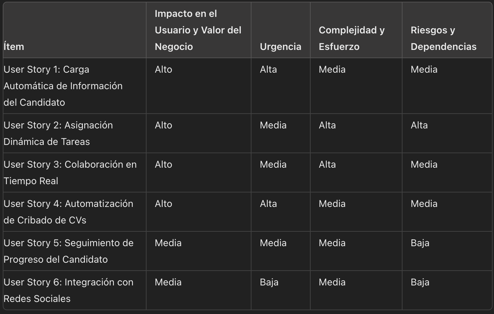

**Prompt:**

## 1. User Story

Eres un Product Manager y Business Analyst, experto con experiencia en sistemas de seguimiento de candidatos (ATS). Usando el documento "LTI-WBF.md" como referencia, que contiene PRD básico (funcionalidades clave, casos de uso, modelo de datos etc), crea  cuatro historias de usuario para el sistema de gestión de candidatos LTI. Utiliza la siguiente plantilla estándar para cada historia de usuario:

**Plantilla para la Historia de Usuario:**

- **Título de la Historia de Usuario:** [Título Descriptivo]
- **Como [rol del usuario], quiero [acción que desea realizar el usuario], para que [beneficio que espera obtener el usuario].**
- **Criterios de Aceptación:**
  - [Detalle específico de funcionalidad]
  - [Detalle específico de funcionalidad]
  - [Detalle específico de funcionalidad]
- **Notas Adicionales:**
  - [Cualquier consideración adicional]
- **Historias de Usuario Relacionadas:**
  - [Relaciones con otras historias de usuario]

**Contexto:**
El sistema LTI es una solución avanzada para la gestión de candidatos, impulsada por inteligencia artificial y automatización, diseñada para mejorar la eficiencia del proceso de reclutamiento y la colaboración en tiempo real entre los equipos de recursos humanos y managers.

### Ejemplo de Historias de Usuario:

1. **Título de la Historia de Usuario:** Carga Automática de Información del Candidato
   - **Como reclutador, quiero que la IA extraiga automáticamente la información de los CVs que subo, para que pueda organizar rápidamente el perfil del candidato.**
   - **Criterios de Aceptación:**
     - Al subir un CV, la IA debe extraer automáticamente la experiencia laboral, habilidades y educación.
     - La información extraída debe ser organizada y presentada en el perfil del candidato.
     - El reclutador debe recibir una notificación confirmando la finalización del proceso.
   - **Notas Adicionales:**
     - La IA debe manejar diferentes formatos de CV (PDF, DOCX).
   - **Historias de Usuario Relacionadas:**
     - Ninguna.

2. **Título de la Historia de Usuario:** Asignación Dinámica de Tareas
   - **Como manager, quiero que la IA asigne automáticamente tareas al equipo más adecuado, para optimizar los flujos de trabajo.**
   - **Criterios de Aceptación:**
     - La IA debe analizar la disponibilidad y habilidades del equipo antes de asignar tareas.
     - Las tareas deben ser asignadas con una prioridad basada en la carga de trabajo actual.
     - El manager debe poder ver y ajustar las asignaciones si es necesario.
   - **Notas Adicionales:**
     - Las asignaciones deben ser actualizadas en tiempo real.
   - **Historias de Usuario Relacionadas:**
     - Ninguna.

**Instrucciones Adicionales:**
- Asegúrate de que cada historia de usuario sea clara y detallada.
- Mantén la coherencia en el uso de la plantilla para todas las historias de usuario.
- Refiérete al documento "LTI-WBF.md" para obtener información adicional y asegurar que las historias de usuario estén alineadas con el PRD básico.

## Resultado

### Historia de Usuario 1: Carga Automática de Información del Candidato

**Título de la Historia de Usuario:** Carga Automática de Información del Candidato

**Como** reclutador, **quiero** que la IA extraiga automáticamente la información de los CVs que subo, **para que** pueda organizar rápidamente el perfil del candidato.

**Criterios de Aceptación:**
- Al subir un CV, la IA debe extraer automáticamente la experiencia laboral, habilidades y educación.
- La información extraída debe ser organizada y presentada en el perfil del candidato.
- El reclutador debe recibir una notificación confirmando la finalización del proceso.

**Notas Adicionales:**
- La IA debe manejar diferentes formatos de CV (PDF, DOCX).

**Historias de Usuario Relacionadas:**
- Ninguna.

### Historia de Usuario 2: Asignación Dinámica de Tareas

**Título de la Historia de Usuario:** Asignación Dinámica de Tareas

**Como** manager, **quiero** que la IA asigne automáticamente tareas al equipo más adecuado, **para** optimizar los flujos de trabajo.

**Criterios de Aceptación:**
- La IA debe analizar la disponibilidad y habilidades del equipo antes de asignar tareas.
- Las tareas deben ser asignadas con una prioridad basada en la carga de trabajo actual.
- El manager debe poder ver y ajustar las asignaciones si es necesario.

**Notas Adicionales:**
- Las asignaciones deben ser actualizadas en tiempo real.

**Historias de Usuario Relacionadas:**
- Ninguna.

### Historia de Usuario 3: Colaboración en Tiempo Real

**Título de la Historia de Usuario:** Colaboración en Tiempo Real

**Como** reclutador, **quiero** colaborar en tiempo real con los managers sobre los perfiles de los candidatos, **para** mejorar la toma de decisiones.

**Criterios de Aceptación:**
- Los comentarios y anotaciones sobre los perfiles deben ser visibles para todos los miembros del equipo en tiempo real.
- Debe haber una funcionalidad de notificación para alertar a los usuarios sobre nuevas colaboraciones.
- La plataforma debe soportar la edición simultánea de los perfiles.

**Notas Adicionales:**
- Debe existir un historial de cambios para rastrear las colaboraciones.

**Historias de Usuario Relacionadas:**
- Ninguna.

### Historia de Usuario 4: Automatización de Cribado de CVs

**Título de la Historia de Usuario:** Automatización de Cribado de CVs

**Como** reclutador, **quiero** que la IA cribe automáticamente los CVs basándose en criterios predefinidos, **para** reducir el tiempo de revisión.

**Criterios de Aceptación:**
- La IA debe evaluar los CVs según los criterios de la empresa (experiencia, habilidades, educación).
- Los CVs que no cumplan con los criterios deben ser marcados para revisión posterior.
- Los CVs que cumplan con los criterios deben ser destacados para revisión prioritaria.

**Notas Adicionales:**
- El reclutador debe poder ajustar los criterios de cribado.

**Historias de Usuario Relacionadas:**
- Ninguna.

### Historia de Usuario 5: Seguimiento de Progreso del Candidato

**Título de la Historia de Usuario:** Seguimiento de Progreso del Candidato

**Como** reclutador, **quiero** tener una vista del progreso de cada candidato a lo largo del proceso de selección, **para** monitorear y gestionar eficazmente su avance.

**Criterios de Aceptación:**
- Debe existir una visualización del progreso del candidato a través de diferentes etapas del proceso de selección (entrevista, pruebas, evaluaciones).
- El reclutador debe recibir notificaciones cuando un candidato complete una etapa del proceso.
- El sistema debe permitir agregar notas y comentarios en cada etapa.

**Notas Adicionales:**
- La visualización debe ser intuitiva y fácil de entender.

**Historias de Usuario Relacionadas:**
- Ninguna.

### Historia de Usuario 6: Integración con Redes Sociales

**Título de la Historia de Usuario:** Integración con Redes Sociales

**Como** reclutador, **quiero** que el sistema se integre con redes sociales profesionales como LinkedIn, **para** obtener información adicional sobre los candidatos.

**Criterios de Aceptación:**
- El sistema debe permitir importar información del perfil de LinkedIn del candidato.
- La información importada debe ser integrada en el perfil del candidato en el sistema.
- Debe haber una opción para actualizar periódicamente la información desde LinkedIn.

**Notas Adicionales:**
- La integración debe cumplir con las políticas de privacidad y términos de uso de las redes sociales.

**Historias de Usuario Relacionadas:**
- Ninguna.

## 2. User Story

Genera un backlog de producto para un sistema de gestión de candidatos basado en las siguientes historias de usuario: Organiza las historias de usuario en un backlog utilizando la metodología MoSCoW y desglosa cada historia en tickets de trabajo con estimaciones de esfuerzo. 

Criterios de Priorización: 
Impacto en el usuario y valor del negocio
Urgencia basada en tendencias del mercado y feedback de usuarios
Complejidad y esfuerzo estimado de implementación
Riesgos y dependencias entre tareas. 

Ver imagen de ejemplo.

### Backlog de Producto Utilizando la Metodología MoSCoW

#### Must Have
1. **Carga Automática de Información del Candidato**
   - Impacto en el Usuario y Valor del Negocio: Alto
   - Urgencia: Alta
   - Complejidad y Esfuerzo: Media
   - Riesgos y Dependencias: Media

2. **Automatización de Cribado de CVs**
   - Impacto en el Usuario y Valor del Negocio: Alto
   - Urgencia: Alta
   - Complejidad y Esfuerzo: Media
   - Riesgos y Dependencias: Media

#### Should Have
3. **Colaboración en Tiempo Real**
   - Impacto en el Usuario y Valor del Negocio: Alto
   - Urgencia: Media
   - Complejidad y Esfuerzo: Alta
   - Riesgos y Dependencias: Media

4. **Asignación Dinámica de Tareas**
   - Impacto en el Usuario y Valor del Negocio: Alto
   - Urgencia: Media
   - Complejidad y Esfuerzo: Alta
   - Riesgos y Dependencias: Alta

#### Could Have
5. **Seguimiento de Progreso del Candidato**
   - Impacto en el Usuario y Valor del Negocio: Media
   - Urgencia: Media
   - Complejidad y Esfuerzo: Media
   - Riesgos y Dependencias: Baja

6. **Integración con Redes Sociales**
   - Impacto en el Usuario y Valor del Negocio: Media
   - Urgencia: Baja
   - Complejidad y Esfuerzo: Media
   - Riesgos y Dependencias: Baja

### Desglose en Tickets de Trabajo con Estimaciones de Esfuerzo

#### Historia de Usuario 1: Carga Automática de Información del Candidato

**Criterios de Aceptación:**
- Al subir un CV, la IA debe extraer automáticamente la experiencia laboral, habilidades y educación.
- La información extraída debe ser organizada y presentada en el perfil del candidato.
- El reclutador debe recibir una notificación confirmando la finalización del proceso.

**Tickets de Trabajo:**
1. **Implementar subida de CVs en diferentes formatos (PDF, DOCX)**
   - Estimación: 5 puntos
2. **Desarrollar algoritmos de extracción de información**
   - Estimación: 8 puntos
3. **Organizar la información extraída en el perfil del candidato**
   - Estimación: 5 puntos
4. **Notificaciones al reclutador sobre la finalización del proceso**
   - Estimación: 3 puntos

#### Historia de Usuario 2: Automatización de Cribado de CVs

**Criterios de Aceptación:**
- La IA debe evaluar los CVs según los criterios de la empresa (experiencia, habilidades, educación).
- Los CVs que no cumplan con los criterios deben ser marcados para revisión posterior.
- Los CVs que cumplan con los criterios deben ser destacados para revisión prioritaria.

**Tickets de Trabajo:**
1. **Definir criterios de cribado basados en los requisitos de la empresa**
   - Estimación: 3 puntos
2. **Desarrollar algoritmos de cribado automático**
   - Estimación: 8 puntos
3. **Implementar sistema de marcado y destaque de CVs**
   - Estimación: 5 puntos
4. **Configurar notificaciones de resultados de cribado**
   - Estimación: 3 puntos

#### Historia de Usuario 3: Colaboración en Tiempo Real

**Criterios de Aceptación:**
- Los comentarios y anotaciones sobre los perfiles deben ser visibles para todos los miembros del equipo en tiempo real.
- Debe haber una funcionalidad de notificación para alertar a los usuarios sobre nuevas colaboraciones.
- La plataforma debe soportar la edición simultánea de los perfiles.

**Tickets de Trabajo:**
1. **Implementar funcionalidad de comentarios y anotaciones en tiempo real**
   - Estimación: 5 puntos
2. **Desarrollar sistema de notificaciones para nuevas colaboraciones**
   - Estimación: 3 puntos
3. **Soporte para edición simultánea de perfiles**
   - Estimación: 8 puntos
4. **Registrar historial de cambios y colaboraciones**
   - Estimación: 5 puntos

#### Historia de Usuario 4: Asignación Dinámica de Tareas

**Criterios de Aceptación:**
- La IA debe analizar la disponibilidad y habilidades del equipo antes de asignar tareas.
- Las tareas deben ser asignadas con una prioridad basada en la carga de trabajo actual.
- El manager debe poder ver y ajustar las asignaciones si es necesario.

**Tickets de Trabajo:**
1. **Desarrollar algoritmos de análisis de disponibilidad y habilidades del equipo**
   - Estimación: 8 puntos
2. **Implementar asignación automática de tareas basadas en prioridad**
   - Estimación: 5 puntos
3. **Crear interfaz para que los managers puedan ver y ajustar asignaciones**
   - Estimación: 5 puntos
4. **Actualizar asignaciones en tiempo real según la carga de trabajo**
   - Estimación: 3 puntos

#### Historia de Usuario 5: Seguimiento de Progreso del Candidato

**Criterios de Aceptación:**
- Debe existir una visualización del progreso del candidato a través de diferentes etapas del proceso de selección (entrevista, pruebas, evaluaciones).
- El reclutador debe recibir notificaciones cuando un candidato complete una etapa del proceso.
- El sistema debe permitir agregar notas y comentarios en cada etapa.

**Tickets de Trabajo:**
1. **Desarrollar visualización del progreso del candidato a través de diferentes etapas**
   - Estimación: 5 puntos
2. **Implementar notificaciones de progreso**
   - Estimación: 3 puntos
3. **Permitir agregar notas y comentarios en cada etapa**
   - Estimación: 5 puntos

#### Historia de Usuario 6: Integración con Redes Sociales

**Criterios de Aceptación:**
- El sistema debe permitir importar información del perfil de LinkedIn del candidato.
- La información importada debe ser integrada en el perfil del candidato en el sistema.
- Debe haber una opción para actualizar periódicamente la información desde LinkedIn.

**Tickets de Trabajo:**
1. **Implementar integración con LinkedIn para importar información del perfil**
   - Estimación: 5 puntos
2. **Integrar información importada en el perfil del candidato en el sistema**
   - Estimación: 5 puntos
3. **Configurar actualización periódica de información desde LinkedIn**
   - Estimación: 3 puntos

### Conclusiones

Para generar el backlog y los tickets de trabajo, utilicé los criterios de priorización (impacto en el usuario, urgencia, complejidad y riesgos) para organizar las historias de usuario en una metodología MoSCoW. Desglosé cada historia en tickets de trabajo específicos con estimaciones de esfuerzo, asegurando que cada tarea es clara y manejable.

Este proceso asegura que las funcionalidades más críticas y de mayor valor se aborden primero, permitiendo al equipo de desarrollo centrarse en entregar el máximo valor posible en cada sprint. Utilizando herramientas como Trello, puedes organizar visualmente el backlog y gestionar los tickets de trabajo de manera eficiente.