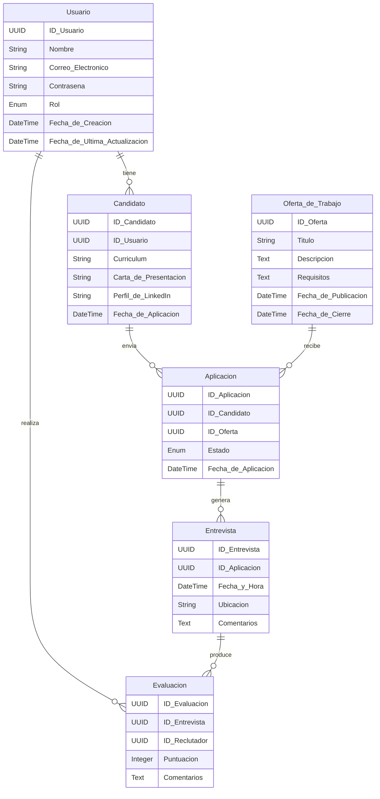
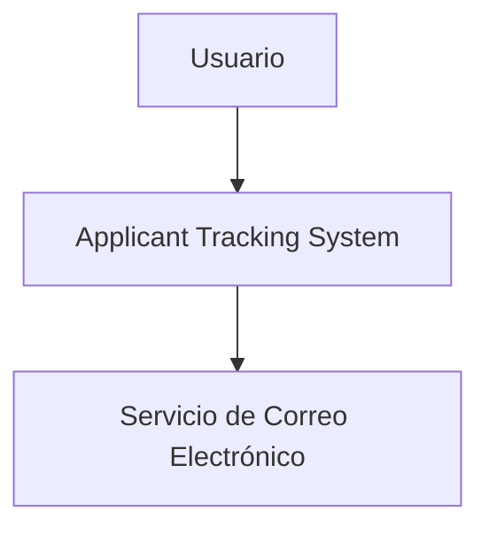

# Applicant Tracking System (ATS) LIDR

## Funcionalidades Clave para un Applicant Tracking System (ATS) Moderno

### Funcionalidades Clave

1. **Automatización de Procesos**

   - **Filtrado Automático de Candidatos**: Utilizar IA para analizar currículums y cartas de presentación, destacando a los candidatos más adecuados.
   - **Gestión de Correo Electrónico Automatizado**: Envío automático de correos electrónicos a candidatos para confirmar recepción de solicitudes, actualizaciones del estado de la aplicación y notificaciones de entrevistas.

2. **Colaboración en Tiempo Real**

   - **Panel de Control Compartido**: Plataforma centralizada donde los reclutadores y managers pueden ver el estado de las candidaturas, dejar comentarios y puntuar a los candidatos.
   - **Chat y Mensajería Interna**: Funcionalidad de comunicación en tiempo real para discutir sobre candidatos y coordinar entrevistas.

3. **Asistencia de IA**

   - **Recomendación de Candidatos**: Algoritmos que sugieren candidatos potenciales basados en las descripciones de trabajo y el historial de contrataciones.
   - **Análisis de Sentimiento y Lenguaje**: Herramientas de IA que analizan el tono y la emoción en las entrevistas y comunicaciones escritas para evaluar la idoneidad cultural y la actitud.

4. **Automatización de Tareas Administrativas**

   - **Programación de Entrevistas**: Herramienta que permite a los candidatos seleccionar automáticamente las franjas horarias disponibles para entrevistas, integrándose con los calendarios de los reclutadores.
   - **Gestión de Documentos**: Almacenamiento centralizado y gestión de todos los documentos relacionados con la candidatura, accesibles para todos los stakeholders.

5. **Mejora de la Experiencia del Candidato**

   - **Portal del Candidato**: Portal intuitivo donde los candidatos pueden ver el estado de su aplicación, actualizar su información y recibir feedback.
   - **Feedback Automatizado**: Sistema que proporciona automáticamente retroalimentación a los candidatos sobre el estado de sus aplicaciones y áreas de mejora.

6. **Análisis y Reportes**

   - **Dashboard de KPIs**: Tablero de indicadores clave de rendimiento para evaluar la eficacia de las campañas de contratación y el desempeño de los reclutadores.
   - **Análisis de Diversidad**: Herramientas para monitorear y analizar la diversidad de los candidatos a lo largo del proceso de contratación.

7. **Integraciones y API**

   - **Integraciones con Plataformas de Empleo**: Conexiones con LinkedIn, Indeed, Glassdoor y otras plataformas para publicar ofertas de trabajo y recibir aplicaciones directamente en el ATS.
   - **API Abierta**: Para permitir integraciones con otras herramientas de HR y software empresarial.

8. **Funcionalidades de Seguridad y Cumplimiento**
   - **Cumplimiento de GDPR**: Herramientas para asegurar que todos los datos de los candidatos se manejen conforme a las regulaciones de privacidad.
   - **Autenticación Multifactor**: Implementación de autenticación en dos pasos para proteger la información sensible.

### Funcionalidades Adicionales

9. **Optimización Móvil**

   - **Aplicación Móvil**: Versión móvil del ATS para que los reclutadores y managers puedan gestionar las candidaturas desde cualquier lugar.

10. **Gamificación del Proceso de Selección**

    - **Desafíos y Evaluaciones Interactivas**: Pruebas y retos interactivos para evaluar las habilidades y la idoneidad de los candidatos de manera más dinámica.

11. **Feedback de Entrevistas en Vivo**
    - **Grabación y Análisis de Entrevistas en Vivo**: Herramientas para grabar entrevistas y analizarlas posteriormente utilizando IA para obtener insights adicionales.

## Descripción Breve del Software LTI

**LTI Applicant Tracking System (ATS)** es una plataforma avanzada de gestión de candidatos diseñada para revolucionar el proceso de contratación. Utilizando inteligencia artificial (IA) y herramientas de colaboración en tiempo real, LTI ATS mejora la eficiencia de los departamentos de recursos humanos y facilita una experiencia excepcional tanto para reclutadores como para candidatos.

## Valor Añadido

- **Automatización Inteligente**: Filtrado automático de candidatos y gestión de comunicaciones, reduciendo significativamente el tiempo y esfuerzo necesarios para encontrar al candidato ideal.
- **Colaboración en Tiempo Real**: Panel de control compartido y mensajería interna que permite a los equipos de contratación trabajar juntos de manera más efectiva y rápida.
- **Asistencia de IA**: Recomendaciones precisas de candidatos y análisis de sentimientos para una evaluación más profunda y eficaz.
- **Experiencia del Candidato Mejorada**: Portal intuitivo y feedback automatizado que mantienen a los candidatos informados y comprometidos durante todo el proceso de selección.

## Ventajas Competitivas

1. **Eficiencia Operativa**: La automatización de tareas repetitivas y la programación inteligente de entrevistas optimizan el tiempo de los reclutadores, permitiéndoles enfocarse en la toma de decisiones estratégicas.
2. **Colaboración Avanzada**: Herramientas de colaboración en tiempo real facilitan la comunicación entre reclutadores y managers, mejorando la toma de decisiones y acelerando el proceso de contratación.
3. **Análisis y Reportes**: Dashboards y análisis avanzados proporcionan insights clave para mejorar continuamente las estrategias de contratación y garantizar una diversidad adecuada en el proceso.
4. **Seguridad y Cumplimiento**: Funcionalidades robustas de seguridad y cumplimiento con regulaciones como GDPR aseguran que los datos sensibles de los candidatos estén protegidos.
5. **Movilidad y Accesibilidad**: La optimización móvil permite a los usuarios gestionar las candidaturas desde cualquier lugar, brindando flexibilidad y conveniencia.

LTI ATS se posiciona como una solución integral y moderna que supera las expectativas del mercado actual, proporcionando herramientas avanzadas para una gestión de candidatos más eficaz y eficiente.

## Lean Canvas - LTI Applicant Tracking System (ATS)

| **Sección**                                                                                                   | **Descripción**                                                                                                                                                                                          |
| ------------------------------------------------------------------------------------------------------------- | -------------------------------------------------------------------------------------------------------------------------------------------------------------------------------------------------------- |
|  **Problem**                                   | - Procesos de selección ineficientes y manuales. <br> - Dificultad en la colaboración en tiempo real entre reclutadores y managers. <br> - Experiencia del candidato insatisfactoria.                    |
|  **Solution**                                 | - Automatización inteligente con IA. <br> - Herramientas de colaboración en tiempo real. <br> - Portal intuitivo para candidatos y feedback automatizado.                                                |
|  **Key Metrics**                           | - Reducción del tiempo de contratación. <br> - Incremento en la tasa de aceptación de candidatos. <br> - Satisfacción de los usuarios (reclutadores y candidatos).                                       |
|  **Unique Value Proposition** | - Plataforma integral de gestión de candidatos con IA avanzada. <br> - Experiencia optimizada tanto para reclutadores como para candidatos. <br> - Funcionalidades robustas de seguridad y cumplimiento. |
|  **Unfair Advantage**                 | - Algoritmos de IA propietarios para recomendaciones precisas y análisis de sentimientos. <br> - Integración móvil completa para gestión en cualquier lugar.                                             |
|  **Channels**                                 | - Marketing digital (SEO, SEM, redes sociales). <br> - Alianzas con plataformas de empleo y software de HR. <br> - Participación en ferias y eventos de recursos humanos.                                |
|  **Customer Segments**               | - Empresas de todos los tamaños con necesidades de contratación. <br> - Departamentos de recursos humanos que buscan optimizar sus procesos.                                                             |
|  **Cost Structure**                     | - Desarrollo y mantenimiento del software. <br> - Gastos de marketing y ventas. <br> - Costos de soporte y capacitación al cliente.                                                                      |
|  **Revenue Streams**                   | - Suscripciones mensuales/anuales. <br> - Tarifas por usuario adicional. <br> - Servicios premium y personalización.                                                                                     |

**Nota:** Los colores utilizados son representativos y pueden variar en función de las herramientas que se usen para visualizar el markdown. Se recomienda utilizar herramientas que soporten la visualización de colores HTML.

## Casos de Uso para Applicant Tracking System (ATS)

### Caso de Uso: Filtrado Automático de Candidatos

#### Actor Principal

- Reclutador

#### Objetivo

- Reducir el tiempo y esfuerzo en la revisión inicial de currículums.

#### Precondiciones

- El candidato ha enviado su currículum y carta de presentación.
- La oferta de trabajo está publicada en el sistema.

#### Postcondiciones

- Los candidatos más adecuados son destacados y clasificados en una lista priorizada.

#### Flujo Principal

1. El reclutador publica una oferta de trabajo en el sistema.
2. Los candidatos envían sus aplicaciones (currículum y carta de presentación).
3. El sistema analiza las aplicaciones utilizando IA.
4. El sistema destaca a los candidatos más adecuados y los clasifica en una lista priorizada.
5. El reclutador revisa la lista y selecciona los candidatos para la siguiente fase.

#### Flujo Alternativo

- Si el sistema no puede analizar una aplicación, se notifica al reclutador para una revisión manual.

#### Código para Visualizar el Diagrama en Formato PlantUML:

```mermaid
@startuml
:Reclutador: --> (Publicar oferta de trabajo)
:Candidato: --> (Enviar currículum y carta de presentación)
(Publicar oferta de trabajo) --> (Analizar aplicaciones usando IA)
(Enviar currículum y carta de presentación) --> (Analizar aplicaciones usando IA)
(Analizar aplicaciones usando IA) --> (Destacar y clasificar candidatos adecuados)
(Destacar y clasificar candidatos adecuados) --> :Reclutador:
(Reclutador) --> (Revisar lista y seleccionar candidatos)
@enduml
```

### Caso de Uso: Programación Automática de Entrevistas

#### Actor Principal

- Candidato
- Reclutador

#### Objetivo

- Facilitar la programación de entrevistas reduciendo la necesidad de coordinación manual.

#### Precondiciones

- El candidato ha sido seleccionado para una entrevista.
- Las franjas horarias disponibles están configuradas en el sistema.

#### Postcondiciones

- La entrevista está programada y confirmada en los calendarios del candidato y el reclutador.

#### Flujo Principal

1. El reclutador selecciona al candidato para una entrevista.
2. El sistema envía una invitación al candidato con las franjas horarias disponibles.
3. El candidato selecciona una franja horaria.
4. El sistema confirma la entrevista y actualiza los calendarios del candidato y el reclutador.

#### Flujo Alternativo

- Si no hay franjas horarias disponibles, el sistema notifica al reclutador para añadir nuevas opciones.

#### Código para Visualizar el Diagrama en Formato PlantUML:

```mermaid
@startuml
:Reclutador: --> (Seleccionar candidato para entrevista)
(Seleccionar candidato para entrevista) --> (Enviar invitación con franjas horarias)
:ATS: --> (Enviar invitación con franjas horarias)
:Candidato: --> (Seleccionar franja horaria)
(Seleccionar franja horaria) --> :ATS:
:ATS: --> (Confirmar entrevista y actualizar calendarios)
(Confirmar entrevista y actualizar calendarios) --> :Reclutador:
(Confirmar entrevista y actualizar calendarios) --> :Candidato:
@enduml
```

### Caso de Uso: Portal del Candidato

#### Actor Principal

- Candidato

#### Objetivo

- Mejorar la experiencia del candidato proporcionando transparencia y comunicación continua.

#### Precondiciones

- El candidato ha creado una cuenta y ha enviado una aplicación.

#### Postcondiciones

- El candidato puede ver el estado de su aplicación y recibir feedback en tiempo real.

#### Flujo Principal

1. El candidato inicia sesión en el portal.
2. El candidato visualiza el estado de su aplicación.
3. El candidato actualiza su información personal si es necesario.
4. El sistema envía notificaciones y feedback en tiempo real al candidato.

#### Flujo Alternativo

- Si el candidato encuentra algún problema, puede contactar con el soporte a través del portal.

#### Código para Visualizar el Diagrama en Formato PlantUML:

```mermaid
@startuml
:Candidato: --> (Iniciar sesión en el portal)
(Iniciar sesión en el portal) --> (Visualizar estado de aplicación)
(Candidato) --> (Visualizar estado de aplicación)
(Candidato) --> (Actualizar información personal)
(Actualizar información personal) --> :ATS:
:ATS: --> (Enviar notificaciones y feedback)
(Enviar notificaciones y feedback) --> :Candidato:
@enduml
```

## Modelo de Datos para el Applicant Tracking System (ATS) de LTI

### Entidades y Atributos

#### 1. Usuario

- **ID Usuario**: UUID
  - Identificador único del usuario.
- **Nombre**: String
  - Nombre completo del usuario.
- **Correo Electrónico**: String
  - Correo electrónico del usuario.
- **Contraseña**: String (hashed)
  - Contraseña del usuario, almacenada de forma segura.
- **Rol**: Enum (Admin, Reclutador, Candidato)
  - Rol del usuario en el sistema.
- **Fecha de Creación**: DateTime
  - Fecha y hora en que se creó el usuario.
- **Fecha de Última Actualización**: DateTime
  - Fecha y hora de la última actualización del usuario.

#### 2. Candidato

- **ID Candidato**: UUID
  - Identificador único del candidato.
- **ID Usuario**: UUID (FK)
  - Referencia al ID del usuario en la tabla Usuario.
- **Currículum**: String (URL)
  - URL al archivo del currículum del candidato.
- **Carta de Presentación**: String (URL)
  - URL al archivo de la carta de presentación del candidato.
- **Perfil de LinkedIn**: String
  - URL al perfil de LinkedIn del candidato.
- **Fecha de Aplicación**: DateTime
  - Fecha y hora en que el candidato aplicó.

#### 3. Oferta de Trabajo

- **ID Oferta**: UUID
  - Identificador único de la oferta de trabajo.
- **Título**: String
  - Título del puesto.
- **Descripción**: Text
  - Descripción detallada del puesto.
- **Requisitos**: Text
  - Requisitos necesarios para el puesto.
- **Fecha de Publicación**: DateTime
  - Fecha y hora en que se publicó la oferta.
- **Fecha de Cierre**: DateTime
  - Fecha y hora en que se cierra la oferta.

#### 4. Aplicación

- **ID Aplicación**: UUID
  - Identificador único de la aplicación.
- **ID Candidato**: UUID (FK)
  - Referencia al ID del candidato en la tabla Candidato.
- **ID Oferta**: UUID (FK)
  - Referencia al ID de la oferta de trabajo en la tabla Oferta de Trabajo.
- **Estado**: Enum (Enviado, Revisado, Entrevista, Ofrecido, Rechazado)
  - Estado actual de la aplicación.
- **Fecha de Aplicación**: DateTime
  - Fecha y hora en que se envió la aplicación.

#### 5. Entrevista

- **ID Entrevista**: UUID
  - Identificador único de la entrevista.
- **ID Aplicación**: UUID (FK)
  - Referencia al ID de la aplicación en la tabla Aplicación.
- **Fecha y Hora**: DateTime
  - Fecha y hora de la entrevista.
- **Ubicación**: String
  - Ubicación de la entrevista.
- **Comentarios**: Text
  - Comentarios y observaciones sobre la entrevista.

#### 6. Evaluación

- **ID Evaluación**: UUID
  - Identificador único de la evaluación.
- **ID Entrevista**: UUID (FK)
  - Referencia al ID de la entrevista en la tabla Entrevista.
- **ID Reclutador**: UUID (FK)
  - Referencia al ID del reclutador en la tabla Usuario.
- **Puntuación**: Integer
  - Puntuación de la evaluación.
- **Comentarios**: Text
  - Comentarios adicionales sobre el candidato.

### Código para Visualizar el Diagrama en Formato Mermaid



## Diseño de Sistema a Alto Nivel para el Applicant Tracking System (ATS) de LTI

### 1. Capa de Presentación (Frontend)

La capa de presentación es responsable de la interacción con el usuario final. Esta capa incluye la interfaz gráfica y la lógica de presentación.

#### Tecnología: React.js

### Componentes:

- **Interfaz de Usuario (UI)**: Proporciona una experiencia de usuario interactiva y amigable.
- **Gestión de Estado**: Maneja el estado de la aplicación en el frontend (Redux o Context API).
- **Comunicación con Backend**: Realiza llamadas API al backend para obtener o enviar datos.

### 2. Capa de Aplicación (Backend)

La capa de aplicación maneja la lógica de negocio de la aplicación. Esta capa es responsable del procesamiento de las solicitudes del usuario y la interacción con la base de datos.

#### Tecnología: Node.js con Express

### Componentes:

- **Controladores (Controllers)**: Manejan las solicitudes HTTP entrantes y responden a las peticiones del frontend.
- **Servicios (Services)**: Implementan la lógica de negocio y coordinan las operaciones entre los controladores y los repositorios.
- **Repositorios (Repositories)**: Abstracciones sobre las operaciones de la base de datos.
- **Middleware**: Implementa funcionalidades transversales como autenticación, autorización y validación.

### 3. Capa de Persistencia (Base de Datos)

La capa de persistencia es responsable del almacenamiento y recuperación de datos. Esta capa maneja las operaciones de lectura y escritura en la base de datos.

#### Tecnología: Azure SQL Database

### Componentes:

- **Entidades y Relaciones**: Definición de tablas, columnas y relaciones entre las entidades.
- **Migrations**: Manejo de cambios en el esquema de la base de datos.

### 4. Capa de Integración (APIs Externas)

La capa de integración maneja la comunicación con servicios externos. Esta capa es responsable de integrar la aplicación con APIs de terceros y otros servicios externos necesarios.

#### Tecnología: Node.js con Axios o Fetch API

### Componentes:

- **Conectores**: Implementaciones para la comunicación con APIs externas (ej. LinkedIn, servicios de correo electrónico).
- **Adaptadores**: Transforma los datos de las APIs externas en un formato utilizable por el sistema.

### 5. Capa de Infraestructura

La capa de infraestructura proporciona los servicios de soporte necesarios para el funcionamiento de la aplicación. Esta capa incluye la infraestructura de red, seguridad y despliegue.

#### Tecnología: Azure Kubernetes Service (AKS), Azure Container Registry (ACR)

### Componentes:

- **Contenedores**: Docker containers para el despliegue de servicios.
- **Orquestación de Contenedores**: AKS para gestionar la disponibilidad y escalabilidad de los contenedores.
- **Registro de Contenedores**: ACR para almacenar las imágenes de los contenedores.

### 6. Capa de Seguridad

La capa de seguridad asegura que los datos y operaciones dentro del sistema están protegidos contra accesos no autorizados y ataques.

#### Tecnología: Azure Active Directory (Azure AD), OAuth2

### Componentes:

- **Autenticación y Autorización**: Manejo de identidad y permisos de los usuarios.
- **Encriptación**: Protección de datos sensibles en tránsito y en reposo.
- **Firewall y Monitoreo**: Protección contra amenazas y monitoreo de actividad sospechosa.

#### Diagrama de Arquitectura de Alto Nivel para el Applicant Tracking System (ATS) de LTI

```mermaid
graph TD
    subgraph Frontend
        A[Interfaz de Usuario (React.js)]
        B[Gestión de Estado (Redux/Context API)]
        C[Comunicación con Backend]
    end

    subgraph Backend
        D[Controladores (Express)]
        E[Servicios (Lógica de Negocio)]
        F[Repositorios (Acceso a Datos)]
        G[Middleware (Autenticación/Autorización)]
    end

    subgraph Database
        H[Azure SQL Database]
        I[Entidades y Relaciones]
        J[Migrations]
    end

    subgraph Integration
        K[Conectores (APIs Externas)]
        L[Adaptadores (Transformación de Datos)]
    end

    subgraph Infrastructure
        M[Contenedores (Docker)]
        N[Orquestación de Contenedores (AKS)]
        O[Registro de Contenedores (ACR)]
    end

    subgraph Security
        P[Autenticación y Autorización (Azure AD, OAuth2)]
        Q[Encriptación (Datos en Tránsito y Reposo)]
        R[Firewall y Monitoreo]
    end

    A --> D
    B --> D
    C --> D
    D --> E
    E --> F
    F --> H
    E --> G
    E --> K
    K --> L
    M --> N
    N --> O
    D --> M
    G --> P
    P --> Q
    Q --> R
```

## Diagrama C4 y Descripción para la Gestión de Correos Automatizado en el Applicant Tracking System (ATS) de LTI

El diagrama C4 consta de cuatro niveles: contexto, contenedor, componente y código. Aquí se presentarán los tres primeros niveles para la gestión de correos automatizado dentro del ATS de LTI.

### Nivel 1: Diagrama de Contexto

El usuario interactúa con el Applicant Tracking System (ATS), que a su vez utiliza un servicio externo para la gestión de correos electrónicos automatizados.



### Nivel 2: Diagrama de Contenedor

El navegador web del usuario accede a la aplicación frontend (React.js). La aplicación frontend se comunica con la aplicación backend (Node.js/Express). El backend interactúa con el servicio de correo electrónico (SendGrid) para enviar correos automatizados y con la base de datos (Azure SQL) para almacenar y recuperar datos.

```mermaid
graph TD
    WebBrowser[Navegador Web]
    Frontend[Aplicación Frontend (React.js)]
    Backend[Aplicación Backend (Node.js/Express)]
    EmailService[Servicio de Correo Electrónico (SendGrid)]
    Database[Base de Datos (Azure SQL)]

    WebBrowser --> Frontend
    Frontend --> Backend
    Backend --> EmailService
    Backend --> Database

```

### Nivel 3: Diagrama de Componente

Dentro de la aplicación backend (Node.js/Express), el controlador de correos gestiona las solicitudes entrantes relacionadas con los correos electrónicos. El controlador llama al servicio de gestión de correos, que implementa la lógica de negocio para la gestión de correos electrónicos automatizados. El servicio de gestión de correos interactúa con el repositorio de usuarios para obtener datos de la base de datos (Azure SQL) y con el servicio de correo electrónico (SendGrid) para enviar los correos.

```mermaid
graph TD
    Backend[Aplicación Backend (Node.js/Express)]
    Controller[Controlador de Correos]
    Service[Servicio de Gestión de Correos]
    Repository[Repositorio de Usuarios]
    EmailService[Servicio de Correo Electrónico (SendGrid)]
    Database[Base de Datos (Azure SQL)]

    Backend --> Controller
    Controller --> Service
    Service --> Repository
    Service --> EmailService
    Repository --> Database
```

### Nivel 4: Diagrama de Código (Esbozo)

Dentro de la aplicación backend (Node.js/Express), el controlador de correos gestiona las solicitudes entrantes relacionadas con los correos electrónicos. El controlador llama al servicio de gestión de correos, que implementa la lógica de negocio para la gestión de correos electrónicos automatizados. El servicio de gestión de correos interactúa con el repositorio de usuarios para obtener datos de la base de datos (Azure SQL) y con el servicio de correo electrónico (SendGrid) para enviar los correos.

```javascript
// emailService.js
const sendgrid = require("@sendgrid/mail");
sendgrid.setApiKey(process.env.SENDGRID_API_KEY);

class EmailService {
  static async sendEmail(to, subject, content) {
    const msg = {
      to,
      from: "no-reply@example.com",
      subject,
      html: content,
    };
    try {
      await sendgrid.send(msg);
      console.log("Email sent successfully");
    } catch (error) {
      console.error("Error sending email:", error);
    }
  }
}

module.exports = EmailService;
```
