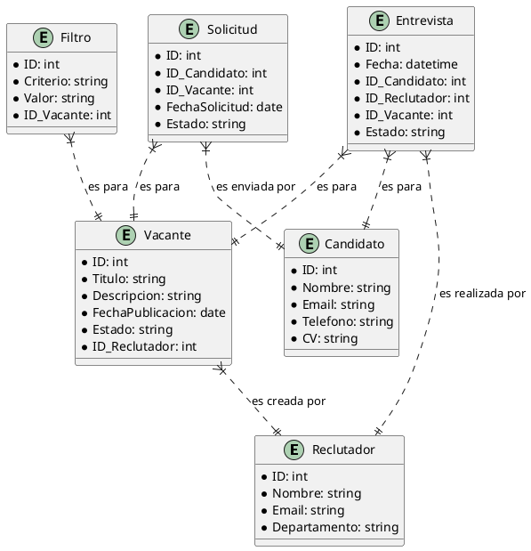

# Descripción breve del software LTI

**LTI ATS (Applicant-Tracking System)** es una solución avanzada de gestión de talento diseñada para revolucionar el proceso de reclutamiento. Con una integración sin fisuras de herramientas automatizadas, colaboración en tiempo real y asistencia de inteligencia artificial, LTI ATS aumenta la eficiencia del departamento de recursos humanos, reduce el tiempo de contratación y mejora la calidad de las contrataciones. Sus ventajas competitivas incluyen una interfaz intuitiva, análisis predictivo de candidatos y una optimización continua basada en el aprendizaje automático.

# Funciones principales

1. **Automatización de Procesos**:
   - Publicación automática de vacantes en múltiples plataformas.
   - Filtro automático de candidatos basado en criterios predefinidos.
   - Programación automática de entrevistas y evaluaciones.

2. **Colaboración en Tiempo Real**:
   - Plataforma colaborativa para que reclutadores y managers compartan comentarios y evaluaciones.
   - Integración de chat en vivo y videoconferencias para discutir candidatos.
   - Herramientas de feedback instantáneo para una toma de decisiones más rápida.

3. **Asistencia de IA**:
   - Análisis predictivo para identificar los mejores candidatos.
   - Asistente virtual para responder preguntas frecuentes de los candidatos.
   - Sugerencias automáticas para mejorar descripciones de trabajo y estrategias de reclutamiento.

4. **Gestión de Candidatos**:
   - Base de datos centralizada con perfiles detallados de candidatos.
   - Seguimiento de la evolución de los candidatos a lo largo del proceso de selección.
   - Herramientas de búsqueda avanzada y filtrado de candidatos.

5. **Reportes y Análisis**:
   - Dashboards personalizables con métricas clave de reclutamiento.
   - Informes detallados sobre el rendimiento de los canales de reclutamiento.
   - Análisis de tendencias y recomendaciones para mejorar el proceso de selección.

6. **Experiencia del Usuario**:
   - Interfaz intuitiva y fácil de usar.
   - Portal de candidatos optimizado para dispositivos móviles.
   - Soporte multilingüe y personalización de la experiencia del usuario.

# Lean Canvas

| **Título**                | **Descripción**                                                                                                                                           |
|---------------------------|-----------------------------------------------------------------------------------------------------------------------------------------------------------|
| **Problema**              | - Proceso de reclutamiento ineficiente. <br> - Falta de colaboración en tiempo real entre reclutadores y managers. <br> - Necesidad de automatización e IA. |
| **Segmento de clientes**  | - Empresas de todos los tamaños. <br> - Departamentos de Recursos Humanos. <br> - Reclutadores y managers.                                                  |
| **Propuesta de valor**    | - Aumenta la eficiencia del reclutamiento. <br> - Mejora la colaboración y comunicación. <br> - Automatiza tareas repetitivas y proporciona asistencia de IA.|
| **Solución**              | - Automatización de procesos de publicación y filtrado. <br> - Plataforma colaborativa en tiempo real. <br> - Asistencia de IA para análisis predictivo.   |
| **Canales**               | - Sitio web de LTI. <br> - Redes sociales. <br> - Asociaciones con consultoras de recursos humanos.                                                         |
| **Estructura de costes**  | - Desarrollo y mantenimiento del software. <br> - Costes de marketing y ventas. <br> - Infraestructura de TI.                                              |
| **Flujo de ingresos**     | - Suscripciones mensuales/anuales. <br> - Licencias por usuario.                                                                                          |
| **Métricas clave**        | - Tiempo de contratación reducido. <br> - Aumento en la tasa de aceptación de ofertas. <br> - Satisfacción del usuario.                                     |
| **Ventaja diferencial**   | - Uso avanzado de IA. <br> - Interfaz intuitiva y colaborativa. <br> - Análisis predictivo y optimización continua.                                         |

# Casos de Uso Iniciales

1. **Publicación Automática de Vacantes**:
   - **Descripción**: Los reclutadores pueden crear y publicar automáticamente las ofertas de trabajo en múltiples plataformas desde el sistema.
   - **Valor**: Ahorra tiempo y asegura una mayor difusión de las vacantes.

2. **Filtro Automático de Candidatos**:
   - **Descripción**: El sistema revisa automáticamente las aplicaciones recibidas y filtra a los candidatos según criterios predefinidos.
   - **Valor**: Mejora la eficiencia del proceso de selección al reducir el tiempo dedicado a revisar aplicaciones no relevantes.

3. **Programación Automática de Entrevistas**:
   - **Descripción**: Una vez que los candidatos han sido filtrados, el sistema programa entrevistas automáticamente basándose en la disponibilidad de los entrevistadores y los candidatos.
   - **Valor**: Optimiza la programación de entrevistas, reduciendo conflictos de horarios y mejorando la coordinación.

# Diagrama de Casos de Uso

```
plantuml
@startuml
actor Reclutador
actor Sistema
actor Candidato

Reclutador -> (Publicación Automática de Vacantes) : Crear Oferta
(Publicación Automática de Vacantes) -> Sistema : Publicar en Múltiples Plataformas

Candidato -> (Filtro Automático de Candidatos) : Enviar Solicitud
(Filtro Automático de Candidatos) -> Sistema : Revisar Solicitud
Sistema -> (Filtro Automático de Candidatos) : Filtrar según Criterios

Reclutador -> (Programación Automática de Entrevistas) : Seleccionar Candidatos
(Programación Automática de Entrevistas) -> Sistema : Programar Entrevistas
Sistema -> Reclutador : Confirmar Entrevistas
Sistema -> Candidato : Notificación de Entrevista

@enduml
```

# Modelo de Datos



# Diseño del Sistema a Alto Nivel
El diseño del sistema de ATS a alto nivel incluye los siguientes componentes:

**Front-End**: Interfaz de usuario para reclutadores, candidatos y administradores.
**Back-End**: Lógica de negocio y API para manejar solicitudes.
**Base de Datos**: Almacenamiento de datos de usuarios, vacantes, aplicaciones, etc.
**Servicios de IA**: Análisis predictivo y filtros automáticos de candidatos.
**Servicios de Notificación**: Envío de correos electrónicos y notificaciones.
**Servicios de Integración**: Publicación de vacantes en múltiples plataformas.
**Servicios de Seguridad**: Autenticación y autorización.
**Almacenamiento de Archivos**: Almacenamiento de CVs y documentos relacionados

# Diagrama de Sistema en Mermaid

```
mermaid
graph TD;
    A[Usuarios] --> B[Front-End]
    B --> C[API Gateway]
    C --> D[Back-End]
    D --> E[Base de Datos]
    D --> F[Servicios de IA]
    D --> G[Servicios de Notificación]
    D --> H[Servicios de Integración]
    D --> I[Servicios de Seguridad]
    D --> J[Almacenamiento de Archivos]
    I --> E
    I --> J
```


### Script de Terraform para Generar la Infraestructura del Sistema en AWS


```
hcl
provider "aws" {
  region = "us-east-1"
}

resource "aws_vpc" "main" {
  cidr_block = "10.0.0.0/16"
}

resource "aws_subnet" "subnet" {
  vpc_id     = aws_vpc.main.id
  cidr_block = "10.0.1.0/24"
}

resource "aws_internet_gateway" "igw" {
  vpc_id = aws_vpc.main.id
}

resource "aws_route_table" "route_table" {
  vpc_id = aws_vpc.main.id

  route {
    cidr_block = "0.0.0.0/0"
    gateway_id = aws_internet_gateway.igw.id
  }
}

resource "aws_route_table_association" "a" {
  subnet_id      = aws_subnet.subnet.id
  route_table_id = aws_route_table.route_table.id
}

resource "aws_security_group" "web_sg" {
  vpc_id = aws_vpc.main.id

  ingress {
    from_port   = 80
    to_port     = 80
    protocol    = "tcp"
    cidr_blocks = ["0.0.0.0/0"]
  }

  ingress {
    from_port   = 443
    to_port     = 443
    protocol    = "tcp"
    cidr_blocks = ["0.0.0.0/0"]
  }

  egress {
    from_port   = 0
    to_port     = 0
    protocol    = "-1"
    cidr_blocks = ["0.0.0.0/0"]
  }
}

resource "aws_instance" "web" {
  ami           = "ami-0c55b159cbfafe1f0"
  instance_type = "t2.micro"
  subnet_id     = aws_subnet.subnet.id
  security_groups = [aws_security_group.web_sg.name]

  tags = {
    Name = "WebServer"
  }
}

resource "aws_rds_instance" "db" {
  allocated_storage    = 20
  engine               = "mysql"
  engine_version       = "8.0"
  instance_class       = "db.t2.micro"
  name                 = "atsdb"
  username             = "admin"
  password             = "password"
  skip_final_snapshot  = true
  vpc_security_group_ids = [aws_security_group.web_sg.id]
  db_subnet_group_name = aws_db_subnet_group.db_subnet_group.name
}

resource "aws_db_subnet_group" "db_subnet_group" {
  name       = "main"
  subnet_ids = [aws_subnet.subnet.id]

  tags = {
    Name = "Main DB subnet group"
  }
}

resource "aws_s3_bucket" "cv_bucket" {
  bucket = "ats-cv-bucket"
  acl    = "private"
}

resource "aws_lambda_function" "ia_function" {
  function_name = "ATSIAFunction"
  role          = aws_iam_role.iam_for_lambda.arn
  handler       = "index.handler"
  runtime       = "nodejs12.x"
  filename      = "lambda_function_payload.zip"
}

resource "aws_iam_role" "iam_for_lambda" {
  name = "iam_for_lambda"

  assume_role_policy = <<EOF
{
  "Version": "2012-10-17",
  "Statement": [
    {
      "Action": "sts:AssumeRole",
      "Effect": "Allow",
      "Principal": {
        "Service": "lambda.amazonaws.com"
      }
    }
  ]
}
EOF
}

resource "aws_sns_topic" "notifications" {
  name = "ats-notifications"
}
```

# Diagrama de Contexto en Mermaid

```
mermaid
graph TD;
    A[Reclutador] --> B[ATS (Applicant Tracking System)]
    C[Candidato] --> B
    D[Administrador] --> B
    B --> E[AWS Cloud]
    E --> F[Servicios Externos (Job Boards, Email Services, etc.)]
```


### Diagrama de Contenedores (C4 Nivel 2)

```
mermaid
graph TD;
    subgraph AWS Cloud
        A[API Gateway]
        B[Front-End]
        C[Back-End]
        D[Base de Datos]
        E[Servicios de IA]
        F[Servicios de Notificación]
        G[Servicios de Integración]
        H[Almacenamiento de Archivos]
    end
    
    B[Front-End] --> A[API Gateway]
    A[API Gateway] --> C[Back-End]
    C[Back-End] --> D[Base de Datos]
    C[Back-End] --> E[Servicios de IA]
    C[Back-End] --> F[Servicios de Notificación]
    C[Back-End] --> G[Servicios de Integración]
    C[Back-End] --> H[Almacenamiento de Archivos]
    
    subgraph Usuarios
        I[Reclutador]
        J[Candidato]
        K[Administrador]
    end
    
    I --> B
    J --> B
    K --> B
```


### Diagrama de Componentes (C4 Nivel 3)

```
mermaid
graph TD;
    subgraph Back-End
        A[Controlador de Usuarios]
        B[Controlador de Vacantes]
        C[Controlador de Solicitudes]
        D[Controlador de Entrevistas]
        E[Servicio de IA]
        F[Servicio de Notificaciones]
        G[Servicio de Integraciones]
    end
    
    A --> H[Base de Datos]
    B --> H
    C --> H
    D --> H
    E --> H
    F --> H
    G --> H
    
    E --> I[Motor de IA]
    F --> J[SNS Topic]
    G --> K[API Externa]
``

### Diagrama de Código (C4 Nivel 4)

```
mermaid
graph TD;
    subgraph Controlador de Vacantes
        A[VacanteController]
        B[VacanteService]
        C[VacanteRepository]
        D[VacanteEntity]
    end
    
    A --> B
    B --> C
    C --> D
    
    subgraph Servicio de IA
        E[IAService]
        F[IAClient]
    end
    
    E --> F
`
```


